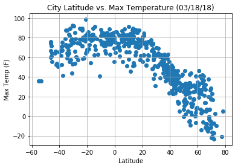
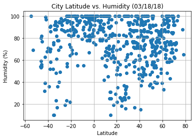
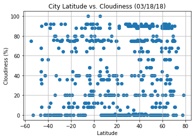
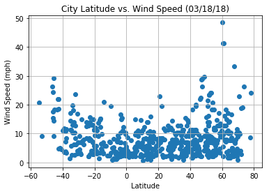

## Unit 6 | Assignment - What's the Weather Like?

## Background

Whether financial, political, or social -- data's true power lies in its ability to answer questions definitively. So let's take what you've learned about Python requests, APIs, and JSON traversals to answer a fundamental question: "What's the weather like as we approach the equator?"

Now, we know what you may be thinking: _"Duh. It gets hotter..."_ 

But, if pressed, how would you **prove** it? 


## WeatherPy

In this example, you'll be creating a Python script to visualize the weather of 500+ cities across the world of varying distance from the equator. To accomplish this, you'll be utilizing a [simple Python library](https://pypi.python.org/pypi/citipy), the [OpenWeatherMap API](https://openweathermap.org/api), and a little common sense to create a representative model of weather across world cities.

Your objective is to build a series of scatter plots to showcase the following relationships:

* Temperature (F) vs. Latitude
* Humidity (%) vs. Latitude
* Cloudiness (%) vs. Latitude
* Wind Speed (mph) vs. Latitude

Your final notebook must:

* Randomly select **at least** 500 unique (non-repeat) cities based on latitude and longitude.
* Perform a weather check on each of the cities using a series of successive API calls. 
* Include a print log of each city as it's being processed with the city number, city name, and requested URL.
* Save both a CSV of all data retrieved and png images for each scatter plot.

As final considerations:

* You must use the Matplotlib and Seaborn libraries.
* You must include a written description of three observable trends based on the data. 
* You must use proper labeling of your plots, including aspects like: Plot Titles (with date of analysis) and Axes Labels.
* You must include an exported markdown version of your Notebook called  `README.md` in your GitHub repository.  
* See [Example Solution](WeatherPy_Example.pdf) for a reference on expected format. 

### Observed Trend 1: 
Temeratures are higher in cities in lower latitudes (close to equater)
### Observed Trend 2: 
According to the Wind Speed (mph) vs. Latitude graph, it seems cities in both N and S hemisphere are having lower wind speed.  
### Observed Trend 3: 
Cities near the equater raines more (higher humidity)


```python
# import dependencies
import numpy as np
import pandas as pd
import matplotlib.pyplot as plt
import urllib
%matplotlib inline

# import API call dependencies
import requests as req
from citipy import citipy
```


```python
# Generate List of Cities
lats = np.random.uniform(low=-90, high=90, size=1500)
lngs = np.random.uniform(low=-180, high=180, size=1500)
```


```python
# zip data together
lat_lngs = zip(lats, lngs)
cities_list = []

for lat_lng in lat_lngs:
    # find city closest of lat and long values
    city = citipy.nearest_city(lat_lng[0], lat_lng[1]).city_name
    
    # only add city if not already in list
    if city not in cities_list:
        cities_list.append(city)
```


```python
# check how many cities we have in our list
len(cities_list)
```


    608


```python
# now that we have our list of cities, do API calls
api_key = "c2b08233fcadbb70d4455878f2df6167"

# build initial url for API call
url = "http://api.openweathermap.org/data/2.5/weather?units=Imperial&APPID=" + api_key
 
# build list of city
city_data_all = []

for i, city in enumerate(cities_list):
    print(i)
    # build API url
    city_url = url + "&q=" + urllib.request.pathname2url(city)
    print(f"Processing record for {city}")
    print(city_url)
    try:
        city_weather = requests.get(city_url).json()
        city_data_all.append(requests.get(city_url).json())
    except:
        print("City not found. Skipping...")
        pass
```

    0
    Processing record for tuktoyaktuk
    http://api.openweathermap.org/data/2.5/weather?units=Imperial&APPID=c2b08233fcadbb70d4455878f2df6167&q=tuktoyaktuk
    1
    Processing record for pevek
    http://api.openweathermap.org/data/2.5/weather?units=Imperial&APPID=c2b08233fcadbb70d4455878f2df6167&q=pevek
    2
    Processing record for san patricio
    http://api.openweathermap.org/data/2.5/weather?units=Imperial&APPID=c2b08233fcadbb70d4455878f2df6167&q=san%20patricio
    3
    Processing record for mar del plata
    http://api.openweathermap.org/data/2.5/weather?units=Imperial&APPID=c2b08233fcadbb70d4455878f2df6167&q=mar%20del%20plata
    4
    Processing record for vaini
    http://api.openweathermap.org/data/2.5/weather?units=Imperial&APPID=c2b08233fcadbb70d4455878f2df6167&q=vaini
    5
    Processing record for puerto ayora
    http://api.openweathermap.org/data/2.5/weather?units=Imperial&APPID=c2b08233fcadbb70d4455878f2df6167&q=puerto%20ayora
    6
    Processing record for atuona
    http://api.openweathermap.org/data/2.5/weather?units=Imperial&APPID=c2b08233fcadbb70d4455878f2df6167&q=atuona
    7
    Processing record for saldanha
    http://api.openweathermap.org/data/2.5/weather?units=Imperial&APPID=c2b08233fcadbb70d4455878f2df6167&q=saldanha
    8
    Processing record for hithadhoo
    http://api.openweathermap.org/data/2.5/weather?units=Imperial&APPID=c2b08233fcadbb70d4455878f2df6167&q=hithadhoo
    9
    Processing record for russkaya polyana
    http://api.openweathermap.org/data/2.5/weather?units=Imperial&APPID=c2b08233fcadbb70d4455878f2df6167&q=russkaya%20polyana
    10
    Processing record for faanui
    http://api.openweathermap.org/data/2.5/weather?units=Imperial&APPID=c2b08233fcadbb70d4455878f2df6167&q=faanui
    11
    Processing record for konin
    http://api.openweathermap.org/data/2.5/weather?units=Imperial&APPID=c2b08233fcadbb70d4455878f2df6167&q=konin
    12
    Processing record for saint anthony
    http://api.openweathermap.org/data/2.5/weather?units=Imperial&APPID=c2b08233fcadbb70d4455878f2df6167&q=saint%20anthony
    13
    Processing record for sakakah
    http://api.openweathermap.org/data/2.5/weather?units=Imperial&APPID=c2b08233fcadbb70d4455878f2df6167&q=sakakah
    14
    Processing record for upernavik
    http://api.openweathermap.org/data/2.5/weather?units=Imperial&APPID=c2b08233fcadbb70d4455878f2df6167&q=upernavik
    15
    Processing record for washington
    http://api.openweathermap.org/data/2.5/weather?units=Imperial&APPID=c2b08233fcadbb70d4455878f2df6167&q=washington
    16
    Processing record for cape town
    http://api.openweathermap.org/data/2.5/weather?units=Imperial&APPID=c2b08233fcadbb70d4455878f2df6167&q=cape%20town
    17
    Processing record for kamenskoye
    http://api.openweathermap.org/data/2.5/weather?units=Imperial&APPID=c2b08233fcadbb70d4455878f2df6167&q=kamenskoye
    18
    Processing record for butaritari
    http://api.openweathermap.org/data/2.5/weather?units=Imperial&APPID=c2b08233fcadbb70d4455878f2df6167&q=butaritari
    19
    Processing record for katsuura
    http://api.openweathermap.org/data/2.5/weather?units=Imperial&APPID=c2b08233fcadbb70d4455878f2df6167&q=katsuura
    20
    Processing record for half moon bay
    http://api.openweathermap.org/data/2.5/weather?units=Imperial&APPID=c2b08233fcadbb70d4455878f2df6167&q=half%20moon%20bay
    21
    Processing record for nikolskoye
    http://api.openweathermap.org/data/2.5/weather?units=Imperial&APPID=c2b08233fcadbb70d4455878f2df6167&q=nikolskoye
    22
    Processing record for hermanus
    http://api.openweathermap.org/data/2.5/weather?units=Imperial&APPID=c2b08233fcadbb70d4455878f2df6167&q=hermanus
    23
    Processing record for barrow
    http://api.openweathermap.org/data/2.5/weather?units=Imperial&APPID=c2b08233fcadbb70d4455878f2df6167&q=barrow
    24
    Processing record for albany
    http://api.openweathermap.org/data/2.5/weather?units=Imperial&APPID=c2b08233fcadbb70d4455878f2df6167&q=albany
    25
    Processing record for ancud
    http://api.openweathermap.org/data/2.5/weather?units=Imperial&APPID=c2b08233fcadbb70d4455878f2df6167&q=ancud
    26
    Processing record for ridgecrest
    http://api.openweathermap.org/data/2.5/weather?units=Imperial&APPID=c2b08233fcadbb70d4455878f2df6167&q=ridgecrest
    27
    Processing record for busselton
    http://api.openweathermap.org/data/2.5/weather?units=Imperial&APPID=c2b08233fcadbb70d4455878f2df6167&q=busselton
    28
    Processing record for rikitea
    http://api.openweathermap.org/data/2.5/weather?units=Imperial&APPID=c2b08233fcadbb70d4455878f2df6167&q=rikitea
    29
    Processing record for aklavik
    http://api.openweathermap.org/data/2.5/weather?units=Imperial&APPID=c2b08233fcadbb70d4455878f2df6167&q=aklavik
    30
    Processing record for kieta
    http://api.openweathermap.org/data/2.5/weather?units=Imperial&APPID=c2b08233fcadbb70d4455878f2df6167&q=kieta
    31
    Processing record for derzhavinsk
    http://api.openweathermap.org/data/2.5/weather?units=Imperial&APPID=c2b08233fcadbb70d4455878f2df6167&q=derzhavinsk
    32
    Processing record for porto walter
    http://api.openweathermap.org/data/2.5/weather?units=Imperial&APPID=c2b08233fcadbb70d4455878f2df6167&q=porto%20walter
    33
    Processing record for grand-lahou
    http://api.openweathermap.org/data/2.5/weather?units=Imperial&APPID=c2b08233fcadbb70d4455878f2df6167&q=grand-lahou
    34
    Processing record for ponta do sol
    http://api.openweathermap.org/data/2.5/weather?units=Imperial&APPID=c2b08233fcadbb70d4455878f2df6167&q=ponta%20do%20sol
    35
    Processing record for wahpeton
    http://api.openweathermap.org/data/2.5/weather?units=Imperial&APPID=c2b08233fcadbb70d4455878f2df6167&q=wahpeton
    36
    Processing record for bluff
    http://api.openweathermap.org/data/2.5/weather?units=Imperial&APPID=c2b08233fcadbb70d4455878f2df6167&q=bluff
    37
    Processing record for saskylakh
    http://api.openweathermap.org/data/2.5/weather?units=Imperial&APPID=c2b08233fcadbb70d4455878f2df6167&q=saskylakh
    38
    Processing record for new norfolk
    http://api.openweathermap.org/data/2.5/weather?units=Imperial&APPID=c2b08233fcadbb70d4455878f2df6167&q=new%20norfolk
    39
    Processing record for noumea
    http://api.openweathermap.org/data/2.5/weather?units=Imperial&APPID=c2b08233fcadbb70d4455878f2df6167&q=noumea
    40
    Processing record for boueni
    http://api.openweathermap.org/data/2.5/weather?units=Imperial&APPID=c2b08233fcadbb70d4455878f2df6167&q=boueni
    41
    Processing record for ushuaia
    http://api.openweathermap.org/data/2.5/weather?units=Imperial&APPID=c2b08233fcadbb70d4455878f2df6167&q=ushuaia
    42
    Processing record for bergheim
    http://api.openweathermap.org/data/2.5/weather?units=Imperial&APPID=c2b08233fcadbb70d4455878f2df6167&q=bergheim
    43
    Processing record for muana
    http://api.openweathermap.org/data/2.5/weather?units=Imperial&APPID=c2b08233fcadbb70d4455878f2df6167&q=muana
    44
    Processing record for bolungarvik
    http://api.openweathermap.org/data/2.5/weather?units=Imperial&APPID=c2b08233fcadbb70d4455878f2df6167&q=bolungarvik
    45
    Processing record for punta arenas
    http://api.openweathermap.org/data/2.5/weather?units=Imperial&APPID=c2b08233fcadbb70d4455878f2df6167&q=punta%20arenas
    46
    Processing record for severo-kurilsk
    http://api.openweathermap.org/data/2.5/weather?units=Imperial&APPID=c2b08233fcadbb70d4455878f2df6167&q=severo-kurilsk
    47
    Processing record for mys shmidta
    http://api.openweathermap.org/data/2.5/weather?units=Imperial&APPID=c2b08233fcadbb70d4455878f2df6167&q=mys%20shmidta
    48
    Processing record for yaan
    http://api.openweathermap.org/data/2.5/weather?units=Imperial&APPID=c2b08233fcadbb70d4455878f2df6167&q=yaan
    49
    Processing record for felidhoo
    http://api.openweathermap.org/data/2.5/weather?units=Imperial&APPID=c2b08233fcadbb70d4455878f2df6167&q=felidhoo
    50
    Processing record for tuatapere
    http://api.openweathermap.org/data/2.5/weather?units=Imperial&APPID=c2b08233fcadbb70d4455878f2df6167&q=tuatapere
    51
    Processing record for castro
    http://api.openweathermap.org/data/2.5/weather?units=Imperial&APPID=c2b08233fcadbb70d4455878f2df6167&q=castro
    52
    Processing record for carnarvon
    http://api.openweathermap.org/data/2.5/weather?units=Imperial&APPID=c2b08233fcadbb70d4455878f2df6167&q=carnarvon
    53
    Processing record for port alfred
    http://api.openweathermap.org/data/2.5/weather?units=Imperial&APPID=c2b08233fcadbb70d4455878f2df6167&q=port%20alfred
    54
    Processing record for manga
    http://api.openweathermap.org/data/2.5/weather?units=Imperial&APPID=c2b08233fcadbb70d4455878f2df6167&q=manga
    55
    Processing record for ataco
    http://api.openweathermap.org/data/2.5/weather?units=Imperial&APPID=c2b08233fcadbb70d4455878f2df6167&q=ataco
    56
    Processing record for mataura
    http://api.openweathermap.org/data/2.5/weather?units=Imperial&APPID=c2b08233fcadbb70d4455878f2df6167&q=mataura
    57
    Processing record for de haan
    http://api.openweathermap.org/data/2.5/weather?units=Imperial&APPID=c2b08233fcadbb70d4455878f2df6167&q=de%20haan
    58
    Processing record for san quintin
    http://api.openweathermap.org/data/2.5/weather?units=Imperial&APPID=c2b08233fcadbb70d4455878f2df6167&q=san%20quintin
    59
    Processing record for jos
    http://api.openweathermap.org/data/2.5/weather?units=Imperial&APPID=c2b08233fcadbb70d4455878f2df6167&q=jos
    60
    Processing record for bambous virieux
    http://api.openweathermap.org/data/2.5/weather?units=Imperial&APPID=c2b08233fcadbb70d4455878f2df6167&q=bambous%20virieux
    61
    Processing record for ribeira grande
    http://api.openweathermap.org/data/2.5/weather?units=Imperial&APPID=c2b08233fcadbb70d4455878f2df6167&q=ribeira%20grande
    62
    Processing record for hobart
    http://api.openweathermap.org/data/2.5/weather?units=Imperial&APPID=c2b08233fcadbb70d4455878f2df6167&q=hobart
    63
    Processing record for hofn
    http://api.openweathermap.org/data/2.5/weather?units=Imperial&APPID=c2b08233fcadbb70d4455878f2df6167&q=hofn
    64
    Processing record for solnechnyy
    http://api.openweathermap.org/data/2.5/weather?units=Imperial&APPID=c2b08233fcadbb70d4455878f2df6167&q=solnechnyy
    65
    Processing record for mehamn
    http://api.openweathermap.org/data/2.5/weather?units=Imperial&APPID=c2b08233fcadbb70d4455878f2df6167&q=mehamn
    66
    Processing record for nelson bay
    http://api.openweathermap.org/data/2.5/weather?units=Imperial&APPID=c2b08233fcadbb70d4455878f2df6167&q=nelson%20bay
    67
    Processing record for mareeba
    http://api.openweathermap.org/data/2.5/weather?units=Imperial&APPID=c2b08233fcadbb70d4455878f2df6167&q=mareeba
    68
    Processing record for tessalit
    http://api.openweathermap.org/data/2.5/weather?units=Imperial&APPID=c2b08233fcadbb70d4455878f2df6167&q=tessalit
    69
    Processing record for artyom
    http://api.openweathermap.org/data/2.5/weather?units=Imperial&APPID=c2b08233fcadbb70d4455878f2df6167&q=artyom
    70
    Processing record for sebinkarahisar
    http://api.openweathermap.org/data/2.5/weather?units=Imperial&APPID=c2b08233fcadbb70d4455878f2df6167&q=sebinkarahisar
    71
    Processing record for jumla
    http://api.openweathermap.org/data/2.5/weather?units=Imperial&APPID=c2b08233fcadbb70d4455878f2df6167&q=jumla
    72
    Processing record for hervey bay
    http://api.openweathermap.org/data/2.5/weather?units=Imperial&APPID=c2b08233fcadbb70d4455878f2df6167&q=hervey%20bay
    73
    Processing record for lanigan
    http://api.openweathermap.org/data/2.5/weather?units=Imperial&APPID=c2b08233fcadbb70d4455878f2df6167&q=lanigan
    74
    Processing record for aginskoye
    http://api.openweathermap.org/data/2.5/weather?units=Imperial&APPID=c2b08233fcadbb70d4455878f2df6167&q=aginskoye
    75
    Processing record for east london
    http://api.openweathermap.org/data/2.5/weather?units=Imperial&APPID=c2b08233fcadbb70d4455878f2df6167&q=east%20london
    76
    Processing record for jamestown
    http://api.openweathermap.org/data/2.5/weather?units=Imperial&APPID=c2b08233fcadbb70d4455878f2df6167&q=jamestown
    77
    Processing record for yanam
    http://api.openweathermap.org/data/2.5/weather?units=Imperial&APPID=c2b08233fcadbb70d4455878f2df6167&q=yanam
    78
    Processing record for arraial do cabo
    http://api.openweathermap.org/data/2.5/weather?units=Imperial&APPID=c2b08233fcadbb70d4455878f2df6167&q=arraial%20do%20cabo
    79
    Processing record for sentyabrskiy
    http://api.openweathermap.org/data/2.5/weather?units=Imperial&APPID=c2b08233fcadbb70d4455878f2df6167&q=sentyabrskiy
    80
    Processing record for illoqqortoormiut
    http://api.openweathermap.org/data/2.5/weather?units=Imperial&APPID=c2b08233fcadbb70d4455878f2df6167&q=illoqqortoormiut
    81
    Processing record for bakchar
    http://api.openweathermap.org/data/2.5/weather?units=Imperial&APPID=c2b08233fcadbb70d4455878f2df6167&q=bakchar
    82
    Processing record for provideniya
    http://api.openweathermap.org/data/2.5/weather?units=Imperial&APPID=c2b08233fcadbb70d4455878f2df6167&q=provideniya
    83
    Processing record for eureka
    http://api.openweathermap.org/data/2.5/weather?units=Imperial&APPID=c2b08233fcadbb70d4455878f2df6167&q=eureka
    84
    Processing record for tasiilaq
    http://api.openweathermap.org/data/2.5/weather?units=Imperial&APPID=c2b08233fcadbb70d4455878f2df6167&q=tasiilaq
    85
    Processing record for bredasdorp
    http://api.openweathermap.org/data/2.5/weather?units=Imperial&APPID=c2b08233fcadbb70d4455878f2df6167&q=bredasdorp
    86
    Processing record for dikson
    http://api.openweathermap.org/data/2.5/weather?units=Imperial&APPID=c2b08233fcadbb70d4455878f2df6167&q=dikson
    87
    Processing record for isangel
    http://api.openweathermap.org/data/2.5/weather?units=Imperial&APPID=c2b08233fcadbb70d4455878f2df6167&q=isangel
    88
    Processing record for carrickmacross
    http://api.openweathermap.org/data/2.5/weather?units=Imperial&APPID=c2b08233fcadbb70d4455878f2df6167&q=carrickmacross
    89
    Processing record for victoria
    http://api.openweathermap.org/data/2.5/weather?units=Imperial&APPID=c2b08233fcadbb70d4455878f2df6167&q=victoria
    90
    Processing record for esperance
    http://api.openweathermap.org/data/2.5/weather?units=Imperial&APPID=c2b08233fcadbb70d4455878f2df6167&q=esperance
    91
    Processing record for lavrentiya
    http://api.openweathermap.org/data/2.5/weather?units=Imperial&APPID=c2b08233fcadbb70d4455878f2df6167&q=lavrentiya
    92
    Processing record for cidreira
    http://api.openweathermap.org/data/2.5/weather?units=Imperial&APPID=c2b08233fcadbb70d4455878f2df6167&q=cidreira
    93
    Processing record for porto novo
    http://api.openweathermap.org/data/2.5/weather?units=Imperial&APPID=c2b08233fcadbb70d4455878f2df6167&q=porto%20novo
    94
    Processing record for north platte
    http://api.openweathermap.org/data/2.5/weather?units=Imperial&APPID=c2b08233fcadbb70d4455878f2df6167&q=north%20platte
    95
    Processing record for ulcinj
    http://api.openweathermap.org/data/2.5/weather?units=Imperial&APPID=c2b08233fcadbb70d4455878f2df6167&q=ulcinj
    96
    Processing record for havelock
    http://api.openweathermap.org/data/2.5/weather?units=Imperial&APPID=c2b08233fcadbb70d4455878f2df6167&q=havelock
    97
    Processing record for georgetown
    http://api.openweathermap.org/data/2.5/weather?units=Imperial&APPID=c2b08233fcadbb70d4455878f2df6167&q=georgetown
    98
    Processing record for vaitape
    http://api.openweathermap.org/data/2.5/weather?units=Imperial&APPID=c2b08233fcadbb70d4455878f2df6167&q=vaitape
    99
    Processing record for khatanga
    http://api.openweathermap.org/data/2.5/weather?units=Imperial&APPID=c2b08233fcadbb70d4455878f2df6167&q=khatanga
    100
    Processing record for lagoa
    http://api.openweathermap.org/data/2.5/weather?units=Imperial&APPID=c2b08233fcadbb70d4455878f2df6167&q=lagoa
    101
    Processing record for mossendjo
    http://api.openweathermap.org/data/2.5/weather?units=Imperial&APPID=c2b08233fcadbb70d4455878f2df6167&q=mossendjo
    102
    Processing record for namatanai
    http://api.openweathermap.org/data/2.5/weather?units=Imperial&APPID=c2b08233fcadbb70d4455878f2df6167&q=namatanai
    103
    Processing record for catuday
    http://api.openweathermap.org/data/2.5/weather?units=Imperial&APPID=c2b08233fcadbb70d4455878f2df6167&q=catuday
    104
    Processing record for louisbourg
    http://api.openweathermap.org/data/2.5/weather?units=Imperial&APPID=c2b08233fcadbb70d4455878f2df6167&q=louisbourg
    105
    Processing record for abha
    http://api.openweathermap.org/data/2.5/weather?units=Imperial&APPID=c2b08233fcadbb70d4455878f2df6167&q=abha
    106
    Processing record for muroto
    http://api.openweathermap.org/data/2.5/weather?units=Imperial&APPID=c2b08233fcadbb70d4455878f2df6167&q=muroto
    107
    Processing record for lensk
    http://api.openweathermap.org/data/2.5/weather?units=Imperial&APPID=c2b08233fcadbb70d4455878f2df6167&q=lensk
    108
    Processing record for kavieng
    http://api.openweathermap.org/data/2.5/weather?units=Imperial&APPID=c2b08233fcadbb70d4455878f2df6167&q=kavieng
    109
    Processing record for oxbow
    http://api.openweathermap.org/data/2.5/weather?units=Imperial&APPID=c2b08233fcadbb70d4455878f2df6167&q=oxbow
    110
    Processing record for coihaique
    http://api.openweathermap.org/data/2.5/weather?units=Imperial&APPID=c2b08233fcadbb70d4455878f2df6167&q=coihaique
    111
    Processing record for mahebourg
    http://api.openweathermap.org/data/2.5/weather?units=Imperial&APPID=c2b08233fcadbb70d4455878f2df6167&q=mahebourg
    112
    Processing record for taolanaro
    http://api.openweathermap.org/data/2.5/weather?units=Imperial&APPID=c2b08233fcadbb70d4455878f2df6167&q=taolanaro
    113
    Processing record for storslett
    http://api.openweathermap.org/data/2.5/weather?units=Imperial&APPID=c2b08233fcadbb70d4455878f2df6167&q=storslett
    114
    Processing record for alotau
    http://api.openweathermap.org/data/2.5/weather?units=Imperial&APPID=c2b08233fcadbb70d4455878f2df6167&q=alotau
    115
    Processing record for qaanaaq
    http://api.openweathermap.org/data/2.5/weather?units=Imperial&APPID=c2b08233fcadbb70d4455878f2df6167&q=qaanaaq
    116
    Processing record for kodiak
    http://api.openweathermap.org/data/2.5/weather?units=Imperial&APPID=c2b08233fcadbb70d4455878f2df6167&q=kodiak
    117
    Processing record for porto santo
    http://api.openweathermap.org/data/2.5/weather?units=Imperial&APPID=c2b08233fcadbb70d4455878f2df6167&q=porto%20santo
    118
    Processing record for cherskiy
    http://api.openweathermap.org/data/2.5/weather?units=Imperial&APPID=c2b08233fcadbb70d4455878f2df6167&q=cherskiy
    119
    Processing record for rawson
    http://api.openweathermap.org/data/2.5/weather?units=Imperial&APPID=c2b08233fcadbb70d4455878f2df6167&q=rawson
    120
    Processing record for harper
    http://api.openweathermap.org/data/2.5/weather?units=Imperial&APPID=c2b08233fcadbb70d4455878f2df6167&q=harper
    121
    Processing record for stromness
    http://api.openweathermap.org/data/2.5/weather?units=Imperial&APPID=c2b08233fcadbb70d4455878f2df6167&q=stromness
    122
    Processing record for baykit
    http://api.openweathermap.org/data/2.5/weather?units=Imperial&APPID=c2b08233fcadbb70d4455878f2df6167&q=baykit
    123
    Processing record for codrington
    http://api.openweathermap.org/data/2.5/weather?units=Imperial&APPID=c2b08233fcadbb70d4455878f2df6167&q=codrington
    124
    Processing record for bairiki
    http://api.openweathermap.org/data/2.5/weather?units=Imperial&APPID=c2b08233fcadbb70d4455878f2df6167&q=bairiki
    125
    Processing record for broken hill
    http://api.openweathermap.org/data/2.5/weather?units=Imperial&APPID=c2b08233fcadbb70d4455878f2df6167&q=broken%20hill
    126
    Processing record for cermik
    http://api.openweathermap.org/data/2.5/weather?units=Imperial&APPID=c2b08233fcadbb70d4455878f2df6167&q=cermik
    127
    Processing record for vlasim
    http://api.openweathermap.org/data/2.5/weather?units=Imperial&APPID=c2b08233fcadbb70d4455878f2df6167&q=vlasim
    128
    Processing record for saint george
    http://api.openweathermap.org/data/2.5/weather?units=Imperial&APPID=c2b08233fcadbb70d4455878f2df6167&q=saint%20george
    129
    Processing record for iracoubo
    http://api.openweathermap.org/data/2.5/weather?units=Imperial&APPID=c2b08233fcadbb70d4455878f2df6167&q=iracoubo
    130
    Processing record for port hardy
    http://api.openweathermap.org/data/2.5/weather?units=Imperial&APPID=c2b08233fcadbb70d4455878f2df6167&q=port%20hardy
    131
    Processing record for kununurra
    http://api.openweathermap.org/data/2.5/weather?units=Imperial&APPID=c2b08233fcadbb70d4455878f2df6167&q=kununurra
    132
    Processing record for yamada
    http://api.openweathermap.org/data/2.5/weather?units=Imperial&APPID=c2b08233fcadbb70d4455878f2df6167&q=yamada
    133
    Processing record for santa isabel do rio negro
    http://api.openweathermap.org/data/2.5/weather?units=Imperial&APPID=c2b08233fcadbb70d4455878f2df6167&q=santa%20isabel%20do%20rio%20negro
    134
    Processing record for longyearbyen
    http://api.openweathermap.org/data/2.5/weather?units=Imperial&APPID=c2b08233fcadbb70d4455878f2df6167&q=longyearbyen
    135
    Processing record for chuy
    http://api.openweathermap.org/data/2.5/weather?units=Imperial&APPID=c2b08233fcadbb70d4455878f2df6167&q=chuy
    136
    Processing record for kloulklubed
    http://api.openweathermap.org/data/2.5/weather?units=Imperial&APPID=c2b08233fcadbb70d4455878f2df6167&q=kloulklubed
    137
    Processing record for udachnyy
    http://api.openweathermap.org/data/2.5/weather?units=Imperial&APPID=c2b08233fcadbb70d4455878f2df6167&q=udachnyy
    138
    Processing record for nuuk
    http://api.openweathermap.org/data/2.5/weather?units=Imperial&APPID=c2b08233fcadbb70d4455878f2df6167&q=nuuk
    139
    Processing record for asau
    http://api.openweathermap.org/data/2.5/weather?units=Imperial&APPID=c2b08233fcadbb70d4455878f2df6167&q=asau
    140
    Processing record for tanout
    http://api.openweathermap.org/data/2.5/weather?units=Imperial&APPID=c2b08233fcadbb70d4455878f2df6167&q=tanout
    141
    Processing record for arlit
    http://api.openweathermap.org/data/2.5/weather?units=Imperial&APPID=c2b08233fcadbb70d4455878f2df6167&q=arlit
    142
    Processing record for viedma
    http://api.openweathermap.org/data/2.5/weather?units=Imperial&APPID=c2b08233fcadbb70d4455878f2df6167&q=viedma
    143
    Processing record for sitka
    http://api.openweathermap.org/data/2.5/weather?units=Imperial&APPID=c2b08233fcadbb70d4455878f2df6167&q=sitka
    144
    Processing record for dingle
    http://api.openweathermap.org/data/2.5/weather?units=Imperial&APPID=c2b08233fcadbb70d4455878f2df6167&q=dingle
    145
    Processing record for imbituba
    http://api.openweathermap.org/data/2.5/weather?units=Imperial&APPID=c2b08233fcadbb70d4455878f2df6167&q=imbituba
    146
    Processing record for sambava
    http://api.openweathermap.org/data/2.5/weather?units=Imperial&APPID=c2b08233fcadbb70d4455878f2df6167&q=sambava
    147
    Processing record for klaksvik
    http://api.openweathermap.org/data/2.5/weather?units=Imperial&APPID=c2b08233fcadbb70d4455878f2df6167&q=klaksvik
    148
    Processing record for ijaki
    http://api.openweathermap.org/data/2.5/weather?units=Imperial&APPID=c2b08233fcadbb70d4455878f2df6167&q=ijaki
    149
    Processing record for kapaa
    http://api.openweathermap.org/data/2.5/weather?units=Imperial&APPID=c2b08233fcadbb70d4455878f2df6167&q=kapaa
    150
    Processing record for daru
    http://api.openweathermap.org/data/2.5/weather?units=Imperial&APPID=c2b08233fcadbb70d4455878f2df6167&q=daru
    151
    Processing record for jalu
    http://api.openweathermap.org/data/2.5/weather?units=Imperial&APPID=c2b08233fcadbb70d4455878f2df6167&q=jalu
    152
    Processing record for san andres
    http://api.openweathermap.org/data/2.5/weather?units=Imperial&APPID=c2b08233fcadbb70d4455878f2df6167&q=san%20andres
    153
    Processing record for burns lake
    http://api.openweathermap.org/data/2.5/weather?units=Imperial&APPID=c2b08233fcadbb70d4455878f2df6167&q=burns%20lake
    154
    Processing record for gretna
    http://api.openweathermap.org/data/2.5/weather?units=Imperial&APPID=c2b08233fcadbb70d4455878f2df6167&q=gretna
    155
    Processing record for hilo
    http://api.openweathermap.org/data/2.5/weather?units=Imperial&APPID=c2b08233fcadbb70d4455878f2df6167&q=hilo
    156
    Processing record for ranong
    http://api.openweathermap.org/data/2.5/weather?units=Imperial&APPID=c2b08233fcadbb70d4455878f2df6167&q=ranong
    157
    Processing record for belushya guba
    http://api.openweathermap.org/data/2.5/weather?units=Imperial&APPID=c2b08233fcadbb70d4455878f2df6167&q=belushya%20guba
    158
    Processing record for huilong
    http://api.openweathermap.org/data/2.5/weather?units=Imperial&APPID=c2b08233fcadbb70d4455878f2df6167&q=huilong
    159
    Processing record for geraldton
    http://api.openweathermap.org/data/2.5/weather?units=Imperial&APPID=c2b08233fcadbb70d4455878f2df6167&q=geraldton
    160
    Processing record for pangkalanbuun
    http://api.openweathermap.org/data/2.5/weather?units=Imperial&APPID=c2b08233fcadbb70d4455878f2df6167&q=pangkalanbuun
    161
    Processing record for ahipara
    http://api.openweathermap.org/data/2.5/weather?units=Imperial&APPID=c2b08233fcadbb70d4455878f2df6167&q=ahipara
    162
    Processing record for zhanakorgan
    http://api.openweathermap.org/data/2.5/weather?units=Imperial&APPID=c2b08233fcadbb70d4455878f2df6167&q=zhanakorgan
    163
    Processing record for tigzirt
    http://api.openweathermap.org/data/2.5/weather?units=Imperial&APPID=c2b08233fcadbb70d4455878f2df6167&q=tigzirt
    164
    Processing record for nantucket
    http://api.openweathermap.org/data/2.5/weather?units=Imperial&APPID=c2b08233fcadbb70d4455878f2df6167&q=nantucket
    165
    Processing record for avarua
    http://api.openweathermap.org/data/2.5/weather?units=Imperial&APPID=c2b08233fcadbb70d4455878f2df6167&q=avarua
    166
    Processing record for charters towers
    http://api.openweathermap.org/data/2.5/weather?units=Imperial&APPID=c2b08233fcadbb70d4455878f2df6167&q=charters%20towers
    167
    Processing record for acapulco
    http://api.openweathermap.org/data/2.5/weather?units=Imperial&APPID=c2b08233fcadbb70d4455878f2df6167&q=acapulco
    168
    Processing record for sorland
    http://api.openweathermap.org/data/2.5/weather?units=Imperial&APPID=c2b08233fcadbb70d4455878f2df6167&q=sorland
    169
    Processing record for fortuna
    http://api.openweathermap.org/data/2.5/weather?units=Imperial&APPID=c2b08233fcadbb70d4455878f2df6167&q=fortuna
    170
    Processing record for samarai
    http://api.openweathermap.org/data/2.5/weather?units=Imperial&APPID=c2b08233fcadbb70d4455878f2df6167&q=samarai
    171
    Processing record for troitsko-pechorsk
    http://api.openweathermap.org/data/2.5/weather?units=Imperial&APPID=c2b08233fcadbb70d4455878f2df6167&q=troitsko-pechorsk
    172
    Processing record for puerto quijarro
    http://api.openweathermap.org/data/2.5/weather?units=Imperial&APPID=c2b08233fcadbb70d4455878f2df6167&q=puerto%20quijarro
    173
    Processing record for velizh
    http://api.openweathermap.org/data/2.5/weather?units=Imperial&APPID=c2b08233fcadbb70d4455878f2df6167&q=velizh
    174
    Processing record for kattivakkam
    http://api.openweathermap.org/data/2.5/weather?units=Imperial&APPID=c2b08233fcadbb70d4455878f2df6167&q=kattivakkam
    175
    Processing record for tromso
    http://api.openweathermap.org/data/2.5/weather?units=Imperial&APPID=c2b08233fcadbb70d4455878f2df6167&q=tromso
    176
    Processing record for touros
    http://api.openweathermap.org/data/2.5/weather?units=Imperial&APPID=c2b08233fcadbb70d4455878f2df6167&q=touros
    177
    Processing record for puerto del rosario
    http://api.openweathermap.org/data/2.5/weather?units=Imperial&APPID=c2b08233fcadbb70d4455878f2df6167&q=puerto%20del%20rosario
    178
    Processing record for falealupo
    http://api.openweathermap.org/data/2.5/weather?units=Imperial&APPID=c2b08233fcadbb70d4455878f2df6167&q=falealupo
    179
    Processing record for santa fe
    http://api.openweathermap.org/data/2.5/weather?units=Imperial&APPID=c2b08233fcadbb70d4455878f2df6167&q=santa%20fe
    180
    Processing record for pasighat
    http://api.openweathermap.org/data/2.5/weather?units=Imperial&APPID=c2b08233fcadbb70d4455878f2df6167&q=pasighat
    181
    Processing record for pingliang
    http://api.openweathermap.org/data/2.5/weather?units=Imperial&APPID=c2b08233fcadbb70d4455878f2df6167&q=pingliang
    182
    Processing record for luderitz
    http://api.openweathermap.org/data/2.5/weather?units=Imperial&APPID=c2b08233fcadbb70d4455878f2df6167&q=luderitz
    183
    Processing record for ostrovnoy
    http://api.openweathermap.org/data/2.5/weather?units=Imperial&APPID=c2b08233fcadbb70d4455878f2df6167&q=ostrovnoy
    184
    Processing record for papara
    http://api.openweathermap.org/data/2.5/weather?units=Imperial&APPID=c2b08233fcadbb70d4455878f2df6167&q=papara
    185
    Processing record for katherine
    http://api.openweathermap.org/data/2.5/weather?units=Imperial&APPID=c2b08233fcadbb70d4455878f2df6167&q=katherine
    186
    Processing record for ketchikan
    http://api.openweathermap.org/data/2.5/weather?units=Imperial&APPID=c2b08233fcadbb70d4455878f2df6167&q=ketchikan
    187
    Processing record for bengkulu
    http://api.openweathermap.org/data/2.5/weather?units=Imperial&APPID=c2b08233fcadbb70d4455878f2df6167&q=bengkulu
    188
    Processing record for slobodskoy
    http://api.openweathermap.org/data/2.5/weather?units=Imperial&APPID=c2b08233fcadbb70d4455878f2df6167&q=slobodskoy
    189
    Processing record for iqaluit
    http://api.openweathermap.org/data/2.5/weather?units=Imperial&APPID=c2b08233fcadbb70d4455878f2df6167&q=iqaluit
    190
    Processing record for thompson
    http://api.openweathermap.org/data/2.5/weather?units=Imperial&APPID=c2b08233fcadbb70d4455878f2df6167&q=thompson
    191
    Processing record for pisco
    http://api.openweathermap.org/data/2.5/weather?units=Imperial&APPID=c2b08233fcadbb70d4455878f2df6167&q=pisco
    192
    Processing record for moroni
    http://api.openweathermap.org/data/2.5/weather?units=Imperial&APPID=c2b08233fcadbb70d4455878f2df6167&q=moroni
    193
    Processing record for nola
    http://api.openweathermap.org/data/2.5/weather?units=Imperial&APPID=c2b08233fcadbb70d4455878f2df6167&q=nola
    194
    Processing record for dubbo
    http://api.openweathermap.org/data/2.5/weather?units=Imperial&APPID=c2b08233fcadbb70d4455878f2df6167&q=dubbo
    195
    Processing record for anito
    http://api.openweathermap.org/data/2.5/weather?units=Imperial&APPID=c2b08233fcadbb70d4455878f2df6167&q=anito
    196
    Processing record for guerrero negro
    http://api.openweathermap.org/data/2.5/weather?units=Imperial&APPID=c2b08233fcadbb70d4455878f2df6167&q=guerrero%20negro
    197
    Processing record for nizhneyansk
    http://api.openweathermap.org/data/2.5/weather?units=Imperial&APPID=c2b08233fcadbb70d4455878f2df6167&q=nizhneyansk
    198
    Processing record for taoudenni
    http://api.openweathermap.org/data/2.5/weather?units=Imperial&APPID=c2b08233fcadbb70d4455878f2df6167&q=taoudenni
    199
    Processing record for sinkat
    http://api.openweathermap.org/data/2.5/weather?units=Imperial&APPID=c2b08233fcadbb70d4455878f2df6167&q=sinkat
    200
    Processing record for bulgan
    http://api.openweathermap.org/data/2.5/weather?units=Imperial&APPID=c2b08233fcadbb70d4455878f2df6167&q=bulgan
    201
    Processing record for hamilton
    http://api.openweathermap.org/data/2.5/weather?units=Imperial&APPID=c2b08233fcadbb70d4455878f2df6167&q=hamilton
    202
    Processing record for mayo
    http://api.openweathermap.org/data/2.5/weather?units=Imperial&APPID=c2b08233fcadbb70d4455878f2df6167&q=mayo
    203
    Processing record for yellowknife
    http://api.openweathermap.org/data/2.5/weather?units=Imperial&APPID=c2b08233fcadbb70d4455878f2df6167&q=yellowknife
    204
    Processing record for hasaki
    http://api.openweathermap.org/data/2.5/weather?units=Imperial&APPID=c2b08233fcadbb70d4455878f2df6167&q=hasaki
    205
    Processing record for shingu
    http://api.openweathermap.org/data/2.5/weather?units=Imperial&APPID=c2b08233fcadbb70d4455878f2df6167&q=shingu
    206
    Processing record for finnsnes
    http://api.openweathermap.org/data/2.5/weather?units=Imperial&APPID=c2b08233fcadbb70d4455878f2df6167&q=finnsnes
    207
    Processing record for kilindoni
    http://api.openweathermap.org/data/2.5/weather?units=Imperial&APPID=c2b08233fcadbb70d4455878f2df6167&q=kilindoni
    208
    Processing record for hambantota
    http://api.openweathermap.org/data/2.5/weather?units=Imperial&APPID=c2b08233fcadbb70d4455878f2df6167&q=hambantota
    209
    Processing record for turukhansk
    http://api.openweathermap.org/data/2.5/weather?units=Imperial&APPID=c2b08233fcadbb70d4455878f2df6167&q=turukhansk
    210
    Processing record for grand river south east
    http://api.openweathermap.org/data/2.5/weather?units=Imperial&APPID=c2b08233fcadbb70d4455878f2df6167&q=grand%20river%20south%20east
    211
    Processing record for laguna
    http://api.openweathermap.org/data/2.5/weather?units=Imperial&APPID=c2b08233fcadbb70d4455878f2df6167&q=laguna
    212
    Processing record for chokurdakh
    http://api.openweathermap.org/data/2.5/weather?units=Imperial&APPID=c2b08233fcadbb70d4455878f2df6167&q=chokurdakh
    213
    Processing record for zheleznodorozhnyy
    http://api.openweathermap.org/data/2.5/weather?units=Imperial&APPID=c2b08233fcadbb70d4455878f2df6167&q=zheleznodorozhnyy
    214
    Processing record for jinji
    http://api.openweathermap.org/data/2.5/weather?units=Imperial&APPID=c2b08233fcadbb70d4455878f2df6167&q=jinji
    215
    Processing record for mahon
    http://api.openweathermap.org/data/2.5/weather?units=Imperial&APPID=c2b08233fcadbb70d4455878f2df6167&q=mahon
    216
    Processing record for naze
    http://api.openweathermap.org/data/2.5/weather?units=Imperial&APPID=c2b08233fcadbb70d4455878f2df6167&q=naze
    217
    Processing record for galiwinku
    http://api.openweathermap.org/data/2.5/weather?units=Imperial&APPID=c2b08233fcadbb70d4455878f2df6167&q=galiwinku
    218
    Processing record for vanimo
    http://api.openweathermap.org/data/2.5/weather?units=Imperial&APPID=c2b08233fcadbb70d4455878f2df6167&q=vanimo
    219
    Processing record for katangli
    http://api.openweathermap.org/data/2.5/weather?units=Imperial&APPID=c2b08233fcadbb70d4455878f2df6167&q=katangli
    220
    Processing record for tibagon
    http://api.openweathermap.org/data/2.5/weather?units=Imperial&APPID=c2b08233fcadbb70d4455878f2df6167&q=tibagon
    221
    Processing record for ust-kamchatsk
    http://api.openweathermap.org/data/2.5/weather?units=Imperial&APPID=c2b08233fcadbb70d4455878f2df6167&q=ust-kamchatsk
    222
    Processing record for ljungby
    http://api.openweathermap.org/data/2.5/weather?units=Imperial&APPID=c2b08233fcadbb70d4455878f2df6167&q=ljungby
    223
    Processing record for nara
    http://api.openweathermap.org/data/2.5/weather?units=Imperial&APPID=c2b08233fcadbb70d4455878f2df6167&q=nara
    224
    Processing record for sur
    http://api.openweathermap.org/data/2.5/weather?units=Imperial&APPID=c2b08233fcadbb70d4455878f2df6167&q=sur
    225
    Processing record for teneguiban
    http://api.openweathermap.org/data/2.5/weather?units=Imperial&APPID=c2b08233fcadbb70d4455878f2df6167&q=teneguiban
    226
    Processing record for mount isa
    http://api.openweathermap.org/data/2.5/weather?units=Imperial&APPID=c2b08233fcadbb70d4455878f2df6167&q=mount%20isa
    227
    Processing record for san cristobal
    http://api.openweathermap.org/data/2.5/weather?units=Imperial&APPID=c2b08233fcadbb70d4455878f2df6167&q=san%20cristobal
    228
    Processing record for saint-philippe
    http://api.openweathermap.org/data/2.5/weather?units=Imperial&APPID=c2b08233fcadbb70d4455878f2df6167&q=saint-philippe
    229
    Processing record for owando
    http://api.openweathermap.org/data/2.5/weather?units=Imperial&APPID=c2b08233fcadbb70d4455878f2df6167&q=owando
    230
    Processing record for toora-khem
    http://api.openweathermap.org/data/2.5/weather?units=Imperial&APPID=c2b08233fcadbb70d4455878f2df6167&q=toora-khem
    231
    Processing record for bugiri
    http://api.openweathermap.org/data/2.5/weather?units=Imperial&APPID=c2b08233fcadbb70d4455878f2df6167&q=bugiri
    232
    Processing record for goderich
    http://api.openweathermap.org/data/2.5/weather?units=Imperial&APPID=c2b08233fcadbb70d4455878f2df6167&q=goderich
    233
    Processing record for lolua
    http://api.openweathermap.org/data/2.5/weather?units=Imperial&APPID=c2b08233fcadbb70d4455878f2df6167&q=lolua
    234
    Processing record for lasa
    http://api.openweathermap.org/data/2.5/weather?units=Imperial&APPID=c2b08233fcadbb70d4455878f2df6167&q=lasa
    235
    Processing record for waipawa
    http://api.openweathermap.org/data/2.5/weather?units=Imperial&APPID=c2b08233fcadbb70d4455878f2df6167&q=waipawa
    236
    Processing record for bathsheba
    http://api.openweathermap.org/data/2.5/weather?units=Imperial&APPID=c2b08233fcadbb70d4455878f2df6167&q=bathsheba
    237
    Processing record for faya
    http://api.openweathermap.org/data/2.5/weather?units=Imperial&APPID=c2b08233fcadbb70d4455878f2df6167&q=faya
    238
    Processing record for te anau
    http://api.openweathermap.org/data/2.5/weather?units=Imperial&APPID=c2b08233fcadbb70d4455878f2df6167&q=te%20anau
    239
    Processing record for kremenki
    http://api.openweathermap.org/data/2.5/weather?units=Imperial&APPID=c2b08233fcadbb70d4455878f2df6167&q=kremenki
    240
    Processing record for bonavista
    http://api.openweathermap.org/data/2.5/weather?units=Imperial&APPID=c2b08233fcadbb70d4455878f2df6167&q=bonavista
    241
    Processing record for lebu
    http://api.openweathermap.org/data/2.5/weather?units=Imperial&APPID=c2b08233fcadbb70d4455878f2df6167&q=lebu
    242
    Processing record for moron
    http://api.openweathermap.org/data/2.5/weather?units=Imperial&APPID=c2b08233fcadbb70d4455878f2df6167&q=moron
    243
    Processing record for keti bandar
    http://api.openweathermap.org/data/2.5/weather?units=Imperial&APPID=c2b08233fcadbb70d4455878f2df6167&q=keti%20bandar
    244
    Processing record for moree
    http://api.openweathermap.org/data/2.5/weather?units=Imperial&APPID=c2b08233fcadbb70d4455878f2df6167&q=moree
    245
    Processing record for babanusah
    http://api.openweathermap.org/data/2.5/weather?units=Imperial&APPID=c2b08233fcadbb70d4455878f2df6167&q=babanusah
    246
    Processing record for chapais
    http://api.openweathermap.org/data/2.5/weather?units=Imperial&APPID=c2b08233fcadbb70d4455878f2df6167&q=chapais
    247
    Processing record for codajas
    http://api.openweathermap.org/data/2.5/weather?units=Imperial&APPID=c2b08233fcadbb70d4455878f2df6167&q=codajas
    248
    Processing record for sabha
    http://api.openweathermap.org/data/2.5/weather?units=Imperial&APPID=c2b08233fcadbb70d4455878f2df6167&q=sabha
    249
    Processing record for puerto madryn
    http://api.openweathermap.org/data/2.5/weather?units=Imperial&APPID=c2b08233fcadbb70d4455878f2df6167&q=puerto%20madryn
    250
    Processing record for la crosse
    http://api.openweathermap.org/data/2.5/weather?units=Imperial&APPID=c2b08233fcadbb70d4455878f2df6167&q=la%20crosse
    251
    Processing record for eregli
    http://api.openweathermap.org/data/2.5/weather?units=Imperial&APPID=c2b08233fcadbb70d4455878f2df6167&q=eregli
    252
    Processing record for bosaso
    http://api.openweathermap.org/data/2.5/weather?units=Imperial&APPID=c2b08233fcadbb70d4455878f2df6167&q=bosaso
    253
    Processing record for airai
    http://api.openweathermap.org/data/2.5/weather?units=Imperial&APPID=c2b08233fcadbb70d4455878f2df6167&q=airai
    254
    Processing record for bagdarin
    http://api.openweathermap.org/data/2.5/weather?units=Imperial&APPID=c2b08233fcadbb70d4455878f2df6167&q=bagdarin
    255
    Processing record for tiksi
    http://api.openweathermap.org/data/2.5/weather?units=Imperial&APPID=c2b08233fcadbb70d4455878f2df6167&q=tiksi
    256
    Processing record for golden
    http://api.openweathermap.org/data/2.5/weather?units=Imperial&APPID=c2b08233fcadbb70d4455878f2df6167&q=golden
    257
    Processing record for parkes
    http://api.openweathermap.org/data/2.5/weather?units=Imperial&APPID=c2b08233fcadbb70d4455878f2df6167&q=parkes
    258
    Processing record for alofi
    http://api.openweathermap.org/data/2.5/weather?units=Imperial&APPID=c2b08233fcadbb70d4455878f2df6167&q=alofi
    259
    Processing record for los llanos de aridane
    http://api.openweathermap.org/data/2.5/weather?units=Imperial&APPID=c2b08233fcadbb70d4455878f2df6167&q=los%20llanos%20de%20aridane
    260
    Processing record for havre
    http://api.openweathermap.org/data/2.5/weather?units=Imperial&APPID=c2b08233fcadbb70d4455878f2df6167&q=havre
    261
    Processing record for tautira
    http://api.openweathermap.org/data/2.5/weather?units=Imperial&APPID=c2b08233fcadbb70d4455878f2df6167&q=tautira
    262
    Processing record for cockburn town
    http://api.openweathermap.org/data/2.5/weather?units=Imperial&APPID=c2b08233fcadbb70d4455878f2df6167&q=cockburn%20town
    263
    Processing record for lompoc
    http://api.openweathermap.org/data/2.5/weather?units=Imperial&APPID=c2b08233fcadbb70d4455878f2df6167&q=lompoc
    264
    Processing record for malur
    http://api.openweathermap.org/data/2.5/weather?units=Imperial&APPID=c2b08233fcadbb70d4455878f2df6167&q=malur
    265
    Processing record for angoche
    http://api.openweathermap.org/data/2.5/weather?units=Imperial&APPID=c2b08233fcadbb70d4455878f2df6167&q=angoche
    266
    Processing record for mwene-ditu
    http://api.openweathermap.org/data/2.5/weather?units=Imperial&APPID=c2b08233fcadbb70d4455878f2df6167&q=mwene-ditu
    267
    Processing record for westerland
    http://api.openweathermap.org/data/2.5/weather?units=Imperial&APPID=c2b08233fcadbb70d4455878f2df6167&q=westerland
    268
    Processing record for sao joao da barra
    http://api.openweathermap.org/data/2.5/weather?units=Imperial&APPID=c2b08233fcadbb70d4455878f2df6167&q=sao%20joao%20da%20barra
    269
    Processing record for bud
    http://api.openweathermap.org/data/2.5/weather?units=Imperial&APPID=c2b08233fcadbb70d4455878f2df6167&q=bud
    270
    Processing record for birjand
    http://api.openweathermap.org/data/2.5/weather?units=Imperial&APPID=c2b08233fcadbb70d4455878f2df6167&q=birjand
    271
    Processing record for poya
    http://api.openweathermap.org/data/2.5/weather?units=Imperial&APPID=c2b08233fcadbb70d4455878f2df6167&q=poya
    272
    Processing record for sisimiut
    http://api.openweathermap.org/data/2.5/weather?units=Imperial&APPID=c2b08233fcadbb70d4455878f2df6167&q=sisimiut
    273
    Processing record for nishihara
    http://api.openweathermap.org/data/2.5/weather?units=Imperial&APPID=c2b08233fcadbb70d4455878f2df6167&q=nishihara
    274
    Processing record for olafsvik
    http://api.openweathermap.org/data/2.5/weather?units=Imperial&APPID=c2b08233fcadbb70d4455878f2df6167&q=olafsvik
    275
    Processing record for egvekinot
    http://api.openweathermap.org/data/2.5/weather?units=Imperial&APPID=c2b08233fcadbb70d4455878f2df6167&q=egvekinot
    276
    Processing record for ust-barguzin
    http://api.openweathermap.org/data/2.5/weather?units=Imperial&APPID=c2b08233fcadbb70d4455878f2df6167&q=ust-barguzin
    277
    Processing record for port elizabeth
    http://api.openweathermap.org/data/2.5/weather?units=Imperial&APPID=c2b08233fcadbb70d4455878f2df6167&q=port%20elizabeth
    278
    Processing record for northam
    http://api.openweathermap.org/data/2.5/weather?units=Imperial&APPID=c2b08233fcadbb70d4455878f2df6167&q=northam
    279
    Processing record for somanda
    http://api.openweathermap.org/data/2.5/weather?units=Imperial&APPID=c2b08233fcadbb70d4455878f2df6167&q=somanda
    280
    Processing record for qaqortoq
    http://api.openweathermap.org/data/2.5/weather?units=Imperial&APPID=c2b08233fcadbb70d4455878f2df6167&q=qaqortoq
    281
    Processing record for utiroa
    http://api.openweathermap.org/data/2.5/weather?units=Imperial&APPID=c2b08233fcadbb70d4455878f2df6167&q=utiroa
    282
    Processing record for uberlandia
    http://api.openweathermap.org/data/2.5/weather?units=Imperial&APPID=c2b08233fcadbb70d4455878f2df6167&q=uberlandia
    283
    Processing record for nogliki
    http://api.openweathermap.org/data/2.5/weather?units=Imperial&APPID=c2b08233fcadbb70d4455878f2df6167&q=nogliki
    284
    Processing record for amderma
    http://api.openweathermap.org/data/2.5/weather?units=Imperial&APPID=c2b08233fcadbb70d4455878f2df6167&q=amderma
    285
    Processing record for menongue
    http://api.openweathermap.org/data/2.5/weather?units=Imperial&APPID=c2b08233fcadbb70d4455878f2df6167&q=menongue
    286
    Processing record for andevoranto
    http://api.openweathermap.org/data/2.5/weather?units=Imperial&APPID=c2b08233fcadbb70d4455878f2df6167&q=andevoranto
    287
    Processing record for batemans bay
    http://api.openweathermap.org/data/2.5/weather?units=Imperial&APPID=c2b08233fcadbb70d4455878f2df6167&q=batemans%20bay
    288
    Processing record for kutum
    http://api.openweathermap.org/data/2.5/weather?units=Imperial&APPID=c2b08233fcadbb70d4455878f2df6167&q=kutum
    289
    Processing record for karkaralinsk
    http://api.openweathermap.org/data/2.5/weather?units=Imperial&APPID=c2b08233fcadbb70d4455878f2df6167&q=karkaralinsk
    290
    Processing record for walvis bay
    http://api.openweathermap.org/data/2.5/weather?units=Imperial&APPID=c2b08233fcadbb70d4455878f2df6167&q=walvis%20bay
    291
    Processing record for zunyi
    http://api.openweathermap.org/data/2.5/weather?units=Imperial&APPID=c2b08233fcadbb70d4455878f2df6167&q=zunyi
    292
    Processing record for emba
    http://api.openweathermap.org/data/2.5/weather?units=Imperial&APPID=c2b08233fcadbb70d4455878f2df6167&q=emba
    293
    Processing record for sao mateus
    http://api.openweathermap.org/data/2.5/weather?units=Imperial&APPID=c2b08233fcadbb70d4455878f2df6167&q=sao%20mateus
    294
    Processing record for rosetta
    http://api.openweathermap.org/data/2.5/weather?units=Imperial&APPID=c2b08233fcadbb70d4455878f2df6167&q=rosetta
    295
    Processing record for barentsburg
    http://api.openweathermap.org/data/2.5/weather?units=Imperial&APPID=c2b08233fcadbb70d4455878f2df6167&q=barentsburg
    296
    Processing record for innoshima
    http://api.openweathermap.org/data/2.5/weather?units=Imperial&APPID=c2b08233fcadbb70d4455878f2df6167&q=innoshima
    297
    Processing record for mulchen
    http://api.openweathermap.org/data/2.5/weather?units=Imperial&APPID=c2b08233fcadbb70d4455878f2df6167&q=mulchen
    298
    Processing record for vao
    http://api.openweathermap.org/data/2.5/weather?units=Imperial&APPID=c2b08233fcadbb70d4455878f2df6167&q=vao
    299
    Processing record for kayes
    http://api.openweathermap.org/data/2.5/weather?units=Imperial&APPID=c2b08233fcadbb70d4455878f2df6167&q=kayes
    300
    Processing record for manta
    http://api.openweathermap.org/data/2.5/weather?units=Imperial&APPID=c2b08233fcadbb70d4455878f2df6167&q=manta
    301
    Processing record for monclova
    http://api.openweathermap.org/data/2.5/weather?units=Imperial&APPID=c2b08233fcadbb70d4455878f2df6167&q=monclova
    302
    Processing record for khao yoi
    http://api.openweathermap.org/data/2.5/weather?units=Imperial&APPID=c2b08233fcadbb70d4455878f2df6167&q=khao%20yoi
    303
    Processing record for nome
    http://api.openweathermap.org/data/2.5/weather?units=Imperial&APPID=c2b08233fcadbb70d4455878f2df6167&q=nome
    304
    Processing record for itaituba
    http://api.openweathermap.org/data/2.5/weather?units=Imperial&APPID=c2b08233fcadbb70d4455878f2df6167&q=itaituba
    305
    Processing record for mogok
    http://api.openweathermap.org/data/2.5/weather?units=Imperial&APPID=c2b08233fcadbb70d4455878f2df6167&q=mogok
    306
    Processing record for yumen
    http://api.openweathermap.org/data/2.5/weather?units=Imperial&APPID=c2b08233fcadbb70d4455878f2df6167&q=yumen
    307
    Processing record for harer
    http://api.openweathermap.org/data/2.5/weather?units=Imperial&APPID=c2b08233fcadbb70d4455878f2df6167&q=harer
    308
    Processing record for bambanglipuro
    http://api.openweathermap.org/data/2.5/weather?units=Imperial&APPID=c2b08233fcadbb70d4455878f2df6167&q=bambanglipuro
    309
    Processing record for kaitangata
    http://api.openweathermap.org/data/2.5/weather?units=Imperial&APPID=c2b08233fcadbb70d4455878f2df6167&q=kaitangata
    310
    Processing record for attawapiskat
    http://api.openweathermap.org/data/2.5/weather?units=Imperial&APPID=c2b08233fcadbb70d4455878f2df6167&q=attawapiskat
    311
    Processing record for abu samrah
    http://api.openweathermap.org/data/2.5/weather?units=Imperial&APPID=c2b08233fcadbb70d4455878f2df6167&q=abu%20samrah
    312
    Processing record for floriano
    http://api.openweathermap.org/data/2.5/weather?units=Imperial&APPID=c2b08233fcadbb70d4455878f2df6167&q=floriano
    313
    Processing record for ust-kuyga
    http://api.openweathermap.org/data/2.5/weather?units=Imperial&APPID=c2b08233fcadbb70d4455878f2df6167&q=ust-kuyga
    314
    Processing record for kuching
    http://api.openweathermap.org/data/2.5/weather?units=Imperial&APPID=c2b08233fcadbb70d4455878f2df6167&q=kuching
    315
    Processing record for marsh harbour
    http://api.openweathermap.org/data/2.5/weather?units=Imperial&APPID=c2b08233fcadbb70d4455878f2df6167&q=marsh%20harbour
    316
    Processing record for vikulovo
    http://api.openweathermap.org/data/2.5/weather?units=Imperial&APPID=c2b08233fcadbb70d4455878f2df6167&q=vikulovo
    317
    Processing record for teya
    http://api.openweathermap.org/data/2.5/weather?units=Imperial&APPID=c2b08233fcadbb70d4455878f2df6167&q=teya
    318
    Processing record for san policarpo
    http://api.openweathermap.org/data/2.5/weather?units=Imperial&APPID=c2b08233fcadbb70d4455878f2df6167&q=san%20policarpo
    319
    Processing record for camacha
    http://api.openweathermap.org/data/2.5/weather?units=Imperial&APPID=c2b08233fcadbb70d4455878f2df6167&q=camacha
    320
    Processing record for oistins
    http://api.openweathermap.org/data/2.5/weather?units=Imperial&APPID=c2b08233fcadbb70d4455878f2df6167&q=oistins
    321
    Processing record for miramar
    http://api.openweathermap.org/data/2.5/weather?units=Imperial&APPID=c2b08233fcadbb70d4455878f2df6167&q=miramar
    322
    Processing record for bethel
    http://api.openweathermap.org/data/2.5/weather?units=Imperial&APPID=c2b08233fcadbb70d4455878f2df6167&q=bethel
    323
    Processing record for taunton
    http://api.openweathermap.org/data/2.5/weather?units=Imperial&APPID=c2b08233fcadbb70d4455878f2df6167&q=taunton
    324
    Processing record for emerald
    http://api.openweathermap.org/data/2.5/weather?units=Imperial&APPID=c2b08233fcadbb70d4455878f2df6167&q=emerald
    325
    Processing record for lugovskiy
    http://api.openweathermap.org/data/2.5/weather?units=Imperial&APPID=c2b08233fcadbb70d4455878f2df6167&q=lugovskiy
    326
    Processing record for nanortalik
    http://api.openweathermap.org/data/2.5/weather?units=Imperial&APPID=c2b08233fcadbb70d4455878f2df6167&q=nanortalik
    327
    Processing record for nylstroom
    http://api.openweathermap.org/data/2.5/weather?units=Imperial&APPID=c2b08233fcadbb70d4455878f2df6167&q=nylstroom
    328
    Processing record for pinega
    http://api.openweathermap.org/data/2.5/weather?units=Imperial&APPID=c2b08233fcadbb70d4455878f2df6167&q=pinega
    329
    Processing record for kiama
    http://api.openweathermap.org/data/2.5/weather?units=Imperial&APPID=c2b08233fcadbb70d4455878f2df6167&q=kiama
    330
    Processing record for karauli
    http://api.openweathermap.org/data/2.5/weather?units=Imperial&APPID=c2b08233fcadbb70d4455878f2df6167&q=karauli
    331
    Processing record for pathein
    http://api.openweathermap.org/data/2.5/weather?units=Imperial&APPID=c2b08233fcadbb70d4455878f2df6167&q=pathein
    332
    Processing record for norman wells
    http://api.openweathermap.org/data/2.5/weather?units=Imperial&APPID=c2b08233fcadbb70d4455878f2df6167&q=norman%20wells
    333
    Processing record for togur
    http://api.openweathermap.org/data/2.5/weather?units=Imperial&APPID=c2b08233fcadbb70d4455878f2df6167&q=togur
    334
    Processing record for nouadhibou
    http://api.openweathermap.org/data/2.5/weather?units=Imperial&APPID=c2b08233fcadbb70d4455878f2df6167&q=nouadhibou
    335
    Processing record for verkh-usugli
    http://api.openweathermap.org/data/2.5/weather?units=Imperial&APPID=c2b08233fcadbb70d4455878f2df6167&q=verkh-usugli
    336
    Processing record for riyadh
    http://api.openweathermap.org/data/2.5/weather?units=Imperial&APPID=c2b08233fcadbb70d4455878f2df6167&q=riyadh
    337
    Processing record for teknaf
    http://api.openweathermap.org/data/2.5/weather?units=Imperial&APPID=c2b08233fcadbb70d4455878f2df6167&q=teknaf
    338
    Processing record for hoi an
    http://api.openweathermap.org/data/2.5/weather?units=Imperial&APPID=c2b08233fcadbb70d4455878f2df6167&q=hoi%20an
    339
    Processing record for khash
    http://api.openweathermap.org/data/2.5/weather?units=Imperial&APPID=c2b08233fcadbb70d4455878f2df6167&q=khash
    340
    Processing record for itainopolis
    http://api.openweathermap.org/data/2.5/weather?units=Imperial&APPID=c2b08233fcadbb70d4455878f2df6167&q=itainopolis
    341
    Processing record for caravelas
    http://api.openweathermap.org/data/2.5/weather?units=Imperial&APPID=c2b08233fcadbb70d4455878f2df6167&q=caravelas
    342
    Processing record for bereda
    http://api.openweathermap.org/data/2.5/weather?units=Imperial&APPID=c2b08233fcadbb70d4455878f2df6167&q=bereda
    343
    Processing record for goleta
    http://api.openweathermap.org/data/2.5/weather?units=Imperial&APPID=c2b08233fcadbb70d4455878f2df6167&q=goleta
    344
    Processing record for marapanim
    http://api.openweathermap.org/data/2.5/weather?units=Imperial&APPID=c2b08233fcadbb70d4455878f2df6167&q=marapanim
    345
    Processing record for tsihombe
    http://api.openweathermap.org/data/2.5/weather?units=Imperial&APPID=c2b08233fcadbb70d4455878f2df6167&q=tsihombe
    346
    Processing record for bahir dar
    http://api.openweathermap.org/data/2.5/weather?units=Imperial&APPID=c2b08233fcadbb70d4455878f2df6167&q=bahir%20dar
    347
    Processing record for vaitupu
    http://api.openweathermap.org/data/2.5/weather?units=Imperial&APPID=c2b08233fcadbb70d4455878f2df6167&q=vaitupu
    348
    Processing record for chagda
    http://api.openweathermap.org/data/2.5/weather?units=Imperial&APPID=c2b08233fcadbb70d4455878f2df6167&q=chagda
    349
    Processing record for mrirt
    http://api.openweathermap.org/data/2.5/weather?units=Imperial&APPID=c2b08233fcadbb70d4455878f2df6167&q=mrirt
    350
    Processing record for safranbolu
    http://api.openweathermap.org/data/2.5/weather?units=Imperial&APPID=c2b08233fcadbb70d4455878f2df6167&q=safranbolu
    351
    Processing record for datong
    http://api.openweathermap.org/data/2.5/weather?units=Imperial&APPID=c2b08233fcadbb70d4455878f2df6167&q=datong
    352
    Processing record for kathu
    http://api.openweathermap.org/data/2.5/weather?units=Imperial&APPID=c2b08233fcadbb70d4455878f2df6167&q=kathu
    353
    Processing record for dhemaji
    http://api.openweathermap.org/data/2.5/weather?units=Imperial&APPID=c2b08233fcadbb70d4455878f2df6167&q=dhemaji
    354
    Processing record for nizwa
    http://api.openweathermap.org/data/2.5/weather?units=Imperial&APPID=c2b08233fcadbb70d4455878f2df6167&q=nizwa
    355
    Processing record for lubao
    http://api.openweathermap.org/data/2.5/weather?units=Imperial&APPID=c2b08233fcadbb70d4455878f2df6167&q=lubao
    356
    Processing record for pocatello
    http://api.openweathermap.org/data/2.5/weather?units=Imperial&APPID=c2b08233fcadbb70d4455878f2df6167&q=pocatello
    357
    Processing record for natal
    http://api.openweathermap.org/data/2.5/weather?units=Imperial&APPID=c2b08233fcadbb70d4455878f2df6167&q=natal
    358
    Processing record for sabang
    http://api.openweathermap.org/data/2.5/weather?units=Imperial&APPID=c2b08233fcadbb70d4455878f2df6167&q=sabang
    359
    Processing record for stornoway
    http://api.openweathermap.org/data/2.5/weather?units=Imperial&APPID=c2b08233fcadbb70d4455878f2df6167&q=stornoway
    360
    Processing record for lakes entrance
    http://api.openweathermap.org/data/2.5/weather?units=Imperial&APPID=c2b08233fcadbb70d4455878f2df6167&q=lakes%20entrance
    361
    Processing record for salalah
    http://api.openweathermap.org/data/2.5/weather?units=Imperial&APPID=c2b08233fcadbb70d4455878f2df6167&q=salalah
    362
    Processing record for tolaga bay
    http://api.openweathermap.org/data/2.5/weather?units=Imperial&APPID=c2b08233fcadbb70d4455878f2df6167&q=tolaga%20bay
    363
    Processing record for viligili
    http://api.openweathermap.org/data/2.5/weather?units=Imperial&APPID=c2b08233fcadbb70d4455878f2df6167&q=viligili
    364
    Processing record for leningradskiy
    http://api.openweathermap.org/data/2.5/weather?units=Imperial&APPID=c2b08233fcadbb70d4455878f2df6167&q=leningradskiy
    365
    Processing record for college
    http://api.openweathermap.org/data/2.5/weather?units=Imperial&APPID=c2b08233fcadbb70d4455878f2df6167&q=college
    366
    Processing record for turangi
    http://api.openweathermap.org/data/2.5/weather?units=Imperial&APPID=c2b08233fcadbb70d4455878f2df6167&q=turangi
    367
    Processing record for kamaishi
    http://api.openweathermap.org/data/2.5/weather?units=Imperial&APPID=c2b08233fcadbb70d4455878f2df6167&q=kamaishi
    368
    Processing record for zyryanka
    http://api.openweathermap.org/data/2.5/weather?units=Imperial&APPID=c2b08233fcadbb70d4455878f2df6167&q=zyryanka
    369
    Processing record for pacific grove
    http://api.openweathermap.org/data/2.5/weather?units=Imperial&APPID=c2b08233fcadbb70d4455878f2df6167&q=pacific%20grove
    370
    Processing record for manacapuru
    http://api.openweathermap.org/data/2.5/weather?units=Imperial&APPID=c2b08233fcadbb70d4455878f2df6167&q=manacapuru
    371
    Processing record for adrar
    http://api.openweathermap.org/data/2.5/weather?units=Imperial&APPID=c2b08233fcadbb70d4455878f2df6167&q=adrar
    372
    Processing record for kenora
    http://api.openweathermap.org/data/2.5/weather?units=Imperial&APPID=c2b08233fcadbb70d4455878f2df6167&q=kenora
    373
    Processing record for dabat
    http://api.openweathermap.org/data/2.5/weather?units=Imperial&APPID=c2b08233fcadbb70d4455878f2df6167&q=dabat
    374
    Processing record for lifford
    http://api.openweathermap.org/data/2.5/weather?units=Imperial&APPID=c2b08233fcadbb70d4455878f2df6167&q=lifford
    375
    Processing record for luganville
    http://api.openweathermap.org/data/2.5/weather?units=Imperial&APPID=c2b08233fcadbb70d4455878f2df6167&q=luganville
    376
    Processing record for carutapera
    http://api.openweathermap.org/data/2.5/weather?units=Imperial&APPID=c2b08233fcadbb70d4455878f2df6167&q=carutapera
    377
    Processing record for haines junction
    http://api.openweathermap.org/data/2.5/weather?units=Imperial&APPID=c2b08233fcadbb70d4455878f2df6167&q=haines%20junction
    378
    Processing record for narrabri
    http://api.openweathermap.org/data/2.5/weather?units=Imperial&APPID=c2b08233fcadbb70d4455878f2df6167&q=narrabri
    379
    Processing record for vidim
    http://api.openweathermap.org/data/2.5/weather?units=Imperial&APPID=c2b08233fcadbb70d4455878f2df6167&q=vidim
    380
    Processing record for atar
    http://api.openweathermap.org/data/2.5/weather?units=Imperial&APPID=c2b08233fcadbb70d4455878f2df6167&q=atar
    381
    Processing record for bargal
    http://api.openweathermap.org/data/2.5/weather?units=Imperial&APPID=c2b08233fcadbb70d4455878f2df6167&q=bargal
    382
    Processing record for cap-aux-meules
    http://api.openweathermap.org/data/2.5/weather?units=Imperial&APPID=c2b08233fcadbb70d4455878f2df6167&q=cap-aux-meules
    383
    Processing record for vrindavan
    http://api.openweathermap.org/data/2.5/weather?units=Imperial&APPID=c2b08233fcadbb70d4455878f2df6167&q=vrindavan
    384
    Processing record for alice springs
    http://api.openweathermap.org/data/2.5/weather?units=Imperial&APPID=c2b08233fcadbb70d4455878f2df6167&q=alice%20springs
    385
    Processing record for tynda
    http://api.openweathermap.org/data/2.5/weather?units=Imperial&APPID=c2b08233fcadbb70d4455878f2df6167&q=tynda
    386
    Processing record for gonzalez
    http://api.openweathermap.org/data/2.5/weather?units=Imperial&APPID=c2b08233fcadbb70d4455878f2df6167&q=gonzalez
    387
    Processing record for hami
    http://api.openweathermap.org/data/2.5/weather?units=Imperial&APPID=c2b08233fcadbb70d4455878f2df6167&q=hami
    388
    Processing record for ayan
    http://api.openweathermap.org/data/2.5/weather?units=Imperial&APPID=c2b08233fcadbb70d4455878f2df6167&q=ayan
    389
    Processing record for road town
    http://api.openweathermap.org/data/2.5/weather?units=Imperial&APPID=c2b08233fcadbb70d4455878f2df6167&q=road%20town
    390
    Processing record for portland
    http://api.openweathermap.org/data/2.5/weather?units=Imperial&APPID=c2b08233fcadbb70d4455878f2df6167&q=portland
    391
    Processing record for katha
    http://api.openweathermap.org/data/2.5/weather?units=Imperial&APPID=c2b08233fcadbb70d4455878f2df6167&q=katha
    392
    Processing record for yulara
    http://api.openweathermap.org/data/2.5/weather?units=Imperial&APPID=c2b08233fcadbb70d4455878f2df6167&q=yulara
    393
    Processing record for ilulissat
    http://api.openweathermap.org/data/2.5/weather?units=Imperial&APPID=c2b08233fcadbb70d4455878f2df6167&q=ilulissat
    394
    Processing record for belmonte
    http://api.openweathermap.org/data/2.5/weather?units=Imperial&APPID=c2b08233fcadbb70d4455878f2df6167&q=belmonte
    395
    Processing record for mount gambier
    http://api.openweathermap.org/data/2.5/weather?units=Imperial&APPID=c2b08233fcadbb70d4455878f2df6167&q=mount%20gambier
    396
    Processing record for ekpoma
    http://api.openweathermap.org/data/2.5/weather?units=Imperial&APPID=c2b08233fcadbb70d4455878f2df6167&q=ekpoma
    397
    Processing record for tokoroa
    http://api.openweathermap.org/data/2.5/weather?units=Imperial&APPID=c2b08233fcadbb70d4455878f2df6167&q=tokoroa
    398
    Processing record for souillac
    http://api.openweathermap.org/data/2.5/weather?units=Imperial&APPID=c2b08233fcadbb70d4455878f2df6167&q=souillac
    399
    Processing record for ouesso
    http://api.openweathermap.org/data/2.5/weather?units=Imperial&APPID=c2b08233fcadbb70d4455878f2df6167&q=ouesso
    400
    Processing record for ugoofaaru
    http://api.openweathermap.org/data/2.5/weather?units=Imperial&APPID=c2b08233fcadbb70d4455878f2df6167&q=ugoofaaru
    401
    Processing record for kurumkan
    http://api.openweathermap.org/data/2.5/weather?units=Imperial&APPID=c2b08233fcadbb70d4455878f2df6167&q=kurumkan
    402
    Processing record for santa ana
    http://api.openweathermap.org/data/2.5/weather?units=Imperial&APPID=c2b08233fcadbb70d4455878f2df6167&q=santa%20ana
    403
    Processing record for jose bonifacio
    http://api.openweathermap.org/data/2.5/weather?units=Imperial&APPID=c2b08233fcadbb70d4455878f2df6167&q=jose%20bonifacio
    404
    Processing record for soe
    http://api.openweathermap.org/data/2.5/weather?units=Imperial&APPID=c2b08233fcadbb70d4455878f2df6167&q=soe
    405
    Processing record for aquiraz
    http://api.openweathermap.org/data/2.5/weather?units=Imperial&APPID=c2b08233fcadbb70d4455878f2df6167&q=aquiraz
    406
    Processing record for bandarbeyla
    http://api.openweathermap.org/data/2.5/weather?units=Imperial&APPID=c2b08233fcadbb70d4455878f2df6167&q=bandarbeyla
    407
    Processing record for rathenow
    http://api.openweathermap.org/data/2.5/weather?units=Imperial&APPID=c2b08233fcadbb70d4455878f2df6167&q=rathenow
    408
    Processing record for gravdal
    http://api.openweathermap.org/data/2.5/weather?units=Imperial&APPID=c2b08233fcadbb70d4455878f2df6167&q=gravdal
    409
    Processing record for constitucion
    http://api.openweathermap.org/data/2.5/weather?units=Imperial&APPID=c2b08233fcadbb70d4455878f2df6167&q=constitucion
    410
    Processing record for pangoa
    http://api.openweathermap.org/data/2.5/weather?units=Imperial&APPID=c2b08233fcadbb70d4455878f2df6167&q=pangoa
    411
    Processing record for den helder
    http://api.openweathermap.org/data/2.5/weather?units=Imperial&APPID=c2b08233fcadbb70d4455878f2df6167&q=den%20helder
    412
    Processing record for iquique
    http://api.openweathermap.org/data/2.5/weather?units=Imperial&APPID=c2b08233fcadbb70d4455878f2df6167&q=iquique
    413
    Processing record for vila velha
    http://api.openweathermap.org/data/2.5/weather?units=Imperial&APPID=c2b08233fcadbb70d4455878f2df6167&q=vila%20velha
    414
    Processing record for beloha
    http://api.openweathermap.org/data/2.5/weather?units=Imperial&APPID=c2b08233fcadbb70d4455878f2df6167&q=beloha
    415
    Processing record for ngukurr
    http://api.openweathermap.org/data/2.5/weather?units=Imperial&APPID=c2b08233fcadbb70d4455878f2df6167&q=ngukurr
    416
    Processing record for nuevo progreso
    http://api.openweathermap.org/data/2.5/weather?units=Imperial&APPID=c2b08233fcadbb70d4455878f2df6167&q=nuevo%20progreso
    417
    Processing record for nador
    http://api.openweathermap.org/data/2.5/weather?units=Imperial&APPID=c2b08233fcadbb70d4455878f2df6167&q=nador
    418
    Processing record for saint-augustin
    http://api.openweathermap.org/data/2.5/weather?units=Imperial&APPID=c2b08233fcadbb70d4455878f2df6167&q=saint-augustin
    419
    Processing record for mascote
    http://api.openweathermap.org/data/2.5/weather?units=Imperial&APPID=c2b08233fcadbb70d4455878f2df6167&q=mascote
    420
    Processing record for puerto baquerizo moreno
    http://api.openweathermap.org/data/2.5/weather?units=Imperial&APPID=c2b08233fcadbb70d4455878f2df6167&q=puerto%20baquerizo%20moreno
    421
    Processing record for inderborskiy
    http://api.openweathermap.org/data/2.5/weather?units=Imperial&APPID=c2b08233fcadbb70d4455878f2df6167&q=inderborskiy
    422
    Processing record for maun
    http://api.openweathermap.org/data/2.5/weather?units=Imperial&APPID=c2b08233fcadbb70d4455878f2df6167&q=maun
    423
    Processing record for comodoro rivadavia
    http://api.openweathermap.org/data/2.5/weather?units=Imperial&APPID=c2b08233fcadbb70d4455878f2df6167&q=comodoro%20rivadavia
    424
    Processing record for puerto leguizamo
    http://api.openweathermap.org/data/2.5/weather?units=Imperial&APPID=c2b08233fcadbb70d4455878f2df6167&q=puerto%20leguizamo
    425
    Processing record for hohhot
    http://api.openweathermap.org/data/2.5/weather?units=Imperial&APPID=c2b08233fcadbb70d4455878f2df6167&q=hohhot
    426
    Processing record for hovd
    http://api.openweathermap.org/data/2.5/weather?units=Imperial&APPID=c2b08233fcadbb70d4455878f2df6167&q=hovd
    427
    Processing record for sola
    http://api.openweathermap.org/data/2.5/weather?units=Imperial&APPID=c2b08233fcadbb70d4455878f2df6167&q=sola
    428
    Processing record for farnborough
    http://api.openweathermap.org/data/2.5/weather?units=Imperial&APPID=c2b08233fcadbb70d4455878f2df6167&q=farnborough
    429
    Processing record for marquard
    http://api.openweathermap.org/data/2.5/weather?units=Imperial&APPID=c2b08233fcadbb70d4455878f2df6167&q=marquard
    430
    Processing record for matay
    http://api.openweathermap.org/data/2.5/weather?units=Imperial&APPID=c2b08233fcadbb70d4455878f2df6167&q=matay
    431
    Processing record for santa cruz
    http://api.openweathermap.org/data/2.5/weather?units=Imperial&APPID=c2b08233fcadbb70d4455878f2df6167&q=santa%20cruz
    432
    Processing record for carauari
    http://api.openweathermap.org/data/2.5/weather?units=Imperial&APPID=c2b08233fcadbb70d4455878f2df6167&q=carauari
    433
    Processing record for cerro de pasco
    http://api.openweathermap.org/data/2.5/weather?units=Imperial&APPID=c2b08233fcadbb70d4455878f2df6167&q=cerro%20de%20pasco
    434
    Processing record for asmara
    http://api.openweathermap.org/data/2.5/weather?units=Imperial&APPID=c2b08233fcadbb70d4455878f2df6167&q=asmara
    435
    Processing record for santa maria
    http://api.openweathermap.org/data/2.5/weather?units=Imperial&APPID=c2b08233fcadbb70d4455878f2df6167&q=santa%20maria
    436
    Processing record for mpanda
    http://api.openweathermap.org/data/2.5/weather?units=Imperial&APPID=c2b08233fcadbb70d4455878f2df6167&q=mpanda
    437
    Processing record for torbay
    http://api.openweathermap.org/data/2.5/weather?units=Imperial&APPID=c2b08233fcadbb70d4455878f2df6167&q=torbay
    438
    Processing record for khovu-aksy
    http://api.openweathermap.org/data/2.5/weather?units=Imperial&APPID=c2b08233fcadbb70d4455878f2df6167&q=khovu-aksy
    439
    Processing record for xining
    http://api.openweathermap.org/data/2.5/weather?units=Imperial&APPID=c2b08233fcadbb70d4455878f2df6167&q=xining
    440
    Processing record for sao filipe
    http://api.openweathermap.org/data/2.5/weather?units=Imperial&APPID=c2b08233fcadbb70d4455878f2df6167&q=sao%20filipe
    441
    Processing record for bushehr
    http://api.openweathermap.org/data/2.5/weather?units=Imperial&APPID=c2b08233fcadbb70d4455878f2df6167&q=bushehr
    442
    Processing record for svetlogorsk
    http://api.openweathermap.org/data/2.5/weather?units=Imperial&APPID=c2b08233fcadbb70d4455878f2df6167&q=svetlogorsk
    443
    Processing record for mikhaylov
    http://api.openweathermap.org/data/2.5/weather?units=Imperial&APPID=c2b08233fcadbb70d4455878f2df6167&q=mikhaylov
    444
    Processing record for kosh-agach
    http://api.openweathermap.org/data/2.5/weather?units=Imperial&APPID=c2b08233fcadbb70d4455878f2df6167&q=kosh-agach
    445
    Processing record for agadez
    http://api.openweathermap.org/data/2.5/weather?units=Imperial&APPID=c2b08233fcadbb70d4455878f2df6167&q=agadez
    446
    Processing record for batagay-alyta
    http://api.openweathermap.org/data/2.5/weather?units=Imperial&APPID=c2b08233fcadbb70d4455878f2df6167&q=batagay-alyta
    447
    Processing record for chiredzi
    http://api.openweathermap.org/data/2.5/weather?units=Imperial&APPID=c2b08233fcadbb70d4455878f2df6167&q=chiredzi
    448
    Processing record for kushiro
    http://api.openweathermap.org/data/2.5/weather?units=Imperial&APPID=c2b08233fcadbb70d4455878f2df6167&q=kushiro
    449
    Processing record for trairi
    http://api.openweathermap.org/data/2.5/weather?units=Imperial&APPID=c2b08233fcadbb70d4455878f2df6167&q=trairi
    450
    Processing record for macheng
    http://api.openweathermap.org/data/2.5/weather?units=Imperial&APPID=c2b08233fcadbb70d4455878f2df6167&q=macheng
    451
    Processing record for kupang
    http://api.openweathermap.org/data/2.5/weather?units=Imperial&APPID=c2b08233fcadbb70d4455878f2df6167&q=kupang
    452
    Processing record for bilibino
    http://api.openweathermap.org/data/2.5/weather?units=Imperial&APPID=c2b08233fcadbb70d4455878f2df6167&q=bilibino
    453
    Processing record for sain alto
    http://api.openweathermap.org/data/2.5/weather?units=Imperial&APPID=c2b08233fcadbb70d4455878f2df6167&q=sain%20alto
    454
    Processing record for casper
    http://api.openweathermap.org/data/2.5/weather?units=Imperial&APPID=c2b08233fcadbb70d4455878f2df6167&q=casper
    455
    Processing record for benito juarez
    http://api.openweathermap.org/data/2.5/weather?units=Imperial&APPID=c2b08233fcadbb70d4455878f2df6167&q=benito%20juarez
    456
    Processing record for cheuskiny
    http://api.openweathermap.org/data/2.5/weather?units=Imperial&APPID=c2b08233fcadbb70d4455878f2df6167&q=cheuskiny
    457
    Processing record for oriximina
    http://api.openweathermap.org/data/2.5/weather?units=Imperial&APPID=c2b08233fcadbb70d4455878f2df6167&q=oriximina
    458
    Processing record for iquitos
    http://api.openweathermap.org/data/2.5/weather?units=Imperial&APPID=c2b08233fcadbb70d4455878f2df6167&q=iquitos
    459
    Processing record for bara
    http://api.openweathermap.org/data/2.5/weather?units=Imperial&APPID=c2b08233fcadbb70d4455878f2df6167&q=bara
    460
    Processing record for jacareacanga
    http://api.openweathermap.org/data/2.5/weather?units=Imperial&APPID=c2b08233fcadbb70d4455878f2df6167&q=jacareacanga
    461
    Processing record for tabarqah
    http://api.openweathermap.org/data/2.5/weather?units=Imperial&APPID=c2b08233fcadbb70d4455878f2df6167&q=tabarqah
    462
    Processing record for zhangjiakou
    http://api.openweathermap.org/data/2.5/weather?units=Imperial&APPID=c2b08233fcadbb70d4455878f2df6167&q=zhangjiakou
    463
    Processing record for maceio
    http://api.openweathermap.org/data/2.5/weather?units=Imperial&APPID=c2b08233fcadbb70d4455878f2df6167&q=maceio
    464
    Processing record for morro bay
    http://api.openweathermap.org/data/2.5/weather?units=Imperial&APPID=c2b08233fcadbb70d4455878f2df6167&q=morro%20bay
    465
    Processing record for kotelnich
    http://api.openweathermap.org/data/2.5/weather?units=Imperial&APPID=c2b08233fcadbb70d4455878f2df6167&q=kotelnich
    466
    Processing record for zhigansk
    http://api.openweathermap.org/data/2.5/weather?units=Imperial&APPID=c2b08233fcadbb70d4455878f2df6167&q=zhigansk
    467
    Processing record for lixourion
    http://api.openweathermap.org/data/2.5/weather?units=Imperial&APPID=c2b08233fcadbb70d4455878f2df6167&q=lixourion
    468
    Processing record for itoman
    http://api.openweathermap.org/data/2.5/weather?units=Imperial&APPID=c2b08233fcadbb70d4455878f2df6167&q=itoman
    469
    Processing record for poum
    http://api.openweathermap.org/data/2.5/weather?units=Imperial&APPID=c2b08233fcadbb70d4455878f2df6167&q=poum
    470
    Processing record for umm kaddadah
    http://api.openweathermap.org/data/2.5/weather?units=Imperial&APPID=c2b08233fcadbb70d4455878f2df6167&q=umm%20kaddadah
    471
    Processing record for warora
    http://api.openweathermap.org/data/2.5/weather?units=Imperial&APPID=c2b08233fcadbb70d4455878f2df6167&q=warora
    472
    Processing record for dzhankoy
    http://api.openweathermap.org/data/2.5/weather?units=Imperial&APPID=c2b08233fcadbb70d4455878f2df6167&q=dzhankoy
    473
    Processing record for ventanas
    http://api.openweathermap.org/data/2.5/weather?units=Imperial&APPID=c2b08233fcadbb70d4455878f2df6167&q=ventanas
    474
    Processing record for springfield
    http://api.openweathermap.org/data/2.5/weather?units=Imperial&APPID=c2b08233fcadbb70d4455878f2df6167&q=springfield
    475
    Processing record for cabo san lucas
    http://api.openweathermap.org/data/2.5/weather?units=Imperial&APPID=c2b08233fcadbb70d4455878f2df6167&q=cabo%20san%20lucas
    476
    Processing record for tulsipur
    http://api.openweathermap.org/data/2.5/weather?units=Imperial&APPID=c2b08233fcadbb70d4455878f2df6167&q=tulsipur
    477
    Processing record for richards bay
    http://api.openweathermap.org/data/2.5/weather?units=Imperial&APPID=c2b08233fcadbb70d4455878f2df6167&q=richards%20bay
    478
    Processing record for yar-sale
    http://api.openweathermap.org/data/2.5/weather?units=Imperial&APPID=c2b08233fcadbb70d4455878f2df6167&q=yar-sale
    479
    Processing record for camaqua
    http://api.openweathermap.org/data/2.5/weather?units=Imperial&APPID=c2b08233fcadbb70d4455878f2df6167&q=camaqua
    480
    Processing record for tenenkou
    http://api.openweathermap.org/data/2.5/weather?units=Imperial&APPID=c2b08233fcadbb70d4455878f2df6167&q=tenenkou
    481
    Processing record for rudnogorsk
    http://api.openweathermap.org/data/2.5/weather?units=Imperial&APPID=c2b08233fcadbb70d4455878f2df6167&q=rudnogorsk
    482
    Processing record for lorengau
    http://api.openweathermap.org/data/2.5/weather?units=Imperial&APPID=c2b08233fcadbb70d4455878f2df6167&q=lorengau
    483
    Processing record for crixas
    http://api.openweathermap.org/data/2.5/weather?units=Imperial&APPID=c2b08233fcadbb70d4455878f2df6167&q=crixas
    484
    Processing record for baker city
    http://api.openweathermap.org/data/2.5/weather?units=Imperial&APPID=c2b08233fcadbb70d4455878f2df6167&q=baker%20city
    485
    Processing record for ziniare
    http://api.openweathermap.org/data/2.5/weather?units=Imperial&APPID=c2b08233fcadbb70d4455878f2df6167&q=ziniare
    486
    Processing record for sataua
    http://api.openweathermap.org/data/2.5/weather?units=Imperial&APPID=c2b08233fcadbb70d4455878f2df6167&q=sataua
    487
    Processing record for vokhma
    http://api.openweathermap.org/data/2.5/weather?units=Imperial&APPID=c2b08233fcadbb70d4455878f2df6167&q=vokhma
    488
    Processing record for gangapur
    http://api.openweathermap.org/data/2.5/weather?units=Imperial&APPID=c2b08233fcadbb70d4455878f2df6167&q=gangapur
    489
    Processing record for pundaguitan
    http://api.openweathermap.org/data/2.5/weather?units=Imperial&APPID=c2b08233fcadbb70d4455878f2df6167&q=pundaguitan
    490
    Processing record for arman
    http://api.openweathermap.org/data/2.5/weather?units=Imperial&APPID=c2b08233fcadbb70d4455878f2df6167&q=arman
    491
    Processing record for kijang
    http://api.openweathermap.org/data/2.5/weather?units=Imperial&APPID=c2b08233fcadbb70d4455878f2df6167&q=kijang
    492
    Processing record for puerto asis
    http://api.openweathermap.org/data/2.5/weather?units=Imperial&APPID=c2b08233fcadbb70d4455878f2df6167&q=puerto%20asis
    493
    Processing record for lynn haven
    http://api.openweathermap.org/data/2.5/weather?units=Imperial&APPID=c2b08233fcadbb70d4455878f2df6167&q=lynn%20haven
    494
    Processing record for aflu
    http://api.openweathermap.org/data/2.5/weather?units=Imperial&APPID=c2b08233fcadbb70d4455878f2df6167&q=aflu
    495
    Processing record for lata
    http://api.openweathermap.org/data/2.5/weather?units=Imperial&APPID=c2b08233fcadbb70d4455878f2df6167&q=lata
    496
    Processing record for saint-francois
    http://api.openweathermap.org/data/2.5/weather?units=Imperial&APPID=c2b08233fcadbb70d4455878f2df6167&q=saint-francois
    497
    Processing record for fairbanks
    http://api.openweathermap.org/data/2.5/weather?units=Imperial&APPID=c2b08233fcadbb70d4455878f2df6167&q=fairbanks
    498
    Processing record for kholodnyy
    http://api.openweathermap.org/data/2.5/weather?units=Imperial&APPID=c2b08233fcadbb70d4455878f2df6167&q=kholodnyy
    499
    Processing record for abonnema
    http://api.openweathermap.org/data/2.5/weather?units=Imperial&APPID=c2b08233fcadbb70d4455878f2df6167&q=abonnema
    500
    Processing record for north bend
    http://api.openweathermap.org/data/2.5/weather?units=Imperial&APPID=c2b08233fcadbb70d4455878f2df6167&q=north%20bend
    501
    Processing record for bukachacha
    http://api.openweathermap.org/data/2.5/weather?units=Imperial&APPID=c2b08233fcadbb70d4455878f2df6167&q=bukachacha
    502
    Processing record for cordoba
    http://api.openweathermap.org/data/2.5/weather?units=Imperial&APPID=c2b08233fcadbb70d4455878f2df6167&q=cordoba
    503
    Processing record for verkhnetulomskiy
    http://api.openweathermap.org/data/2.5/weather?units=Imperial&APPID=c2b08233fcadbb70d4455878f2df6167&q=verkhnetulomskiy
    504
    Processing record for krylovskaya
    http://api.openweathermap.org/data/2.5/weather?units=Imperial&APPID=c2b08233fcadbb70d4455878f2df6167&q=krylovskaya
    505
    Processing record for padang
    http://api.openweathermap.org/data/2.5/weather?units=Imperial&APPID=c2b08233fcadbb70d4455878f2df6167&q=padang
    506
    Processing record for clyde river
    http://api.openweathermap.org/data/2.5/weather?units=Imperial&APPID=c2b08233fcadbb70d4455878f2df6167&q=clyde%20river
    507
    Processing record for fort nelson
    http://api.openweathermap.org/data/2.5/weather?units=Imperial&APPID=c2b08233fcadbb70d4455878f2df6167&q=fort%20nelson
    508
    Processing record for marshalltown
    http://api.openweathermap.org/data/2.5/weather?units=Imperial&APPID=c2b08233fcadbb70d4455878f2df6167&q=marshalltown
    509
    Processing record for atambua
    http://api.openweathermap.org/data/2.5/weather?units=Imperial&APPID=c2b08233fcadbb70d4455878f2df6167&q=atambua
    510
    Processing record for grand gaube
    http://api.openweathermap.org/data/2.5/weather?units=Imperial&APPID=c2b08233fcadbb70d4455878f2df6167&q=grand%20gaube
    511
    Processing record for severo-yeniseyskiy
    http://api.openweathermap.org/data/2.5/weather?units=Imperial&APPID=c2b08233fcadbb70d4455878f2df6167&q=severo-yeniseyskiy
    512
    Processing record for rodrigues alves
    http://api.openweathermap.org/data/2.5/weather?units=Imperial&APPID=c2b08233fcadbb70d4455878f2df6167&q=rodrigues%20alves
    513
    Processing record for narsaq
    http://api.openweathermap.org/data/2.5/weather?units=Imperial&APPID=c2b08233fcadbb70d4455878f2df6167&q=narsaq
    514
    Processing record for domoni
    http://api.openweathermap.org/data/2.5/weather?units=Imperial&APPID=c2b08233fcadbb70d4455878f2df6167&q=domoni
    515
    Processing record for tual
    http://api.openweathermap.org/data/2.5/weather?units=Imperial&APPID=c2b08233fcadbb70d4455878f2df6167&q=tual
    516
    Processing record for bayangol
    http://api.openweathermap.org/data/2.5/weather?units=Imperial&APPID=c2b08233fcadbb70d4455878f2df6167&q=bayangol
    517
    Processing record for tongling
    http://api.openweathermap.org/data/2.5/weather?units=Imperial&APPID=c2b08233fcadbb70d4455878f2df6167&q=tongling
    518
    Processing record for tumannyy
    http://api.openweathermap.org/data/2.5/weather?units=Imperial&APPID=c2b08233fcadbb70d4455878f2df6167&q=tumannyy
    519
    Processing record for verkhnyaya inta
    http://api.openweathermap.org/data/2.5/weather?units=Imperial&APPID=c2b08233fcadbb70d4455878f2df6167&q=verkhnyaya%20inta
    520
    Processing record for dukat
    http://api.openweathermap.org/data/2.5/weather?units=Imperial&APPID=c2b08233fcadbb70d4455878f2df6167&q=dukat
    521
    Processing record for opotiki
    http://api.openweathermap.org/data/2.5/weather?units=Imperial&APPID=c2b08233fcadbb70d4455878f2df6167&q=opotiki
    522
    Processing record for empalme
    http://api.openweathermap.org/data/2.5/weather?units=Imperial&APPID=c2b08233fcadbb70d4455878f2df6167&q=empalme
    523
    Processing record for malidong
    http://api.openweathermap.org/data/2.5/weather?units=Imperial&APPID=c2b08233fcadbb70d4455878f2df6167&q=malidong
    524
    Processing record for barcelos
    http://api.openweathermap.org/data/2.5/weather?units=Imperial&APPID=c2b08233fcadbb70d4455878f2df6167&q=barcelos
    525
    Processing record for nemuro
    http://api.openweathermap.org/data/2.5/weather?units=Imperial&APPID=c2b08233fcadbb70d4455878f2df6167&q=nemuro
    526
    Processing record for asfi
    http://api.openweathermap.org/data/2.5/weather?units=Imperial&APPID=c2b08233fcadbb70d4455878f2df6167&q=asfi
    527
    Processing record for japura
    http://api.openweathermap.org/data/2.5/weather?units=Imperial&APPID=c2b08233fcadbb70d4455878f2df6167&q=japura
    528
    Processing record for moquegua
    http://api.openweathermap.org/data/2.5/weather?units=Imperial&APPID=c2b08233fcadbb70d4455878f2df6167&q=moquegua
    529
    Processing record for kuytun
    http://api.openweathermap.org/data/2.5/weather?units=Imperial&APPID=c2b08233fcadbb70d4455878f2df6167&q=kuytun
    530
    Processing record for qui nhon
    http://api.openweathermap.org/data/2.5/weather?units=Imperial&APPID=c2b08233fcadbb70d4455878f2df6167&q=qui%20nhon
    531
    Processing record for ozinki
    http://api.openweathermap.org/data/2.5/weather?units=Imperial&APPID=c2b08233fcadbb70d4455878f2df6167&q=ozinki
    532
    Processing record for koppang
    http://api.openweathermap.org/data/2.5/weather?units=Imperial&APPID=c2b08233fcadbb70d4455878f2df6167&q=koppang
    533
    Processing record for knokke-heist
    http://api.openweathermap.org/data/2.5/weather?units=Imperial&APPID=c2b08233fcadbb70d4455878f2df6167&q=knokke-heist
    534
    Processing record for lardos
    http://api.openweathermap.org/data/2.5/weather?units=Imperial&APPID=c2b08233fcadbb70d4455878f2df6167&q=lardos
    535
    Processing record for oppdal
    http://api.openweathermap.org/data/2.5/weather?units=Imperial&APPID=c2b08233fcadbb70d4455878f2df6167&q=oppdal
    536
    Processing record for shemonaikha
    http://api.openweathermap.org/data/2.5/weather?units=Imperial&APPID=c2b08233fcadbb70d4455878f2df6167&q=shemonaikha
    537
    Processing record for thinadhoo
    http://api.openweathermap.org/data/2.5/weather?units=Imperial&APPID=c2b08233fcadbb70d4455878f2df6167&q=thinadhoo
    538
    Processing record for nerchinskiy zavod
    http://api.openweathermap.org/data/2.5/weather?units=Imperial&APPID=c2b08233fcadbb70d4455878f2df6167&q=nerchinskiy%20zavod
    539
    Processing record for rio grande
    http://api.openweathermap.org/data/2.5/weather?units=Imperial&APPID=c2b08233fcadbb70d4455878f2df6167&q=rio%20grande
    540
    Processing record for rapid valley
    http://api.openweathermap.org/data/2.5/weather?units=Imperial&APPID=c2b08233fcadbb70d4455878f2df6167&q=rapid%20valley
    541
    Processing record for mao
    http://api.openweathermap.org/data/2.5/weather?units=Imperial&APPID=c2b08233fcadbb70d4455878f2df6167&q=mao
    542
    Processing record for kavaratti
    http://api.openweathermap.org/data/2.5/weather?units=Imperial&APPID=c2b08233fcadbb70d4455878f2df6167&q=kavaratti
    543
    Processing record for floro
    http://api.openweathermap.org/data/2.5/weather?units=Imperial&APPID=c2b08233fcadbb70d4455878f2df6167&q=floro
    544
    Processing record for wajima
    http://api.openweathermap.org/data/2.5/weather?units=Imperial&APPID=c2b08233fcadbb70d4455878f2df6167&q=wajima
    545
    Processing record for lodwar
    http://api.openweathermap.org/data/2.5/weather?units=Imperial&APPID=c2b08233fcadbb70d4455878f2df6167&q=lodwar
    546
    Processing record for general roca
    http://api.openweathermap.org/data/2.5/weather?units=Imperial&APPID=c2b08233fcadbb70d4455878f2df6167&q=general%20roca
    547
    Processing record for timbiqui
    http://api.openweathermap.org/data/2.5/weather?units=Imperial&APPID=c2b08233fcadbb70d4455878f2df6167&q=timbiqui
    548
    Processing record for kovylkino
    http://api.openweathermap.org/data/2.5/weather?units=Imperial&APPID=c2b08233fcadbb70d4455878f2df6167&q=kovylkino
    549
    Processing record for pangnirtung
    http://api.openweathermap.org/data/2.5/weather?units=Imperial&APPID=c2b08233fcadbb70d4455878f2df6167&q=pangnirtung
    550
    Processing record for tecate
    http://api.openweathermap.org/data/2.5/weather?units=Imperial&APPID=c2b08233fcadbb70d4455878f2df6167&q=tecate
    551
    Processing record for saint-michel-des-saints
    http://api.openweathermap.org/data/2.5/weather?units=Imperial&APPID=c2b08233fcadbb70d4455878f2df6167&q=saint-michel-des-saints
    552
    Processing record for portsmouth
    http://api.openweathermap.org/data/2.5/weather?units=Imperial&APPID=c2b08233fcadbb70d4455878f2df6167&q=portsmouth
    553
    Processing record for prince rupert
    http://api.openweathermap.org/data/2.5/weather?units=Imperial&APPID=c2b08233fcadbb70d4455878f2df6167&q=prince%20rupert
    554
    Processing record for boda
    http://api.openweathermap.org/data/2.5/weather?units=Imperial&APPID=c2b08233fcadbb70d4455878f2df6167&q=boda
    555
    Processing record for aksarayskiy
    http://api.openweathermap.org/data/2.5/weather?units=Imperial&APPID=c2b08233fcadbb70d4455878f2df6167&q=aksarayskiy
    556
    Processing record for vestmannaeyjar
    http://api.openweathermap.org/data/2.5/weather?units=Imperial&APPID=c2b08233fcadbb70d4455878f2df6167&q=vestmannaeyjar
    557
    Processing record for batsfjord
    http://api.openweathermap.org/data/2.5/weather?units=Imperial&APPID=c2b08233fcadbb70d4455878f2df6167&q=batsfjord
    558
    Processing record for lebedinyy
    http://api.openweathermap.org/data/2.5/weather?units=Imperial&APPID=c2b08233fcadbb70d4455878f2df6167&q=lebedinyy
    559
    Processing record for kimbe
    http://api.openweathermap.org/data/2.5/weather?units=Imperial&APPID=c2b08233fcadbb70d4455878f2df6167&q=kimbe
    560
    Processing record for vaasa
    http://api.openweathermap.org/data/2.5/weather?units=Imperial&APPID=c2b08233fcadbb70d4455878f2df6167&q=vaasa
    561
    Processing record for vardo
    http://api.openweathermap.org/data/2.5/weather?units=Imperial&APPID=c2b08233fcadbb70d4455878f2df6167&q=vardo
    562
    Processing record for shuya
    http://api.openweathermap.org/data/2.5/weather?units=Imperial&APPID=c2b08233fcadbb70d4455878f2df6167&q=shuya
    563
    Processing record for gigmoto
    http://api.openweathermap.org/data/2.5/weather?units=Imperial&APPID=c2b08233fcadbb70d4455878f2df6167&q=gigmoto
    564
    Processing record for pyapon
    http://api.openweathermap.org/data/2.5/weather?units=Imperial&APPID=c2b08233fcadbb70d4455878f2df6167&q=pyapon
    565
    Processing record for tongliao
    http://api.openweathermap.org/data/2.5/weather?units=Imperial&APPID=c2b08233fcadbb70d4455878f2df6167&q=tongliao
    566
    Processing record for khonuu
    http://api.openweathermap.org/data/2.5/weather?units=Imperial&APPID=c2b08233fcadbb70d4455878f2df6167&q=khonuu
    567
    Processing record for brazzaville
    http://api.openweathermap.org/data/2.5/weather?units=Imperial&APPID=c2b08233fcadbb70d4455878f2df6167&q=brazzaville
    568
    Processing record for fare
    http://api.openweathermap.org/data/2.5/weather?units=Imperial&APPID=c2b08233fcadbb70d4455878f2df6167&q=fare
    569
    Processing record for kaeo
    http://api.openweathermap.org/data/2.5/weather?units=Imperial&APPID=c2b08233fcadbb70d4455878f2df6167&q=kaeo
    570
    Processing record for angoram
    http://api.openweathermap.org/data/2.5/weather?units=Imperial&APPID=c2b08233fcadbb70d4455878f2df6167&q=angoram
    571
    Processing record for marystown
    http://api.openweathermap.org/data/2.5/weather?units=Imperial&APPID=c2b08233fcadbb70d4455878f2df6167&q=marystown
    572
    Processing record for vostok
    http://api.openweathermap.org/data/2.5/weather?units=Imperial&APPID=c2b08233fcadbb70d4455878f2df6167&q=vostok
    573
    Processing record for ulladulla
    http://api.openweathermap.org/data/2.5/weather?units=Imperial&APPID=c2b08233fcadbb70d4455878f2df6167&q=ulladulla
    574
    Processing record for ovalle
    http://api.openweathermap.org/data/2.5/weather?units=Imperial&APPID=c2b08233fcadbb70d4455878f2df6167&q=ovalle
    575
    Processing record for dodge city
    http://api.openweathermap.org/data/2.5/weather?units=Imperial&APPID=c2b08233fcadbb70d4455878f2df6167&q=dodge%20city
    576
    Processing record for ponta delgada
    http://api.openweathermap.org/data/2.5/weather?units=Imperial&APPID=c2b08233fcadbb70d4455878f2df6167&q=ponta%20delgada
    577
    Processing record for tocopilla
    http://api.openweathermap.org/data/2.5/weather?units=Imperial&APPID=c2b08233fcadbb70d4455878f2df6167&q=tocopilla
    578
    Processing record for boyolangu
    http://api.openweathermap.org/data/2.5/weather?units=Imperial&APPID=c2b08233fcadbb70d4455878f2df6167&q=boyolangu
    579
    Processing record for waitati
    http://api.openweathermap.org/data/2.5/weather?units=Imperial&APPID=c2b08233fcadbb70d4455878f2df6167&q=waitati
    580
    Processing record for meaford
    http://api.openweathermap.org/data/2.5/weather?units=Imperial&APPID=c2b08233fcadbb70d4455878f2df6167&q=meaford
    581
    Processing record for quatre cocos
    http://api.openweathermap.org/data/2.5/weather?units=Imperial&APPID=c2b08233fcadbb70d4455878f2df6167&q=quatre%20cocos
    582
    Processing record for kholm
    http://api.openweathermap.org/data/2.5/weather?units=Imperial&APPID=c2b08233fcadbb70d4455878f2df6167&q=kholm
    583
    Processing record for vargem grande
    http://api.openweathermap.org/data/2.5/weather?units=Imperial&APPID=c2b08233fcadbb70d4455878f2df6167&q=vargem%20grande
    584
    Processing record for ryotsu
    http://api.openweathermap.org/data/2.5/weather?units=Imperial&APPID=c2b08233fcadbb70d4455878f2df6167&q=ryotsu
    585
    Processing record for kysyl-syr
    http://api.openweathermap.org/data/2.5/weather?units=Imperial&APPID=c2b08233fcadbb70d4455878f2df6167&q=kysyl-syr
    586
    Processing record for xadani
    http://api.openweathermap.org/data/2.5/weather?units=Imperial&APPID=c2b08233fcadbb70d4455878f2df6167&q=xadani
    587
    Processing record for puro
    http://api.openweathermap.org/data/2.5/weather?units=Imperial&APPID=c2b08233fcadbb70d4455878f2df6167&q=puro
    588
    Processing record for komsomolskiy
    http://api.openweathermap.org/data/2.5/weather?units=Imperial&APPID=c2b08233fcadbb70d4455878f2df6167&q=komsomolskiy
    589
    Processing record for natchitoches
    http://api.openweathermap.org/data/2.5/weather?units=Imperial&APPID=c2b08233fcadbb70d4455878f2df6167&q=natchitoches
    590
    Processing record for esso
    http://api.openweathermap.org/data/2.5/weather?units=Imperial&APPID=c2b08233fcadbb70d4455878f2df6167&q=esso
    591
    Processing record for coxim
    http://api.openweathermap.org/data/2.5/weather?units=Imperial&APPID=c2b08233fcadbb70d4455878f2df6167&q=coxim
    592
    Processing record for frontera
    http://api.openweathermap.org/data/2.5/weather?units=Imperial&APPID=c2b08233fcadbb70d4455878f2df6167&q=frontera
    593
    Processing record for aqtobe
    http://api.openweathermap.org/data/2.5/weather?units=Imperial&APPID=c2b08233fcadbb70d4455878f2df6167&q=aqtobe
    594
    Processing record for vinderup
    http://api.openweathermap.org/data/2.5/weather?units=Imperial&APPID=c2b08233fcadbb70d4455878f2df6167&q=vinderup
    595
    Processing record for lakatoro
    http://api.openweathermap.org/data/2.5/weather?units=Imperial&APPID=c2b08233fcadbb70d4455878f2df6167&q=lakatoro
    596
    Processing record for saint-georges
    http://api.openweathermap.org/data/2.5/weather?units=Imperial&APPID=c2b08233fcadbb70d4455878f2df6167&q=saint-georges
    597
    Processing record for aktau
    http://api.openweathermap.org/data/2.5/weather?units=Imperial&APPID=c2b08233fcadbb70d4455878f2df6167&q=aktau
    598
    Processing record for sotouboua
    http://api.openweathermap.org/data/2.5/weather?units=Imperial&APPID=c2b08233fcadbb70d4455878f2df6167&q=sotouboua
    599
    Processing record for hobyo
    http://api.openweathermap.org/data/2.5/weather?units=Imperial&APPID=c2b08233fcadbb70d4455878f2df6167&q=hobyo
    600
    Processing record for calabozo
    http://api.openweathermap.org/data/2.5/weather?units=Imperial&APPID=c2b08233fcadbb70d4455878f2df6167&q=calabozo
    601
    Processing record for labuhan
    http://api.openweathermap.org/data/2.5/weather?units=Imperial&APPID=c2b08233fcadbb70d4455878f2df6167&q=labuhan
    602
    Processing record for le creusot
    http://api.openweathermap.org/data/2.5/weather?units=Imperial&APPID=c2b08233fcadbb70d4455878f2df6167&q=le%20creusot
    603
    Processing record for suntar
    http://api.openweathermap.org/data/2.5/weather?units=Imperial&APPID=c2b08233fcadbb70d4455878f2df6167&q=suntar
    604
    Processing record for parauna
    http://api.openweathermap.org/data/2.5/weather?units=Imperial&APPID=c2b08233fcadbb70d4455878f2df6167&q=parauna
    605
    Processing record for dolbeau
    http://api.openweathermap.org/data/2.5/weather?units=Imperial&APPID=c2b08233fcadbb70d4455878f2df6167&q=dolbeau
    606
    Processing record for garden city
    http://api.openweathermap.org/data/2.5/weather?units=Imperial&APPID=c2b08233fcadbb70d4455878f2df6167&q=garden%20city
    607
    Processing record for balabac
    http://api.openweathermap.org/data/2.5/weather?units=Imperial&APPID=c2b08233fcadbb70d4455878f2df6167&q=balabac


```python

city_data_all
```


    [{'base': 'stations',
      'clouds': {'all': 56},
      'cod': 200,
      'coord': {'lat': 69.44, 'lon': -133.03},
      'dt': 1521439200,
      'id': 6170031,
      'main': {'humidity': 84,
       'pressure': 1016,
       'temp': -9.57,
       'temp_max': -7.61,
       'temp_min': -11.21},
      'name': 'Tuktoyaktuk',
      'sys': {'country': 'CA',
       'id': 3958,
       'message': 0.0036,
       'sunrise': 1521471214,
       'sunset': 1521515276,
       'type': 1},
      'weather': [{'description': 'broken clouds',
        'icon': '04n',
        'id': 803,
        'main': 'Clouds'}],
      'wind': {'deg': 100, 'speed': 10.29}},
     {'base': 'stations',
      'clouds': {'all': 36},
      'cod': 200,
      'coord': {'lat': 69.7, 'lon': 170.27},
      'dt': 1521441211,
      'id': 2122090,
      'main': {'grnd_level': 1024.91,
       'humidity': 74,
       'pressure': 1024.91,
       'sea_level': 1032.93,
       'temp': -11,
       'temp_max': -11,
       'temp_min': -11},
      'name': 'Pevek',
      'sys': {'country': 'RU',
       'message': 0.0037,
       'sunrise': 1521398648,
       'sunset': 1521442288},
      'weather': [{'description': 'scattered clouds',
        'icon': '03d',
        'id': 802,
        'main': 'Clouds'}],
      'wind': {'deg': 20.5005, 'speed': 7.52}},
     {'base': 'stations',
      'clouds': {'all': 36},
      'cod': 200,
      'coord': {'lat': -26.98, 'lon': -56.83},
      'dt': 1521441212,
      'id': 3437029,
      'main': {'grnd_level': 1012.51,
       'humidity': 89,
       'pressure': 1012.51,
       'sea_level': 1022.31,
       'temp': 72.88,
       'temp_max': 72.88,
       'temp_min': 72.88},
      'name': 'San Patricio',
      'sys': {'country': 'PY',
       'message': 0.0035,
       'sunrise': 1521453028,
       'sunset': 1521496739},
      'weather': [{'description': 'scattered clouds',
        'icon': '03n',
        'id': 802,
        'main': 'Clouds'}],
      'wind': {'deg': 169.001, 'speed': 7.74}},
     {'base': 'stations',
      'clouds': {'all': 0},
      'cod': 200,
      'coord': {'lat': -46.43, 'lon': -67.52},
      'dt': 1521441212,
      'id': 3863379,
      'main': {'grnd_level': 993.87,
       'humidity': 57,
       'pressure': 993.87,
       'sea_level': 1015.01,
       'temp': 57.94,
       'temp_max': 57.94,
       'temp_min': 57.94},
      'name': 'Mar del Plata',
      'sys': {'country': 'AR',
       'message': 0.0033,
       'sunrise': 1521455479,
       'sunset': 1521499392},
      'weather': [{'description': 'clear sky',
        'icon': '01n',
        'id': 800,
        'main': 'Clear'}],
      'wind': {'deg': 268.501, 'speed': 24.07}},
     {'base': 'stations',
      'clouds': {'all': 0},
      'cod': 200,
      'coord': {'lat': 15.34, 'lon': 74.49},
      'dt': 1521441143,
      'id': 1273574,
      'main': {'grnd_level': 961.28,
       'humidity': 63,
       'pressure': 961.28,
       'sea_level': 1025.79,
       'temp': 86.74,
       'temp_max': 86.74,
       'temp_min': 86.74},
      'name': 'Vaini',
      'sys': {'country': 'IN',
       'message': 0.0271,
       'sunrise': 1521421618,
       'sunset': 1521465166},
      'weather': [{'description': 'clear sky',
        'icon': '01d',
        'id': 800,
        'main': 'Clear'}],
      'wind': {'deg': 90.5005, 'speed': 3.49}},
     {'base': 'stations',
      'clouds': {'all': 88},
      'cod': 200,
      'coord': {'lat': -0.74, 'lon': -90.35},
      'dt': 1521441213,
      'id': 3652764,
      'main': {'grnd_level': 1016.16,
       'humidity': 100,
       'pressure': 1016.16,
       'sea_level': 1023.24,
       'temp': 77.02,
       'temp_max': 77.02,
       'temp_min': 77.02},
      'name': 'Puerto Ayora',
      'rain': {'3h': 0.27},
      'sys': {'country': 'EC',
       'message': 0.005,
       'sunrise': 1521461143,
       'sunset': 1521504735},
      'weather': [{'description': 'light rain',
        'icon': '10n',
        'id': 500,
        'main': 'Rain'}],
      'wind': {'deg': 253.001, 'speed': 3.71}},
     {'base': 'stations',
      'clouds': {'all': 80},
      'cod': 200,
      'coord': {'lat': -9.8, 'lon': -139.03},
      'dt': 1521441120,
      'id': 4020109,
      'main': {'grnd_level': 1022.48,
       'humidity': 99,
       'pressure': 1022.48,
       'sea_level': 1022.47,
       'temp': 82.06,
       'temp_max': 82.06,
       'temp_min': 82.06},
      'name': 'Atuona',
      'sys': {'country': 'PF',
       'message': 0.0033,
       'sunrise': 1521472809,
       'sunset': 1521516423},
      'weather': [{'description': 'broken clouds',
        'icon': '04n',
        'id': 803,
        'main': 'Clouds'}],
      'wind': {'deg': 86.0005, 'speed': 20.6}},
     {'base': 'stations',
      'clouds': {'all': 92},
      'cod': 200,
      'coord': {'lat': 41.42, 'lon': -6.55},
      'dt': 1521441214,
      'id': 2737599,
      'main': {'grnd_level': 949.04,
       'humidity': 97,
       'pressure': 949.04,
       'sea_level': 1024.98,
       'temp': 38.59,
       'temp_max': 38.59,
       'temp_min': 38.59},
      'name': 'Saldanha',
      'rain': {'3h': 0.385},
      'sys': {'country': 'PT',
       'message': 0.0036,
       'sunrise': 1521441064,
       'sunset': 1521484641},
      'weather': [{'description': 'light rain',
        'icon': '10d',
        'id': 500,
        'main': 'Rain'}],
      'wind': {'deg': 228.501, 'speed': 8.08}},
     {'base': 'stations',
      'clouds': {'all': 88},
      'cod': 200,
      'coord': {'lat': -0.6, 'lon': 73.08},
      'dt': 1521441198,
      'id': 1282256,
      'main': {'grnd_level': 1024.43,
       'humidity': 98,
       'pressure': 1024.43,
       'sea_level': 1024.38,
       'temp': 85.3,
       'temp_max': 85.3,
       'temp_min': 85.3},
      'name': 'Hithadhoo',
      'sys': {'country': 'MV',
       'message': 0.0033,
       'sunrise': 1521421927,
       'sunset': 1521465520},
      'weather': [{'description': 'overcast clouds',
        'icon': '04d',
        'id': 804,
        'main': 'Clouds'}],
      'wind': {'deg': 57.0005, 'speed': 10.42}},
     {'base': 'stations',
      'clouds': {'all': 68},
      'cod': 200,
      'coord': {'lat': 53.78, 'lon': 73.88},
      'dt': 1521441216,
      'id': 1493423,
      'main': {'grnd_level': 998.65,
       'humidity': 93,
       'pressure': 998.65,
       'sea_level': 1013.51,
       'temp': 34.99,
       'temp_max': 34.99,
       'temp_min': 34.99},
      'name': 'Russkaya Polyana',
      'sys': {'country': 'RU',
       'message': 0.0046,
       'sunrise': 1521421774,
       'sunset': 1521465356},
      'weather': [{'description': 'broken clouds',
        'icon': '04d',
        'id': 803,
        'main': 'Clouds'}],
      'wind': {'deg': 192.501, 'speed': 21.5}},
     {'base': 'stations',
      'clouds': {'all': 68},
      'cod': 200,
      'coord': {'lat': -16.48, 'lon': -151.75},
      'dt': 1521441216,
      'id': 4034551,
      'main': {'grnd_level': 1023.53,
       'humidity': 100,
       'pressure': 1023.53,
       'sea_level': 1023.61,
       'temp': 82.24,
       'temp_max': 82.24,
       'temp_min': 82.24},
      'name': 'Faanui',
      'sys': {'country': 'PF',
       'message': 0.0028,
       'sunrise': 1521475848,
       'sunset': 1521519483},
      'weather': [{'description': 'broken clouds',
        'icon': '04n',
        'id': 803,
        'main': 'Clouds'}],
      'wind': {'deg': 96.0005, 'speed': 16.58}},
     {'base': 'stations',
      'clouds': {'all': 0},
      'cod': 200,
      'coord': {'lat': 52.23, 'lon': 18.25},
      'dt': 1521441217,
      'id': 3095321,
      'main': {'grnd_level': 1018.02,
       'humidity': 75,
       'pressure': 1018.02,
       'sea_level': 1031.59,
       'temp': 13.66,
       'temp_max': 13.66,
       'temp_min': 13.66},
      'name': 'Konin',
      'sys': {'country': 'PL',
       'message': 0.0033,
       'sunrise': 1521435106,
       'sunset': 1521478717},
      'weather': [{'description': 'clear sky',
        'icon': '01d',
        'id': 800,
        'main': 'Clear'}],
      'wind': {'deg': 68.0005, 'speed': 8.97}},
     {'base': 'stations',
      'clouds': {'all': 90},
      'cod': 200,
      'coord': {'lat': 43.97, 'lon': -111.68},
      'dt': 1521438960,
      'id': 5606187,
      'main': {'humidity': 86,
       'pressure': 1019,
       'temp': 28.36,
       'temp_max': 30.2,
       'temp_min': 24.8},
      'name': 'Saint Anthony',
      'sys': {'country': 'US',
       'id': 933,
       'message': 0.0051,
       'sunrise': 1521466261,
       'sunset': 1521509900,
       'type': 1},
      'visibility': 16093,
      'weather': [{'description': 'light snow',
        'icon': '13n',
        'id': 600,
        'main': 'Snow'}],
      'wind': {'deg': 360, 'speed': 3.36}},
     {'cod': '404', 'message': 'city not found'},
     {'base': 'stations',
      'clouds': {'all': 48},
      'cod': 200,
      'coord': {'lat': 72.79, 'lon': -56.15},
      'dt': 1521441219,
      'id': 3418910,
      'main': {'grnd_level': 1025.16,
       'humidity': 99,
       'pressure': 1025.16,
       'sea_level': 1028.59,
       'temp': 1.87,
       'temp_max': 1.87,
       'temp_min': 1.87},
      'name': 'Upernavik',
      'sys': {'country': 'GL',
       'message': 0.0034,
       'sunrise': 1521452767,
       'sunset': 1521496855},
      'weather': [{'description': 'scattered clouds',
        'icon': '03n',
        'id': 802,
        'main': 'Clouds'}],
      'wind': {'deg': 349.001, 'speed': 17.69}},
     {'base': 'stations',
      'clouds': {'all': 1},
      'cod': 200,
      'coord': {'lat': 38.9, 'lon': -77.04},
      'dt': 1521440100,
      'id': 4366164,
      'main': {'humidity': 82,
       'pressure': 1013,
       'temp': 33.91,
       'temp_max': 42.8,
       'temp_min': 26.6},
      'name': 'Washington DC.',
      'sys': {'country': 'US',
       'id': 1325,
       'message': 0.0051,
       'sunrise': 1521457965,
       'sunset': 1521501565,
       'type': 1},
      'visibility': 16093,
      'weather': [{'description': 'clear sky',
        'icon': '01n',
        'id': 800,
        'main': 'Clear'}],
      'wind': {'deg': 282.501, 'speed': 5.84}},
     {'base': 'stations',
      'clouds': {'all': 20},
      'cod': 200,
      'coord': {'lat': -33.93, 'lon': 18.42},
      'dt': 1521439200,
      'id': 3369157,
      'main': {'humidity': 77,
       'pressure': 1014,
       'temp': 66.2,
       'temp_max': 66.2,
       'temp_min': 66.2},
      'name': 'Cape Town',
      'sys': {'country': 'ZA',
       'id': 6529,
       'message': 0.0039,
       'sunrise': 1521434927,
       'sunset': 1521478721,
       'type': 1},
      'visibility': 10000,
      'weather': [{'description': 'few clouds',
        'icon': '02d',
        'id': 801,
        'main': 'Clouds'}],
      'wind': {'deg': 190, 'speed': 13.87}},
     {'cod': '404', 'message': 'city not found'},
     {'base': 'stations',
      'clouds': {'all': 36},
      'cod': 200,
      'coord': {'lat': 3.07, 'lon': 172.79},
      'dt': 1521441115,
      'id': 2110227,
      'main': {'grnd_level': 1020.45,
       'humidity': 100,
       'pressure': 1020.45,
       'sea_level': 1020.48,
       'temp': 83.14,
       'temp_max': 83.14,
       'temp_min': 83.14},
      'name': 'Butaritari',
      'sys': {'country': 'KI',
       'message': 0.0034,
       'sunrise': 1521398011,
       'sunset': 1521441589},
      'weather': [{'description': 'scattered clouds',
        'icon': '03d',
        'id': 802,
        'main': 'Clouds'}],
      'wind': {'deg': 145.501, 'speed': 7.85}},
     {'base': 'stations',
      'clouds': {'all': 75},
      'cod': 200,
      'coord': {'lat': 33.93, 'lon': 134.5},
      'dt': 1521440340,
      'id': 1865309,
      'main': {'humidity': 100,
       'pressure': 1012,
       'temp': 53.6,
       'temp_max': 53.6,
       'temp_min': 53.6},
      'name': 'Katsuura',
      'sys': {'country': 'JP',
       'id': 7587,
       'message': 0.0039,
       'sunrise': 1521407247,
       'sunset': 1521450758,
       'type': 1},
      'visibility': 500,
      'weather': [{'description': 'fog', 'icon': '50d', 'id': 741, 'main': 'Fog'},
       {'description': 'light intensity shower rain',
        'icon': '09d',
        'id': 520,
        'main': 'Rain'}],
      'wind': {'deg': 50, 'speed': 4.7}},
     {'base': 'stations',
      'clouds': {'all': 1},
      'cod': 200,
      'coord': {'lat': 37.46, 'lon': -122.43},
      'dt': 1521438960,
      'id': 5354943,
      'main': {'humidity': 81,
       'pressure': 1021,
       'temp': 49.6,
       'temp_max': 51.8,
       'temp_min': 46.4},
      'name': 'Half Moon Bay',
      'sys': {'country': 'US',
       'id': 392,
       'message': 0.0041,
       'sunrise': 1521468848,
       'sunset': 1521512462,
       'type': 1},
      'visibility': 16093,
      'weather': [{'description': 'clear sky',
        'icon': '01n',
        'id': 800,
        'main': 'Clear'}],
      'wind': {'deg': 353.501, 'speed': 4.5}},
     {'base': 'stations',
      'clouds': {'all': 90},
      'cod': 200,
      'coord': {'lat': 59.7, 'lon': 30.79},
      'dt': 1521439200,
      'id': 546105,
      'main': {'humidity': 93,
       'pressure': 1002,
       'temp': 32,
       'temp_max': 32,
       'temp_min': 32},
      'name': 'Nikolskoye',
      'sys': {'country': 'RU',
       'id': 7267,
       'message': 0.0031,
       'sunrise': 1521432080,
       'sunset': 1521475745,
       'type': 1},
      'visibility': 8000,
      'weather': [{'description': 'light shower snow',
        'icon': '13d',
        'id': 620,
        'main': 'Snow'}],
      'wind': {'deg': 260, 'speed': 15.66}},
     {'base': 'stations',
      'clouds': {'all': 76},
      'cod': 200,
      'coord': {'lat': -34.42, 'lon': 19.24},
      'dt': 1521441126,
      'id': 3366880,
      'main': {'grnd_level': 988.44,
       'humidity': 96,
       'pressure': 988.44,
       'sea_level': 1027.9,
       'temp': 60.19,
       'temp_max': 60.19,
       'temp_min': 60.19},
      'name': 'Hermanus',
      'rain': {'3h': 0.105},
      'sys': {'country': 'ZA',
       'message': 0.0035,
       'sunrise': 1521434727,
       'sunset': 1521478526},
      'weather': [{'description': 'light rain',
        'icon': '10d',
        'id': 500,
        'main': 'Rain'}],
      'wind': {'deg': 128.501, 'speed': 3.6}},
     {'base': 'stations',
      'clouds': {'all': 0},
      'cod': 200,
      'coord': {'lat': -38.31, 'lon': -60.23},
      'dt': 1521441224,
      'id': 3833859,
      'main': {'grnd_level': 1010.48,
       'humidity': 86,
       'pressure': 1010.48,
       'sea_level': 1022.55,
       'temp': 50.11,
       'temp_max': 50.11,
       'temp_min': 50.11},
      'name': 'Barrow',
      'sys': {'country': 'AR',
       'message': 0.0031,
       'sunrise': 1521453788,
       'sunset': 1521497598},
      'weather': [{'description': 'clear sky',
        'icon': '01n',
        'id': 800,
        'main': 'Clear'}],
      'wind': {'deg': 271.001, 'speed': 10.31}},
     {'base': 'stations',
      'clouds': {'all': 90},
      'cod': 200,
      'coord': {'lat': 42.65, 'lon': -73.75},
      'dt': 1521438840,
      'id': 5106834,
      'main': {'humidity': 38,
       'pressure': 1014,
       'temp': 22.51,
       'temp_max': 24.8,
       'temp_min': 19.4},
      'name': 'Albany',
      'sys': {'country': 'US',
       'id': 2088,
       'message': 0.0038,
       'sunrise': 1521457171,
       'sunset': 1521500785,
       'type': 1},
      'visibility': 16093,
      'weather': [{'description': 'overcast clouds',
        'icon': '04n',
        'id': 804,
        'main': 'Clouds'}],
      'wind': {'deg': 20, 'speed': 5.82}},
     {'base': 'stations',
      'clouds': {'all': 88},
      'cod': 200,
      'coord': {'lat': -41.87, 'lon': -73.83},
      'dt': 1521441225,
      'id': 3899695,
      'main': {'grnd_level': 1023.21,
       'humidity': 96,
       'pressure': 1023.21,
       'sea_level': 1030.74,
       'temp': 53.89,
       'temp_max': 53.89,
       'temp_min': 53.89},
      'name': 'Ancud',
      'rain': {'3h': 0.225},
      'sys': {'country': 'CL',
       'message': 0.0032,
       'sunrise': 1521457031,
       'sunset': 1521500877},
      'weather': [{'description': 'light rain',
        'icon': '10n',
        'id': 500,
        'main': 'Rain'}],
      'wind': {'deg': 302.501, 'speed': 4.94}},
     {'base': 'stations',
      'clouds': {'all': 1},
      'cod': 200,
      'coord': {'lat': 35.62, 'lon': -117.67},
      'dt': 1521438960,
      'id': 5387494,
      'main': {'humidity': 42,
       'pressure': 1019,
       'temp': 48.2,
       'temp_max': 48.2,
       'temp_min': 48.2},
      'name': 'Ridgecrest',
      'sys': {'country': 'US',
       'id': 371,
       'message': 0.0049,
       'sunrise': 1521467709,
       'sunset': 1521511315,
       'type': 1},
      'visibility': 16093,
      'weather': [{'description': 'clear sky',
        'icon': '01n',
        'id': 800,
        'main': 'Clear'}],
      'wind': {'deg': 210, 'speed': 5.82}},
     {'base': 'stations',
      'clouds': {'all': 0},
      'cod': 200,
      'coord': {'lat': -33.64, 'lon': 115.35},
      'dt': 1521441226,
      'id': 2075265,
      'main': {'grnd_level': 1033.75,
       'humidity': 80,
       'pressure': 1033.75,
       'sea_level': 1034.83,
       'temp': 76.57,
       'temp_max': 76.57,
       'temp_min': 76.57},
      'name': 'Busselton',
      'sys': {'country': 'AU',
       'message': 0.0035,
       'sunrise': 1521411653,
       'sunset': 1521455478},
      'weather': [{'description': 'clear sky',
        'icon': '01d',
        'id': 800,
        'main': 'Clear'}],
      'wind': {'deg': 135.001, 'speed': 6.62}},
     {'base': 'stations',
      'clouds': {'all': 56},
      'cod': 200,
      'coord': {'lat': -23.12, 'lon': -134.97},
      'dt': 1521441226,
      'id': 4030556,
      'main': {'grnd_level': 1029.61,
       'humidity': 100,
       'pressure': 1029.61,
       'sea_level': 1029.77,
       'temp': 79.63,
       'temp_max': 79.63,
       'temp_min': 79.63},
      'name': 'Rikitea',
      'sys': {'country': 'PF',
       'message': 0.0038,
       'sunrise': 1521471802,
       'sunset': 1521515470},
      'weather': [{'description': 'broken clouds',
        'icon': '04n',
        'id': 803,
        'main': 'Clouds'}],
      'wind': {'deg': 72.0005, 'speed': 17.92}},
     {'base': 'stations',
      'clouds': {'all': 90},
      'cod': 200,
      'coord': {'lat': 68.22, 'lon': -135.01},
      'dt': 1521439200,
      'id': 5882953,
      'main': {'humidity': 77,
       'pressure': 1018,
       'temp': -0.41,
       'temp_max': -0.41,
       'temp_min': -0.41},
      'name': 'Aklavik',
      'sys': {'country': 'CA',
       'id': 3535,
       'message': 0.0048,
       'sunrise': 1521471706,
       'sunset': 1521515726,
       'type': 1},
      'visibility': 4828,
      'weather': [{'description': 'light snow',
        'icon': '13n',
        'id': 600,
        'main': 'Snow'}],
      'wind': {'deg': 90, 'speed': 6.93}},
     {'base': 'stations',
      'clouds': {'all': 88},
      'cod': 200,
      'coord': {'lat': -6.22, 'lon': 155.63},
      'dt': 1521441228,
      'id': 2094027,
      'main': {'grnd_level': 998.16,
       'humidity': 100,
       'pressure': 998.16,
       'sea_level': 1017.65,
       'temp': 80.62,
       'temp_max': 80.62,
       'temp_min': 80.62},
      'name': 'Kieta',
      'rain': {'3h': 0.635},
      'sys': {'country': 'PG',
       'message': 0.0035,
       'sunrise': 1521402103,
       'sunset': 1521445724},
      'weather': [{'description': 'light rain',
        'icon': '10d',
        'id': 500,
        'main': 'Rain'}],
      'wind': {'deg': 342.501, 'speed': 6.62}},
     {'base': 'stations',
      'clouds': {'all': 92},
      'cod': 200,
      'coord': {'lat': 51.1, 'lon': 66.31},
      'dt': 1521441228,
      'id': 1524606,
      'main': {'grnd_level': 983.98,
       'humidity': 100,
       'pressure': 983.98,
       'sea_level': 1018.86,
       'temp': 36.34,
       'temp_max': 36.34,
       'temp_min': 36.34},
      'name': 'Derzhavinsk',
      'rain': {'3h': 1.21},
      'sys': {'country': 'KZ',
       'message': 0.0033,
       'sunrise': 1521423591,
       'sunset': 1521467165},
      'weather': [{'description': 'light rain',
        'icon': '10d',
        'id': 500,
        'main': 'Rain'}],
      'wind': {'deg': 240.001, 'speed': 21.72}},
     {'base': 'stations',
      'clouds': {'all': 8},
      'cod': 200,
      'coord': {'lat': -8.27, 'lon': -72.74},
      'dt': 1521441229,
      'id': 3662761,
      'main': {'grnd_level': 996.38,
       'humidity': 96,
       'pressure': 996.38,
       'sea_level': 1020.48,
       'temp': 74.5,
       'temp_max': 74.5,
       'temp_min': 74.5},
      'name': 'Porto Walter',
      'sys': {'country': 'BR',
       'message': 0.0037,
       'sunrise': 1521456903,
       'sunset': 1521500517},
      'weather': [{'description': 'clear sky',
        'icon': '02n',
        'id': 800,
        'main': 'Clear'}],
      'wind': {'deg': 122.001, 'speed': 1.14}},
     {'base': 'stations',
      'clouds': {'all': 20},
      'cod': 200,
      'coord': {'lat': 5.24, 'lon': -5},
      'dt': 1521441230,
      'id': 2288105,
      'main': {'grnd_level': 1014.13,
       'humidity': 90,
       'pressure': 1014.13,
       'sea_level': 1023.24,
       'temp': 76.75,
       'temp_max': 76.75,
       'temp_min': 76.75},
      'name': 'Grand-Lahou',
      'sys': {'country': 'CI',
       'message': 0.0033,
       'sunrise': 1521440673,
       'sunset': 1521484250},
      'weather': [{'description': 'few clouds',
        'icon': '02d',
        'id': 801,
        'main': 'Clouds'}],
      'wind': {'deg': 237.501, 'speed': 4.94}},
     {'base': 'stations',
      'clouds': {'all': 44},
      'cod': 200,
      'coord': {'lat': -20.63, 'lon': -46},
      'dt': 1521441230,
      'id': 3453439,
      'main': {'grnd_level': 923.83,
       'humidity': 87,
       'pressure': 923.83,
       'sea_level': 1023.65,
       'temp': 63.79,
       'temp_max': 63.79,
       'temp_min': 63.79},
      'name': 'Ponta do Sol',
      'sys': {'country': 'BR',
       'message': 0.0034,
       'sunrise': 1521450452,
       'sunset': 1521494125},
      'weather': [{'description': 'scattered clouds',
        'icon': '03n',
        'id': 802,
        'main': 'Clouds'}],
      'wind': {'deg': 47.0005, 'speed': 3.38}},
     {'base': 'stations',
      'clouds': {'all': 90},
      'cod': 200,
      'coord': {'lat': 46.27, 'lon': -96.61},
      'dt': 1521440100,
      'id': 5062355,
      'main': {'humidity': 81,
       'pressure': 1016,
       'temp': 34.52,
       'temp_max': 35.6,
       'temp_min': 33.8},
      'name': 'Wahpeton',
      'sys': {'country': 'US',
       'id': 1886,
       'message': 0.005,
       'sunrise': 1521462644,
       'sunset': 1521506289,
       'type': 1},
      'visibility': 16093,
      'weather': [{'description': 'overcast clouds',
        'icon': '04n',
        'id': 804,
        'main': 'Clouds'}],
      'wind': {'deg': 360, 'speed': 8.05}},
     {'base': 'stations',
      'clouds': {'all': 0},
      'cod': 200,
      'coord': {'lat': -23.58, 'lon': 149.07},
      'dt': 1521441231,
      'id': 2175403,
      'main': {'grnd_level': 1002.13,
       'humidity': 42,
       'pressure': 1002.13,
       'sea_level': 1024.54,
       'temp': 91.42,
       'temp_max': 91.42,
       'temp_min': 91.42},
      'name': 'Bluff',
      'sys': {'country': 'AU',
       'message': 0.0053,
       'sunrise': 1521403612,
       'sunset': 1521447348},
      'weather': [{'description': 'clear sky',
        'icon': '01d',
        'id': 800,
        'main': 'Clear'}],
      'wind': {'deg': 107.001, 'speed': 9.08}},
     {'base': 'stations',
      'clouds': {'all': 76},
      'cod': 200,
      'coord': {'lat': 71.97, 'lon': 114.09},
      'dt': 1521441145,
      'id': 2017155,
      'main': {'grnd_level': 1012.83,
       'humidity': 75,
       'pressure': 1012.83,
       'sea_level': 1025.75,
       'temp': -11.63,
       'temp_max': -11.63,
       'temp_min': -11.63},
      'name': 'Saskylakh',
      'sys': {'country': 'RU',
       'message': 0.0032,
       'sunrise': 1521412070,
       'sunset': 1521455845},
      'weather': [{'description': 'broken clouds',
        'icon': '04d',
        'id': 803,
        'main': 'Clouds'}],
      'wind': {'deg': 154.501, 'speed': 19.26}},
     {'base': 'stations',
      'clouds': {'all': 75},
      'cod': 200,
      'coord': {'lat': -42.78, 'lon': 147.06},
      'dt': 1521438240,
      'id': 2155415,
      'main': {'humidity': 42,
       'pressure': 1002,
       'temp': 62.6,
       'temp_max': 62.6,
       'temp_min': 62.6},
      'name': 'New Norfolk',
      'sys': {'country': 'AU',
       'id': 8195,
       'message': 0.0032,
       'sunrise': 1521403968,
       'sunset': 1521447933,
       'type': 1},
      'visibility': 10000,
      'weather': [{'description': 'light intensity shower rain',
        'icon': '09d',
        'id': 520,
        'main': 'Rain'}],
      'wind': {'deg': 270, 'gust': 13.4, 'speed': 18.34}},
     {'base': 'stations',
      'clouds': {'all': 90},
      'cod': 200,
      'coord': {'lat': -22.28, 'lon': 166.46},
      'dt': 1521439200,
      'id': 2139521,
      'main': {'humidity': 94,
       'pressure': 1010,
       'temp': 75.2,
       'temp_max': 75.2,
       'temp_min': 75.2},
      'name': 'Noumea',
      'sys': {'country': 'NC',
       'id': 8344,
       'message': 0.0035,
       'sunrise': 1521399443,
       'sunset': 1521443172,
       'type': 1},
      'visibility': 9000,
      'weather': [{'description': 'overcast clouds',
        'icon': '04d',
        'id': 804,
        'main': 'Clouds'}],
      'wind': {'deg': 150, 'speed': 5.82}},
     {'base': 'stations',
      'clouds': {'all': 75},
      'cod': 200,
      'coord': {'lat': -12.9, 'lon': 45.08},
      'dt': 1521439200,
      'id': 1090467,
      'main': {'humidity': 70,
       'pressure': 1009,
       'temp': 87.8,
       'temp_max': 87.8,
       'temp_min': 87.8},
      'name': 'Boueni',
      'sys': {'country': 'YT',
       'id': 6790,
       'message': 0.0038,
       'sunrise': 1521428614,
       'sunset': 1521472260,
       'type': 1},
      'visibility': 10000,
      'weather': [{'description': 'broken clouds',
        'icon': '04d',
        'id': 803,
        'main': 'Clouds'}],
      'wind': {'deg': 260, 'speed': 9.17}},
     {'base': 'stations',
      'clouds': {'all': 40},
      'cod': 200,
      'coord': {'lat': -54.81, 'lon': -68.31},
      'dt': 1521439200,
      'id': 3833367,
      'main': {'humidity': 100,
       'pressure': 998,
       'temp': 35.6,
       'temp_max': 35.6,
       'temp_min': 35.6},
      'name': 'Ushuaia',
      'sys': {'country': 'AR',
       'id': 4754,
       'message': 0.0037,
       'sunrise': 1521455579,
       'sunset': 1521499654,
       'type': 1},
      'visibility': 10000,
      'weather': [{'description': 'scattered clouds',
        'icon': '03n',
        'id': 802,
        'main': 'Clouds'}],
      'wind': {'deg': 270, 'speed': 14.99}},
     {'base': 'stations',
      'clouds': {'all': 0},
      'cod': 200,
      'coord': {'lat': 50.95, 'lon': 6.64},
      'dt': 1521438900,
      'id': 2950438,
      'main': {'humidity': 49,
       'pressure': 1011,
       'temp': 25.7,
       'temp_max': 28.4,
       'temp_min': 21.2},
      'name': 'Bergheim',
      'sys': {'country': 'DE',
       'id': 4885,
       'message': 0.0049,
       'sunrise': 1521437890,
       'sunset': 1521481502,
       'type': 1},
      'visibility': 10000,
      'weather': [{'description': 'clear sky',
        'icon': '01d',
        'id': 800,
        'main': 'Clear'}],
      'wind': {'deg': 90, 'speed': 8.05}},
     {'base': 'stations',
      'clouds': {'all': 64},
      'cod': 200,
      'coord': {'lat': -1.53, 'lon': -49.22},
      'dt': 1521441235,
      'id': 3394326,
      'main': {'grnd_level': 1021.99,
       'humidity': 100,
       'pressure': 1021.99,
       'sea_level': 1022.23,
       'temp': 78.01,
       'temp_max': 78.01,
       'temp_min': 78.01},
      'name': 'Muana',
      'rain': {'3h': 0.19},
      'sys': {'country': 'BR',
       'message': 0.0039,
       'sunrise': 1521451272,
       'sunset': 1521494867},
      'weather': [{'description': 'light rain',
        'icon': '10n',
        'id': 500,
        'main': 'Rain'}],
      'wind': {'deg': 17.0005, 'speed': 5.61}},
     {'cod': '404', 'message': 'city not found'},
     {'base': 'stations',
      'clouds': {'all': 0},
      'cod': 200,
      'coord': {'lat': -53.16, 'lon': -70.91},
      'dt': 1521439200,
      'id': 3874787,
      'main': {'humidity': 74,
       'pressure': 1000,
       'temp': 35.6,
       'temp_max': 35.6,
       'temp_min': 35.6},
      'name': 'Punta Arenas',
      'sys': {'country': 'CL',
       'id': 4642,
       'message': 0.0034,
       'sunrise': 1521456225,
       'sunset': 1521500260,
       'type': 1},
      'visibility': 10000,
      'weather': [{'description': 'clear sky',
        'icon': '01n',
        'id': 800,
        'main': 'Clear'}],
      'wind': {'deg': 240, 'speed': 11.41}},
     {'base': 'stations',
      'clouds': {'all': 88},
      'cod': 200,
      'coord': {'lat': 50.68, 'lon': 156.12},
      'dt': 1521441127,
      'id': 2121385,
      'main': {'grnd_level': 1008.21,
       'humidity': 100,
       'pressure': 1008.21,
       'sea_level': 1021.66,
       'temp': 25.99,
       'temp_max': 25.99,
       'temp_min': 25.99},
      'name': 'Severo-Kurilsk',
      'sys': {'country': 'RU',
       'message': 0.0032,
       'sunrise': 1521402071,
       'sunset': 1521445585},
      'weather': [{'description': 'overcast clouds',
        'icon': '04d',
        'id': 804,
        'main': 'Clouds'}],
      'wind': {'deg': 91.5005, 'speed': 11.77}},
     {'cod': '404', 'message': 'city not found'},
     {'base': 'stations',
      'clouds': {'all': 0},
      'cod': 200,
      'coord': {'lat': 7.38, 'lon': 8.57},
      'dt': 1521441239,
      'id': 2338660,
      'main': {'grnd_level': 1005.78,
       'humidity': 85,
       'pressure': 1005.78,
       'sea_level': 1022.63,
       'temp': 77.29,
       'temp_max': 77.29,
       'temp_min': 77.29},
      'name': 'Yaan',
      'sys': {'country': 'NG',
       'message': 0.0036,
       'sunrise': 1521437421,
       'sunset': 1521480992},
      'weather': [{'description': 'clear sky',
        'icon': '01d',
        'id': 800,
        'main': 'Clear'}],
      'wind': {'deg': 198.501, 'speed': 10.98}},
     {'cod': '404', 'message': 'city not found'},
     {'base': 'stations',
      'clouds': {'all': 68},
      'cod': 200,
      'coord': {'lat': -46.13, 'lon': 167.69},
      'dt': 1521441214,
      'id': 2180815,
      'main': {'grnd_level': 1002.22,
       'humidity': 82,
       'pressure': 1002.22,
       'sea_level': 1027.5,
       'temp': 66.4,
       'temp_max': 66.4,
       'temp_min': 66.4},
      'name': 'Tuatapere',
      'rain': {'3h': 0.645},
      'sys': {'country': 'NZ',
       'message': 0.0078,
       'sunrise': 1521398979,
       'sunset': 1521443016},
      'weather': [{'description': 'light rain',
        'icon': '10d',
        'id': 500,
        'main': 'Rain'}],
      'wind': {'deg': 333.501, 'speed': 15.23}},
     {'base': 'stations',
      'clouds': {'all': 92},
      'cod': 200,
      'coord': {'lat': -42.48, 'lon': -73.76},
      'dt': 1521441241,
      'id': 3896218,
      'main': {'grnd_level': 1015.27,
       'humidity': 98,
       'pressure': 1015.27,
       'sea_level': 1029.85,
       'temp': 52.72,
       'temp_max': 52.72,
       'temp_min': 52.72},
      'name': 'Castro',
      'rain': {'3h': 0.4},
      'sys': {'country': 'CL',
       'message': 0.0041,
       'sunrise': 1521457010,
       'sunset': 1521500863},
      'weather': [{'description': 'light rain',
        'icon': '10n',
        'id': 500,
        'main': 'Rain'}],
      'wind': {'deg': 317.001, 'speed': 5.5}},
     {'base': 'stations',
      'clouds': {'all': 0},
      'cod': 200,
      'coord': {'lat': -30.97, 'lon': 22.13},
      'dt': 1521441242,
      'id': 1014034,
      'main': {'grnd_level': 872.93,
       'humidity': 58,
       'pressure': 872.93,
       'sea_level': 1025.55,
       'temp': 50.74,
       'temp_max': 50.74,
       'temp_min': 50.74},
      'name': 'Carnarvon',
      'sys': {'country': 'ZA',
       'message': 0.0029,
       'sunrise': 1521434052,
       'sunset': 1521477818},
      'weather': [{'description': 'clear sky',
        'icon': '01d',
        'id': 800,
        'main': 'Clear'}],
      'wind': {'deg': 128.001, 'speed': 2.59}},
     {'base': 'stations',
      'clouds': {'all': 0},
      'cod': 200,
      'coord': {'lat': -33.59, 'lon': 26.89},
      'dt': 1521441150,
      'id': 964432,
      'main': {'grnd_level': 1016.56,
       'humidity': 90,
       'pressure': 1016.56,
       'sea_level': 1025.31,
       'temp': 67.93,
       'temp_max': 67.93,
       'temp_min': 67.93},
      'name': 'Port Alfred',
      'sys': {'country': 'ZA',
       'message': 0.0042,
       'sunrise': 1521432895,
       'sunset': 1521476688},
      'weather': [{'description': 'clear sky',
        'icon': '01d',
        'id': 800,
        'main': 'Clear'}],
      'wind': {'deg': 253.001, 'speed': 17.36}},
     {'base': 'stations',
      'clouds': {'all': 44},
      'cod': 200,
      'coord': {'lat': 11.67, 'lon': -1.07},
      'dt': 1521441243,
      'id': 2358100,
      'main': {'grnd_level': 989.41,
       'humidity': 82,
       'pressure': 989.41,
       'sea_level': 1021.34,
       'temp': 73.6,
       'temp_max': 73.6,
       'temp_min': 73.6},
      'name': 'Manga',
      'sys': {'country': 'BF',
       'message': 0.0062,
       'sunrise': 1521439739,
       'sunset': 1521483304},
      'weather': [{'description': 'scattered clouds',
        'icon': '03d',
        'id': 802,
        'main': 'Clouds'}],
      'wind': {'deg': 208.001, 'speed': 9.98}},
     {'base': 'stations',
      'clouds': {'all': 76},
      'cod': 200,
      'coord': {'lat': 3.59, 'lon': -75.38},
      'dt': 1521441244,
      'id': 3689450,
      'main': {'grnd_level': 843.01,
       'humidity': 95,
       'pressure': 843.01,
       'sea_level': 1020.89,
       'temp': 60.1,
       'temp_max': 60.1,
       'temp_min': 60.1},
      'name': 'Ataco',
      'rain': {'3h': 1.605},
      'sys': {'country': 'CO',
       'message': 0.0048,
       'sunrise': 1521457557,
       'sunset': 1521501140},
      'weather': [{'description': 'light rain',
        'icon': '10n',
        'id': 500,
        'main': 'Rain'}],
      'wind': {'deg': 275.501, 'speed': 2.71}},
     {'base': 'stations',
      'clouds': {'all': 80},
      'cod': 200,
      'coord': {'lat': -46.19, 'lon': 168.86},
      'dt': 1521441126,
      'id': 6201424,
      'main': {'grnd_level': 1013.97,
       'humidity': 60,
       'pressure': 1013.97,
       'sea_level': 1028.75,
       'temp': 71.89,
       'temp_max': 71.89,
       'temp_min': 71.89},
      'name': 'Mataura',
      'sys': {'country': 'NZ',
       'message': 0.0043,
       'sunrise': 1521398697,
       'sunset': 1521442736},
      'weather': [{'description': 'broken clouds',
        'icon': '04d',
        'id': 803,
        'main': 'Clouds'}],
      'wind': {'deg': 330.001, 'speed': 20.71}},
     {'base': 'stations',
      'clouds': {'all': 0},
      'cod': 200,
      'coord': {'lat': 51.28, 'lon': 3.03},
      'dt': 1521438900,
      'id': 2783855,
      'main': {'humidity': 58,
       'pressure': 1011,
       'temp': 28.4,
       'temp_max': 28.4,
       'temp_min': 28.4},
      'name': 'De Haan',
      'sys': {'country': 'BE',
       'id': 4857,
       'message': 0.0042,
       'sunrise': 1521438754,
       'sunset': 1521482371,
       'type': 1},
      'visibility': 10000,
      'weather': [{'description': 'clear sky',
        'icon': '01d',
        'id': 800,
        'main': 'Clear'}],
      'wind': {'deg': 60, 'speed': 14.99}},
     {'base': 'stations',
      'clouds': {'all': 20},
      'cod': 200,
      'coord': {'lat': 17.54, 'lon': 120.52},
      'dt': 1521439200,
      'id': 1688687,
      'main': {'humidity': 59,
       'pressure': 1009,
       'temp': 89.6,
       'temp_max': 89.6,
       'temp_min': 89.6},
      'name': 'San Quintin',
      'sys': {'country': 'PH',
       'id': 7705,
       'message': 0.0033,
       'sunrise': 1521410580,
       'sunset': 1521454117,
       'type': 1},
      'visibility': 10000,
      'weather': [{'description': 'few clouds',
        'icon': '02d',
        'id': 801,
        'main': 'Clouds'}],
      'wind': {'deg': 320, 'speed': 6.93}},
     {'base': 'stations',
      'clouds': {'all': 0},
      'cod': 200,
      'coord': {'lat': 9.92, 'lon': 8.9},
      'dt': 1521441246,
      'id': 2335953,
      'main': {'grnd_level': 921.16,
       'humidity': 66,
       'pressure': 921.16,
       'sea_level': 1022.07,
       'temp': 57.4,
       'temp_max': 57.4,
       'temp_min': 57.4},
      'name': 'Jos',
      'sys': {'country': 'NG',
       'message': 0.0044,
       'sunrise': 1521437345,
       'sunset': 1521480912},
      'weather': [{'description': 'clear sky',
        'icon': '01d',
        'id': 800,
        'main': 'Clear'}],
      'wind': {'deg': 213.501, 'speed': 3.71}},
     {'base': 'stations',
      'clouds': {'all': 75},
      'cod': 200,
      'coord': {'lat': -20.34, 'lon': 57.76},
      'dt': 1521439200,
      'id': 1106677,
      'main': {'humidity': 83,
       'pressure': 1011,
       'temp': 82.4,
       'temp_max': 82.4,
       'temp_min': 82.4},
      'name': 'Bambous Virieux',
      'sys': {'country': 'MU',
       'id': 6729,
       'message': 0.0033,
       'sunrise': 1521425545,
       'sunset': 1521469237,
       'type': 1},
      'visibility': 10000,
      'weather': [{'description': 'shower rain',
        'icon': '09d',
        'id': 521,
        'main': 'Rain'}],
      'wind': {'deg': 50, 'speed': 14.99}},
     {'base': 'stations',
      'clouds': {'all': 76},
      'cod': 200,
      'coord': {'lat': 38.52, 'lon': -28.7},
      'dt': 1521441247,
      'id': 3372707,
      'main': {'grnd_level': 1030.18,
       'humidity': 96,
       'pressure': 1030.18,
       'sea_level': 1033.66,
       'temp': 63.16,
       'temp_max': 63.16,
       'temp_min': 63.16},
      'name': 'Ribeira Grande',
      'rain': {'3h': 0.12},
      'sys': {'country': 'PT',
       'message': 0.0057,
       'sunrise': 1521446376,
       'sunset': 1521489955},
      'weather': [{'description': 'light rain',
        'icon': '10n',
        'id': 500,
        'main': 'Rain'}],
      'wind': {'deg': 220.001, 'speed': 11.77}},
     {'base': 'stations',
      'clouds': {'all': 75},
      'cod': 200,
      'coord': {'lat': -42.88, 'lon': 147.33},
      'dt': 1521438240,
      'id': 2163355,
      'main': {'humidity': 42,
       'pressure': 1002,
       'temp': 62.6,
       'temp_max': 62.6,
       'temp_min': 62.6},
      'name': 'Hobart',
      'sys': {'country': 'AU',
       'id': 8195,
       'message': 0.0041,
       'sunrise': 1521403902,
       'sunset': 1521447869,
       'type': 1},
      'visibility': 10000,
      'weather': [{'description': 'light intensity shower rain',
        'icon': '09d',
        'id': 520,
        'main': 'Rain'}],
      'wind': {'deg': 270, 'gust': 13.4, 'speed': 18.34}},
     {'base': 'stations',
      'clouds': {'all': 0},
      'cod': 200,
      'coord': {'lat': 64.25, 'lon': -15.21},
      'dt': 1521441231,
      'id': 2630299,
      'main': {'grnd_level': 1026.7,
       'humidity': 98,
       'pressure': 1026.7,
       'sea_level': 1038.03,
       'temp': 36.16,
       'temp_max': 36.16,
       'temp_min': 36.16},
      'name': 'Hofn',
      'sys': {'country': 'IS',
       'message': 0.0032,
       'sunrise': 1521443072,
       'sunset': 1521486847},
      'weather': [{'description': 'clear sky',
        'icon': '01n',
        'id': 800,
        'main': 'Clear'}],
      'wind': {'deg': 249.501, 'speed': 10.2}},
     {'base': 'stations',
      'clouds': {'all': 24},
      'cod': 200,
      'coord': {'lat': 50.72, 'lon': 136.64},
      'dt': 1521441248,
      'id': 2016307,
      'main': {'grnd_level': 1012.59,
       'humidity': 57,
       'pressure': 1012.59,
       'sea_level': 1034.55,
       'temp': 16.09,
       'temp_max': 16.09,
       'temp_min': 16.09},
      'name': 'Solnechnyy',
      'sys': {'country': 'RU',
       'message': 0.0034,
       'sunrise': 1521406739,
       'sunset': 1521450265},
      'weather': [{'description': 'few clouds',
        'icon': '02d',
        'id': 801,
        'main': 'Clouds'}],
      'wind': {'deg': 352.501, 'speed': 7.74}},
     {'base': 'stations',
      'clouds': {'all': 90},
      'cod': 200,
      'coord': {'lat': 71.03, 'lon': 27.85},
      'dt': 1521438600,
      'id': 778707,
      'main': {'humidity': 92,
       'pressure': 996,
       'temp': 24.93,
       'temp_max': 26.6,
       'temp_min': 23},
      'name': 'Mehamn',
      'sys': {'country': 'NO',
       'id': 5282,
       'message': 0.004,
       'sunrise': 1521432705,
       'sunset': 1521476589,
       'type': 1},
      'visibility': 200,
      'weather': [{'description': 'heavy shower snow',
        'icon': '13d',
        'id': 622,
        'main': 'Snow'},
       {'description': 'shower rain', 'icon': '09d', 'id': 521, 'main': 'Rain'}],
      'wind': {'deg': 70, 'speed': 29.97}},
     {'base': 'stations',
      'clouds': {'all': 0},
      'cod': 200,
      'coord': {'lat': -32.72, 'lon': 152.14},
      'dt': 1521439200,
      'id': 2155562,
      'main': {'humidity': 61,
       'pressure': 1012,
       'temp': 82.4,
       'temp_max': 82.4,
       'temp_min': 82.4},
      'name': 'Nelson Bay',
      'sys': {'country': 'AU',
       'id': 8242,
       'message': 0.0036,
       'sunrise': 1521402824,
       'sunset': 1521446652,
       'type': 1},
      'visibility': 10000,
      'weather': [{'description': 'clear sky',
        'icon': '01d',
        'id': 800,
        'main': 'Clear'}],
      'wind': {'deg': 60, 'speed': 12.75}},
     {'base': 'stations',
      'clouds': {'all': 75},
      'cod': 200,
      'coord': {'lat': -16.99, 'lon': 145.42},
      'dt': 1521439200,
      'id': 2158767,
      'main': {'humidity': 88,
       'pressure': 1010,
       'temp': 78.8,
       'temp_max': 78.8,
       'temp_min': 78.8},
      'name': 'Mareeba',
      'sys': {'country': 'AU',
       'id': 8166,
       'message': 0.0034,
       'sunrise': 1521404516,
       'sunset': 1521448201,
       'type': 1},
      'visibility': 10000,
      'weather': [{'description': 'shower rain',
        'icon': '09d',
        'id': 521,
        'main': 'Rain'}],
      'wind': {'deg': 150, 'speed': 13.87}},
     {'base': 'stations',
      'clouds': {'all': 8},
      'cod': 200,
      'coord': {'lat': 20.2, 'lon': 1.01},
      'dt': 1521441251,
      'id': 2449893,
      'main': {'grnd_level': 965.74,
       'humidity': 21,
       'pressure': 965.74,
       'sea_level': 1026.56,
       'temp': 51.64,
       'temp_max': 51.64,
       'temp_min': 51.64},
      'name': 'Tessalit',
      'sys': {'country': 'ML',
       'message': 0.003,
       'sunrise': 1521439249,
       'sunset': 1521482803},
      'weather': [{'description': 'clear sky',
        'icon': '02d',
        'id': 800,
        'main': 'Clear'}],
      'wind': {'deg': 42.5005, 'speed': 8.19}},
     {'base': 'stations',
      'clouds': {'all': 0},
      'cod': 200,
      'coord': {'lat': 43.36, 'lon': 132.19},
      'dt': 1521439200,
      'id': 2027456,
      'main': {'humidity': 17,
       'pressure': 1024,
       'temp': 35.6,
       'temp_max': 35.6,
       'temp_min': 35.6},
      'name': 'Artyom',
      'sys': {'country': 'RU',
       'id': 7251,
       'message': 0.0035,
       'sunrise': 1521407806,
       'sunset': 1521451320,
       'type': 1},
      'visibility': 10000,
      'weather': [{'description': 'clear sky',
        'icon': '01d',
        'id': 800,
        'main': 'Clear'}],
      'wind': {'deg': 10, 'gust': 13, 'speed': 17.9}},
     {'base': 'stations',
      'clouds': {'all': 20},
      'cod': 200,
      'coord': {'lat': 40.29, 'lon': 38.42},
      'dt': 1521441252,
      'id': 739914,
      'main': {'grnd_level': 852.01,
       'humidity': 62,
       'pressure': 852.01,
       'sea_level': 1023.36,
       'temp': 49.57,
       'temp_max': 49.57,
       'temp_min': 49.57},
      'name': 'Sebinkarahisar',
      'sys': {'country': 'TR',
       'message': 0.0089,
       'sunrise': 1521430284,
       'sunset': 1521473838},
      'weather': [{'description': 'few clouds',
        'icon': '02d',
        'id': 801,
        'main': 'Clouds'}],
      'wind': {'deg': 194.001, 'speed': 6.96}},
     {'base': 'stations',
      'clouds': {'all': 0},
      'cod': 200,
      'coord': {'lat': 29.28, 'lon': 82.18},
      'dt': 1521441253,
      'id': 1283285,
      'main': {'grnd_level': 685.35,
       'humidity': 61,
       'pressure': 685.35,
       'sea_level': 1026.04,
       'temp': 43.81,
       'temp_max': 43.81,
       'temp_min': 43.81},
      'name': 'Jumla',
      'sys': {'country': 'NP',
       'message': 0.0034,
       'sunrise': 1521419789,
       'sunset': 1521463319},
      'weather': [{'description': 'clear sky',
        'icon': '01d',
        'id': 800,
        'main': 'Clear'}],
      'wind': {'deg': 46.0005, 'speed': 0.92}},
     {'base': 'stations',
      'clouds': {'all': 48},
      'cod': 200,
      'coord': {'lat': -25.3, 'lon': 152.85},
      'dt': 1521441253,
      'id': 2146219,
      'main': {'grnd_level': 1026.05,
       'humidity': 94,
       'pressure': 1026.05,
       'sea_level': 1027.37,
       'temp': 79,
       'temp_max': 79,
       'temp_min': 79},
      'name': 'Hervey Bay',
      'rain': {'3h': 2.115},
      'sys': {'country': 'AU',
       'message': 0.0036,
       'sunrise': 1521402696,
       'sunset': 1521446448},
      'weather': [{'description': 'light rain',
        'icon': '10d',
        'id': 500,
        'main': 'Rain'}],
      'wind': {'deg': 134.001, 'speed': 9.75}},
     {'base': 'stations',
      'clouds': {'all': 88},
      'cod': 200,
      'coord': {'lat': 51.85, 'lon': -105.03},
      'dt': 1521441254,
      'id': 6049515,
      'main': {'grnd_level': 970.68,
       'humidity': 91,
       'pressure': 970.68,
       'sea_level': 1038.97,
       'temp': 21.4,
       'temp_max': 21.4,
       'temp_min': 21.4},
      'name': 'Lanigan',
      'sys': {'country': 'CA',
       'message': 0.0183,
       'sunrise': 1521464646,
       'sunset': 1521508338},
      'weather': [{'description': 'overcast clouds',
        'icon': '04n',
        'id': 804,
        'main': 'Clouds'}],
      'wind': {'deg': 91.5005, 'speed': 6.73}},
     {'base': 'stations',
      'clouds': {'all': 0},
      'cod': 200,
      'coord': {'lat': 51.11, 'lon': 114.54},
      'dt': 1521441254,
      'id': 2028078,
      'main': {'grnd_level': 947.26,
       'humidity': 62,
       'pressure': 947.26,
       'sea_level': 1042.7,
       'temp': 38.86,
       'temp_max': 38.86,
       'temp_min': 38.86},
      'name': 'Aginskoye',
      'sys': {'country': 'RU',
       'message': 0.0041,
       'sunrise': 1521412034,
       'sunset': 1521455576},
      'weather': [{'description': 'clear sky',
        'icon': '01d',
        'id': 800,
        'main': 'Clear'}],
      'wind': {'deg': 55.0005, 'speed': 4.72}},
     {'base': 'stations',
      'clouds': {'all': 0},
      'cod': 200,
      'coord': {'lat': -33.02, 'lon': 27.91},
      'dt': 1521440160,
      'id': 1006984,
      'main': {'humidity': 73,
       'pressure': 1011,
       'temp': 69.8,
       'temp_max': 69.8,
       'temp_min': 69.8},
      'name': 'East London',
      'sys': {'country': 'ZA',
       'id': 6538,
       'message': 0.0079,
       'sunrise': 1521432653,
       'sunset': 1521476441,
       'type': 1},
      'visibility': 10000,
      'weather': [{'description': 'clear sky',
        'icon': '01d',
        'id': 800,
        'main': 'Clear'}],
      'wind': {'deg': 260, 'speed': 9.17}},
     {'base': 'stations',
      'clouds': {'all': 0},
      'cod': 200,
      'coord': {'lat': -33.21, 'lon': 138.6},
      'dt': 1521441242,
      'id': 2069194,
      'main': {'grnd_level': 974.01,
       'humidity': 46,
       'pressure': 974.01,
       'sea_level': 1032,
       'temp': 74.32,
       'temp_max': 74.32,
       'temp_min': 74.32},
      'name': 'Jamestown',
      'sys': {'country': 'AU',
       'message': 0.0036,
       'sunrise': 1521406073,
       'sunset': 1521449901},
      'weather': [{'description': 'clear sky',
        'icon': '01d',
        'id': 800,
        'main': 'Clear'}],
      'wind': {'deg': 222.501, 'speed': 11.21}},
     {'base': 'stations',
      'clouds': {'all': 12},
      'cod': 200,
      'coord': {'lat': 16.73, 'lon': 82.22},
      'dt': 1521441256,
      'id': 1252795,
      'main': {'grnd_level': 1026.29,
       'humidity': 63,
       'pressure': 1026.29,
       'sea_level': 1026.89,
       'temp': 88,
       'temp_max': 88,
       'temp_min': 88},
      'name': 'Yanam',
      'sys': {'country': 'IN',
       'message': 0.0037,
       'sunrise': 1521419766,
       'sunset': 1521463310},
      'weather': [{'description': 'few clouds',
        'icon': '02d',
        'id': 801,
        'main': 'Clouds'}],
      'wind': {'deg': 222.001, 'speed': 3.83}},
     {'base': 'stations',
      'clouds': {'all': 12},
      'cod': 200,
      'coord': {'lat': -22.97, 'lon': -42.02},
      'dt': 1521441179,
      'id': 3471451,
      'main': {'grnd_level': 1021.99,
       'humidity': 99,
       'pressure': 1021.99,
       'sea_level': 1022.96,
       'temp': 76.39,
       'temp_max': 76.39,
       'temp_min': 76.39},
      'name': 'Arraial do Cabo',
      'sys': {'country': 'BR',
       'message': 0.0046,
       'sunrise': 1521449488,
       'sunset': 1521493176},
      'weather': [{'description': 'few clouds',
        'icon': '02n',
        'id': 801,
        'main': 'Clouds'}],
      'wind': {'deg': 40.0005, 'speed': 14.56}},
     {'cod': '404', 'message': 'city not found'},
     {'cod': '404', 'message': 'city not found'},
     {'base': 'stations',
      'clouds': {'all': 8},
      'cod': 200,
      'coord': {'lat': 57.02, 'lon': 82.07},
      'dt': 1521441258,
      'id': 1511057,
      'main': {'grnd_level': 1008.78,
       'humidity': 75,
       'pressure': 1008.78,
       'sea_level': 1023.08,
       'temp': 31.66,
       'temp_max': 31.66,
       'temp_min': 31.66},
      'name': 'Bakchar',
      'sys': {'country': 'RU',
       'message': 0.0036,
       'sunrise': 1521419805,
       'sunset': 1521463402},
      'weather': [{'description': 'clear sky',
        'icon': '02d',
        'id': 800,
        'main': 'Clear'}],
      'wind': {'deg': 171.001, 'speed': 9.31}},
     {'base': 'stations',
      'clouds': {'all': 68},
      'cod': 200,
      'coord': {'lat': 64.42, 'lon': -173.23},
      'dt': 1521441259,
      'id': 4031574,
      'main': {'grnd_level': 1010.73,
       'humidity': 99,
       'pressure': 1010.73,
       'sea_level': 1017,
       'temp': 25,
       'temp_max': 25,
       'temp_min': 25},
      'name': 'Provideniya',
      'sys': {'country': 'RU',
       'message': 0.0044,
       'sunrise': 1521480901,
       'sunset': 1521524853},
      'weather': [{'description': 'broken clouds',
        'icon': '04n',
        'id': 803,
        'main': 'Clouds'}],
      'wind': {'deg': 168.501, 'speed': 10.2}},
     {'base': 'stations',
      'clouds': {'all': 1},
      'cod': 200,
      'coord': {'lat': 40.8, 'lon': -124.16},
      'dt': 1521438900,
      'id': 5563397,
      'main': {'humidity': 81,
       'pressure': 1023,
       'temp': 42.78,
       'temp_max': 44.6,
       'temp_min': 41},
      'name': 'Eureka',
      'sys': {'country': 'US',
       'id': 350,
       'message': 0.003,
       'sunrise': 1521469258,
       'sunset': 1521512887,
       'type': 1},
      'visibility': 16093,
      'weather': [{'description': 'clear sky',
        'icon': '01n',
        'id': 800,
        'main': 'Clear'}],
      'wind': {'deg': 130, 'speed': 3.36}},
     {'base': 'stations',
      'clouds': {'all': 92},
      'cod': 200,
      'coord': {'lat': 65.61, 'lon': -37.64},
      'dt': 1521438600,
      'id': 3424607,
      'main': {'humidity': 95,
       'pressure': 1019,
       'temp': 32,
       'temp_max': 32,
       'temp_min': 32},
      'name': 'Tasiilaq',
      'sys': {'country': 'GL',
       'id': 4806,
       'message': 0.0039,
       'sunrise': 1521448431,
       'sunset': 1521492258,
       'type': 1},
      'weather': [{'description': 'light shower snow',
        'icon': '13n',
        'id': 620,
        'main': 'Snow'}],
      'wind': {'deg': 61.5005, 'speed': 15.23}},
     {'base': 'stations',
      'clouds': {'all': 20},
      'cod': 200,
      'coord': {'lat': -34.53, 'lon': 20.04},
      'dt': 1521439200,
      'id': 1015776,
      'main': {'humidity': 77,
       'pressure': 1014,
       'temp': 68,
       'temp_max': 68,
       'temp_min': 68},
      'name': 'Bredasdorp',
      'sys': {'country': 'ZA',
       'id': 6591,
       'message': 0.0036,
       'sunrise': 1521434534,
       'sunset': 1521478335,
       'type': 1},
      'visibility': 10000,
      'weather': [{'description': 'few clouds',
        'icon': '02d',
        'id': 801,
        'main': 'Clouds'}],
      'wind': {'deg': 270, 'speed': 9.17}},
     {'base': 'stations',
      'clouds': {'all': 68},
      'cod': 200,
      'coord': {'lat': 73.51, 'lon': 80.55},
      'dt': 1521441166,
      'id': 1507390,
      'main': {'grnd_level': 1016.89,
       'humidity': 100,
       'pressure': 1016.89,
       'sea_level': 1017.4,
       'temp': -9.47,
       'temp_max': -9.47,
       'temp_min': -9.47},
      'name': 'Dikson',
      'sys': {'country': 'RU',
       'message': 0.0069,
       'sunrise': 1521420072,
       'sunset': 1521463954},
      'weather': [{'description': 'broken clouds',
        'icon': '04d',
        'id': 803,
        'main': 'Clouds'}],
      'wind': {'deg': 93.5005, 'speed': 22.39}},
     {'base': 'stations',
      'clouds': {'all': 0},
      'cod': 200,
      'coord': {'lat': -19.55, 'lon': 169.27},
      'dt': 1521441261,
      'id': 2136825,
      'main': {'grnd_level': 1019.56,
       'humidity': 100,
       'pressure': 1019.56,
       'sea_level': 1021.66,
       'temp': 79.72,
       'temp_max': 79.72,
       'temp_min': 79.72},
      'name': 'Isangel',
      'sys': {'country': 'VU',
       'message': 0.0032,
       'sunrise': 1521398781,
       'sunset': 1521442488},
      'weather': [{'description': 'clear sky',
        'icon': '01d',
        'id': 800,
        'main': 'Clear'}],
      'wind': {'deg': 171.501, 'speed': 12.55}},
     {'base': 'stations',
      'clouds': {'all': 75},
      'cod': 200,
      'coord': {'lat': 53.98, 'lon': -6.72},
      'dt': 1521439200,
      'id': 2965733,
      'main': {'humidity': 64,
       'pressure': 1019,
       'temp': 35.6,
       'temp_max': 35.6,
       'temp_min': 35.6},
      'name': 'Carrickmacross',
      'sys': {'country': 'IE',
       'id': 5237,
       'message': 0.0031,
       'sunrise': 1521441084,
       'sunset': 1521484726,
       'type': 1},
      'visibility': 10000,
      'weather': [{'description': 'light snow',
        'icon': '13n',
        'id': 600,
        'main': 'Snow'}],
      'wind': {'deg': 70, 'speed': 20.8}},
     {'base': 'stations',
      'clouds': {'all': 75},
      'cod': 200,
      'coord': {'lat': 5.28, 'lon': 115.24},
      'dt': 1521439200,
      'id': 1733782,
      'main': {'humidity': 79,
       'pressure': 1008,
       'temp': 87.8,
       'temp_max': 87.8,
       'temp_min': 87.8},
      'name': 'Victoria',
      'sys': {'country': 'BN',
       'id': 8115,
       'message': 0.0032,
       'sunrise': 1521411824,
       'sunset': 1521455396,
       'type': 1},
      'visibility': 10000,
      'weather': [{'description': 'broken clouds',
        'icon': '04d',
        'id': 803,
        'main': 'Clouds'}],
      'wind': {'speed': 3.36}},
     {'base': 'stations',
      'clouds': {'all': 20},
      'cod': 200,
      'coord': {'lat': 10.24, 'lon': -61.45},
      'dt': 1521435600,
      'id': 3573739,
      'main': {'humidity': 88,
       'pressure': 1011,
       'temp': 71.6,
       'temp_max': 71.6,
       'temp_min': 71.6},
      'name': 'Esperance',
      'sys': {'country': 'TT',
       'id': 4165,
       'message': 0.0078,
       'sunrise': 1521454223,
       'sunset': 1521497795,
       'type': 1},
      'visibility': 10000,
      'weather': [{'description': 'few clouds',
        'icon': '02n',
        'id': 801,
        'main': 'Clouds'}],
      'wind': {'deg': 84.0005, 'speed': 5.5}},
     {'base': 'stations',
      'clouds': {'all': 88},
      'cod': 200,
      'coord': {'lat': 65.58, 'lon': -170.99},
      'dt': 1521441263,
      'id': 4031637,
      'main': {'grnd_level': 1014.62,
       'humidity': 91,
       'pressure': 1014.62,
       'sea_level': 1018.9,
       'temp': 25.27,
       'temp_max': 25.27,
       'temp_min': 25.27},
      'name': 'Lavrentiya',
      'sys': {'country': 'RU',
       'message': 0.0037,
       'sunrise': 1521480351,
       'sunset': 1521524333},
      'weather': [{'description': 'overcast clouds',
        'icon': '04n',
        'id': 804,
        'main': 'Clouds'}],
      'wind': {'deg': 142.001, 'speed': 9.64}},
     {'base': 'stations',
      'clouds': {'all': 88},
      'cod': 200,
      'coord': {'lat': -30.17, 'lon': -50.22},
      'dt': 1521441264,
      'id': 3466165,
      'main': {'grnd_level': 1008.94,
       'humidity': 96,
       'pressure': 1008.94,
       'sea_level': 1018.86,
       'temp': 73.24,
       'temp_max': 73.24,
       'temp_min': 73.24},
      'name': 'Cidreira',
      'rain': {'3h': 3.835},
      'sys': {'country': 'BR',
       'message': 0.0034,
       'sunrise': 1521451428,
       'sunset': 1521495165},
      'weather': [{'description': 'moderate rain',
        'icon': '10n',
        'id': 501,
        'main': 'Rain'}],
      'wind': {'deg': 274.501, 'speed': 11.65}},
     {'base': 'stations',
      'clouds': {'all': 0},
      'cod': 200,
      'coord': {'lat': -23.68, 'lon': -45.44},
      'dt': 1521439200,
      'id': 6322184,
      'main': {'humidity': 94,
       'pressure': 1013,
       'temp': 69.8,
       'temp_max': 69.8,
       'temp_min': 69.8},
      'name': 'Porto Novo',
      'sys': {'country': 'BR',
       'id': 4571,
       'message': 0.0033,
       'sunrise': 1521450307,
       'sunset': 1521493998,
       'type': 1},
      'visibility': 10000,
      'weather': [{'description': 'clear sky',
        'icon': '01n',
        'id': 800,
        'main': 'Clear'}],
      'wind': {'deg': 220, 'speed': 2.24}},
     {'base': 'stations',
      'clouds': {'all': 90},
      'cod': 200,
      'coord': {'lat': 41.12, 'lon': -100.77},
      'dt': 1521438780,
      'id': 5697939,
      'main': {'humidity': 93,
       'pressure': 1009,
       'temp': 35.6,
       'temp_max': 35.6,
       'temp_min': 35.6},
      'name': 'North Platte',
      'sys': {'country': 'US',
       'id': 1913,
       'message': 0.0035,
       'sunrise': 1521463651,
       'sunset': 1521507270,
       'type': 1},
      'visibility': 12874,
      'weather': [{'description': 'overcast clouds',
        'icon': '04n',
        'id': 804,
        'main': 'Clouds'}],
      'wind': {'deg': 30, 'speed': 11.41}},
     {'base': 'stations',
      'clouds': {'all': 90},
      'cod': 200,
      'coord': {'lat': 41.93, 'lon': 19.22},
      'dt': 1521439200,
      'id': 3188516,
      'main': {'humidity': 100,
       'pressure': 1000,
       'temp': 50.09,
       'temp_max': 51.8,
       'temp_min': 48.2},
      'name': 'Ulcinj',
      'sys': {'country': 'ME',
       'id': 5974,
       'message': 0.004,
       'sunrise': 1521434886,
       'sunset': 1521478453,
       'type': 1},
      'visibility': 5000,
      'weather': [{'description': 'moderate rain',
        'icon': '10d',
        'id': 501,
        'main': 'Rain'}],
      'wind': {'deg': 320, 'speed': 1.12}},
     {'base': 'stations',
      'clouds': {'all': 1},
      'cod': 200,
      'coord': {'lat': 34.88, 'lon': -76.9},
      'dt': 1521439080,
      'id': 4470244,
      'main': {'humidity': 93,
       'pressure': 1015,
       'temp': 41.94,
       'temp_max': 46.4,
       'temp_min': 39.2},
      'name': 'Havelock',
      'sys': {'country': 'US',
       'id': 1772,
       'message': 0.0038,
       'sunrise': 1521457935,
       'sunset': 1521501523,
       'type': 1},
      'visibility': 11265,
      'weather': [{'description': 'clear sky',
        'icon': '01n',
        'id': 800,
        'main': 'Clear'}],
      'wind': {'deg': 59.5005, 'speed': 8.19}},
     {'base': 'stations',
      'clouds': {'all': 0},
      'cod': 200,
      'coord': {'lat': 6.8, 'lon': -58.16},
      'dt': 1521435600,
      'id': 3378644,
      'main': {'humidity': 94,
       'pressure': 1011,
       'temp': 69.8,
       'temp_max': 69.8,
       'temp_min': 69.8},
      'name': 'Georgetown',
      'sys': {'country': 'GY',
       'id': 4343,
       'message': 0.0032,
       'sunrise': 1521453430,
       'sunset': 1521497007,
       'type': 1},
      'visibility': 10000,
      'weather': [{'description': 'clear sky',
        'icon': '01n',
        'id': 800,
        'main': 'Clear'}],
      'wind': {'deg': 46.5005, 'speed': 4.61}},
     {'base': 'stations',
      'clouds': {'all': 36},
      'cod': 200,
      'coord': {'lat': -16.52, 'lon': -151.75},
      'dt': 1521441268,
      'id': 4033077,
      'main': {'grnd_level': 1023.21,
       'humidity': 100,
       'pressure': 1023.21,
       'sea_level': 1023.97,
       'temp': 81.16,
       'temp_max': 81.16,
       'temp_min': 81.16},
      'name': 'Vaitape',
      'rain': {'3h': 2.755},
      'sys': {'country': 'PF',
       'message': 0.0033,
       'sunrise': 1521475848,
       'sunset': 1521519483},
      'weather': [{'description': 'light rain',
        'icon': '10n',
        'id': 500,
        'main': 'Rain'}],
      'wind': {'deg': 97.0005, 'speed': 15.68}},
     {'base': 'stations',
      'clouds': {'all': 56},
      'cod': 200,
      'coord': {'lat': 71.98, 'lon': 102.47},
      'dt': 1521441185,
      'id': 2022572,
      'main': {'grnd_level': 1014.78,
       'humidity': 84,
       'pressure': 1014.78,
       'sea_level': 1020.04,
       'temp': -9.29,
       'temp_max': -9.29,
       'temp_min': -9.29},
      'name': 'Khatanga',
      'sys': {'country': 'RU',
       'message': 0.0031,
       'sunrise': 1521414849,
       'sunset': 1521458643},
      'weather': [{'description': 'broken clouds',
        'icon': '04d',
        'id': 803,
        'main': 'Clouds'}],
      'wind': {'deg': 277.001, 'speed': 11.21}},
     {'base': 'stations',
      'clouds': {'all': 0},
      'cod': 200,
      'coord': {'lat': 37.14, 'lon': -8.45},
      'dt': 1521439200,
      'id': 2267254,
      'main': {'humidity': 93,
       'pressure': 1017,
       'temp': 50,
       'temp_max': 50,
       'temp_min': 50},
      'name': 'Lagoa',
      'sys': {'country': 'PT',
       'id': 5948,
       'message': 0.0033,
       'sunrise': 1521441522,
       'sunset': 1521485089,
       'type': 1},
      'visibility': 10000,
      'weather': [{'description': 'clear sky',
        'icon': '01n',
        'id': 800,
        'main': 'Clear'}],
      'wind': {'deg': 320, 'speed': 5.82}},
     {'base': 'stations',
      'clouds': {'all': 92},
      'cod': 200,
      'coord': {'lat': -2.95, 'lon': 12.72},
      'dt': 1521441270,
      'id': 2256895,
      'main': {'grnd_level': 975.63,
       'humidity': 93,
       'pressure': 975.63,
       'sea_level': 1023.56,
       'temp': 73.51,
       'temp_max': 73.51,
       'temp_min': 73.51},
      'name': 'Mossendjo',
      'sys': {'country': 'CG',
       'message': 0.004,
       'sunrise': 1521436406,
       'sunset': 1521480007},
      'weather': [{'description': 'overcast clouds',
        'icon': '04d',
        'id': 804,
        'main': 'Clouds'}],
      'wind': {'deg': 209.001, 'speed': 2.71}},
     {'base': 'stations',
      'clouds': {'all': 20},
      'cod': 200,
      'coord': {'lat': -3.66, 'lon': 152.44},
      'dt': 1521441270,
      'id': 2090021,
      'main': {'grnd_level': 1011.7,
       'humidity': 97,
       'pressure': 1011.7,
       'sea_level': 1017.53,
       'temp': 83.59,
       'temp_max': 83.59,
       'temp_min': 83.59},
      'name': 'Namatanai',
      'sys': {'country': 'PG',
       'message': 0.0601,
       'sunrise': 1521402876,
       'sunset': 1521446484},
      'weather': [{'description': 'few clouds',
        'icon': '02d',
        'id': 801,
        'main': 'Clouds'}],
      'wind': {'deg': 262.501, 'speed': 17.69}},
     {'base': 'stations',
      'clouds': {'all': 8},
      'cod': 200,
      'coord': {'lat': 16.29, 'lon': 119.81},
      'dt': 1521441271,
      'id': 1717787,
      'main': {'grnd_level': 1019.81,
       'humidity': 77,
       'pressure': 1019.81,
       'sea_level': 1023.08,
       'temp': 88.09,
       'temp_max': 88.09,
       'temp_min': 88.09},
      'name': 'Catuday',
      'sys': {'country': 'PH',
       'message': 0.0037,
       'sunrise': 1521410748,
       'sunset': 1521454288},
      'weather': [{'description': 'clear sky',
        'icon': '02d',
        'id': 800,
        'main': 'Clear'}],
      'wind': {'deg': 327.001, 'speed': 2.59}},
     {'cod': '404', 'message': 'city not found'},
     {'base': 'stations',
      'clouds': {'all': 0},
      'cod': 200,
      'coord': {'lat': 18.22, 'lon': 42.5},
      'dt': 1521439200,
      'id': 110690,
      'main': {'humidity': 26,
       'pressure': 1025,
       'temp': 70.66,
       'temp_max': 71.6,
       'temp_min': 69.8},
      'name': 'Abha',
      'sys': {'country': 'SA',
       'id': 6975,
       'message': 0.003,
       'sunrise': 1521429295,
       'sunset': 1521472844,
       'type': 1},
      'visibility': 10000,
      'weather': [{'description': 'clear sky',
        'icon': '01d',
        'id': 800,
        'main': 'Clear'}],
      'wind': {'deg': 150, 'speed': 9.17}},
     {'base': 'stations',
      'clouds': {'all': 75},
      'cod': 200,
      'coord': {'lat': 33.37, 'lon': 134.14},
      'dt': 1521439200,
      'id': 1856392,
      'main': {'humidity': 87,
       'pressure': 1012,
       'temp': 60.8,
       'temp_max': 60.8,
       'temp_min': 60.8},
      'name': 'Muroto',
      'sys': {'country': 'JP',
       'id': 7581,
       'message': 0.0075,
       'sunrise': 1521407333,
       'sunset': 1521450844,
       'type': 1},
      'visibility': 10000,
      'weather': [{'description': 'light intensity shower rain',
        'icon': '09d',
        'id': 520,
        'main': 'Rain'}],
      'wind': {'deg': 120, 'speed': 6.93}},
     {'base': 'stations',
      'clouds': {'all': 92},
      'cod': 200,
      'coord': {'lat': 60.71, 'lon': 114.91},
      'dt': 1521441274,
      'id': 2020838,
      'main': {'grnd_level': 990.22,
       'humidity': 78,
       'pressure': 990.22,
       'sea_level': 1037.71,
       'temp': 23.38,
       'temp_max': 23.38,
       'temp_min': 23.38},
      'name': 'Lensk',
      'sys': {'country': 'RU',
       'message': 0.0044,
       'sunrise': 1521411931,
       'sunset': 1521455528},
      'weather': [{'description': 'overcast clouds',
        'icon': '04d',
        'id': 804,
        'main': 'Clouds'}],
      'wind': {'deg': 246.501, 'speed': 9.53}},
     {'base': 'stations',
      'clouds': {'all': 88},
      'cod': 200,
      'coord': {'lat': -2.57, 'lon': 150.8},
      'dt': 1521441246,
      'id': 2094342,
      'main': {'grnd_level': 1016.56,
       'humidity': 100,
       'pressure': 1016.56,
       'sea_level': 1017.73,
       'temp': 83.86,
       'temp_max': 83.86,
       'temp_min': 83.86},
      'name': 'Kavieng',
      'sys': {'country': 'PG',
       'message': 0.0045,
       'sunrise': 1521403273,
       'sunset': 1521446875},
      'weather': [{'description': 'overcast clouds',
        'icon': '04d',
        'id': 804,
        'main': 'Clouds'}],
      'wind': {'deg': 270.501, 'speed': 11.77}},
     {'base': 'stations',
      'clouds': {'all': 90},
      'cod': 200,
      'coord': {'lat': 49.23, 'lon': -102.17},
      'dt': 1521435600,
      'id': 6095751,
      'main': {'humidity': 92,
       'pressure': 1019,
       'temp': 32,
       'temp_max': 32,
       'temp_min': 32},
      'name': 'Oxbow',
      'sys': {'country': 'CA',
       'id': 3909,
       'message': 0.0033,
       'sunrise': 1521463969,
       'sunset': 1521507638,
       'type': 1},
      'visibility': 24140,
      'weather': [{'description': 'overcast clouds',
        'icon': '04n',
        'id': 804,
        'main': 'Clouds'}],
      'wind': {'deg': 50, 'speed': 5.82}},
     {'base': 'stations',
      'clouds': {'all': 68},
      'cod': 200,
      'coord': {'lat': -45.58, 'lon': -72.07},
      'dt': 1521439200,
      'id': 3894426,
      'main': {'humidity': 66,
       'pressure': 1006,
       'temp': 51.8,
       'temp_max': 51.8,
       'temp_min': 51.8},
      'name': 'Coihaique',
      'sys': {'country': 'CL',
       'id': 4643,
       'message': 0.0036,
       'sunrise': 1521456580,
       'sunset': 1521500477,
       'type': 1},
      'visibility': 10000,
      'weather': [{'description': 'light rain',
        'icon': '10n',
        'id': 500,
        'main': 'Rain'}],
      'wind': {'speed': 6.93}},
     {'base': 'stations',
      'clouds': {'all': 75},
      'cod': 200,
      'coord': {'lat': -20.41, 'lon': 57.7},
      'dt': 1521439200,
      'id': 934322,
      'main': {'humidity': 83,
       'pressure': 1011,
       'temp': 82.4,
       'temp_max': 82.4,
       'temp_min': 82.4},
      'name': 'Mahebourg',
      'sys': {'country': 'MU',
       'id': 6729,
       'message': 0.0031,
       'sunrise': 1521425559,
       'sunset': 1521469252,
       'type': 1},
      'visibility': 10000,
      'weather': [{'description': 'shower rain',
        'icon': '09d',
        'id': 521,
        'main': 'Rain'}],
      'wind': {'deg': 50, 'speed': 14.99}},
     {'cod': '404', 'message': 'city not found'},
     {'base': 'stations',
      'clouds': {'all': 75},
      'cod': 200,
      'coord': {'lat': 69.77, 'lon': 21.03},
      'dt': 1521436800,
      'id': 777381,
      'main': {'humidity': 68,
       'pressure': 993,
       'temp': 28.4,
       'temp_max': 28.4,
       'temp_min': 28.4},
      'name': 'Storslett',
      'sys': {'country': 'NO',
       'id': 5336,
       'message': 0.0039,
       'sunrise': 1521434351,
       'sunset': 1521478207,
       'type': 1},
      'visibility': 10000,
      'weather': [{'description': 'broken clouds',
        'icon': '04d',
        'id': 803,
        'main': 'Clouds'}],
      'wind': {'deg': 360, 'speed': 9.17}},
     {'cod': '404', 'message': 'city not found'},
     {'base': 'stations',
      'clouds': {'all': 0},
      'cod': 200,
      'coord': {'lat': 77.48, 'lon': -69.36},
      'dt': 1521441279,
      'id': 3831208,
      'main': {'grnd_level': 998.32,
       'humidity': 58,
       'pressure': 998.32,
       'sea_level': 1033.82,
       'temp': -20.36,
       'temp_max': -20.36,
       'temp_min': -20.36},
      'name': 'Qaanaaq',
      'sys': {'country': 'GL',
       'message': 0.0033,
       'sunrise': 1521455795,
       'sunset': 1521500230},
      'weather': [{'description': 'clear sky',
        'icon': '01n',
        'id': 800,
        'main': 'Clear'}],
      'wind': {'deg': 93.5005, 'speed': 8.75}},
     {'base': 'stations',
      'clouds': {'all': 90},
      'cod': 200,
      'coord': {'lat': 39.95, 'lon': -94.76},
      'dt': 1521438780,
      'id': 4407665,
      'main': {'humidity': 86,
       'pressure': 1011,
       'temp': 41,
       'temp_max': 41,
       'temp_min': 41},
      'name': 'Kodiak',
      'sys': {'country': 'US',
       'id': 1664,
       'message': 0.0066,
       'sunrise': 1521462211,
       'sunset': 1521505823,
       'type': 1},
      'visibility': 8047,
      'weather': [{'description': 'light rain',
        'icon': '10n',
        'id': 500,
        'main': 'Rain'},
       {'description': 'mist', 'icon': '50n', 'id': 701, 'main': 'Mist'}],
      'wind': {'deg': 50, 'speed': 5.82}},
     {'cod': '404', 'message': 'city not found'},
     {'base': 'stations',
      'clouds': {'all': 20},
      'cod': 200,
      'coord': {'lat': 68.75, 'lon': 161.3},
      'dt': 1521441158,
      'id': 2126199,
      'main': {'grnd_level': 1025.8,
       'humidity': 60,
       'pressure': 1025.8,
       'sea_level': 1034.91,
       'temp': -6.86,
       'temp_max': -6.86,
       'temp_min': -6.86},
      'name': 'Cherskiy',
      'sys': {'country': 'RU',
       'message': 0.0029,
       'sunrise': 1521400798,
       'sunset': 1521444436},
      'weather': [{'description': 'few clouds',
        'icon': '02d',
        'id': 801,
        'main': 'Clouds'}],
      'wind': {'deg': 28.0005, 'speed': 9.19}},
     {'base': 'stations',
      'clouds': {'all': 0},
      'cod': 200,
      'coord': {'lat': -43.3, 'lon': -65.11},
      'dt': 1521441281,
      'id': 3839307,
      'main': {'grnd_level': 1009.43,
       'humidity': 36,
       'pressure': 1009.43,
       'sea_level': 1020.4,
       'temp': 60.73,
       'temp_max': 60.73,
       'temp_min': 60.73},
      'name': 'Rawson',
      'sys': {'country': 'AR',
       'message': 0.0036,
       'sunrise': 1521454926,
       'sunset': 1521498794},
      'weather': [{'description': 'clear sky',
        'icon': '01n',
        'id': 800,
        'main': 'Clear'}],
      'wind': {'deg': 256.001, 'speed': 16.46}},
     {'base': 'stations',
      'clouds': {'all': 1},
      'cod': 200,
      'coord': {'lat': 30.3, 'lon': -99.24},
      'dt': 1521440100,
      'id': 4696310,
      'main': {'humidity': 81,
       'pressure': 1007,
       'temp': 54.75,
       'temp_max': 57.2,
       'temp_min': 53.6},
      'name': 'Harper',
      'sys': {'country': 'US',
       'id': 2613,
       'message': 0.0069,
       'sunrise': 1521463294,
       'sunset': 1521506879,
       'type': 1},
      'visibility': 16093,
      'weather': [{'description': 'clear sky',
        'icon': '01n',
        'id': 800,
        'main': 'Clear'}],
      'wind': {'deg': 205.501, 'speed': 9.42}},
     {'base': 'stations',
      'clouds': {'all': 75},
      'cod': 200,
      'coord': {'lat': 42.87, 'lon': -79.55},
      'dt': 1521439200,
      'id': 5914857,
      'main': {'humidity': 54,
       'pressure': 1015,
       'temp': 29.75,
       'temp_max': 32,
       'temp_min': 28.4},
      'name': 'Stromness',
      'sys': {'country': 'CA',
       'id': 3661,
       'message': 0.0067,
       'sunrise': 1521458561,
       'sunset': 1521502179,
       'type': 1},
      'visibility': 24140,
      'weather': [{'description': 'broken clouds',
        'icon': '04n',
        'id': 803,
        'main': 'Clouds'}],
      'wind': {'deg': 30, 'gust': 8.2, 'speed': 11.41}},
     {'base': 'stations',
      'clouds': {'all': 68},
      'cod': 200,
      'coord': {'lat': 61.68, 'lon': 96.39},
      'dt': 1521441283,
      'id': 1510689,
      'main': {'grnd_level': 967.52,
       'humidity': 82,
       'pressure': 967.52,
       'sea_level': 1030.66,
       'temp': 29.32,
       'temp_max': 29.32,
       'temp_min': 29.32},
      'name': 'Baykit',
      'sys': {'country': 'RU',
       'message': 0.0078,
       'sunrise': 1521416363,
       'sunset': 1521459987},
      'weather': [{'description': 'broken clouds',
        'icon': '04d',
        'id': 803,
        'main': 'Clouds'}],
      'wind': {'deg': 217.001, 'speed': 8.97}},
     {'base': 'stations',
      'clouds': {'all': 0},
      'cod': 200,
      'coord': {'lat': -28.95, 'lon': 153.24},
      'dt': 1521441154,
      'id': 2160063,
      'main': {'grnd_level': 1002.7,
       'humidity': 67,
       'pressure': 1002.7,
       'sea_level': 1028.47,
       'temp': 84.31,
       'temp_max': 84.31,
       'temp_min': 84.31},
      'name': 'Codrington',
      'sys': {'country': 'AU',
       'message': 0.0036,
       'sunrise': 1521402583,
       'sunset': 1521446370},
      'weather': [{'description': 'clear sky',
        'icon': '01d',
        'id': 800,
        'main': 'Clear'}],
      'wind': {'deg': 91.5005, 'speed': 3.71}},
     {'cod': '404', 'message': 'city not found'},
     {'base': 'stations',
      'clouds': {'all': 0},
      'cod': 200,
      'coord': {'lat': -31.97, 'lon': 141.45},
      'dt': 1521441285,
      'id': 2173911,
      'main': {'grnd_level': 999.7,
       'humidity': 32,
       'pressure': 999.7,
       'sea_level': 1030.9,
       'temp': 79.72,
       'temp_max': 79.72,
       'temp_min': 79.72},
      'name': 'Broken Hill',
      'sys': {'country': 'AU',
       'message': 0.0029,
       'sunrise': 1521405396,
       'sunset': 1521449211},
      'weather': [{'description': 'clear sky',
        'icon': '01d',
        'id': 800,
        'main': 'Clear'}],
      'wind': {'deg': 174.501, 'speed': 7.4}},
     {'base': 'stations',
      'clouds': {'all': 0},
      'cod': 200,
      'coord': {'lat': 38.14, 'lon': 39.45},
      'dt': 1521438600,
      'id': 318766,
      'main': {'humidity': 58,
       'pressure': 1017,
       'temp': 57.2,
       'temp_max': 57.2,
       'temp_min': 57.2},
      'name': 'Cermik',
      'sys': {'country': 'TR',
       'id': 6062,
       'message': 0.0035,
       'sunrise': 1521430038,
       'sunset': 1521473587,
       'type': 1},
      'visibility': 10000,
      'weather': [{'description': 'clear sky',
        'icon': '01d',
        'id': 800,
        'main': 'Clear'}],
      'wind': {'deg': 100, 'speed': 3.36}},
     {'base': 'stations',
      'clouds': {'all': 0},
      'cod': 200,
      'coord': {'lat': 49.71, 'lon': 14.9},
      'dt': 1521439200,
      'id': 3062759,
      'main': {'humidity': 85,
       'pressure': 1011,
       'temp': 14.49,
       'temp_max': 17.6,
       'temp_min': 10.4},
      'name': 'Vlasim',
      'sys': {'country': 'CZ',
       'id': 5887,
       'message': 0.0036,
       'sunrise': 1521435913,
       'sunset': 1521479512,
       'type': 1},
      'visibility': 10000,
      'weather': [{'description': 'clear sky',
        'icon': '01d',
        'id': 800,
        'main': 'Clear'}],
      'wind': {'deg': 210, 'speed': 2.24}},
     {'base': 'stations',
      'clouds': {'all': 20},
      'cod': 200,
      'coord': {'lat': 39.45, 'lon': 22.34},
      'dt': 1521438600,
      'id': 262462,
      'main': {'humidity': 76,
       'pressure': 1004,
       'temp': 50,
       'temp_max': 50,
       'temp_min': 50},
      'name': 'Saint George',
      'sys': {'country': 'GR',
       'id': 5674,
       'message': 0.0032,
       'sunrise': 1521434139,
       'sunset': 1521477698,
       'type': 1},
      'visibility': 10000,
      'weather': [{'description': 'few clouds',
        'icon': '02d',
        'id': 801,
        'main': 'Clouds'}],
      'wind': {'deg': 200, 'speed': 3.36}},
     {'base': 'stations',
      'clouds': {'all': 80},
      'cod': 200,
      'coord': {'lat': 5.48, 'lon': -53.21},
      'dt': 1521441287,
      'id': 3381428,
      'main': {'grnd_level': 1017.94,
       'humidity': 89,
       'pressure': 1017.94,
       'sea_level': 1022.63,
       'temp': 76.21,
       'temp_max': 76.21,
       'temp_min': 76.21},
      'name': 'Iracoubo',
      'rain': {'3h': 0.195},
      'sys': {'country': 'GF',
       'message': 0.0078,
       'sunrise': 1521452240,
       'sunset': 1521495819},
      'weather': [{'description': 'light rain',
        'icon': '10n',
        'id': 500,
        'main': 'Rain'}],
      'wind': {'deg': 59.0005, 'speed': 4.61}},
     {'base': 'stations',
      'clouds': {'all': 5},
      'cod': 200,
      'coord': {'lat': 50.7, 'lon': -127.42},
      'dt': 1521439200,
      'id': 6111862,
      'main': {'humidity': 86,
       'pressure': 1024,
       'temp': 37.4,
       'temp_max': 37.4,
       'temp_min': 37.4},
      'name': 'Port Hardy',
      'sys': {'country': 'CA',
       'id': 3322,
       'message': 0.009,
       'sunrise': 1521470015,
       'sunset': 1521513712,
       'type': 1},
      'visibility': 24140,
      'weather': [{'description': 'clear sky',
        'icon': '02n',
        'id': 800,
        'main': 'Clear'}],
      'wind': {'deg': 277.001, 'speed': 4.38}},
     {'base': 'stations',
      'clouds': {'all': 40},
      'cod': 200,
      'coord': {'lat': -15.77, 'lon': 128.74},
      'dt': 1521439200,
      'id': 2068110,
      'main': {'humidity': 63,
       'pressure': 1007,
       'temp': 91.4,
       'temp_max': 91.4,
       'temp_min': 91.4},
      'name': 'Kununurra',
      'sys': {'country': 'AU',
       'id': 8215,
       'message': 0.003,
       'sunrise': 1521408525,
       'sunset': 1521452199,
       'type': 1},
      'visibility': 10000,
      'weather': [{'description': 'scattered clouds',
        'icon': '03d',
        'id': 802,
        'main': 'Clouds'}],
      'wind': {'deg': 140, 'speed': 6.93}},
     {'base': 'stations',
      'clouds': {'all': 75},
      'cod': 200,
      'coord': {'lat': 36.58, 'lon': 137.08},
      'dt': 1521439200,
      'id': 1849876,
      'main': {'humidity': 87,
       'pressure': 1017,
       'temp': 48.2,
       'temp_max': 48.2,
       'temp_min': 48.2},
      'name': 'Yamada',
      'sys': {'country': 'JP',
       'id': 7571,
       'message': 0.0034,
       'sunrise': 1521406630,
       'sunset': 1521450140,
       'type': 1},
      'visibility': 9000,
      'weather': [{'description': 'light intensity shower rain',
        'icon': '09d',
        'id': 520,
        'main': 'Rain'}],
      'wind': {'deg': 30, 'speed': 5.82}},
     {'base': 'stations',
      'clouds': {'all': 44},
      'cod': 200,
      'coord': {'lat': -0.41, 'lon': -65.02},
      'dt': 1521441191,
      'id': 3662489,
      'main': {'grnd_level': 1013.89,
       'humidity': 82,
       'pressure': 1013.89,
       'sea_level': 1019.63,
       'temp': 79.36,
       'temp_max': 79.36,
       'temp_min': 79.36},
      'name': 'Santa Isabel do Rio Negro',
      'sys': {'country': 'BR',
       'message': 0.003,
       'sunrise': 1521455065,
       'sunset': 1521498657},
      'weather': [{'description': 'scattered clouds',
        'icon': '03n',
        'id': 802,
        'main': 'Clouds'}],
      'wind': {'deg': 138.501, 'speed': 5.73}},
     {'base': 'stations',
      'clouds': {'all': 20},
      'cod': 200,
      'coord': {'lat': 78.22, 'lon': 15.63},
      'dt': 1521438600,
      'id': 2729907,
      'main': {'humidity': 65,
       'pressure': 1020,
       'temp': 3.2,
       'temp_max': 3.2,
       'temp_min': 3.2},
      'name': 'Longyearbyen',
      'sys': {'country': 'NO',
       'id': 5326,
       'message': 0.0043,
       'sunrise': 1521435479,
       'sunset': 1521479773,
       'type': 1},
      'visibility': 10000,
      'weather': [{'description': 'few clouds',
        'icon': '02d',
        'id': 801,
        'main': 'Clouds'}],
      'wind': {'deg': 130, 'speed': 20.8}},
     {'base': 'stations',
      'clouds': {'all': 0},
      'cod': 200,
      'coord': {'lat': -33.69, 'lon': -53.46},
      'dt': 1521441168,
      'id': 3443061,
      'main': {'grnd_level': 1017.7,
       'humidity': 90,
       'pressure': 1017.7,
       'sea_level': 1019.19,
       'temp': 63.43,
       'temp_max': 63.43,
       'temp_min': 63.43},
      'name': 'Chuy',
      'sys': {'country': 'UY',
       'message': 0.0033,
       'sunrise': 1521452188,
       'sunset': 1521495955},
      'weather': [{'description': 'clear sky',
        'icon': '01n',
        'id': 800,
        'main': 'Clear'}],
      'wind': {'deg': 242.001, 'speed': 22.06}},
     {'base': 'stations',
      'clouds': {'all': 75},
      'cod': 200,
      'coord': {'lat': 7.04, 'lon': 134.26},
      'dt': 1521438660,
      'id': 7671223,
      'main': {'humidity': 62,
       'pressure': 1008,
       'temp': 88.68,
       'temp_max': 89.6,
       'temp_min': 87.8},
      'name': 'Kloulklubed',
      'sys': {'country': 'PW',
       'id': 4055,
       'message': 0.0083,
       'sunrise': 1521407265,
       'sunset': 1521450829,
       'type': 1},
      'visibility': 24140,
      'weather': [{'description': 'broken clouds',
        'icon': '04d',
        'id': 803,
        'main': 'Clouds'}],
      'wind': {'deg': 70, 'speed': 9.17}},
     {'base': 'stations',
      'clouds': {'all': 48},
      'cod': 200,
      'coord': {'lat': 66.42, 'lon': 112.4},
      'dt': 1521441292,
      'id': 2014624,
      'main': {'grnd_level': 974.09,
       'humidity': 67,
       'pressure': 974.09,
       'sea_level': 1028.75,
       'temp': 15.19,
       'temp_max': 15.19,
       'temp_min': 15.19},
      'name': 'Udachnyy',
      'sys': {'country': 'RU',
       'message': 0.0051,
       'sunrise': 1521412511,
       'sunset': 1521456177},
      'weather': [{'description': 'scattered clouds',
        'icon': '03d',
        'id': 802,
        'main': 'Clouds'}],
      'wind': {'deg': 205.501, 'speed': 4.83}},
     {'base': 'stations',
      'clouds': {'all': 8},
      'cod': 200,
      'coord': {'lat': 64.17, 'lon': -51.74},
      'dt': 1521438600,
      'id': 3421319,
      'main': {'humidity': 69,
       'pressure': 997,
       'temp': 33.8,
       'temp_max': 33.8,
       'temp_min': 33.8},
      'name': 'Nuuk',
      'sys': {'country': 'GL',
       'id': 4801,
       'message': 0.0036,
       'sunrise': 1521451818,
       'sunset': 1521495631,
       'type': 1},
      'weather': [{'description': 'clear sky',
        'icon': '02n',
        'id': 800,
        'main': 'Clear'}],
      'wind': {'deg': 40, 'speed': 10.29}},
     {'cod': '404', 'message': 'city not found'},
     {'base': 'stations',
      'clouds': {'all': 0},
      'cod': 200,
      'coord': {'lat': 14.97, 'lon': 8.88},
      'dt': 1521441293,
      'id': 2439155,
      'main': {'grnd_level': 967.77,
       'humidity': 27,
       'pressure': 967.77,
       'sea_level': 1022.31,
       'temp': 60.64,
       'temp_max': 60.64,
       'temp_min': 60.64},
      'name': 'Tanout',
      'sys': {'country': 'NE',
       'message': 0.0038,
       'sunrise': 1521437356,
       'sunset': 1521480914},
      'weather': [{'description': 'clear sky',
        'icon': '01d',
        'id': 800,
        'main': 'Clear'}],
      'wind': {'deg': 350.501, 'speed': 2.71}},
     {'base': 'stations',
      'clouds': {'all': 0},
      'cod': 200,
      'coord': {'lat': 18.74, 'lon': 7.39},
      'dt': 1521441294,
      'id': 2447513,
      'main': {'grnd_level': 970.44,
       'humidity': 30,
       'pressure': 970.44,
       'sea_level': 1023.36,
       'temp': 57.76,
       'temp_max': 57.76,
       'temp_min': 57.76},
      'name': 'Arlit',
      'sys': {'country': 'NE',
       'message': 0.0041,
       'sunrise': 1521437717,
       'sunset': 1521481272},
      'weather': [{'description': 'clear sky',
        'icon': '01d',
        'id': 800,
        'main': 'Clear'}],
      'wind': {'deg': 352.001, 'speed': 3.71}},
     {'base': 'stations',
      'clouds': {'all': 0},
      'cod': 200,
      'coord': {'lat': -40.81, 'lon': -62.99},
      'dt': 1521441294,
      'id': 3832899,
      'main': {'grnd_level': 1018.35,
       'humidity': 53,
       'pressure': 1018.35,
       'sea_level': 1021.94,
       'temp': 51.46,
       'temp_max': 51.46,
       'temp_min': 51.46},
      'name': 'Viedma',
      'sys': {'country': 'AR',
       'message': 0.005,
       'sunrise': 1521454435,
       'sunset': 1521498272},
      'weather': [{'description': 'clear sky',
        'icon': '01n',
        'id': 800,
        'main': 'Clear'}],
      'wind': {'deg': 278.001, 'speed': 10.54}},
     {'base': 'stations',
      'clouds': {'all': 88},
      'cod': 200,
      'coord': {'lat': 37.17, 'lon': -99.65},
      'dt': 1521441171,
      'id': 4267710,
      'main': {'grnd_level': 937.85,
       'humidity': 91,
       'pressure': 937.85,
       'sea_level': 1010.76,
       'temp': 51.37,
       'temp_max': 51.37,
       'temp_min': 51.37},
      'name': 'Sitka',
      'rain': {'3h': 0.55},
      'sys': {'country': 'US',
       'message': 0.0033,
       'sunrise': 1521463387,
       'sunset': 1521506991},
      'weather': [{'description': 'light rain',
        'icon': '10n',
        'id': 500,
        'main': 'Rain'}],
      'wind': {'deg': 161.001, 'speed': 13.78}},
     {'base': 'stations',
      'clouds': {'all': 20},
      'cod': 200,
      'coord': {'lat': 11, 'lon': 122.67},
      'dt': 1521441295,
      'id': 1714733,
      'main': {'grnd_level': 1001.97,
       'humidity': 64,
       'pressure': 1001.97,
       'sea_level': 1021.94,
       'temp': 87.1,
       'temp_max': 87.1,
       'temp_min': 87.1},
      'name': 'Dingle',
      'sys': {'country': 'PH',
       'message': 0.0043,
       'sunrise': 1521410053,
       'sunset': 1521453606},
      'weather': [{'description': 'few clouds',
        'icon': '02d',
        'id': 801,
        'main': 'Clouds'}],
      'wind': {'deg': 48.0005, 'speed': 12.77}},
     {'base': 'stations',
      'clouds': {'all': 75},
      'cod': 200,
      'coord': {'lat': -28.24, 'lon': -48.67},
      'dt': 1521439200,
      'id': 3461370,
      'main': {'humidity': 88,
       'pressure': 1006,
       'temp': 78.8,
       'temp_max': 78.8,
       'temp_min': 78.8},
      'name': 'Imbituba',
      'sys': {'country': 'BR',
       'id': 4493,
       'message': 0.003,
       'sunrise': 1521451064,
       'sunset': 1521494786,
       'type': 1},
      'visibility': 10000,
      'weather': [{'description': 'broken clouds',
        'icon': '04n',
        'id': 803,
        'main': 'Clouds'}],
      'wind': {'deg': 360, 'speed': 14.99}},
     {'base': 'stations',
      'clouds': {'all': 20},
      'cod': 200,
      'coord': {'lat': -14.27, 'lon': 50.17},
      'dt': 1521441297,
      'id': 1056899,
      'main': {'grnd_level': 1017.29,
       'humidity': 98,
       'pressure': 1017.29,
       'sea_level': 1019.92,
       'temp': 81.61,
       'temp_max': 81.61,
       'temp_min': 81.61},
      'name': 'Sambava',
      'sys': {'country': 'MG',
       'message': 0.0046,
       'sunrise': 1521427388,
       'sunset': 1521471042},
      'weather': [{'description': 'few clouds',
        'icon': '02d',
        'id': 801,
        'main': 'Clouds'}],
      'wind': {'deg': 338.501, 'speed': 18.48}},
     {'base': 'stations',
      'clouds': {'all': 92},
      'cod': 200,
      'coord': {'lat': 62.23, 'lon': -6.59},
      'dt': 1521438600,
      'id': 2618795,
      'main': {'humidity': 75,
       'pressure': 1027,
       'temp': 41,
       'temp_max': 41,
       'temp_min': 41},
      'name': 'Klaksvik',
      'sys': {'country': 'FO',
       'id': 5266,
       'message': 0.0101,
       'sunrise': 1521441020,
       'sunset': 1521484753,
       'type': 1},
      'weather': [{'description': 'overcast clouds',
        'icon': '04n',
        'id': 804,
        'main': 'Clouds'}],
      'wind': {'deg': 290, 'speed': 12.75}},
     {'cod': '404', 'message': 'city not found'},
     {'base': 'stations',
      'clouds': {'all': 90},
      'cod': 200,
      'coord': {'lat': 22.08, 'lon': -159.32},
      'dt': 1521438960,
      'id': 5848280,
      'main': {'humidity': 83,
       'pressure': 1014,
       'temp': 73.4,
       'temp_max': 73.4,
       'temp_min': 73.4},
      'name': 'Kapaa',
      'sys': {'country': 'US',
       'id': 833,
       'message': 0.0156,
       'sunrise': 1521477705,
       'sunset': 1521521292,
       'type': 1},
      'visibility': 16093,
      'weather': [{'description': 'overcast clouds',
        'icon': '04n',
        'id': 804,
        'main': 'Clouds'}],
      'wind': {'deg': 50, 'speed': 19.46}},
     {'base': 'stations',
      'clouds': {'all': 24},
      'cod': 200,
      'coord': {'lat': 7.99, 'lon': -10.85},
      'dt': 1521441299,
      'id': 2409663,
      'main': {'grnd_level': 993.14,
       'humidity': 97,
       'pressure': 993.14,
       'sea_level': 1023.08,
       'temp': 71.53,
       'temp_max': 71.53,
       'temp_min': 71.53},
      'name': 'Daru',
      'sys': {'country': 'SL',
       'message': 0.0028,
       'sunrise': 1521442081,
       'sunset': 1521485652},
      'weather': [{'description': 'few clouds',
        'icon': '02n',
        'id': 801,
        'main': 'Clouds'}],
      'wind': {'deg': 255.001, 'speed': 3.71}},
     {'base': 'stations',
      'clouds': {'all': 0},
      'cod': 200,
      'coord': {'lat': 29.03, 'lon': 21.55},
      'dt': 1521441300,
      'id': 86049,
      'main': {'grnd_level': 1017.78,
       'humidity': 64,
       'pressure': 1017.78,
       'sea_level': 1025.19,
       'temp': 55.42,
       'temp_max': 55.42,
       'temp_min': 55.42},
      'name': 'Jalu',
      'sys': {'country': 'LY',
       'message': 0.0034,
       'sunrise': 1521434328,
       'sunset': 1521477876},
      'weather': [{'description': 'clear sky',
        'icon': '01d',
        'id': 800,
        'main': 'Clear'}],
      'wind': {'deg': 42.0005, 'speed': 2.93}},
     {'base': 'stations',
      'clouds': {'all': 24},
      'cod': 200,
      'coord': {'lat': 13.32, 'lon': 122.68},
      'dt': 1521441301,
      'id': 1690438,
      'main': {'grnd_level': 1020.62,
       'humidity': 95,
       'pressure': 1020.62,
       'sea_level': 1023.24,
       'temp': 83.05,
       'temp_max': 83.05,
       'temp_min': 83.05},
      'name': 'San Andres',
      'sys': {'country': 'PH',
       'message': 0.0031,
       'sunrise': 1521410055,
       'sunset': 1521453601},
      'weather': [{'description': 'few clouds',
        'icon': '02d',
        'id': 801,
        'main': 'Clouds'}],
      'wind': {'deg': 63.0005, 'speed': 7.63}},
     {'base': 'stations',
      'clouds': {'all': 20},
      'cod': 200,
      'coord': {'lat': 54.23, 'lon': -125.76},
      'dt': 1521441301,
      'id': 5911745,
      'main': {'grnd_level': 920.18,
       'humidity': 75,
       'pressure': 920.18,
       'sea_level': 1035.12,
       'temp': 30.31,
       'temp_max': 30.31,
       'temp_min': 30.31},
      'name': 'Burns Lake',
      'sys': {'country': 'CA',
       'message': 0.0039,
       'sunrise': 1521469604,
       'sunset': 1521513335},
      'weather': [{'description': 'few clouds',
        'icon': '02n',
        'id': 801,
        'main': 'Clouds'}],
      'wind': {'deg': 255.501, 'speed': 4.83}},
     {'base': 'stations',
      'clouds': {'all': 48},
      'cod': 200,
      'coord': {'lat': 55, 'lon': -3.06},
      'dt': 1521438600,
      'id': 2647910,
      'main': {'humidity': 86,
       'pressure': 1020,
       'temp': 28.4,
       'temp_max': 28.4,
       'temp_min': 28.4},
      'name': 'Gretna',
      'sys': {'country': 'GB',
       'id': 5109,
       'message': 0.0039,
       'sunrise': 1521440204,
       'sunset': 1521483852,
       'type': 1},
      'visibility': 10000,
      'weather': [{'description': 'scattered clouds',
        'icon': '03n',
        'id': 802,
        'main': 'Clouds'}],
      'wind': {'deg': 50, 'speed': 13.87}},
     {'base': 'stations',
      'clouds': {'all': 90},
      'cod': 200,
      'coord': {'lat': 19.71, 'lon': -155.08},
      'dt': 1521439200,
      'id': 5855927,
      'main': {'humidity': 88,
       'pressure': 1013,
       'temp': 73.4,
       'temp_max': 73.4,
       'temp_min': 73.4},
      'name': 'Hilo',
      'sys': {'country': 'US',
       'id': 818,
       'message': 0.0037,
       'sunrise': 1521476688,
       'sunset': 1521520272,
       'type': 1},
      'visibility': 16093,
      'weather': [{'description': 'overcast clouds',
        'icon': '04n',
        'id': 804,
        'main': 'Clouds'}],
      'wind': {'deg': 30, 'speed': 5.82}},
     {'base': 'stations',
      'clouds': {'all': 40},
      'cod': 200,
      'coord': {'lat': 9.96, 'lon': 98.62},
      'dt': 1521439200,
      'id': 1150965,
      'main': {'humidity': 44,
       'pressure': 1010,
       'temp': 96.8,
       'temp_max': 96.8,
       'temp_min': 96.8},
      'name': 'Ranong',
      'sys': {'country': 'TH',
       'id': 7958,
       'message': 0.0032,
       'sunrise': 1521415821,
       'sunset': 1521459379,
       'type': 1},
      'visibility': 10000,
      'weather': [{'description': 'scattered clouds',
        'icon': '03d',
        'id': 802,
        'main': 'Clouds'}],
      'wind': {'speed': 5.82}},
     {'cod': '404', 'message': 'city not found'},
     {'base': 'stations',
      'clouds': {'all': 92},
      'cod': 200,
      'coord': {'lat': 28.89, 'lon': 110.18},
      'dt': 1521441304,
      'id': 1795424,
      'main': {'grnd_level': 975.14,
       'humidity': 99,
       'pressure': 975.14,
       'sea_level': 1034.02,
       'temp': 43.72,
       'temp_max': 43.72,
       'temp_min': 43.72},
      'name': 'Huilong',
      'rain': {'3h': 2.54},
      'sys': {'country': 'CN',
       'message': 0.0035,
       'sunrise': 1521413074,
       'sunset': 1521456596},
      'weather': [{'description': 'light rain',
        'icon': '10d',
        'id': 500,
        'main': 'Rain'}],
      'wind': {'deg': 58.5005, 'speed': 4.38}},
     {'base': 'stations',
      'clouds': {'all': 5},
      'cod': 200,
      'coord': {'lat': 49.72, 'lon': -86.95},
      'dt': 1521439200,
      'id': 5960603,
      'main': {'humidity': 63,
       'pressure': 1023,
       'temp': -7.61,
       'temp_max': -7.61,
       'temp_min': -7.61},
      'name': 'Geraldton',
      'sys': {'country': 'CA',
       'id': 3656,
       'message': 0.0033,
       'sunrise': 1521460320,
       'sunset': 1521503983,
       'type': 1},
      'visibility': 24140,
      'weather': [{'description': 'clear sky',
        'icon': '02n',
        'id': 800,
        'main': 'Clear'}],
      'wind': {'deg': 330, 'speed': 2.24}},
     {'base': 'stations',
      'clouds': {'all': 48},
      'cod': 200,
      'coord': {'lat': -2.68, 'lon': 111.62},
      'dt': 1521441304,
      'id': 1632694,
      'main': {'grnd_level': 1010.24,
       'humidity': 88,
       'pressure': 1010.24,
       'sea_level': 1021.34,
       'temp': 87.73,
       'temp_max': 87.73,
       'temp_min': 87.73},
      'name': 'Pangkalanbuun',
      'rain': {'3h': 0.56},
      'sys': {'country': 'ID',
       'message': 0.0082,
       'sunrise': 1521412674,
       'sunset': 1521456276},
      'weather': [{'description': 'light rain',
        'icon': '10d',
        'id': 500,
        'main': 'Rain'}],
      'wind': {'deg': 201.501, 'speed': 3.71}},
     {'base': 'stations',
      'clouds': {'all': 44},
      'cod': 200,
      'coord': {'lat': -35.17, 'lon': 173.16},
      'dt': 1521441306,
      'id': 2194098,
      'main': {'grnd_level': 1024.02,
       'humidity': 81,
       'pressure': 1024.02,
       'sea_level': 1037.3,
       'temp': 70.63,
       'temp_max': 70.63,
       'temp_min': 70.63},
      'name': 'Ahipara',
      'sys': {'country': 'NZ',
       'message': 0.0033,
       'sunrise': 1521397761,
       'sunset': 1521441625},
      'weather': [{'description': 'scattered clouds',
        'icon': '03d',
        'id': 802,
        'main': 'Clouds'}],
      'wind': {'deg': 91.5005, 'speed': 15.35}},
     {'base': 'stations',
      'clouds': {'all': 0},
      'cod': 200,
      'coord': {'lat': 43.91, 'lon': 67.25},
      'dt': 1521441306,
      'id': 1517323,
      'main': {'grnd_level': 1008.7,
       'humidity': 93,
       'pressure': 1008.7,
       'sea_level': 1031.75,
       'temp': 48.67,
       'temp_max': 48.67,
       'temp_min': 48.67},
      'name': 'Zhanakorgan',
      'sys': {'country': 'KZ',
       'message': 0.0034,
       'sunrise': 1521423372,
       'sunset': 1521466920},
      'weather': [{'description': 'clear sky',
        'icon': '01d',
        'id': 800,
        'main': 'Clear'}],
      'wind': {'deg': 258.001, 'speed': 4.27}},
     {'base': 'stations',
      'clouds': {'all': 92},
      'cod': 200,
      'coord': {'lat': 36.57, 'lon': 4.2},
      'dt': 1521441307,
      'id': 2504703,
      'main': {'grnd_level': 959.82,
       'humidity': 100,
       'pressure': 959.82,
       'sea_level': 1025.27,
       'temp': 42.82,
       'temp_max': 42.82,
       'temp_min': 42.82},
      'name': 'Tigzirt',
      'rain': {'3h': 0.575},
      'sys': {'country': 'DZ',
       'message': 0.0078,
       'sunrise': 1521438489,
       'sunset': 1521482050},
      'weather': [{'description': 'light rain',
        'icon': '10d',
        'id': 500,
        'main': 'Rain'}],
      'wind': {'deg': 269.001, 'speed': 4.72}},
     {'base': 'stations',
      'clouds': {'all': 1},
      'cod': 200,
      'coord': {'lat': 41.28, 'lon': -70.1},
      'dt': 1521438960,
      'id': 4944903,
      'main': {'humidity': 39,
       'pressure': 1011,
       'temp': 24.03,
       'temp_max': 28.4,
       'temp_min': 15.8},
      'name': 'Nantucket',
      'sys': {'country': 'US',
       'id': 1287,
       'message': 0.0039,
       'sunrise': 1521456298,
       'sunset': 1521499904,
       'type': 1},
      'visibility': 16093,
      'weather': [{'description': 'clear sky',
        'icon': '01n',
        'id': 800,
        'main': 'Clear'}],
      'wind': {'deg': 330, 'speed': 10.29}},
     {'base': 'stations',
      'clouds': {'all': 64},
      'cod': 200,
      'coord': {'lat': -21.21, 'lon': -159.78},
      'dt': 1521441178,
      'id': 4035715,
      'main': {'grnd_level': 1024.67,
       'humidity': 100,
       'pressure': 1024.67,
       'sea_level': 1024.86,
       'temp': 81.52,
       'temp_max': 81.52,
       'temp_min': 81.52},
      'name': 'Avarua',
      'sys': {'country': 'CK',
       'message': 0.0032,
       'sunrise': 1521477763,
       'sunset': 1521521416},
      'weather': [{'description': 'broken clouds',
        'icon': '04n',
        'id': 803,
        'main': 'Clouds'}],
      'wind': {'deg': 64.0005, 'speed': 7.63}},
     {'base': 'stations',
      'clouds': {'all': 20},
      'cod': 200,
      'coord': {'lat': -20.07, 'lon': 146.27},
      'dt': 1521441309,
      'id': 2171722,
      'main': {'grnd_level': 987.62,
       'humidity': 73,
       'pressure': 987.62,
       'sea_level': 1023.36,
       'temp': 84.76,
       'temp_max': 84.76,
       'temp_min': 84.76},
      'name': 'Charters Towers',
      'sys': {'country': 'AU',
       'message': 0.0031,
       'sunrise': 1521404300,
       'sunset': 1521448007},
      'weather': [{'description': 'few clouds',
        'icon': '02d',
        'id': 801,
        'main': 'Clouds'}],
      'wind': {'deg': 99.5005, 'speed': 8.97}},
     {'base': 'stations',
      'clouds': {'all': 20},
      'cod': 200,
      'coord': {'lat': 16.86, 'lon': -99.88},
      'dt': 1521438660,
      'id': 3533462,
      'main': {'humidity': 94,
       'pressure': 1011,
       'temp': 73.4,
       'temp_max': 73.4,
       'temp_min': 73.4},
      'name': 'Acapulco',
      'sys': {'country': 'MX',
       'id': 3965,
       'message': 0.0036,
       'sunrise': 1521463447,
       'sunset': 1521507020,
       'type': 1},
      'visibility': 9656,
      'weather': [{'description': 'few clouds',
        'icon': '02n',
        'id': 801,
        'main': 'Clouds'}],
      'wind': {'deg': 301.001, 'speed': 3.83}},
     {'base': 'stations',
      'clouds': {'all': 40},
      'cod': 200,
      'coord': {'lat': 67.67, 'lon': 12.69},
      'dt': 1521438600,
      'id': 3137469,
      'main': {'humidity': 69,
       'pressure': 997,
       'temp': 35.08,
       'temp_max': 37.4,
       'temp_min': 33.8},
      'name': 'Sorland',
      'sys': {'country': 'NO',
       'id': 5324,
       'message': 0.0034,
       'sunrise': 1521436367,
       'sunset': 1521480180,
       'type': 1},
      'visibility': 10000,
      'weather': [{'description': 'shower snow',
        'icon': '13d',
        'id': 621,
        'main': 'Snow'}],
      'wind': {'deg': 340, 'gust': 20.6, 'speed': 34.45}},
     {'base': 'stations',
      'clouds': {'all': 0},
      'cod': 200,
      'coord': {'lat': 38.18, 'lon': -1.13},
      'dt': 1521439200,
      'id': 2517679,
      'main': {'humidity': 70,
       'pressure': 1012,
       'temp': 44.6,
       'temp_max': 48.2,
       'temp_min': 41},
      'name': 'Fortuna',
      'sys': {'country': 'ES',
       'id': 5494,
       'message': 0.0042,
       'sunrise': 1521439766,
       'sunset': 1521483333,
       'type': 1},
      'visibility': 10000,
      'weather': [{'description': 'clear sky',
        'icon': '01n',
        'id': 800,
        'main': 'Clear'}],
      'wind': {'deg': 240, 'speed': 5.82}},
     {'base': 'stations',
      'clouds': {'all': 92},
      'cod': 200,
      'coord': {'lat': -10.62, 'lon': 150.67},
      'dt': 1521441311,
      'id': 2132606,
      'main': {'grnd_level': 1015.91,
       'humidity': 100,
       'pressure': 1015.91,
       'sea_level': 1018.9,
       'temp': 78.82,
       'temp_max': 78.82,
       'temp_min': 78.82},
      'name': 'Samarai',
      'rain': {'3h': 1.935},
      'sys': {'country': 'PG',
       'message': 0.0099,
       'sunrise': 1521403279,
       'sunset': 1521446924},
      'weather': [{'description': 'light rain',
        'icon': '10d',
        'id': 500,
        'main': 'Rain'}],
      'wind': {'deg': 210.001, 'speed': 7.4}},
     {'base': 'stations',
      'clouds': {'all': 64},
      'cod': 200,
      'coord': {'lat': 62.71, 'lon': 56.19},
      'dt': 1521441312,
      'id': 481548,
      'main': {'grnd_level': 992.81,
       'humidity': 68,
       'pressure': 992.81,
       'sea_level': 1011.85,
       'temp': -1.46,
       'temp_max': -1.46,
       'temp_min': -1.46},
      'name': 'Troitsko-Pechorsk',
      'sys': {'country': 'RU',
       'message': 0.0048,
       'sunrise': 1521425985,
       'sunset': 1521469661},
      'weather': [{'description': 'broken clouds',
        'icon': '04d',
        'id': 803,
        'main': 'Clouds'}],
      'wind': {'deg': 174.001, 'speed': 5.73}},
     {'base': 'stations',
      'clouds': {'all': 12},
      'cod': 200,
      'coord': {'lat': -19, 'lon': -57.72},
      'dt': 1521441312,
      'id': 3465342,
      'main': {'grnd_level': 999.78,
       'humidity': 75,
       'pressure': 999.78,
       'sea_level': 1020.12,
       'temp': 79.54,
       'temp_max': 79.54,
       'temp_min': 79.54},
      'name': 'Puerto Quijarro',
      'sys': {'country': 'BO',
       'message': 0.003,
       'sunrise': 1521453270,
       'sunset': 1521496932},
      'weather': [{'description': 'few clouds',
        'icon': '02n',
        'id': 801,
        'main': 'Clouds'}],
      'wind': {'deg': 347.001, 'speed': 3.15}},
     {'base': 'stations',
      'clouds': {'all': 0},
      'cod': 200,
      'coord': {'lat': 55.61, 'lon': 31.2},
      'dt': 1521441313,
      'id': 475955,
      'main': {'grnd_level': 1006.92,
       'humidity': 83,
       'pressure': 1006.92,
       'sea_level': 1028.67,
       'temp': 14.47,
       'temp_max': 14.47,
       'temp_min': 14.47},
      'name': 'Velizh',
      'sys': {'country': 'RU',
       'message': 0.0035,
       'sunrise': 1521431995,
       'sunset': 1521475622},
      'weather': [{'description': 'clear sky',
        'icon': '01d',
        'id': 800,
        'main': 'Clear'}],
      'wind': {'deg': 243.001, 'speed': 13.22}},
     {'base': 'stations',
      'clouds': {'all': 20},
      'cod': 200,
      'coord': {'lat': 13.22, 'lon': 80.32},
      'dt': 1521439200,
      'id': 1267433,
      'main': {'humidity': 49,
       'pressure': 1014,
       'temp': 89.6,
       'temp_max': 89.6,
       'temp_min': 89.6},
      'name': 'Kattivakkam',
      'sys': {'country': 'IN',
       'id': 7834,
       'message': 0.003,
       'sunrise': 1521420216,
       'sunset': 1521463768,
       'type': 1},
      'visibility': 6000,
      'weather': [{'description': 'few clouds',
        'icon': '02d',
        'id': 801,
        'main': 'Clouds'}],
      'wind': {'deg': 130, 'speed': 8.05}},
     {'base': 'stations',
      'clouds': {'all': 40},
      'cod': 200,
      'coord': {'lat': 69.65, 'lon': 18.96},
      'dt': 1521438600,
      'id': 3133895,
      'main': {'humidity': 74,
       'pressure': 993,
       'temp': 28.4,
       'temp_max': 28.4,
       'temp_min': 28.4},
      'name': 'Tromso',
      'sys': {'country': 'NO',
       'id': 5339,
       'message': 0.0036,
       'sunrise': 1521434847,
       'sunset': 1521478703,
       'type': 1},
      'visibility': 10000,
      'weather': [{'description': 'shower rain',
        'icon': '09d',
        'id': 521,
        'main': 'Rain'}],
      'wind': {'deg': 350, 'speed': 14.99}},
     {'base': 'stations',
      'clouds': {'all': 88},
      'cod': 200,
      'coord': {'lat': -5.2, 'lon': -35.46},
      'dt': 1521441315,
      'id': 3386213,
      'main': {'grnd_level': 1018.59,
       'humidity': 83,
       'pressure': 1018.59,
       'sea_level': 1022.79,
       'temp': 80.89,
       'temp_max': 80.89,
       'temp_min': 80.89},
      'name': 'Touros',
      'sys': {'country': 'BR',
       'message': 0.0038,
       'sunrise': 1521447963,
       'sunset': 1521491569},
      'weather': [{'description': 'overcast clouds',
        'icon': '04n',
        'id': 804,
        'main': 'Clouds'}],
      'wind': {'deg': 111.501, 'speed': 7.74}},
     {'base': 'stations',
      'clouds': {'all': 0},
      'cod': 200,
      'coord': {'lat': 28.5, 'lon': -13.86},
      'dt': 1521439200,
      'id': 2512186,
      'main': {'humidity': 77,
       'pressure': 1020,
       'temp': 60.8,
       'temp_max': 60.8,
       'temp_min': 60.8},
      'name': 'Puerto del Rosario',
      'sys': {'country': 'ES',
       'id': 5512,
       'message': 0.0031,
       'sunrise': 1521442820,
       'sunset': 1521486377,
       'type': 1},
      'visibility': 10000,
      'weather': [{'description': 'clear sky',
        'icon': '01n',
        'id': 800,
        'main': 'Clear'}],
      'wind': {'deg': 360, 'speed': 13.87}},
     {'cod': '404', 'message': 'city not found'},
     {'base': 'stations',
      'clouds': {'all': 0},
      'cod': 200,
      'coord': {'lat': -31.62, 'lon': -60.7},
      'dt': 1521441317,
      'id': 3836277,
      'main': {'grnd_level': 1023.62,
       'humidity': 85,
       'pressure': 1023.62,
       'sea_level': 1027.54,
       'temp': 52.72,
       'temp_max': 52.72,
       'temp_min': 52.72},
      'name': 'Santa Fe',
      'sys': {'country': 'AR',
       'message': 0.0034,
       'sunrise': 1521453937,
       'sunset': 1521497683},
      'weather': [{'description': 'clear sky',
        'icon': '01n',
        'id': 800,
        'main': 'Clear'}],
      'wind': {'deg': 265.501, 'speed': 5.39}},
     {'base': 'stations',
      'clouds': {'all': 0},
      'cod': 200,
      'coord': {'lat': 28.06, 'lon': 95.33},
      'dt': 1521441318,
      'id': 1260206,
      'main': {'grnd_level': 931.69,
       'humidity': 63,
       'pressure': 931.69,
       'sea_level': 1027.5,
       'temp': 67.66,
       'temp_max': 67.66,
       'temp_min': 67.66},
      'name': 'Pasighat',
      'sys': {'country': 'IN',
       'message': 0.0032,
       'sunrise': 1521416634,
       'sunset': 1521460161},
      'weather': [{'description': 'clear sky',
        'icon': '01d',
        'id': 800,
        'main': 'Clear'}],
      'wind': {'deg': 177.001, 'speed': 2.04}},
     {'base': 'stations',
      'clouds': {'all': 32},
      'cod': 200,
      'coord': {'lat': 35.54, 'lon': 106.68},
      'dt': 1521441318,
      'id': 1798760,
      'main': {'grnd_level': 857.85,
       'humidity': 79,
       'pressure': 857.85,
       'sea_level': 1029.32,
       'temp': 51.82,
       'temp_max': 51.82,
       'temp_min': 51.82},
      'name': 'Pingliang',
      'sys': {'country': 'CN',
       'message': 0.005,
       'sunrise': 1521413918,
       'sunset': 1521457439},
      'weather': [{'description': 'scattered clouds',
        'icon': '03d',
        'id': 802,
        'main': 'Clouds'}],
      'wind': {'deg': 131.501, 'speed': 4.94}},
     {'base': 'stations',
      'clouds': {'all': 0},
      'cod': 200,
      'coord': {'lat': -26.65, 'lon': 15.16},
      'dt': 1521435600,
      'id': 3355672,
      'main': {'humidity': 82,
       'pressure': 1010,
       'temp': 55.4,
       'temp_max': 55.4,
       'temp_min': 55.4},
      'name': 'Luderitz',
      'sys': {'country': 'NA',
       'id': 6917,
       'message': 0.0036,
       'sunrise': 1521435746,
       'sunset': 1521479474,
       'type': 1},
      'weather': [{'description': 'clear sky',
        'icon': '01n',
        'id': 800,
        'main': 'Clear'}],
      'wind': {'deg': 190, 'speed': 10.29}},
     {'base': 'stations',
      'clouds': {'all': 76},
      'cod': 200,
      'coord': {'lat': 68.05, 'lon': 39.51},
      'dt': 1521441319,
      'id': 556268,
      'main': {'grnd_level': 974.98,
       'humidity': 94,
       'pressure': 974.98,
       'sea_level': 1001.68,
       'temp': 10.96,
       'temp_max': 10.96,
       'temp_min': 10.96},
      'name': 'Ostrovnoy',
      'sys': {'country': 'RU',
       'message': 0.0038,
       'sunrise': 1521429945,
       'sunset': 1521473733},
      'weather': [{'description': 'broken clouds',
        'icon': '04d',
        'id': 803,
        'main': 'Clouds'}],
      'wind': {'deg': 76.5005, 'speed': 18.37}},
     {'base': 'stations',
      'clouds': {'all': 40},
      'cod': 200,
      'coord': {'lat': -3.98, 'lon': -38.73},
      'dt': 1521439200,
      'id': 3395473,
      'main': {'humidity': 83,
       'pressure': 1009,
       'temp': 80.6,
       'temp_max': 80.6,
       'temp_min': 80.6},
      'name': 'Papara',
      'sys': {'country': 'BR',
       'id': 4498,
       'message': 0.0037,
       'sunrise': 1521448750,
       'sunset': 1521492352,
       'type': 1},
      'visibility': 10000,
      'weather': [{'description': 'scattered clouds',
        'icon': '03n',
        'id': 802,
        'main': 'Clouds'}],
      'wind': {'deg': 70, 'speed': 4.7}},
     {'base': 'stations',
      'clouds': {'all': 0},
      'cod': 200,
      'coord': {'lat': -14.47, 'lon': 132.26},
      'dt': 1521439200,
      'id': 2068655,
      'main': {'humidity': 46,
       'pressure': 1008,
       'temp': 91.4,
       'temp_max': 91.4,
       'temp_min': 91.4},
      'name': 'Katherine',
      'sys': {'country': 'AU',
       'id': 8222,
       'message': 0.0035,
       'sunrise': 1521407685,
       'sunset': 1521451351,
       'type': 1},
      'visibility': 10000,
      'weather': [{'description': 'clear sky',
        'icon': '01d',
        'id': 800,
        'main': 'Clear'}],
      'wind': {'deg': 110, 'speed': 8.05}},
     {'base': 'stations',
      'clouds': {'all': 90},
      'cod': 200,
      'coord': {'lat': 55.34, 'lon': -131.65},
      'dt': 1521439560,
      'id': 5554428,
      'main': {'humidity': 87,
       'pressure': 1023,
       'temp': 42.8,
       'temp_max': 42.8,
       'temp_min': 42.8},
      'name': 'Ketchikan',
      'sys': {'country': 'US',
       'id': 92,
       'message': 0.0041,
       'sunrise': 1521471010,
       'sunset': 1521514758,
       'type': 1},
      'visibility': 16093,
      'weather': [{'description': 'overcast clouds',
        'icon': '04n',
        'id': 804,
        'main': 'Clouds'}],
      'wind': {'deg': 201.001, 'speed': 4.83}},
     {'cod': '404', 'message': 'city not found'},
     {'base': 'stations',
      'clouds': {'all': 56},
      'cod': 200,
      'coord': {'lat': 58.73, 'lon': 50.18},
      'dt': 1521441322,
      'id': 491882,
      'main': {'grnd_level': 998.81,
       'humidity': 88,
       'pressure': 998.81,
       'sea_level': 1021.05,
       'temp': 3.94,
       'temp_max': 3.94,
       'temp_min': 3.94},
      'name': 'Slobodskoy',
      'sys': {'country': 'RU',
       'message': 0.0032,
       'sunrise': 1521427439,
       'sunset': 1521471077},
      'weather': [{'description': 'broken clouds',
        'icon': '04d',
        'id': 803,
        'main': 'Clouds'}],
      'wind': {'deg': 227.501, 'speed': 17.92}},
     {'base': 'stations',
      'clouds': {'all': 20},
      'cod': 200,
      'coord': {'lat': 63.75, 'lon': -68.52},
      'dt': 1521439200,
      'id': 5983720,
      'main': {'humidity': 71,
       'pressure': 1013,
       'temp': 6.8,
       'temp_max': 6.8,
       'temp_min': 6.8},
      'name': 'Iqaluit',
      'sys': {'country': 'CA',
       'id': 3590,
       'message': 0.0051,
       'sunrise': 1521455838,
       'sunset': 1521499662,
       'type': 1},
      'visibility': 24140,
      'weather': [{'description': 'few clouds',
        'icon': '02n',
        'id': 801,
        'main': 'Clouds'}],
      'wind': {'deg': 330, 'speed': 8.05}},
     {'base': 'stations',
      'clouds': {'all': 40},
      'cod': 200,
      'coord': {'lat': 55.74, 'lon': -97.86},
      'dt': 1521439200,
      'id': 6165406,
      'main': {'humidity': 53,
       'pressure': 1029,
       'temp': -4.01,
       'temp_max': -4.01,
       'temp_min': -4.01},
      'name': 'Thompson',
      'sys': {'country': 'CA',
       'id': 3406,
       'message': 0.0033,
       'sunrise': 1521462913,
       'sunset': 1521506640,
       'type': 1},
      'visibility': 24140,
      'weather': [{'description': 'scattered clouds',
        'icon': '03n',
        'id': 802,
        'main': 'Clouds'}],
      'wind': {'speed': 2.24}},
     {'base': 'stations',
      'clouds': {'all': 0},
      'cod': 200,
      'coord': {'lat': -13.71, 'lon': -76.2},
      'dt': 1521439200,
      'id': 3932145,
      'main': {'humidity': 77,
       'pressure': 1010,
       'temp': 69.8,
       'temp_max': 69.8,
       'temp_min': 69.8},
      'name': 'Pisco',
      'sys': {'country': 'PE',
       'id': 4405,
       'message': 0.0086,
       'sunrise': 1521457721,
       'sunset': 1521501355,
       'type': 1},
      'visibility': 10000,
      'weather': [{'description': 'clear sky',
        'icon': '01n',
        'id': 800,
        'main': 'Clear'}],
      'wind': {'deg': 166.501, 'speed': 2.71}},
     {'base': 'stations',
      'clouds': {'all': 68},
      'cod': 200,
      'coord': {'lat': 39.52, 'lon': -111.59},
      'dt': 1521441324,
      'id': 5543462,
      'main': {'grnd_level': 795.51,
       'humidity': 67,
       'pressure': 795.51,
       'sea_level': 1038.44,
       'temp': 21.58,
       'temp_max': 21.58,
       'temp_min': 21.58},
      'name': 'Moroni',
      'sys': {'country': 'US',
       'message': 0.0038,
       'sunrise': 1521466247,
       'sunset': 1521509864},
      'weather': [{'description': 'broken clouds',
        'icon': '04n',
        'id': 803,
        'main': 'Clouds'}],
      'wind': {'deg': 282.501, 'speed': 3.04}},
     {'base': 'stations',
      'clouds': {'all': 68},
      'cod': 200,
      'coord': {'lat': 3.52, 'lon': 16.05},
      'dt': 1521441324,
      'id': 2383827,
      'main': {'grnd_level': 961.93,
       'humidity': 94,
       'pressure': 961.93,
       'sea_level': 1023.16,
       'temp': 69.1,
       'temp_max': 69.1,
       'temp_min': 69.1},
      'name': 'Nola',
      'sys': {'country': 'CF',
       'message': 0.0317,
       'sunrise': 1521435620,
       'sunset': 1521479200},
      'weather': [{'description': 'broken clouds',
        'icon': '04d',
        'id': 803,
        'main': 'Clouds'}],
      'wind': {'deg': 215.501, 'speed': 2.59}},
     {'base': 'stations',
      'clouds': {'all': 0},
      'cod': 200,
      'coord': {'lat': -32.25, 'lon': 148.6},
      'dt': 1521439200,
      'id': 2168305,
      'main': {'humidity': 13,
       'pressure': 1015,
       'temp': 91.4,
       'temp_max': 91.4,
       'temp_min': 91.4},
      'name': 'Dubbo',
      'sys': {'country': 'AU',
       'id': 8229,
       'message': 0.0039,
       'sunrise': 1521403677,
       'sunset': 1521447498,
       'type': 1},
      'visibility': 10000,
      'weather': [{'description': 'clear sky',
        'icon': '01d',
        'id': 800,
        'main': 'Clear'}],
      'wind': {'deg': 280, 'speed': 16.11}},
     {'base': 'stations',
      'clouds': {'all': 32},
      'cod': 200,
      'coord': {'lat': 12.45, 'lon': 125.29},
      'dt': 1521441326,
      'id': 1730622,
      'main': {'grnd_level': 1022.24,
       'humidity': 100,
       'pressure': 1022.24,
       'sea_level': 1023.12,
       'temp': 82.33,
       'temp_max': 82.33,
       'temp_min': 82.33},
      'name': 'Anito',
      'sys': {'country': 'PH',
       'message': 0.003,
       'sunrise': 1521409427,
       'sunset': 1521452976},
      'weather': [{'description': 'scattered clouds',
        'icon': '03d',
        'id': 802,
        'main': 'Clouds'}],
      'wind': {'deg': 63.0005, 'speed': 7.63}},
     {'base': 'stations',
      'clouds': {'all': 20},
      'cod': 200,
      'coord': {'lat': 27.97, 'lon': -114.04},
      'dt': 1521441326,
      'id': 4021858,
      'main': {'grnd_level': 1020.05,
       'humidity': 97,
       'pressure': 1020.05,
       'sea_level': 1031.75,
       'temp': 55.51,
       'temp_max': 55.51,
       'temp_min': 55.51},
      'name': 'Guerrero Negro',
      'sys': {'country': 'MX',
       'message': 0.0035,
       'sunrise': 1521466844,
       'sunset': 1521510429},
      'weather': [{'description': 'few clouds',
        'icon': '02n',
        'id': 801,
        'main': 'Clouds'}],
      'wind': {'deg': 311.001, 'speed': 13}},
     {'cod': '404', 'message': 'city not found'},
     {'base': 'stations',
      'clouds': {'all': 0},
      'cod': 200,
      'coord': {'lat': 22.68, 'lon': -3.98},
      'dt': 1521441279,
      'id': 2450173,
      'main': {'grnd_level': 992.73,
       'humidity': 29,
       'pressure': 992.73,
       'sea_level': 1026.85,
       'temp': 49.84,
       'temp_max': 49.84,
       'temp_min': 49.84},
      'name': 'Taoudenni',
      'sys': {'country': 'ML',
       'message': 0.0035,
       'sunrise': 1521440448,
       'sunset': 1521484002},
      'weather': [{'description': 'clear sky',
        'icon': '01d',
        'id': 800,
        'main': 'Clear'}],
      'wind': {'deg': 9.50055, 'speed': 2.71}},
     {'cod': '404', 'message': 'city not found'},
     {'base': 'stations',
      'clouds': {'all': 44},
      'cod': 200,
      'coord': {'lat': 48.81, 'lon': 103.53},
      'dt': 1521441328,
      'id': 2032201,
      'main': {'grnd_level': 886.62,
       'humidity': 31,
       'pressure': 886.62,
       'sea_level': 1035.36,
       'temp': 47.23,
       'temp_max': 47.23,
       'temp_min': 47.23},
      'name': 'Bulgan',
      'sys': {'country': 'MN',
       'message': 0.0034,
       'sunrise': 1521414674,
       'sunset': 1521458216},
      'weather': [{'description': 'scattered clouds',
        'icon': '03d',
        'id': 802,
        'main': 'Clouds'}],
      'wind': {'deg': 131.001, 'speed': 5.17}},
     {'base': 'stations',
      'clouds': {'all': 40},
      'cod': 200,
      'coord': {'lat': 32.3, 'lon': -64.78},
      'dt': 1521438900,
      'id': 3573197,
      'main': {'humidity': 72,
       'pressure': 1008,
       'temp': 62.6,
       'temp_max': 62.6,
       'temp_min': 62.6},
      'name': 'Hamilton',
      'sys': {'country': 'BM',
       'id': 4169,
       'message': 0.0044,
       'sunrise': 1521455030,
       'sunset': 1521498608,
       'type': 1},
      'visibility': 10000,
      'weather': [{'description': 'scattered clouds',
        'icon': '03n',
        'id': 802,
        'main': 'Clouds'}],
      'wind': {'deg': 350, 'speed': 11.41}},
     {'base': 'stations',
      'clouds': {'all': 90},
      'cod': 200,
      'coord': {'lat': 63.59, 'lon': -135.9},
      'dt': 1521439200,
      'id': 6068416,
      'main': {'humidity': 69,
       'pressure': 1012,
       'temp': 33.8,
       'temp_max': 33.8,
       'temp_min': 33.8},
      'name': 'Mayo',
      'sys': {'country': 'CA',
       'id': 3955,
       'message': 0.0043,
       'sunrise': 1521471972,
       'sunset': 1521515864,
       'type': 1},
      'visibility': 32186,
      'weather': [{'description': 'overcast clouds',
        'icon': '04n',
        'id': 804,
        'main': 'Clouds'}],
      'wind': {'deg': 240, 'speed': 3.36}},
     {'base': 'stations',
      'clouds': {'all': 75},
      'cod': 200,
      'coord': {'lat': 62.45, 'lon': -114.38},
      'dt': 1521439200,
      'id': 6185377,
      'main': {'humidity': 62,
       'pressure': 1014,
       'temp': 21.2,
       'temp_max': 21.2,
       'temp_min': 21.2},
      'name': 'Yellowknife',
      'sys': {'country': 'CA',
       'id': 3558,
       'message': 0.0033,
       'sunrise': 1521466829,
       'sunset': 1521510674,
       'type': 1},
      'visibility': 24140,
      'weather': [{'description': 'broken clouds',
        'icon': '04n',
        'id': 803,
        'main': 'Clouds'}],
      'wind': {'deg': 170, 'speed': 13.87}},
     {'base': 'stations',
      'clouds': {'all': 75},
      'cod': 200,
      'coord': {'lat': 35.73, 'lon': 140.83},
      'dt': 1521439200,
      'id': 2112802,
      'main': {'humidity': 55,
       'pressure': 1013,
       'temp': 63.45,
       'temp_max': 64.4,
       'temp_min': 62.6},
      'name': 'Hasaki',
      'sys': {'country': 'JP',
       'id': 7505,
       'message': 0.0037,
       'sunrise': 1521405731,
       'sunset': 1521449239,
       'type': 1},
      'visibility': 10000,
      'weather': [{'description': 'broken clouds',
        'icon': '04d',
        'id': 803,
        'main': 'Clouds'}],
      'wind': {'deg': 220, 'speed': 13.87}},
     {'base': 'stations',
      'clouds': {'all': 75},
      'cod': 200,
      'coord': {'lat': 33.72, 'lon': 135.99},
      'dt': 1521439200,
      'id': 1847947,
      'main': {'humidity': 77,
       'pressure': 1014,
       'temp': 62.6,
       'temp_max': 62.6,
       'temp_min': 62.6},
      'name': 'Shingu',
      'sys': {'country': 'JP',
       'id': 7515,
       'message': 0.0035,
       'sunrise': 1521406889,
       'sunset': 1521450400,
       'type': 1},
      'visibility': 10000,
      'weather': [{'description': 'light intensity shower rain',
        'icon': '09d',
        'id': 520,
        'main': 'Rain'}],
      'wind': {'deg': 150, 'speed': 9.17}},
     {'base': 'stations',
      'clouds': {'all': 75},
      'cod': 200,
      'coord': {'lat': 69.23, 'lon': 17.98},
      'dt': 1521438600,
      'id': 3157549,
      'main': {'humidity': 92,
       'pressure': 992,
       'temp': 26.76,
       'temp_max': 28.4,
       'temp_min': 24.8},
      'name': 'Finnsnes',
      'sys': {'country': 'NO',
       'id': 5285,
       'message': 0.0035,
       'sunrise': 1521435086,
       'sunset': 1521478932,
       'type': 1},
      'visibility': 10000,
      'weather': [{'description': 'shower rain',
        'icon': '09d',
        'id': 521,
        'main': 'Rain'}],
      'wind': {'deg': 300, 'speed': 11.41}},
     {'base': 'stations',
      'clouds': {'all': 80},
      'cod': 200,
      'coord': {'lat': -7.91, 'lon': 39.67},
      'dt': 1521441333,
      'id': 157429,
      'main': {'grnd_level': 1023.78,
       'humidity': 100,
       'pressure': 1023.78,
       'sea_level': 1023.93,
       'temp': 81.88,
       'temp_max': 81.88,
       'temp_min': 81.88},
      'name': 'Kilindoni',
      'sys': {'country': 'TZ',
       'message': 0.0037,
       'sunrise': 1521429927,
       'sunset': 1521473548},
      'weather': [{'description': 'broken clouds',
        'icon': '04d',
        'id': 803,
        'main': 'Clouds'}],
      'wind': {'deg': 4.50055, 'speed': 7.4}},
     {'base': 'stations',
      'clouds': {'all': 20},
      'cod': 200,
      'coord': {'lat': 6.12, 'lon': 81.12},
      'dt': 1521441333,
      'id': 1244926,
      'main': {'grnd_level': 1022.48,
       'humidity': 93,
       'pressure': 1022.48,
       'sea_level': 1025.15,
       'temp': 85.3,
       'temp_max': 85.3,
       'temp_min': 85.3},
      'name': 'Hambantota',
      'sys': {'country': 'LK',
       'message': 0.0048,
       'sunrise': 1521420012,
       'sunset': 1521463583},
      'weather': [{'description': 'few clouds',
        'icon': '02d',
        'id': 801,
        'main': 'Clouds'}],
      'wind': {'deg': 69.5005, 'speed': 10.09}},
     {'base': 'stations',
      'clouds': {'all': 88},
      'cod': 200,
      'coord': {'lat': 65.8, 'lon': 87.96},
      'dt': 1521441334,
      'id': 1488903,
      'main': {'grnd_level': 1003.27,
       'humidity': 85,
       'pressure': 1003.27,
       'sea_level': 1018.13,
       'temp': 21.67,
       'temp_max': 21.67,
       'temp_min': 21.67},
      'name': 'Turukhansk',
      'sys': {'country': 'RU',
       'message': 0.0057,
       'sunrise': 1521418364,
       'sunset': 1521462050},
      'weather': [{'description': 'overcast clouds',
        'icon': '04d',
        'id': 804,
        'main': 'Clouds'}],
      'wind': {'deg': 136.501, 'speed': 11.65}},
     {'cod': '404', 'message': 'city not found'},
     {'base': 'stations',
      'clouds': {'all': 0},
      'cod': 200,
      'coord': {'lat': 27.52, 'lon': -110.01},
      'dt': 1521441319,
      'id': 4013704,
      'main': {'grnd_level': 1007.16,
       'humidity': 60,
       'pressure': 1007.16,
       'sea_level': 1028.75,
       'temp': 58.57,
       'temp_max': 58.57,
       'temp_min': 58.57},
      'name': 'Laguna',
      'sys': {'country': 'MX',
       'message': 0.0038,
       'sunrise': 1521465877,
       'sunset': 1521509461},
      'weather': [{'description': 'clear sky',
        'icon': '01n',
        'id': 800,
        'main': 'Clear'}],
      'wind': {'deg': 286.501, 'speed': 3.04}},
     {'base': 'stations',
      'clouds': {'all': 12},
      'cod': 200,
      'coord': {'lat': 70.62, 'lon': 147.9},
      'dt': 1521441114,
      'id': 2126123,
      'main': {'grnd_level': 1043.48,
       'humidity': 30,
       'pressure': 1043.48,
       'sea_level': 1045.94,
       'temp': -20.54,
       'temp_max': -20.54,
       'temp_min': -20.54},
      'name': 'Chokurdakh',
      'sys': {'country': 'RU',
       'message': 0.0037,
       'sunrise': 1521403994,
       'sunset': 1521447685},
      'weather': [{'description': 'few clouds',
        'icon': '02d',
        'id': 801,
        'main': 'Clouds'}],
      'wind': {'deg': 13.0005, 'speed': 3.94}},
     {'base': 'stations',
      'clouds': {'all': 0},
      'cod': 200,
      'coord': {'lat': 55.75, 'lon': 38},
      'dt': 1521439200,
      'id': 463355,
      'main': {'humidity': 56,
       'pressure': 1013,
       'temp': 14.9,
       'temp_max': 15.8,
       'temp_min': 14},
      'name': 'Zheleznodorozhnyy',
      'sys': {'country': 'RU',
       'id': 7322,
       'message': 0.0037,
       'sunrise': 1521430365,
       'sunset': 1521473988,
       'type': 1},
      'visibility': 10000,
      'weather': [{'description': 'clear sky',
        'icon': '01d',
        'id': 800,
        'main': 'Clear'}],
      'wind': {'deg': 230, 'speed': 11.18}},
     {'base': 'stations',
      'clouds': {'all': 92},
      'cod': 200,
      'coord': {'lat': 22.16, 'lon': 112.49},
      'dt': 1521441337,
      'id': 1811729,
      'main': {'grnd_level': 1007.57,
       'humidity': 74,
       'pressure': 1007.57,
       'sea_level': 1023.89,
       'temp': 77.02,
       'temp_max': 77.02,
       'temp_min': 77.02},
      'name': 'Jinji',
      'sys': {'country': 'CN',
       'message': 0.0032,
       'sunrise': 1521412513,
       'sunset': 1521456042},
      'weather': [{'description': 'overcast clouds',
        'icon': '04d',
        'id': 804,
        'main': 'Clouds'}],
      'wind': {'deg': 181.501, 'speed': 8.19}},
     {'base': 'stations',
      'clouds': {'all': 75},
      'cod': 200,
      'coord': {'lat': 51.89, 'lon': -8.4},
      'dt': 1521439200,
      'id': 2965139,
      'main': {'humidity': 100,
       'pressure': 1016,
       'temp': 32,
       'temp_max': 32,
       'temp_min': 32},
      'name': 'Mahon',
      'sys': {'country': 'IE',
       'id': 5236,
       'message': 0.0047,
       'sunrise': 1521441492,
       'sunset': 1521485120,
       'type': 1},
      'visibility': 10000,
      'weather': [{'description': 'broken clouds',
        'icon': '04n',
        'id': 803,
        'main': 'Clouds'}],
      'wind': {'deg': 30, 'speed': 17.22}},
     {'base': 'stations',
      'clouds': {'all': 75},
      'cod': 200,
      'coord': {'lat': 5.43, 'lon': 7.07},
      'dt': 1521435600,
      'id': 2337542,
      'main': {'humidity': 94,
       'pressure': 1009,
       'temp': 77,
       'temp_max': 77,
       'temp_min': 77},
      'name': 'Naze',
      'sys': {'country': 'NG',
       'id': 6299,
       'message': 0.0037,
       'sunrise': 1521437777,
       'sunset': 1521481354,
       'type': 1},
      'visibility': 8000,
      'weather': [{'description': 'broken clouds',
        'icon': '04n',
        'id': 803,
        'main': 'Clouds'}],
      'wind': {'deg': 198.001, 'speed': 4.05}},
     {'cod': '404', 'message': 'city not found'},
     {'base': 'stations',
      'clouds': {'all': 0},
      'cod': 200,
      'coord': {'lat': -2.67, 'lon': 141.3},
      'dt': 1521441339,
      'id': 2084442,
      'main': {'grnd_level': 1017.78,
       'humidity': 99,
       'pressure': 1017.78,
       'sea_level': 1018.01,
       'temp': 83.59,
       'temp_max': 83.59,
       'temp_min': 83.59},
      'name': 'Vanimo',
      'sys': {'country': 'PG',
       'message': 0.0041,
       'sunrise': 1521405552,
       'sunset': 1521449155},
      'weather': [{'description': 'clear sky',
        'icon': '01d',
        'id': 800,
        'main': 'Clear'}],
      'wind': {'deg': 303.501, 'speed': 19.26}},
     {'base': 'stations',
      'clouds': {'all': 64},
      'cod': 200,
      'coord': {'lat': 51.71, 'lon': 143.23},
      'dt': 1521441340,
      'id': 2122783,
      'main': {'grnd_level': 1024.99,
       'humidity': 94,
       'pressure': 1024.99,
       'sea_level': 1027.42,
       'temp': 13.57,
       'temp_max': 13.57,
       'temp_min': 13.57},
      'name': 'Katangli',
      'sys': {'country': 'RU',
       'message': 0.0031,
       'sunrise': 1521405159,
       'sunset': 1521448685},
      'weather': [{'description': 'broken clouds',
        'icon': '04d',
        'id': 803,
        'main': 'Clouds'}],
      'wind': {'deg': 349.501, 'speed': 23.96}},
     {'base': 'stations',
      'clouds': {'all': 90},
      'cod': 200,
      'coord': {'lat': 7.23, 'lon': 125.86},
      'dt': 1521439200,
      'id': 1682428,
      'main': {'humidity': 94,
       'pressure': 1010,
       'temp': 77,
       'temp_max': 77,
       'temp_min': 77},
      'name': 'Tibagon',
      'sys': {'country': 'PH',
       'id': 7707,
       'message': 0.0031,
       'sunrise': 1521409280,
       'sunset': 1521452845,
       'type': 1},
      'visibility': 8000,
      'weather': [{'description': 'light rain',
        'icon': '10d',
        'id': 500,
        'main': 'Rain'}],
      'wind': {'deg': 350, 'speed': 4.7}},
     {'cod': '404', 'message': 'city not found'},
     {'base': 'stations',
      'clouds': {'all': 0},
      'cod': 200,
      'coord': {'lat': 56.83, 'lon': 13.94},
      'dt': 1521438600,
      'id': 2694560,
      'main': {'humidity': 78,
       'pressure': 1017,
       'temp': 14,
       'temp_max': 14,
       'temp_min': 14},
      'name': 'Ljungby',
      'sys': {'country': 'SE',
       'id': 5400,
       'message': 0.006,
       'sunrise': 1521436126,
       'sunset': 1521479777,
       'type': 1},
      'visibility': 10000,
      'weather': [{'description': 'clear sky',
        'icon': '01d',
        'id': 800,
        'main': 'Clear'}],
      'wind': {'deg': 260, 'speed': 3.36}},
     {'base': 'stations',
      'clouds': {'all': 75},
      'cod': 200,
      'coord': {'lat': 34.68, 'lon': 135.8},
      'dt': 1521439200,
      'id': 1855612,
      'main': {'humidity': 72,
       'pressure': 1013,
       'temp': 59.85,
       'temp_max': 62.6,
       'temp_min': 57.2},
      'name': 'Nara',
      'sys': {'country': 'JP',
       'id': 7589,
       'message': 0.0043,
       'sunrise': 1521406936,
       'sunset': 1521450446,
       'type': 1},
      'visibility': 10000,
      'weather': [{'description': 'light rain',
        'icon': '10d',
        'id': 500,
        'main': 'Rain'}],
      'wind': {'deg': 360, 'speed': 4.7}},
     {'base': 'stations',
      'clouds': {'all': 0},
      'cod': 200,
      'coord': {'lat': 22.57, 'lon': 59.53},
      'dt': 1521441343,
      'id': 286245,
      'main': {'grnd_level': 997.19,
       'humidity': 86,
       'pressure': 997.19,
       'sea_level': 1027.9,
       'temp': 77.83,
       'temp_max': 77.83,
       'temp_min': 77.83},
      'name': 'Sur',
      'sys': {'country': 'OM',
       'message': 0.0032,
       'sunrise': 1521425215,
       'sunset': 1521468756},
      'weather': [{'description': 'clear sky',
        'icon': '01d',
        'id': 800,
        'main': 'Clear'}],
      'wind': {'deg': 328.501, 'speed': 6.4}},
     {'cod': '404', 'message': 'city not found'},
     {'base': 'stations',
      'clouds': {'all': 0},
      'cod': 200,
      'coord': {'lat': -20.73, 'lon': 139.49},
      'dt': 1521439200,
      'id': 2065594,
      'main': {'humidity': 19,
       'pressure': 1010,
       'temp': 98.6,
       'temp_max': 98.6,
       'temp_min': 98.6},
      'name': 'Mount Isa',
      'sys': {'country': 'AU',
       'id': 8171,
       'message': 0.0041,
       'sunrise': 1521405924,
       'sunset': 1521449635,
       'type': 1},
      'visibility': 10000,
      'weather': [{'description': 'clear sky',
        'icon': '01d',
        'id': 800,
        'main': 'Clear'}],
      'wind': {'deg': 110, 'speed': 12.75}},
     {'base': 'stations',
      'clouds': {'all': 75},
      'cod': 200,
      'coord': {'lat': -0.39, 'lon': -78.55},
      'dt': 1521439200,
      'id': 3652462,
      'main': {'humidity': 87,
       'pressure': 1028,
       'temp': 53.6,
       'temp_max': 53.6,
       'temp_min': 53.6},
      'name': 'San Cristobal',
      'sys': {'country': 'EC',
       'id': 4361,
       'message': 0.0088,
       'sunrise': 1521458312,
       'sunset': 1521501904,
       'type': 1},
      'visibility': 10000,
      'weather': [{'description': 'broken clouds',
        'icon': '04n',
        'id': 803,
        'main': 'Clouds'}],
      'wind': {'deg': 360, 'speed': 3.36}},
     {'base': 'stations',
      'clouds': {'all': 1},
      'cod': 200,
      'coord': {'lat': 45.36, 'lon': -73.48},
      'dt': 1521440100,
      'id': 6138908,
      'main': {'humidity': 43,
       'pressure': 1015,
       'temp': 8.96,
       'temp_max': 12.2,
       'temp_min': 3.2},
      'name': 'Saint-Philippe',
      'sys': {'country': 'CA',
       'id': 3851,
       'message': 0.0063,
       'sunrise': 1521457102,
       'sunset': 1521500729,
       'type': 1},
      'visibility': 14484,
      'weather': [{'description': 'clear sky',
        'icon': '01n',
        'id': 800,
        'main': 'Clear'}],
      'wind': {'deg': 320, 'speed': 6.93}},
     {'base': 'stations',
      'clouds': {'all': 92},
      'cod': 200,
      'coord': {'lat': -0.49, 'lon': 15.91},
      'dt': 1521441346,
      'id': 2255542,
      'main': {'grnd_level': 988.68,
       'humidity': 98,
       'pressure': 988.68,
       'sea_level': 1025.27,
       'temp': 69.37,
       'temp_max': 69.37,
       'temp_min': 69.37},
      'name': 'Owando',
      'rain': {'3h': 1.16},
      'sys': {'country': 'CG',
       'message': 0.005,
       'sunrise': 1521435646,
       'sunset': 1521479238},
      'weather': [{'description': 'light rain',
        'icon': '10d',
        'id': 500,
        'main': 'Rain'}],
      'wind': {'deg': 153.501, 'speed': 3.27}},
     {'base': 'stations',
      'clouds': {'all': 0},
      'cod': 200,
      'coord': {'lat': 52.47, 'lon': 96.11},
      'dt': 1521441347,
      'id': 1489401,
      'main': {'grnd_level': 877.06,
       'humidity': 49,
       'pressure': 877.06,
       'sea_level': 1035.24,
       'temp': 39.94,
       'temp_max': 39.94,
       'temp_min': 39.94},
      'name': 'Toora-Khem',
      'sys': {'country': 'RU',
       'message': 0.0039,
       'sunrise': 1521416449,
       'sunset': 1521460009},
      'weather': [{'description': 'clear sky',
        'icon': '01d',
        'id': 800,
        'main': 'Clear'}],
      'wind': {'deg': 118.501, 'speed': 2.71}},
     {'base': 'stations',
      'clouds': {'all': 68},
      'cod': 200,
      'coord': {'lat': 0.57, 'lon': 33.75},
      'dt': 1521441348,
      'id': 234565,
      'main': {'grnd_level': 900.4,
       'humidity': 100,
       'pressure': 900.4,
       'sea_level': 1023,
       'temp': 67.21,
       'temp_max': 67.21,
       'temp_min': 67.21},
      'name': 'Bugiri',
      'sys': {'country': 'UG',
       'message': 0.0034,
       'sunrise': 1521431367,
       'sunset': 1521474956},
      'weather': [{'description': 'broken clouds',
        'icon': '04d',
        'id': 803,
        'main': 'Clouds'}],
      'wind': {'deg': 305.001, 'speed': 4.16}},
     {'base': 'stations',
      'clouds': {'all': 0},
      'cod': 200,
      'coord': {'lat': 43.74, 'lon': -81.71},
      'dt': 1521441348,
      'id': 5962442,
      'main': {'grnd_level': 999.7,
       'humidity': 78,
       'pressure': 999.7,
       'sea_level': 1032.08,
       'temp': 19.78,
       'temp_max': 19.78,
       'temp_min': 19.78},
      'name': 'Goderich',
      'sys': {'country': 'CA',
       'message': 0.0032,
       'sunrise': 1521459077,
       'sunset': 1521502701},
      'weather': [{'description': 'clear sky',
        'icon': '01n',
        'id': 800,
        'main': 'Clear'}],
      'wind': {'deg': 47.5005, 'speed': 9.98}},
     {'cod': '404', 'message': 'city not found'},
     {'base': 'stations',
      'clouds': {'all': 0},
      'cod': 200,
      'coord': {'lat': 34.92, 'lon': 32.53},
      'dt': 1521439200,
      'id': 146639,
      'main': {'humidity': 52,
       'pressure': 1008,
       'temp': 67.77,
       'temp_max': 69.8,
       'temp_min': 66.2},
      'name': 'Lasa',
      'sys': {'country': 'CY',
       'id': 5450,
       'message': 0.0344,
       'sunrise': 1521431697,
       'sunset': 1521475245,
       'type': 1},
      'visibility': 10000,
      'weather': [{'description': 'clear sky',
        'icon': '01d',
        'id': 800,
        'main': 'Clear'}],
      'wind': {'deg': 70, 'speed': 4.7}},
     {'base': 'stations',
      'clouds': {'all': 44},
      'cod': 200,
      'coord': {'lat': -39.94, 'lon': 176.59},
      'dt': 1521441350,
      'id': 2185329,
      'main': {'grnd_level': 1011.38,
       'humidity': 69,
       'pressure': 1011.38,
       'sea_level': 1042.61,
       'temp': 63.34,
       'temp_max': 63.34,
       'temp_min': 63.34},
      'name': 'Waipawa',
      'sys': {'country': 'NZ',
       'message': 0.0036,
       'sunrise': 1521396900,
       'sunset': 1521440833},
      'weather': [{'description': 'scattered clouds',
        'icon': '03n',
        'id': 802,
        'main': 'Clouds'}],
      'wind': {'deg': 38.5005, 'speed': 11.21}},
     {'base': 'stations',
      'clouds': {'all': 20},
      'cod': 200,
      'coord': {'lat': 13.22, 'lon': -59.52},
      'dt': 1521439200,
      'id': 3374083,
      'main': {'humidity': 73,
       'pressure': 1011,
       'temp': 77,
       'temp_max': 77,
       'temp_min': 77},
      'name': 'Bathsheba',
      'sys': {'country': 'BB',
       'id': 4160,
       'message': 0.0102,
       'sunrise': 1521453763,
       'sunset': 1521497332,
       'type': 1},
      'visibility': 10000,
      'weather': [{'description': 'few clouds',
        'icon': '02n',
        'id': 801,
        'main': 'Clouds'}],
      'wind': {'deg': 90, 'speed': 14.99}},
     {'base': 'stations',
      'clouds': {'all': 0},
      'cod': 200,
      'coord': {'lat': 18.39, 'lon': 42.45},
      'dt': 1521439200,
      'id': 110690,
      'main': {'humidity': 26,
       'pressure': 1025,
       'temp': 70.68,
       'temp_max': 71.6,
       'temp_min': 69.8},
      'name': 'Faya',
      'sys': {'country': 'SA',
       'id': 6975,
       'message': 0.0042,
       'sunrise': 1521429307,
       'sunset': 1521472856,
       'type': 1},
      'visibility': 10000,
      'weather': [{'description': 'clear sky',
        'icon': '01d',
        'id': 800,
        'main': 'Clear'}],
      'wind': {'deg': 150, 'speed': 9.17}},
     {'base': 'stations',
      'clouds': {'all': 80},
      'cod': 200,
      'coord': {'lat': -45.41, 'lon': 167.72},
      'dt': 1521441269,
      'id': 2181625,
      'main': {'grnd_level': 965.74,
       'humidity': 83,
       'pressure': 965.74,
       'sea_level': 1029.32,
       'temp': 62.08,
       'temp_max': 62.08,
       'temp_min': 62.08},
      'name': 'Te Anau',
      'rain': {'3h': 1.02},
      'sys': {'country': 'NZ',
       'message': 0.004,
       'sunrise': 1521398979,
       'sunset': 1521443002},
      'weather': [{'description': 'light rain',
        'icon': '10d',
        'id': 500,
        'main': 'Rain'}],
      'wind': {'deg': 339.501, 'speed': 16.46}},
     {'base': 'stations',
      'clouds': {'all': 0},
      'cod': 200,
      'coord': {'lat': 54.51, 'lon': 48.87},
      'dt': 1521439200,
      'id': 569360,
      'main': {'humidity': 70,
       'pressure': 1019,
       'temp': -0.41,
       'temp_max': -0.41,
       'temp_min': -0.41},
      'name': 'Kremenki',
      'sys': {'country': 'RU',
       'id': 7339,
       'message': 0.0037,
       'sunrise': 1521427764,
       'sunset': 1521471370,
       'type': 1},
      'visibility': 8000,
      'weather': [{'description': 'clear sky',
        'icon': '01d',
        'id': 800,
        'main': 'Clear'}],
      'wind': {'deg': 210, 'speed': 6.71}},
     {'base': 'stations',
      'clouds': {'all': 92},
      'cod': 200,
      'coord': {'lat': 48.65, 'lon': -53.11},
      'dt': 1521441353,
      'id': 5905393,
      'main': {'grnd_level': 993.7,
       'humidity': 90,
       'pressure': 993.7,
       'sea_level': 995.88,
       'temp': 30.04,
       'temp_max': 30.04,
       'temp_min': 30.04},
      'name': 'Bonavista',
      'sys': {'country': 'CA',
       'message': 0.0037,
       'sunrise': 1521452213,
       'sunset': 1521495848},
      'weather': [{'description': 'overcast clouds',
        'icon': '04n',
        'id': 804,
        'main': 'Clouds'}],
      'wind': {'deg': 246.501, 'speed': 28.88}},
     {'base': 'stations',
      'clouds': {'all': 76},
      'cod': 200,
      'coord': {'lat': 8.96, 'lon': 38.73},
      'dt': 1521441144,
      'id': 344979,
      'main': {'grnd_level': 777.76,
       'humidity': 74,
       'pressure': 777.76,
       'sea_level': 1024.01,
       'temp': 58.66,
       'temp_max': 58.66,
       'temp_min': 58.66},
      'name': 'Lebu',
      'rain': {'3h': 0.36},
      'sys': {'country': 'ET',
       'message': 0.0045,
       'sunrise': 1521430187,
       'sunset': 1521473753},
      'weather': [{'description': 'light rain',
        'icon': '10d',
        'id': 500,
        'main': 'Rain'}],
      'wind': {'deg': 39.0005, 'speed': 3.83}},
     {'base': 'stations',
      'clouds': {'all': 20},
      'cod': 200,
      'coord': {'lat': 10.49, 'lon': -68.2},
      'dt': 1521439200,
      'id': 3631878,
      'main': {'humidity': 83,
       'pressure': 1013,
       'temp': 75.2,
       'temp_max': 75.2,
       'temp_min': 75.2},
      'name': 'Moron',
      'sys': {'country': 'VE',
       'id': 4330,
       'message': 0.0032,
       'sunrise': 1521455842,
       'sunset': 1521499415,
       'type': 1},
      'visibility': 10000,
      'weather': [{'description': 'few clouds',
        'icon': '02n',
        'id': 801,
        'main': 'Clouds'}],
      'wind': {'deg': 360, 'speed': 4.7}},
     {'base': 'stations',
      'clouds': {'all': 36},
      'cod': 200,
      'coord': {'lat': 24.14, 'lon': 67.45},
      'dt': 1521441355,
      'id': 1174451,
      'main': {'grnd_level': 1028.15,
       'humidity': 94,
       'pressure': 1028.15,
       'sea_level': 1028.23,
       'temp': 77.38,
       'temp_max': 77.38,
       'temp_min': 77.38},
      'name': 'Keti Bandar',
      'sys': {'country': 'PK',
       'message': 0.003,
       'sunrise': 1521423317,
       'sunset': 1521466854},
      'weather': [{'description': 'scattered clouds',
        'icon': '03d',
        'id': 802,
        'main': 'Clouds'}],
      'wind': {'deg': 308.501, 'speed': 10.98}},
     {'base': 'stations',
      'clouds': {'all': 0},
      'cod': 200,
      'coord': {'lat': -29.46, 'lon': 149.84},
      'dt': 1521441355,
      'id': 2156927,
      'main': {'grnd_level': 998.65,
       'humidity': 39,
       'pressure': 998.65,
       'sea_level': 1026.97,
       'temp': 93.85,
       'temp_max': 93.85,
       'temp_min': 93.85},
      'name': 'Moree',
      'sys': {'country': 'AU',
       'message': 0.0028,
       'sunrise': 1521403396,
       'sunset': 1521447187},
      'weather': [{'description': 'clear sky',
        'icon': '01d',
        'id': 800,
        'main': 'Clear'}],
      'wind': {'deg': 189.001, 'speed': 4.38}},
     {'cod': '404', 'message': 'city not found'},
     {'base': 'stations',
      'clouds': {'all': 1},
      'cod': 200,
      'coord': {'lat': 49.78, 'lon': -74.86},
      'dt': 1521439200,
      'id': 5919850,
      'main': {'humidity': 70,
       'pressure': 1014,
       'temp': -4.01,
       'temp_max': -4.01,
       'temp_min': -4.01},
      'name': 'Chapais',
      'sys': {'country': 'CA',
       'id': 3777,
       'message': 0.0032,
       'sunrise': 1521457423,
       'sunset': 1521501079,
       'type': 1},
      'visibility': 14484,
      'weather': [{'description': 'clear sky',
        'icon': '01n',
        'id': 800,
        'main': 'Clear'}],
      'wind': {'deg': 310, 'speed': 5.82}},
     {'base': 'stations',
      'clouds': {'all': 8},
      'cod': 200,
      'coord': {'lat': -3.84, 'lon': -62.06},
      'dt': 1521441357,
      'id': 3664525,
      'main': {'grnd_level': 1017.05,
       'humidity': 96,
       'pressure': 1017.05,
       'sea_level': 1020.77,
       'temp': 75.49,
       'temp_max': 75.49,
       'temp_min': 75.49},
      'name': 'Codajas',
      'sys': {'country': 'BR',
       'message': 0.0036,
       'sunrise': 1521454349,
       'sunset': 1521497950},
      'weather': [{'description': 'clear sky',
        'icon': '02n',
        'id': 800,
        'main': 'Clear'}],
      'wind': {'deg': 81.0005, 'speed': 2.71}},
     {'base': 'stations',
      'clouds': {'all': 0},
      'cod': 200,
      'coord': {'lat': 27.03, 'lon': 14.43},
      'dt': 1521441358,
      'id': 2212775,
      'main': {'grnd_level': 973.84,
       'humidity': 23,
       'pressure': 973.84,
       'sea_level': 1026.24,
       'temp': 49.66,
       'temp_max': 49.66,
       'temp_min': 49.66},
      'name': 'Sabha',
      'sys': {'country': 'LY',
       'message': 0.0088,
       'sunrise': 1521436035,
       'sunset': 1521479584},
      'weather': [{'description': 'clear sky',
        'icon': '01d',
        'id': 800,
        'main': 'Clear'}],
      'wind': {'deg': 269.001, 'speed': 3.04}},
     {'base': 'stations',
      'clouds': {'all': 0},
      'cod': 200,
      'coord': {'lat': -42.77, 'lon': -65.04},
      'dt': 1521441358,
      'id': 3840092,
      'main': {'grnd_level': 1016,
       'humidity': 70,
       'pressure': 1016,
       'sea_level': 1021.05,
       'temp': 62.8,
       'temp_max': 62.8,
       'temp_min': 62.8},
      'name': 'Puerto Madryn',
      'sys': {'country': 'AR',
       'message': 0.0044,
       'sunrise': 1521454913,
       'sunset': 1521498774},
      'weather': [{'description': 'clear sky',
        'icon': '01n',
        'id': 800,
        'main': 'Clear'}],
      'wind': {'deg': 245.001, 'speed': 18.03}},
     {'base': 'stations',
      'clouds': {'all': 40},
      'cod': 200,
      'coord': {'lat': 43.8, 'lon': -91.24},
      'dt': 1521440100,
      'id': 5258957,
      'main': {'humidity': 59,
       'pressure': 1013,
       'temp': 34.86,
       'temp_max': 37.4,
       'temp_min': 32},
      'name': 'La Crosse',
      'sys': {'country': 'US',
       'id': 3029,
       'message': 0.0037,
       'sunrise': 1521461362,
       'sunset': 1521504990,
       'type': 1},
      'visibility': 16093,
      'weather': [{'description': 'scattered clouds',
        'icon': '03n',
        'id': 802,
        'main': 'Clouds'}],
      'wind': {'deg': 329.001, 'speed': 1.92}},
     {'base': 'stations',
      'clouds': {'all': 0},
      'cod': 200,
      'coord': {'lat': 37.51, 'lon': 34.05},
      'dt': 1521441359,
      'id': 315498,
      'main': {'grnd_level': 889.79,
       'humidity': 63,
       'pressure': 889.79,
       'sea_level': 1022.39,
       'temp': 50.65,
       'temp_max': 50.65,
       'temp_min': 50.65},
      'name': 'Eregli',
      'sys': {'country': 'TR',
       'message': 0.0038,
       'sunrise': 1521431332,
       'sunset': 1521474883},
      'weather': [{'description': 'clear sky',
        'icon': '01d',
        'id': 800,
        'main': 'Clear'}],
      'wind': {'deg': 128.001, 'speed': 2.37}},
     {'base': 'stations',
      'clouds': {'all': 0},
      'cod': 200,
      'coord': {'lat': 11.28, 'lon': 49.18},
      'dt': 1521439200,
      'id': 64013,
      'main': {'humidity': 61,
       'pressure': 1010,
       'temp': 80.6,
       'temp_max': 80.6,
       'temp_min': 80.6},
      'name': 'Bosaso',
      'sys': {'country': 'SO',
       'id': 6370,
       'message': 0.0058,
       'sunrise': 1521427684,
       'sunset': 1521471244,
       'type': 1},
      'visibility': 10000,
      'weather': [{'description': 'clear sky',
        'icon': '01d',
        'id': 800,
        'main': 'Clear'}],
      'wind': {'deg': 40, 'speed': 11.41}},
     {'base': 'stations',
      'clouds': {'all': 36},
      'cod': 200,
      'coord': {'lat': -8.93, 'lon': 125.41},
      'dt': 1521441201,
      'id': 1651810,
      'main': {'grnd_level': 944.74,
       'humidity': 95,
       'pressure': 944.74,
       'sea_level': 1020.85,
       'temp': 76.39,
       'temp_max': 76.39,
       'temp_min': 76.39},
      'name': 'Airai',
      'rain': {'3h': 5.685},
      'sys': {'country': 'TL',
       'message': 0.0033,
       'sunrise': 1521409347,
       'sunset': 1521452980},
      'weather': [{'description': 'moderate rain',
        'icon': '10d',
        'id': 501,
        'main': 'Rain'}],
      'wind': {'deg': 177.001, 'speed': 0.92}},
     {'base': 'stations',
      'clouds': {'all': 0},
      'cod': 200,
      'coord': {'lat': 54.44, 'lon': 113.59},
      'dt': 1521441361,
      'id': 2027244,
      'main': {'grnd_level': 889.22,
       'humidity': 38,
       'pressure': 889.22,
       'sea_level': 1043.3,
       'temp': 32.74,
       'temp_max': 32.74,
       'temp_min': 32.74},
      'name': 'Bagdarin',
      'sys': {'country': 'RU',
       'message': 0.0032,
       'sunrise': 1521412258,
       'sunset': 1521455816},
      'weather': [{'description': 'clear sky',
        'icon': '01d',
        'id': 800,
        'main': 'Clear'}],
      'wind': {'deg': 243.501, 'speed': 3.38}},
     {'base': 'stations',
      'clouds': {'all': 0},
      'cod': 200,
      'coord': {'lat': 71.64, 'lon': 128.87},
      'dt': 1521441362,
      'id': 2015306,
      'main': {'grnd_level': 1020.94,
       'humidity': 58,
       'pressure': 1020.94,
       'sea_level': 1040.87,
       'temp': -19.91,
       'temp_max': -19.91,
       'temp_min': -19.91},
      'name': 'Tiksi',
      'sys': {'country': 'RU',
       'message': 0.0042,
       'sunrise': 1521408538,
       'sunset': 1521452282},
      'weather': [{'description': 'clear sky',
        'icon': '01d',
        'id': 800,
        'main': 'Clear'}],
      'wind': {'deg': 155.501, 'speed': 4.27}},
     {'base': 'stations',
      'clouds': {'all': 12},
      'cod': 200,
      'coord': {'lat': 51.3, 'lon': -116.96},
      'dt': 1521441362,
      'id': 5962582,
      'main': {'grnd_level': 825.42,
       'humidity': 93,
       'pressure': 825.42,
       'sea_level': 1036.09,
       'temp': 20.77,
       'temp_max': 20.77,
       'temp_min': 20.77},
      'name': 'Golden',
      'sys': {'country': 'CA',
       'message': 0.0041,
       'sunrise': 1521467507,
       'sunset': 1521511202},
      'weather': [{'description': 'few clouds',
        'icon': '02n',
        'id': 801,
        'main': 'Clouds'}],
      'wind': {'deg': 70.0005, 'speed': 1.92}},
     {'base': 'stations',
      'clouds': {'all': 0},
      'cod': 200,
      'coord': {'lat': -33.14, 'lon': 148.18},
      'dt': 1521441183,
      'id': 2153778,
      'main': {'grnd_level': 984.87,
       'humidity': 20,
       'pressure': 984.87,
       'sea_level': 1028.19,
       'temp': 86.47,
       'temp_max': 86.47,
       'temp_min': 86.47},
      'name': 'Parkes',
      'sys': {'country': 'AU',
       'message': 0.0086,
       'sunrise': 1521403773,
       'sunset': 1521447603},
      'weather': [{'description': 'clear sky',
        'icon': '01d',
        'id': 800,
        'main': 'Clear'}],
      'wind': {'deg': 262.001, 'speed': 7.74}},
     {'base': 'stations',
      'clouds': {'all': 92},
      'cod': 200,
      'coord': {'lat': -19.06, 'lon': -169.92},
      'dt': 1521439200,
      'id': 4036284,
      'main': {'humidity': 83,
       'pressure': 1008,
       'temp': 80.6,
       'temp_max': 80.6,
       'temp_min': 80.6},
      'name': 'Alofi',
      'rain': {'3h': 12.405},
      'sys': {'country': 'NU',
       'id': 8341,
       'message': 0.0036,
       'sunrise': 1521480203,
       'sunset': 1521523845,
       'type': 1},
      'weather': [{'description': 'heavy intensity rain',
        'icon': '10n',
        'id': 502,
        'main': 'Rain'}],
      'wind': {'deg': 100, 'speed': 2.24}},
     {'base': 'stations',
      'clouds': {'all': 75},
      'cod': 200,
      'coord': {'lat': 28.66, 'lon': -17.92},
      'dt': 1521439200,
      'id': 2514651,
      'main': {'humidity': 72,
       'pressure': 1023,
       'temp': 64.4,
       'temp_max': 64.4,
       'temp_min': 64.4},
      'name': 'Los Llanos de Aridane',
      'sys': {'country': 'ES',
       'id': 5515,
       'message': 0.0034,
       'sunrise': 1521443793,
       'sunset': 1521487352,
       'type': 1},
      'visibility': 10000,
      'weather': [{'description': 'broken clouds',
        'icon': '04n',
        'id': 803,
        'main': 'Clouds'}],
      'wind': {'deg': 10, 'speed': 6.93}},
     {'base': 'stations',
      'clouds': {'all': 90},
      'cod': 200,
      'coord': {'lat': 48.55, 'lon': -109.68},
      'dt': 1521439560,
      'id': 5656497,
      'main': {'humidity': 92,
       'pressure': 1020,
       'temp': 28.4,
       'temp_max': 28.4,
       'temp_min': 28.4},
      'name': 'Havre',
      'sys': {'country': 'US',
       'id': 1733,
       'message': 0.0031,
       'sunrise': 1521465771,
       'sunset': 1521509439,
       'type': 1},
      'visibility': 12874,
      'weather': [{'description': 'overcast clouds',
        'icon': '04n',
        'id': 804,
        'main': 'Clouds'}],
      'wind': {'deg': 300, 'speed': 8.05}},
     {'base': 'stations',
      'clouds': {'all': 75},
      'cod': 200,
      'coord': {'lat': -17.73, 'lon': -149.15},
      'dt': 1521441000,
      'id': 4033557,
      'main': {'humidity': 78,
       'pressure': 1010,
       'temp': 77,
       'temp_max': 77,
       'temp_min': 77},
      'name': 'Tautira',
      'sys': {'country': 'PF',
       'id': 8343,
       'message': 0.0138,
       'sunrise': 1521475221,
       'sunset': 1521518861,
       'type': 1},
      'visibility': 10000,
      'weather': [{'description': 'broken clouds',
        'icon': '04n',
        'id': 803,
        'main': 'Clouds'}],
      'wind': {'deg': 170, 'speed': 6.93}},
     {'base': 'stations',
      'clouds': {'all': 100},
      'cod': 200,
      'coord': {'lat': 21.46, 'lon': -71.14},
      'dt': 1521441366,
      'id': 3576994,
      'main': {'grnd_level': 1025.89,
       'humidity': 100,
       'pressure': 1025.89,
       'sea_level': 1025.92,
       'temp': 73.42,
       'temp_max': 73.42,
       'temp_min': 73.42},
      'name': 'Cockburn Town',
      'rain': {'3h': 0.28},
      'sys': {'country': 'TC',
       'message': 0.0066,
       'sunrise': 1521456555,
       'sunset': 1521500124},
      'weather': [{'description': 'light rain',
        'icon': '10n',
        'id': 500,
        'main': 'Rain'}],
      'wind': {'deg': 61.5005, 'speed': 6.4}},
     {'base': 'stations',
      'clouds': {'all': 1},
      'cod': 200,
      'coord': {'lat': 34.64, 'lon': -120.46},
      'dt': 1521439080,
      'id': 5367788,
      'main': {'humidity': 87,
       'pressure': 1021,
       'temp': 44.92,
       'temp_max': 46.4,
       'temp_min': 42.8},
      'name': 'Lompoc',
      'sys': {'country': 'US',
       'id': 410,
       'message': 0.0044,
       'sunrise': 1521468379,
       'sunset': 1521511982,
       'type': 1},
      'visibility': 16093,
      'weather': [{'description': 'clear sky',
        'icon': '01n',
        'id': 800,
        'main': 'Clear'}],
      'wind': {'deg': 311.001, 'speed': 3.71}},
     {'base': 'stations',
      'clouds': {'all': 0},
      'cod': 200,
      'coord': {'lat': 13.01, 'lon': 77.94},
      'dt': 1521439200,
      'id': 1264010,
      'main': {'humidity': 18,
       'pressure': 1019,
       'temp': 84.2,
       'temp_max': 84.2,
       'temp_min': 84.2},
      'name': 'Malur',
      'sys': {'country': 'IN',
       'id': 7823,
       'message': 0.0029,
       'sunrise': 1521420787,
       'sunset': 1521464340,
       'type': 1},
      'visibility': 10000,
      'weather': [{'description': 'clear sky',
        'icon': '01d',
        'id': 800,
        'main': 'Clear'}],
      'wind': {'deg': 110, 'speed': 9.17}},
     {'base': 'stations',
      'clouds': {'all': 88},
      'cod': 200,
      'coord': {'lat': -16.23, 'lon': 39.91},
      'dt': 1521441368,
      'id': 1052944,
      'main': {'grnd_level': 1022.4,
       'humidity': 100,
       'pressure': 1022.4,
       'sea_level': 1022.43,
       'temp': 79.81,
       'temp_max': 79.81,
       'temp_min': 79.81},
      'name': 'Angoche',
      'rain': {'3h': 0.51},
      'sys': {'country': 'MZ',
       'message': 0.0033,
       'sunrise': 1521429845,
       'sunset': 1521473508},
      'weather': [{'description': 'light rain',
        'icon': '10d',
        'id': 500,
        'main': 'Rain'}],
      'wind': {'deg': 256.501, 'speed': 13.78}},
     {'base': 'stations',
      'clouds': {'all': 88},
      'cod': 200,
      'coord': {'lat': -7.01, 'lon': 23.45},
      'dt': 1521441369,
      'id': 207570,
      'main': {'grnd_level': 927.15,
       'humidity': 99,
       'pressure': 927.15,
       'sea_level': 1023.56,
       'temp': 68.2,
       'temp_max': 68.2,
       'temp_min': 68.2},
      'name': 'Mwene-Ditu',
      'sys': {'country': 'CD',
       'message': 0.0037,
       'sunrise': 1521433822,
       'sunset': 1521477438},
      'weather': [{'description': 'overcast clouds',
        'icon': '04d',
        'id': 804,
        'main': 'Clouds'}],
      'wind': {'deg': 233.001, 'speed': 6.51}},
     {'base': 'stations',
      'clouds': {'all': 0},
      'cod': 200,
      'coord': {'lat': 52.89, 'lon': 4.93},
      'dt': 1521438900,
      'id': 2757220,
      'main': {'humidity': 63,
       'pressure': 1016,
       'temp': 26.96,
       'temp_max': 30.2,
       'temp_min': 24.8},
      'name': 'Westerland',
      'sys': {'country': 'NL',
       'id': 5211,
       'message': 0.0059,
       'sunrise': 1521438295,
       'sunset': 1521481921,
       'type': 1},
      'visibility': 10000,
      'weather': [{'description': 'clear sky',
        'icon': '01d',
        'id': 800,
        'main': 'Clear'}],
      'wind': {'deg': 70, 'speed': 23.04}},
     {'base': 'stations',
      'clouds': {'all': 0},
      'cod': 200,
      'coord': {'lat': -21.64, 'lon': -41.05},
      'dt': 1521441292,
      'id': 3448903,
      'main': {'grnd_level': 1023.62,
       'humidity': 98,
       'pressure': 1023.62,
       'sea_level': 1023.69,
       'temp': 79.81,
       'temp_max': 79.81,
       'temp_min': 79.81},
      'name': 'Sao Joao da Barra',
      'sys': {'country': 'BR',
       'message': 0.0039,
       'sunrise': 1521449260,
       'sunset': 1521492940},
      'weather': [{'description': 'clear sky',
        'icon': '01n',
        'id': 800,
        'main': 'Clear'}],
      'wind': {'deg': 21.5005, 'speed': 18.03}},
     {'base': 'stations',
      'clouds': {'all': 90},
      'cod': 200,
      'coord': {'lat': 62.91, 'lon': 6.91},
      'dt': 1521438600,
      'id': 7626370,
      'main': {'humidity': 98,
       'pressure': 1012,
       'temp': 36.79,
       'temp_max': 37.4,
       'temp_min': 35.6},
      'name': 'Bud',
      'sys': {'country': 'NO',
       'id': 5308,
       'message': 0.0113,
       'sunrise': 1521437784,
       'sunset': 1521481513,
       'type': 1},
      'visibility': 4000,
      'weather': [{'description': 'light rain',
        'icon': '10d',
        'id': 500,
        'main': 'Rain'},
       {'description': 'shower sleet', 'icon': '13d', 'id': 612, 'main': 'Snow'}],
      'wind': {'deg': 300, 'speed': 16.11}},
     {'base': 'stations',
      'clouds': {'all': 90},
      'cod': 200,
      'coord': {'lat': 32.86, 'lon': 59.22},
      'dt': 1521439200,
      'id': 140463,
      'main': {'humidity': 87,
       'pressure': 1017,
       'temp': 44.6,
       'temp_max': 44.6,
       'temp_min': 44.6},
      'name': 'Birjand',
      'sys': {'country': 'IR',
       'id': 7041,
       'message': 0.0041,
       'sunrise': 1521425297,
       'sunset': 1521468834,
       'type': 1},
      'visibility': 10000,
      'weather': [{'description': 'overcast clouds',
        'icon': '04d',
        'id': 804,
        'main': 'Clouds'}],
      'wind': {'deg': 80.0005, 'speed': 4.16}},
     {'base': 'stations',
      'clouds': {'all': 20},
      'cod': 200,
      'coord': {'lat': -21.35, 'lon': 165.16},
      'dt': 1521441371,
      'id': 2138522,
      'main': {'grnd_level': 1018.35,
       'humidity': 98,
       'pressure': 1018.35,
       'sea_level': 1023.44,
       'temp': 76.75,
       'temp_max': 76.75,
       'temp_min': 76.75},
      'name': 'Poya',
      'sys': {'country': 'NC',
       'message': 0.0117,
       'sunrise': 1521399760,
       'sunset': 1521443480},
      'weather': [{'description': 'few clouds',
        'icon': '02d',
        'id': 801,
        'main': 'Clouds'}],
      'wind': {'deg': 149.501, 'speed': 14.56}},
     {'base': 'stations',
      'clouds': {'all': 36},
      'cod': 200,
      'coord': {'lat': 66.94, 'lon': -53.67},
      'dt': 1521441320,
      'id': 3419842,
      'main': {'grnd_level': 985.11,
       'humidity': 78,
       'pressure': 985.11,
       'sea_level': 1023.2,
       'temp': 6.37,
       'temp_max': 6.37,
       'temp_min': 6.37},
      'name': 'Sisimiut',
      'sys': {'country': 'GL',
       'message': 0.0039,
       'sunrise': 1521452255,
       'sunset': 1521496134},
      'weather': [{'description': 'scattered clouds',
        'icon': '03n',
        'id': 802,
        'main': 'Clouds'}],
      'wind': {'deg': 326.001, 'speed': 2.04}},
     {'base': 'stations',
      'clouds': {'all': 75},
      'cod': 200,
      'coord': {'lat': 35.74, 'lon': 139.53},
      'dt': 1521440100,
      'id': 1850144,
      'main': {'humidity': 63,
       'pressure': 1013,
       'temp': 61.9,
       'temp_max': 62.6,
       'temp_min': 60.8},
      'name': 'Nishihara',
      'sys': {'country': 'JP',
       'id': 7619,
       'message': 0.008,
       'sunrise': 1521406042,
       'sunset': 1521449551,
       'type': 1},
      'visibility': 10000,
      'weather': [{'description': 'broken clouds',
        'icon': '04d',
        'id': 803,
        'main': 'Clouds'}],
      'wind': {'deg': 210, 'gust': 14.9, 'speed': 21.92}},
     {'cod': '404', 'message': 'city not found'},
     {'base': 'stations',
      'clouds': {'all': 24},
      'cod': 200,
      'coord': {'lat': 66.32, 'lon': -179.17},
      'dt': 1521441374,
      'id': 4031742,
      'main': {'grnd_level': 966.87,
       'humidity': 76,
       'pressure': 966.87,
       'sea_level': 1024.7,
       'temp': -12.8,
       'temp_max': -12.8,
       'temp_min': -12.8},
      'name': 'Egvekinot',
      'sys': {'country': 'RU',
       'message': 0.0041,
       'sunrise': 1521482300,
       'sunset': 1521526314},
      'weather': [{'description': 'few clouds',
        'icon': '02n',
        'id': 801,
        'main': 'Clouds'}],
      'wind': {'deg': 30.0005, 'speed': 3.38}},
     {'base': 'stations',
      'clouds': {'all': 44},
      'cod': 200,
      'coord': {'lat': 53.41, 'lon': 109.03},
      'dt': 1521441374,
      'id': 2013986,
      'main': {'grnd_level': 951.72,
       'humidity': 64,
       'pressure': 951.72,
       'sea_level': 1042.82,
       'temp': 34.9,
       'temp_max': 34.9,
       'temp_min': 34.9},
      'name': 'Ust-Barguzin',
      'sys': {'country': 'RU',
       'message': 0.004,
       'sunrise': 1521413352,
       'sunset': 1521456908},
      'weather': [{'description': 'scattered clouds',
        'icon': '03d',
        'id': 802,
        'main': 'Clouds'}],
      'wind': {'deg': 29.0005, 'speed': 2.37}},
     {'base': 'stations',
      'clouds': {'all': 1},
      'cod': 200,
      'coord': {'lat': 39.31, 'lon': -74.98},
      'dt': 1521438900,
      'id': 4501427,
      'main': {'humidity': 69,
       'pressure': 1013,
       'temp': 37.4,
       'temp_max': 37.4,
       'temp_min': 37.4},
      'name': 'Port Elizabeth',
      'sys': {'country': 'US',
       'id': 1971,
       'message': 0.0041,
       'sunrise': 1521457470,
       'sunset': 1521501071,
       'type': 1},
      'visibility': 16093,
      'weather': [{'description': 'clear sky',
        'icon': '01n',
        'id': 800,
        'main': 'Clear'}],
      'wind': {'deg': 230, 'speed': 5.82}},
     {'base': 'stations',
      'clouds': {'all': 24},
      'cod': 200,
      'coord': {'lat': 51.04, 'lon': -4.21},
      'dt': 1521438600,
      'id': 2641434,
      'main': {'humidity': 68,
       'pressure': 1012,
       'temp': 30.2,
       'temp_max': 30.2,
       'temp_min': 30.2},
      'name': 'Northam',
      'sys': {'country': 'GB',
       'id': 5071,
       'message': 0.0048,
       'sunrise': 1521440490,
       'sunset': 1521484109,
       'type': 1},
      'visibility': 10000,
      'weather': [{'description': 'few clouds',
        'icon': '02n',
        'id': 801,
        'main': 'Clouds'}],
      'wind': {'deg': 60, 'speed': 20.8}},
     {'base': 'stations',
      'clouds': {'all': 20},
      'cod': 200,
      'coord': {'lat': -3.37, 'lon': 33.95},
      'dt': 1521441376,
      'id': 149792,
      'main': {'grnd_level': 895.54,
       'humidity': 95,
       'pressure': 895.54,
       'sea_level': 1022.84,
       'temp': 70.36,
       'temp_max': 70.36,
       'temp_min': 70.36},
      'name': 'Somanda',
      'sys': {'country': 'TZ',
       'message': 0.003,
       'sunrise': 1521431311,
       'sunset': 1521474913},
      'weather': [{'description': 'few clouds',
        'icon': '02d',
        'id': 801,
        'main': 'Clouds'}],
      'wind': {'deg': 57.5005, 'speed': 3.38}},
     {'base': 'stations',
      'clouds': {'all': 76},
      'cod': 200,
      'coord': {'lat': 60.72, 'lon': -46.03},
      'dt': 1521438600,
      'id': 3420846,
      'main': {'humidity': 36,
       'pressure': 994,
       'temp': 46.4,
       'temp_max': 46.4,
       'temp_min': 46.4},
      'name': 'Qaqortoq',
      'sys': {'country': 'GL',
       'id': 4791,
       'message': 0.0061,
       'sunrise': 1521450473,
       'sunset': 1521494222,
       'type': 1},
      'weather': [{'description': 'broken clouds',
        'icon': '04n',
        'id': 803,
        'main': 'Clouds'}],
      'wind': {'deg': 60, 'gust': 23.7, 'speed': 36.91}},
     {'cod': '404', 'message': 'city not found'},
     {'base': 'stations',
      'clouds': {'all': 0},
      'cod': 200,
      'coord': {'lat': -18.92, 'lon': -48.28},
      'dt': 1521441355,
      'id': 3445831,
      'main': {'grnd_level': 925.13,
       'humidity': 88,
       'pressure': 925.13,
       'sea_level': 1022.79,
       'temp': 66.58,
       'temp_max': 66.58,
       'temp_min': 66.58},
      'name': 'Uberlandia',
      'sys': {'country': 'BR',
       'message': 0.0032,
       'sunrise': 1521451005,
       'sunset': 1521494668},
      'weather': [{'description': 'clear sky',
        'icon': '01n',
        'id': 800,
        'main': 'Clear'}],
      'wind': {'deg': 49.0005, 'speed': 3.6}},
     {'base': 'stations',
      'clouds': {'all': 64},
      'cod': 200,
      'coord': {'lat': 51.8, 'lon': 143.14},
      'dt': 1521441379,
      'id': 2122783,
      'main': {'grnd_level': 1024.99,
       'humidity': 94,
       'pressure': 1024.99,
       'sea_level': 1027.42,
       'temp': 13.57,
       'temp_max': 13.57,
       'temp_min': 13.57},
      'name': 'Nogliki',
      'sys': {'country': 'RU',
       'message': 0.0376,
       'sunrise': 1521405180,
       'sunset': 1521448706},
      'weather': [{'description': 'broken clouds',
        'icon': '04d',
        'id': 803,
        'main': 'Clouds'}],
      'wind': {'deg': 349.501, 'speed': 23.96}},
     {'cod': '404', 'message': 'city not found'},
     {'base': 'stations',
      'clouds': {'all': 68},
      'cod': 200,
      'coord': {'lat': -14.66, 'lon': 17.68},
      'dt': 1521441381,
      'id': 3347353,
      'main': {'grnd_level': 863.93,
       'humidity': 95,
       'pressure': 863.93,
       'sea_level': 1022.55,
       'temp': 63.34,
       'temp_max': 63.34,
       'temp_min': 63.34},
      'name': 'Menongue',
      'sys': {'country': 'AO',
       'message': 0.0035,
       'sunrise': 1521435185,
       'sunset': 1521478837},
      'weather': [{'description': 'broken clouds',
        'icon': '04d',
        'id': 803,
        'main': 'Clouds'}],
      'wind': {'deg': 291.001, 'speed': 2.71}},
     {'cod': '404', 'message': 'city not found'},
     {'base': 'stations',
      'clouds': {'all': 0},
      'cod': 200,
      'coord': {'lat': -35.71, 'lon': 150.18},
      'dt': 1521441365,
      'id': 2176639,
      'main': {'grnd_level': 1002.22,
       'humidity': 51,
       'pressure': 1002.22,
       'sea_level': 1025.55,
       'temp': 79.45,
       'temp_max': 79.45,
       'temp_min': 79.45},
      'name': 'Batemans Bay',
      'sys': {'country': 'AU',
       'message': 0.0046,
       'sunrise': 1521403275,
       'sunset': 1521447138},
      'weather': [{'description': 'clear sky',
        'icon': '01d',
        'id': 800,
        'main': 'Clear'}],
      'wind': {'deg': 113.501, 'speed': 2.59}},
     {'base': 'stations',
      'clouds': {'all': 0},
      'cod': 200,
      'coord': {'lat': 14.2, 'lon': 24.66},
      'dt': 1521441318,
      'id': 371745,
      'main': {'grnd_level': 897.32,
       'humidity': 18,
       'pressure': 897.32,
       'sea_level': 1024.42,
       'temp': 64.15,
       'temp_max': 64.15,
       'temp_min': 64.15},
      'name': 'Kutum',
      'sys': {'country': 'SD',
       'message': 0.0029,
       'sunrise': 1521433570,
       'sunset': 1521477127},
      'weather': [{'description': 'clear sky',
        'icon': '01d',
        'id': 800,
        'main': 'Clear'}],
      'wind': {'deg': 100.501, 'speed': 7.18}},
     {'cod': '404', 'message': 'city not found'},
     {'base': 'stations',
      'clouds': {'all': 90},
      'cod': 200,
      'coord': {'lat': -22.95, 'lon': 14.51},
      'dt': 1521435600,
      'id': 3359638,
      'main': {'humidity': 87,
       'pressure': 1011,
       'temp': 59,
       'temp_max': 59,
       'temp_min': 59},
      'name': 'Walvis Bay',
      'sys': {'country': 'NA',
       'id': 6925,
       'message': 0.0029,
       'sunrise': 1521435918,
       'sunset': 1521479618,
       'type': 1},
      'visibility': 10000,
      'weather': [{'description': 'overcast clouds',
        'icon': '04n',
        'id': 804,
        'main': 'Clouds'}],
      'wind': {'deg': 10, 'speed': 2.24}},
     {'base': 'stations',
      'clouds': {'all': 88},
      'cod': 200,
      'coord': {'lat': 27.73, 'lon': 106.92},
      'dt': 1521441384,
      'id': 1783621,
      'main': {'grnd_level': 918.16,
       'humidity': 100,
       'pressure': 918.16,
       'sea_level': 1030.17,
       'temp': 52.09,
       'temp_max': 52.09,
       'temp_min': 52.09},
      'name': 'Zunyi',
      'rain': {'3h': 0.415},
      'sys': {'country': 'CN',
       'message': 0.0032,
       'sunrise': 1521413855,
       'sunset': 1521457379},
      'weather': [{'description': 'light rain',
        'icon': '10d',
        'id': 500,
        'main': 'Rain'}],
      'wind': {'deg': 318.001, 'speed': 3.83}},
     {'base': 'stations',
      'clouds': {'all': 0},
      'cod': 200,
      'coord': {'lat': 34.81, 'lon': 32.42},
      'dt': 1521439200,
      'id': 146639,
      'main': {'humidity': 52,
       'pressure': 1008,
       'temp': 67.71,
       'temp_max': 69.8,
       'temp_min': 66.2},
      'name': 'Emba',
      'sys': {'country': 'CY',
       'id': 5450,
       'message': 0.0075,
       'sunrise': 1521431723,
       'sunset': 1521475271,
       'type': 1},
      'visibility': 10000,
      'weather': [{'description': 'clear sky',
        'icon': '01d',
        'id': 800,
        'main': 'Clear'}],
      'wind': {'deg': 70, 'speed': 4.7}},
     {'base': 'stations',
      'clouds': {'all': 80},
      'cod': 200,
      'coord': {'lat': -18.72, 'lon': -39.86},
      'dt': 1521441385,
      'id': 3448519,
      'main': {'grnd_level': 1024.26,
       'humidity': 91,
       'pressure': 1024.26,
       'sea_level': 1024.98,
       'temp': 79.9,
       'temp_max': 79.9,
       'temp_min': 79.9},
      'name': 'Sao Mateus',
      'sys': {'country': 'BR',
       'message': 0.0041,
       'sunrise': 1521448984,
       'sunset': 1521492648},
      'weather': [{'description': 'broken clouds',
        'icon': '04n',
        'id': 803,
        'main': 'Clouds'}],
      'wind': {'deg': 25.0005, 'speed': 9.64}},
     {'base': 'stations',
      'clouds': {'all': 75},
      'cod': 200,
      'coord': {'lat': 31.4, 'lon': 30.42},
      'dt': 1521435600,
      'id': 350203,
      'main': {'humidity': 93,
       'pressure': 1007,
       'temp': 64.4,
       'temp_max': 64.4,
       'temp_min': 64.4},
      'name': 'Rosetta',
      'sys': {'country': 'EG',
       'id': 6388,
       'message': 0.0035,
       'sunrise': 1521432202,
       'sunset': 1521475748,
       'type': 1},
      'visibility': 6000,
      'weather': [{'description': 'broken clouds',
        'icon': '04d',
        'id': 803,
        'main': 'Clouds'}],
      'wind': {'deg': 280, 'speed': 6.93}},
     {'cod': '404', 'message': 'city not found'},
     {'base': 'stations',
      'clouds': {'all': 75},
      'cod': 200,
      'coord': {'lat': 34.28, 'lon': 133.18},
      'dt': 1521439200,
      'id': 1861586,
      'main': {'humidity': 93,
       'pressure': 1012,
       'temp': 54.61,
       'temp_max': 55.4,
       'temp_min': 53.6},
      'name': 'Innoshima',
      'sys': {'country': 'JP',
       'id': 7574,
       'message': 0.0045,
       'sunrise': 1521407564,
       'sunset': 1521451075,
       'type': 1},
      'visibility': 1800,
      'weather': [{'description': 'light intensity shower rain',
        'icon': '09d',
        'id': 520,
        'main': 'Rain'},
       {'description': 'fog', 'icon': '50d', 'id': 741, 'main': 'Fog'},
       {'description': 'mist', 'icon': '50d', 'id': 701, 'main': 'Mist'}],
      'wind': {'deg': 80, 'speed': 6.93}},
     {'base': 'stations',
      'clouds': {'all': 0},
      'cod': 200,
      'coord': {'lat': -37.72, 'lon': -72.23},
      'dt': 1521441388,
      'id': 3879200,
      'main': {'grnd_level': 968.17,
       'humidity': 84,
       'pressure': 968.17,
       'sea_level': 1029.12,
       'temp': 38.05,
       'temp_max': 38.05,
       'temp_min': 38.05},
      'name': 'Mulchen',
      'sys': {'country': 'CL',
       'message': 0.0034,
       'sunrise': 1521456673,
       'sunset': 1521500472},
      'weather': [{'description': 'clear sky',
        'icon': '01n',
        'id': 800,
        'main': 'Clear'}],
      'wind': {'deg': 172.001, 'speed': 2.93}},
     {'base': 'stations',
      'clouds': {'all': 56},
      'cod': 200,
      'coord': {'lat': 59.1, 'lon': 26.19},
      'dt': 1521441388,
      'id': 588365,
      'main': {'grnd_level': 1009.84,
       'humidity': 84,
       'pressure': 1009.84,
       'sea_level': 1017.93,
       'temp': 29.77,
       'temp_max': 29.77,
       'temp_min': 29.77},
      'name': 'Vao',
      'sys': {'country': 'EE',
       'message': 0.0034,
       'sunrise': 1521433184,
       'sunset': 1521476847},
      'weather': [{'description': 'broken clouds',
        'icon': '04d',
        'id': 803,
        'main': 'Clouds'}],
      'wind': {'deg': 264.001, 'speed': 13.11}},
     {'base': 'stations',
      'clouds': {'all': 0},
      'cod': 200,
      'coord': {'lat': 14.44, 'lon': -11.44},
      'dt': 1521439200,
      'id': 2455518,
      'main': {'humidity': 15,
       'pressure': 1009,
       'temp': 77,
       'temp_max': 77,
       'temp_min': 77},
      'name': 'Kayes',
      'sys': {'country': 'ML',
       'id': 6100,
       'message': 0.0029,
       'sunrise': 1521442230,
       'sunset': 1521485792,
       'type': 1},
      'visibility': 8000,
      'weather': [{'description': 'clear sky',
        'icon': '01n',
        'id': 800,
        'main': 'Clear'}],
      'wind': {'speed': 2.24}},
     {'base': 'stations',
      'clouds': {'all': 92},
      'cod': 200,
      'coord': {'lat': 45.1, 'lon': 24.1},
      'dt': 1521441390,
      'id': 685981,
      'main': {'grnd_level': 968.01,
       'humidity': 95,
       'pressure': 968.01,
       'sea_level': 1022.27,
       'temp': 32.2,
       'temp_max': 32.2,
       'temp_min': 32.2},
      'name': 'Manta',
      'sys': {'country': 'RO',
       'message': 0.0034,
       'sunrise': 1521433714,
       'sunset': 1521477288},
      'weather': [{'description': 'overcast clouds',
        'icon': '04d',
        'id': 804,
        'main': 'Clouds'}],
      'wind': {'deg': 117.501, 'speed': 5.17}},
     {'base': 'stations',
      'clouds': {'all': 0},
      'cod': 200,
      'coord': {'lat': 26.9, 'lon': -101.42},
      'dt': 1521441391,
      'id': 3995523,
      'main': {'grnd_level': 940.53,
       'humidity': 34,
       'pressure': 940.53,
       'sea_level': 1019.47,
       'temp': 58.93,
       'temp_max': 58.93,
       'temp_min': 58.93},
      'name': 'Monclova',
      'sys': {'country': 'MX',
       'message': 0.0037,
       'sunrise': 1521463817,
       'sunset': 1521507398},
      'weather': [{'description': 'clear sky',
        'icon': '01n',
        'id': 800,
        'main': 'Clear'}],
      'wind': {'deg': 352.001, 'speed': 2.59}},
     {'base': 'stations',
      'clouds': {'all': 20},
      'cod': 200,
      'coord': {'lat': 13.24, 'lon': 99.82},
      'dt': 1521439200,
      'id': 1152919,
      'main': {'humidity': 66,
       'pressure': 1010,
       'temp': 89.6,
       'temp_max': 89.6,
       'temp_min': 89.6},
      'name': 'Khao Yoi',
      'sys': {'country': 'TH',
       'id': 7937,
       'message': 0.0112,
       'sunrise': 1521415539,
       'sunset': 1521459088,
       'type': 1},
      'visibility': 10000,
      'weather': [{'description': 'few clouds',
        'icon': '02d',
        'id': 801,
        'main': 'Clouds'}],
      'wind': {'deg': 130, 'speed': 12.75}},
     {'base': 'stations',
      'clouds': {'all': 90},
      'cod': 200,
      'coord': {'lat': 30.04, 'lon': -94.42},
      'dt': 1521440100,
      'id': 4732862,
      'main': {'humidity': 94,
       'pressure': 1007,
       'temp': 68.85,
       'temp_max': 71.6,
       'temp_min': 60.8},
      'name': 'Nome',
      'sys': {'country': 'US',
       'id': 2561,
       'message': 0.0076,
       'sunrise': 1521462138,
       'sunset': 1521505721,
       'type': 1},
      'visibility': 6437,
      'weather': [{'description': 'mist',
        'icon': '50n',
        'id': 701,
        'main': 'Mist'}],
      'wind': {'deg': 170, 'speed': 8.05}},
     {'base': 'stations',
      'clouds': {'all': 36},
      'cod': 200,
      'coord': {'lat': -4.26, 'lon': -55.99},
      'dt': 1521441392,
      'id': 3397967,
      'main': {'grnd_level': 1011.62,
       'humidity': 98,
       'pressure': 1011.62,
       'sea_level': 1021.62,
       'temp': 73.69,
       'temp_max': 73.69,
       'temp_min': 73.69},
      'name': 'Itaituba',
      'sys': {'country': 'BR',
       'message': 0.0036,
       'sunrise': 1521452891,
       'sunset': 1521496494},
      'weather': [{'description': 'scattered clouds',
        'icon': '03n',
        'id': 802,
        'main': 'Clouds'}],
      'wind': {'deg': 77.0005, 'speed': 2.48}},
     {'base': 'stations',
      'clouds': {'all': 0},
      'cod': 200,
      'coord': {'lat': 22.92, 'lon': 96.51},
      'dt': 1521441393,
      'id': 1308937,
      'main': {'grnd_level': 922.53,
       'humidity': 42,
       'pressure': 922.53,
       'sea_level': 1024.7,
       'temp': 78.19,
       'temp_max': 78.19,
       'temp_min': 78.19},
      'name': 'Mogok',
      'sys': {'country': 'MM',
       'message': 0.0028,
       'sunrise': 1521416346,
       'sunset': 1521459878},
      'weather': [{'description': 'clear sky',
        'icon': '01d',
        'id': 800,
        'main': 'Clear'}],
      'wind': {'deg': 302.001, 'speed': 2.82}},
     {'base': 'stations',
      'clouds': {'all': 24},
      'cod': 200,
      'coord': {'lat': 40.29, 'lon': 97.04},
      'dt': 1521441394,
      'id': 1528998,
      'main': {'grnd_level': 849.26,
       'humidity': 72,
       'pressure': 849.26,
       'sea_level': 1028.71,
       'temp': 46.06,
       'temp_max': 46.06,
       'temp_min': 46.06},
      'name': 'Yumen',
      'sys': {'country': 'CN',
       'message': 0.0038,
       'sunrise': 1521416231,
       'sunset': 1521459759},
      'weather': [{'description': 'few clouds',
        'icon': '02d',
        'id': 801,
        'main': 'Clouds'}],
      'wind': {'deg': 277.501, 'speed': 17.47}},
     {'base': 'stations',
      'clouds': {'all': 36},
      'cod': 200,
      'coord': {'lat': 42.19, 'lon': -111.17},
      'dt': 1521441394,
      'id': 5585000,
      'main': {'grnd_level': 796.89,
       'humidity': 82,
       'pressure': 796.89,
       'sea_level': 1037.39,
       'temp': 15.91,
       'temp_max': 15.91,
       'temp_min': 15.91},
      'name': 'Harer',
      'sys': {'country': 'US',
       'message': 0.0046,
       'sunrise': 1521466142,
       'sunset': 1521509772},
      'weather': [{'description': 'scattered clouds',
        'icon': '03n',
        'id': 802,
        'main': 'Clouds'}],
      'wind': {'deg': 268.001, 'speed': 3.15}},
     {'base': 'stations',
      'clouds': {'all': 8},
      'cod': 200,
      'coord': {'lat': -7.95, 'lon': 110.28},
      'dt': 1521441395,
      'id': 1650434,
      'main': {'grnd_level': 992,
       'humidity': 100,
       'pressure': 992,
       'sea_level': 1022.02,
       'temp': 82.42,
       'temp_max': 82.42,
       'temp_min': 82.42},
      'name': 'Bambanglipuro',
      'rain': {'3h': 8.04},
      'sys': {'country': 'ID',
       'message': 0.0034,
       'sunrise': 1521412981,
       'sunset': 1521456608},
      'weather': [{'description': 'moderate rain',
        'icon': '10d',
        'id': 501,
        'main': 'Rain'}],
      'wind': {'deg': 190.501, 'speed': 4.61}},
     {'base': 'stations',
      'clouds': {'all': 12},
      'cod': 200,
      'coord': {'lat': -46.28, 'lon': 169.85},
      'dt': 1521441177,
      'id': 2208248,
      'main': {'grnd_level': 1013,
       'humidity': 53,
       'pressure': 1013,
       'sea_level': 1029.77,
       'temp': 73.42,
       'temp_max': 73.42,
       'temp_min': 73.42},
      'name': 'Kaitangata',
      'sys': {'country': 'NZ',
       'message': 0.0035,
       'sunrise': 1521398458,
       'sunset': 1521442499},
      'weather': [{'description': 'few clouds',
        'icon': '02d',
        'id': 801,
        'main': 'Clouds'}],
      'wind': {'deg': 338.001, 'speed': 13}},
     {'cod': '404', 'message': 'city not found'},
     {'base': 'stations',
      'clouds': {'all': 0},
      'cod': 200,
      'coord': {'lat': 35.3, 'lon': 37.18},
      'dt': 1521441396,
      'id': 172515,
      'main': {'grnd_level': 979.52,
       'humidity': 52,
       'pressure': 979.52,
       'sea_level': 1024.42,
       'temp': 60.64,
       'temp_max': 60.64,
       'temp_min': 60.64},
      'name': 'Abu Samrah',
      'sys': {'country': 'SY',
       'message': 0.0032,
       'sunrise': 1521430582,
       'sunset': 1521474129},
      'weather': [{'description': 'clear sky',
        'icon': '01d',
        'id': 800,
        'main': 'Clear'}],
      'wind': {'deg': 167.501, 'speed': 2.71}},
     {'base': 'stations',
      'clouds': {'all': 24},
      'cod': 200,
      'coord': {'lat': -6.77, 'lon': -43.02},
      'dt': 1521441397,
      'id': 3399506,
      'main': {'grnd_level': 996.87,
       'humidity': 93,
       'pressure': 996.87,
       'sea_level': 1022.07,
       'temp': 70.36,
       'temp_max': 70.36,
       'temp_min': 70.36},
      'name': 'Floriano',
      'sys': {'country': 'BR',
       'message': 0.0039,
       'sunrise': 1521449774,
       'sunset': 1521493385},
      'weather': [{'description': 'few clouds',
        'icon': '02n',
        'id': 801,
        'main': 'Clouds'}],
      'wind': {'deg': 314.501, 'speed': 3.27}},
     {'base': 'stations',
      'clouds': {'all': 0},
      'cod': 200,
      'coord': {'lat': 70, 'lon': 135.55},
      'dt': 1521441398,
      'id': 2013921,
      'main': {'grnd_level': 1012.35,
       'humidity': 52,
       'pressure': 1012.35,
       'sea_level': 1043.18,
       'temp': -17.93,
       'temp_max': -17.93,
       'temp_min': -17.93},
      'name': 'Ust-Kuyga',
      'sys': {'country': 'RU',
       'message': 0.0037,
       'sunrise': 1521406952,
       'sunset': 1521450649},
      'weather': [{'description': 'clear sky',
        'icon': '01d',
        'id': 800,
        'main': 'Clear'}],
      'wind': {'deg': 184.001, 'speed': 5.95}},
     {'base': 'stations',
      'clouds': {'all': 75},
      'cod': 200,
      'coord': {'lat': 1.56, 'lon': 110.34},
      'dt': 1521439200,
      'id': 1735634,
      'main': {'humidity': 63,
       'pressure': 1008,
       'temp': 91.4,
       'temp_max': 91.4,
       'temp_min': 91.4},
      'name': 'Kuching',
      'sys': {'country': 'MY',
       'id': 8110,
       'message': 0.0095,
       'sunrise': 1521412992,
       'sunset': 1521456577,
       'type': 1},
      'visibility': 10000,
      'weather': [{'description': 'broken clouds',
        'icon': '04d',
        'id': 803,
        'main': 'Clouds'}],
      'wind': {'deg': 310, 'speed': 9.17}},
     {'base': 'stations',
      'clouds': {'all': 0},
      'cod': 200,
      'coord': {'lat': 26.54, 'lon': -77.06},
      'dt': 1521441399,
      'id': 3571913,
      'main': {'grnd_level': 1026.29,
       'humidity': 100,
       'pressure': 1026.29,
       'sea_level': 1026.44,
       'temp': 71.89,
       'temp_max': 71.89,
       'temp_min': 71.89},
      'name': 'Marsh Harbour',
      'sys': {'country': 'BS',
       'message': 0.0034,
       'sunrise': 1521457975,
       'sunset': 1521501549},
      'weather': [{'description': 'clear sky',
        'icon': '01n',
        'id': 800,
        'main': 'Clear'}],
      'wind': {'deg': 248.001, 'speed': 5.61}},
     {'base': 'stations',
      'clouds': {'all': 0},
      'cod': 200,
      'coord': {'lat': 55.07, 'lon': 40.96},
      'dt': 1521441400,
      'id': 557754,
      'main': {'grnd_level': 1015.1,
       'humidity': 77,
       'pressure': 1015.1,
       'sea_level': 1031.18,
       'temp': 9.34,
       'temp_max': 9.34,
       'temp_min': 9.34},
      'name': 'Vikulovo',
      'sys': {'country': 'RU',
       'message': 0.0029,
       'sunrise': 1521429658,
       'sunset': 1521473273},
      'weather': [{'description': 'clear sky',
        'icon': '01d',
        'id': 800,
        'main': 'Clear'}],
      'wind': {'deg': 230.001, 'speed': 13.78}},
     {'base': 'stations',
      'clouds': {'all': 5},
      'cod': 200,
      'coord': {'lat': 21.05, 'lon': -89.07},
      'dt': 1521438480,
      'id': 3526662,
      'main': {'humidity': 65,
       'pressure': 1011,
       'temp': 80.6,
       'temp_max': 80.6,
       'temp_min': 80.6},
      'name': 'Teya',
      'sys': {'country': 'MX',
       'id': 3996,
       'message': 0.0253,
       'sunrise': 1521460855,
       'sunset': 1521504427,
       'type': 1},
      'visibility': 11265,
      'weather': [{'description': 'clear sky',
        'icon': '02n',
        'id': 800,
        'main': 'Clear'}],
      'wind': {'deg': 130, 'speed': 17.22}},
     {'base': 'stations',
      'clouds': {'all': 12},
      'cod': 200,
      'coord': {'lat': 12.18, 'lon': 125.51},
      'dt': 1521441401,
      'id': 1688696,
      'main': {'grnd_level': 1013,
       'humidity': 92,
       'pressure': 1013,
       'sea_level': 1022.96,
       'temp': 83.41,
       'temp_max': 83.41,
       'temp_min': 83.41},
      'name': 'San Policarpo',
      'sys': {'country': 'PH',
       'message': 0.0032,
       'sunrise': 1521409374,
       'sunset': 1521452923},
      'weather': [{'description': 'few clouds',
        'icon': '02d',
        'id': 801,
        'main': 'Clouds'}],
      'wind': {'deg': 70.5005, 'speed': 8.41}},
     {'base': 'stations',
      'clouds': {'all': 40},
      'cod': 200,
      'coord': {'lat': 33.08, 'lon': -16.33},
      'dt': 1521439200,
      'id': 2270385,
      'main': {'humidity': 87,
       'pressure': 1022,
       'temp': 59.77,
       'temp_max': 60.8,
       'temp_min': 59},
      'name': 'Camacha',
      'sys': {'country': 'PT',
       'id': 5960,
       'message': 0.0042,
       'sunrise': 1521443412,
       'sunset': 1521486975,
       'type': 1},
      'visibility': 10000,
      'weather': [{'description': 'scattered clouds',
        'icon': '03n',
        'id': 802,
        'main': 'Clouds'}],
      'wind': {'deg': 310, 'speed': 11.41}},
     {'base': 'stations',
      'clouds': {'all': 20},
      'cod': 200,
      'coord': {'lat': 13.07, 'lon': -59.53},
      'dt': 1521439200,
      'id': 3373652,
      'main': {'humidity': 73,
       'pressure': 1011,
       'temp': 77,
       'temp_max': 77,
       'temp_min': 77},
      'name': 'Oistins',
      'sys': {'country': 'BB',
       'id': 4160,
       'message': 0.0043,
       'sunrise': 1521453765,
       'sunset': 1521497334,
       'type': 1},
      'visibility': 10000,
      'weather': [{'description': 'few clouds',
        'icon': '02n',
        'id': 801,
        'main': 'Clouds'}],
      'wind': {'deg': 90, 'speed': 14.99}},
     {'base': 'stations',
      'clouds': {'all': 0},
      'cod': 200,
      'coord': {'lat': 10.09, 'lon': -84.73},
      'dt': 1521439200,
      'id': 3622854,
      'main': {'humidity': 68,
       'pressure': 1014,
       'temp': 71.6,
       'temp_max': 71.6,
       'temp_min': 71.6},
      'name': 'Miramar',
      'sys': {'country': 'CR',
       'id': 4220,
       'message': 0.0167,
       'sunrise': 1521459807,
       'sunset': 1521503382,
       'type': 1},
      'visibility': 10000,
      'weather': [{'description': 'clear sky',
        'icon': '01n',
        'id': 800,
        'main': 'Clear'}],
      'wind': {'deg': 110, 'speed': 13.87}},
     {'base': 'stations',
      'clouds': {'all': 90},
      'cod': 200,
      'coord': {'lat': 60.79, 'lon': -161.76},
      'dt': 1521439200,
      'id': 5880568,
      'main': {'humidity': 92,
       'pressure': 1015,
       'temp': 32,
       'temp_max': 32,
       'temp_min': 32},
      'name': 'Bethel',
      'sys': {'country': 'US',
       'id': 28,
       'message': 0.0142,
       'sunrise': 1521478188,
       'sunset': 1521522047,
       'type': 1},
      'visibility': 4023,
      'weather': [{'description': 'light snow',
        'icon': '13n',
        'id': 600,
        'main': 'Snow'},
       {'description': 'mist', 'icon': '50n', 'id': 701, 'main': 'Mist'}],
      'wind': {'deg': 210, 'speed': 10.29}},
     {'base': 'stations',
      'clouds': {'all': 1},
      'cod': 200,
      'coord': {'lat': 41.9, 'lon': -71.09},
      'dt': 1521438960,
      'id': 4952629,
      'main': {'humidity': 78,
       'pressure': 1012,
       'temp': 21.51,
       'temp_max': 26.6,
       'temp_min': 15.8},
      'name': 'Taunton',
      'sys': {'country': 'US',
       'id': 1296,
       'message': 0.0047,
       'sunrise': 1521456534,
       'sunset': 1521500144,
       'type': 1},
      'visibility': 16093,
      'weather': [{'description': 'clear sky',
        'icon': '01n',
        'id': 800,
        'main': 'Clear'}],
      'wind': {'deg': 300, 'speed': 3.36}},
     {'base': 'stations',
      'clouds': {'all': 64},
      'cod': 200,
      'coord': {'lat': -23.53, 'lon': 148.16},
      'dt': 1521441405,
      'id': 2167426,
      'main': {'grnd_level': 1002.13,
       'humidity': 50,
       'pressure': 1002.13,
       'sea_level': 1024.46,
       'temp': 90.16,
       'temp_max': 90.16,
       'temp_min': 90.16},
      'name': 'Emerald',
      'rain': {'3h': 1.02},
      'sys': {'country': 'AU',
       'message': 0.003,
       'sunrise': 1521403830,
       'sunset': 1521447566},
      'weather': [{'description': 'light rain',
        'icon': '10d',
        'id': 500,
        'main': 'Rain'}],
      'wind': {'deg': 117.001, 'speed': 8.97}},
     {'cod': '404', 'message': 'city not found'},
     {'base': 'stations',
      'clouds': {'all': 0},
      'cod': 200,
      'coord': {'lat': 60.14, 'lon': -45.24},
      'dt': 1521441407,
      'id': 3421765,
      'main': {'grnd_level': 991.84,
       'humidity': 84,
       'pressure': 991.84,
       'sea_level': 1004.52,
       'temp': 35.26,
       'temp_max': 35.26,
       'temp_min': 35.26},
      'name': 'Nanortalik',
      'sys': {'country': 'GL',
       'message': 0.0036,
       'sunrise': 1521450287,
       'sunset': 1521494027},
      'weather': [{'description': 'clear sky',
        'icon': '01n',
        'id': 800,
        'main': 'Clear'}],
      'wind': {'deg': 63.5005, 'speed': 50.13}},
     {'cod': '404', 'message': 'city not found'},
     {'base': 'stations',
      'clouds': {'all': 80},
      'cod': 200,
      'coord': {'lat': 64.7, 'lon': 43.39},
      'dt': 1521441408,
      'id': 509483,
      'main': {'grnd_level': 991.43,
       'humidity': 80,
       'pressure': 991.43,
       'sea_level': 999.61,
       'temp': 21.67,
       'temp_max': 21.67,
       'temp_min': 21.67},
      'name': 'Pinega',
      'sys': {'country': 'RU',
       'message': 0.0029,
       'sunrise': 1521429039,
       'sunset': 1521472759},
      'weather': [{'description': 'broken clouds',
        'icon': '04d',
        'id': 803,
        'main': 'Clouds'}],
      'wind': {'deg': 287.001, 'speed': 8.63}},
     {'base': 'stations',
      'clouds': {'all': 0},
      'cod': 200,
      'coord': {'lat': -34.67, 'lon': 150.86},
      'dt': 1521439200,
      'id': 2161515,
      'main': {'humidity': 7,
       'pressure': 1012,
       'temp': 89.6,
       'temp_max': 89.6,
       'temp_min': 89.6},
      'name': 'Kiama',
      'sys': {'country': 'AU',
       'id': 8231,
       'message': 0.0035,
       'sunrise': 1521403119,
       'sunset': 1521446969,
       'type': 1},
      'visibility': 10000,
      'weather': [{'description': 'clear sky',
        'icon': '01d',
        'id': 800,
        'main': 'Clear'}],
      'wind': {'deg': 320, 'speed': 16.11}},
     {'base': 'stations',
      'clouds': {'all': 0},
      'cod': 200,
      'coord': {'lat': 26.5, 'lon': 77.03},
      'dt': 1521441409,
      'id': 1267819,
      'main': {'grnd_level': 995.41,
       'humidity': 28,
       'pressure': 995.41,
       'sea_level': 1027.62,
       'temp': 89.98,
       'temp_max': 89.98,
       'temp_min': 89.98},
      'name': 'Karauli',
      'sys': {'country': 'IN',
       'message': 0.0033,
       'sunrise': 1521421022,
       'sunset': 1521464555},
      'weather': [{'description': 'clear sky',
        'icon': '01d',
        'id': 800,
        'main': 'Clear'}],
      'wind': {'deg': 115.001, 'speed': 7.29}},
     {'base': 'stations',
      'clouds': {'all': 0},
      'cod': 200,
      'coord': {'lat': 16.78, 'lon': 94.73},
      'dt': 1521441271,
      'id': 1328421,
      'main': {'grnd_level': 1020.7,
       'humidity': 50,
       'pressure': 1020.7,
       'sea_level': 1023.4,
       'temp': 93.31,
       'temp_max': 93.31,
       'temp_min': 93.31},
      'name': 'Pathein',
      'sys': {'country': 'MM',
       'message': 0.0026,
       'sunrise': 1521416765,
       'sunset': 1521460308},
      'weather': [{'description': 'clear sky',
        'icon': '01d',
        'id': 800,
        'main': 'Clear'}],
      'wind': {'deg': 341.501, 'speed': 7.74}},
     {'base': 'stations',
      'clouds': {'all': 90},
      'cod': 200,
      'coord': {'lat': 65.28, 'lon': -126.83},
      'dt': 1521439200,
      'id': 6089245,
      'main': {'humidity': 92,
       'pressure': 1018,
       'temp': 12.2,
       'temp_max': 12.2,
       'temp_min': 12.2},
      'name': 'Norman Wells',
      'sys': {'country': 'CA',
       'id': 3547,
       'message': 0.0035,
       'sunrise': 1521469783,
       'sunset': 1521513707,
       'type': 1},
      'visibility': 16093,
      'weather': [{'description': 'light snow',
        'icon': '13n',
        'id': 600,
        'main': 'Snow'}],
      'wind': {'deg': 260, 'speed': 4.7}},
     {'base': 'stations',
      'clouds': {'all': 8},
      'cod': 200,
      'coord': {'lat': 58.36, 'lon': 82.83},
      'dt': 1521441411,
      'id': 1489499,
      'main': {'grnd_level': 1013.24,
       'humidity': 81,
       'pressure': 1013.24,
       'sea_level': 1021.78,
       'temp': 30.67,
       'temp_max': 30.67,
       'temp_min': 30.67},
      'name': 'Togur',
      'sys': {'country': 'RU',
       'message': 0.0034,
       'sunrise': 1521419620,
       'sunset': 1521463227},
      'weather': [{'description': 'clear sky',
        'icon': '02d',
        'id': 800,
        'main': 'Clear'}],
      'wind': {'deg': 157.501, 'speed': 14.67}},
     {'base': 'stations',
      'clouds': {'all': 0},
      'cod': 200,
      'coord': {'lat': 20.93, 'lon': -17.03},
      'dt': 1521439200,
      'id': 2377457,
      'main': {'humidity': 77,
       'pressure': 1016,
       'temp': 62.6,
       'temp_max': 62.6,
       'temp_min': 62.6},
      'name': 'Nouadhibou',
      'sys': {'country': 'MR',
       'id': 6182,
       'message': 0.0032,
       'sunrise': 1521443576,
       'sunset': 1521487134,
       'type': 1},
      'visibility': 6000,
      'weather': [{'description': 'sand',
        'icon': '50n',
        'id': 751,
        'main': 'Sand'}],
      'wind': {'deg': 20, 'speed': 24.16}},
     {'base': 'stations',
      'clouds': {'all': 0},
      'cod': 200,
      'coord': {'lat': 52.7, 'lon': 115.17},
      'dt': 1521441413,
      'id': 2013459,
      'main': {'grnd_level': 931.45,
       'humidity': 45,
       'pressure': 931.45,
       'sea_level': 1043.95,
       'temp': 33.91,
       'temp_max': 33.91,
       'temp_min': 33.91},
      'name': 'Verkh-Usugli',
      'sys': {'country': 'RU',
       'message': 0.0033,
       'sunrise': 1521411882,
       'sunset': 1521455430},
      'weather': [{'description': 'clear sky',
        'icon': '01d',
        'id': 800,
        'main': 'Clear'}],
      'wind': {'deg': 86.5005, 'speed': 3.15}},
     {'base': 'stations',
      'clouds': {'all': 0},
      'cod': 200,
      'coord': {'lat': 24.63, 'lon': 46.72},
      'dt': 1521439200,
      'id': 108410,
      'main': {'humidity': 18,
       'pressure': 1019,
       'temp': 73.51,
       'temp_max': 75.2,
       'temp_min': 71.6},
      'name': 'Riyadh',
      'sys': {'country': 'SA',
       'id': 7003,
       'message': 0.0036,
       'sunrise': 1521428289,
       'sunset': 1521471831,
       'type': 1},
      'visibility': 10000,
      'weather': [{'description': 'clear sky',
        'icon': '01d',
        'id': 800,
        'main': 'Clear'}],
      'wind': {'deg': 130, 'speed': 3.36}},
     {'base': 'stations',
      'clouds': {'all': 0},
      'cod': 200,
      'coord': {'lat': 20.86, 'lon': 92.31},
      'dt': 1521441414,
      'id': 1185095,
      'main': {'grnd_level': 1016,
       'humidity': 33,
       'pressure': 1016,
       'sea_level': 1024.74,
       'temp': 91.6,
       'temp_max': 91.6,
       'temp_min': 91.6},
      'name': 'Teknaf',
      'sys': {'country': 'BD',
       'message': 0.0029,
       'sunrise': 1521417351,
       'sunset': 1521460887},
      'weather': [{'description': 'clear sky',
        'icon': '01d',
        'id': 800,
        'main': 'Clear'}],
      'wind': {'deg': 339.501, 'speed': 5.39}},
     {'base': 'stations',
      'clouds': {'all': 20},
      'cod': 200,
      'coord': {'lat': 15.88, 'lon': 108.33},
      'dt': 1521439200,
      'id': 1580541,
      'main': {'humidity': 74,
       'pressure': 1009,
       'temp': 86,
       'temp_max': 86,
       'temp_min': 86},
      'name': 'Hoi An',
      'sys': {'country': 'VN',
       'id': 7978,
       'message': 0.0035,
       'sunrise': 1521413501,
       'sunset': 1521457044,
       'type': 1},
      'visibility': 8000,
      'weather': [{'description': 'few clouds',
        'icon': '02d',
        'id': 801,
        'main': 'Clouds'}],
      'wind': {'deg': 90, 'speed': 6.93}},
     {'base': 'stations',
      'clouds': {'all': 0},
      'cod': 200,
      'coord': {'lat': 28.22, 'lon': 61.21},
      'dt': 1521441415,
      'id': 1160571,
      'main': {'grnd_level': 862.63,
       'humidity': 20,
       'pressure': 862.63,
       'sea_level': 1026.32,
       'temp': 63.07,
       'temp_max': 63.07,
       'temp_min': 63.07},
      'name': 'Khash',
      'sys': {'country': 'IR',
       'message': 0.0031,
       'sunrise': 1521424817,
       'sunset': 1521468353},
      'weather': [{'description': 'clear sky',
        'icon': '01d',
        'id': 800,
        'main': 'Clear'}],
      'wind': {'deg': 166.001, 'speed': 4.5}},
     {'cod': '404', 'message': 'city not found'},
     {'base': 'stations',
      'clouds': {'all': 76},
      'cod': 200,
      'coord': {'lat': -17.73, 'lon': -39.27},
      'dt': 1521441258,
      'id': 3466980,
      'main': {'grnd_level': 1024.91,
       'humidity': 100,
       'pressure': 1024.91,
       'sea_level': 1024.9,
       'temp': 81.34,
       'temp_max': 81.34,
       'temp_min': 81.34},
      'name': 'Caravelas',
      'sys': {'country': 'BR',
       'message': 0.0032,
       'sunrise': 1521448846,
       'sunset': 1521492504},
      'weather': [{'description': 'broken clouds',
        'icon': '04n',
        'id': 803,
        'main': 'Clouds'}],
      'wind': {'deg': 33.0005, 'speed': 13.11}},
     {'base': 'stations',
      'clouds': {'all': 75},
      'cod': 200,
      'coord': {'lat': 43.27, 'lon': -7.54},
      'dt': 1521439200,
      'id': 3105522,
      'main': {'humidity': 81,
       'pressure': 1009,
       'temp': 46.4,
       'temp_max': 46.4,
       'temp_min': 46.4},
      'name': 'Bereda',
      'sys': {'country': 'ES',
       'id': 5474,
       'message': 0.0039,
       'sunrise': 1521441299,
       'sunset': 1521484883,
       'type': 1},
      'visibility': 10000,
      'weather': [{'description': 'light rain',
        'icon': '10n',
        'id': 500,
        'main': 'Rain'}],
      'wind': {'deg': 340, 'speed': 13.87}},
     {'base': 'stations',
      'clouds': {'all': 1},
      'cod': 200,
      'coord': {'lat': 34.44, 'lon': -119.83},
      'dt': 1521438960,
      'id': 5352963,
      'main': {'humidity': 75,
       'pressure': 1020,
       'temp': 47.39,
       'temp_max': 53.6,
       'temp_min': 44.6},
      'name': 'Goleta',
      'sys': {'country': 'US',
       'id': 486,
       'message': 0.0034,
       'sunrise': 1521468228,
       'sunset': 1521511831,
       'type': 1},
      'visibility': 16093,
      'weather': [{'description': 'clear sky',
        'icon': '01n',
        'id': 800,
        'main': 'Clear'}],
      'wind': {'deg': 300, 'speed': 3.36}},
     {'base': 'stations',
      'clouds': {'all': 88},
      'cod': 200,
      'coord': {'lat': -0.71, 'lon': -47.7},
      'dt': 1521441418,
      'id': 3395440,
      'main': {'grnd_level': 1021.99,
       'humidity': 100,
       'pressure': 1021.99,
       'sea_level': 1022.07,
       'temp': 80.26,
       'temp_max': 80.26,
       'temp_min': 80.26},
      'name': 'Marapanim',
      'sys': {'country': 'BR',
       'message': 0.0038,
       'sunrise': 1521450909,
       'sunset': 1521494501},
      'weather': [{'description': 'overcast clouds',
        'icon': '04n',
        'id': 804,
        'main': 'Clouds'}],
      'wind': {'deg': 60.5005, 'speed': 9.64}},
     {'cod': '404', 'message': 'city not found'},
     {'base': 'stations',
      'clouds': {'all': 0},
      'cod': 200,
      'coord': {'lat': 11.59, 'lon': 37.39},
      'dt': 1521441419,
      'id': 342884,
      'main': {'grnd_level': 807.43,
       'humidity': 26,
       'pressure': 807.43,
       'sea_level': 1022.15,
       'temp': 68.47,
       'temp_max': 68.47,
       'temp_min': 68.47},
      'name': 'Bahir Dar',
      'sys': {'country': 'ET',
       'message': 0.0032,
       'sunrise': 1521430513,
       'sunset': 1521474073},
      'weather': [{'description': 'clear sky',
        'icon': '01d',
        'id': 800,
        'main': 'Clear'}],
      'wind': {'deg': 140.501, 'speed': 4.38}},
     {'cod': '404', 'message': 'city not found'},
     {'cod': '404', 'message': 'city not found'},
     {'cod': '404', 'message': 'city not found'},
     {'base': 'stations',
      'clouds': {'all': 90},
      'cod': 200,
      'coord': {'lat': 41.25, 'lon': 32.69},
      'dt': 1521438600,
      'id': 740430,
      'main': {'humidity': 93,
       'pressure': 1010,
       'temp': 48.2,
       'temp_max': 48.2,
       'temp_min': 48.2},
      'name': 'Safranbolu',
      'sys': {'country': 'TR',
       'id': 6037,
       'message': 0.0041,
       'sunrise': 1521431657,
       'sunset': 1521475216,
       'type': 1},
      'visibility': 2800,
      'weather': [{'description': 'mist',
        'icon': '50d',
        'id': 701,
        'main': 'Mist'}],
      'wind': {'deg': 330, 'speed': 8.05}},
     {'base': 'stations',
      'clouds': {'all': 76},
      'cod': 200,
      'coord': {'lat': 40.09, 'lon': 113.3},
      'dt': 1521441421,
      'id': 2037799,
      'main': {'grnd_level': 893.43,
       'humidity': 56,
       'pressure': 893.43,
       'sea_level': 1036.25,
       'temp': 47.68,
       'temp_max': 47.68,
       'temp_min': 47.68},
      'name': 'Datong',
      'sys': {'country': 'CN',
       'message': 0.0031,
       'sunrise': 1521412333,
       'sunset': 1521455854},
      'weather': [{'description': 'broken clouds',
        'icon': '04d',
        'id': 803,
        'main': 'Clouds'}],
      'wind': {'deg': 151.001, 'speed': 6.4}},
     {'base': 'stations',
      'clouds': {'all': 36},
      'cod': 200,
      'coord': {'lat': -27.7, 'lon': 23.05},
      'dt': 1521441422,
      'id': 991664,
      'main': {'grnd_level': 895.22,
       'humidity': 96,
       'pressure': 895.22,
       'sea_level': 1026.16,
       'temp': 62.98,
       'temp_max': 62.98,
       'temp_min': 62.98},
      'name': 'Kathu',
      'sys': {'country': 'ZA',
       'message': 0.0034,
       'sunrise': 1521433847,
       'sunset': 1521477585},
      'weather': [{'description': 'scattered clouds',
        'icon': '03d',
        'id': 802,
        'main': 'Clouds'}],
      'wind': {'deg': 357.501, 'speed': 7.96}},
     {'base': 'stations',
      'clouds': {'all': 0},
      'cod': 200,
      'coord': {'lat': 27.48, 'lon': 94.56},
      'dt': 1521439200,
      'id': 1272783,
      'main': {'humidity': 41,
       'pressure': 1014,
       'temp': 78.8,
       'temp_max': 78.8,
       'temp_min': 78.8},
      'name': 'Dhemaji',
      'sys': {'country': 'IN',
       'id': 7794,
       'message': 0.0034,
       'sunrise': 1521416819,
       'sunset': 1521460346,
       'type': 1},
      'visibility': 6000,
      'weather': [{'description': 'clear sky',
        'icon': '01d',
        'id': 800,
        'main': 'Clear'}],
      'wind': {'deg': 10, 'speed': 6.93}},
     {'base': 'stations',
      'clouds': {'all': 0},
      'cod': 200,
      'coord': {'lat': 22.93, 'lon': 57.53},
      'dt': 1521441423,
      'id': 286987,
      'main': {'grnd_level': 960.96,
       'humidity': 20,
       'pressure': 960.96,
       'sea_level': 1027.94,
       'temp': 79.9,
       'temp_max': 79.9,
       'temp_min': 79.9},
      'name': 'Nizwa',
      'sys': {'country': 'OM',
       'message': 0.0033,
       'sunrise': 1521425695,
       'sunset': 1521469236},
      'weather': [{'description': 'clear sky',
        'icon': '01d',
        'id': 800,
        'main': 'Clear'}],
      'wind': {'deg': 136.001, 'speed': 3.04}},
     {'base': 'stations',
      'clouds': {'all': 75},
      'cod': 200,
      'coord': {'lat': 14.94, 'lon': 120.6},
      'dt': 1521439200,
      'id': 1705441,
      'main': {'humidity': 49,
       'pressure': 1010,
       'temp': 90.81,
       'temp_max': 91.4,
       'temp_min': 89.6},
      'name': 'Lubao',
      'sys': {'country': 'PH',
       'id': 7704,
       'message': 0.0041,
       'sunrise': 1521410557,
       'sunset': 1521454099,
       'type': 1},
      'visibility': 10000,
      'weather': [{'description': 'broken clouds',
        'icon': '04d',
        'id': 803,
        'main': 'Clouds'}],
      'wind': {'deg': 160, 'speed': 4.7}},
     {'base': 'stations',
      'clouds': {'all': 1},
      'cod': 200,
      'coord': {'lat': 42.87, 'lon': -112.44},
      'dt': 1521438780,
      'id': 5604045,
      'main': {'humidity': 90,
       'pressure': 1021,
       'temp': 32,
       'temp_max': 32,
       'temp_min': 32},
      'name': 'Pocatello',
      'sys': {'country': 'US',
       'id': 932,
       'message': 0.0092,
       'sunrise': 1521466445,
       'sunset': 1521510079,
       'type': 1},
      'visibility': 16093,
      'weather': [{'description': 'clear sky',
        'icon': '01n',
        'id': 800,
        'main': 'Clear'}],
      'wind': {'deg': 210, 'speed': 10.29}},
     {'base': 'stations',
      'clouds': {'all': 40},
      'cod': 200,
      'coord': {'lat': -5.81, 'lon': -35.21},
      'dt': 1521439200,
      'id': 3394023,
      'main': {'humidity': 78,
       'pressure': 1009,
       'temp': 80.6,
       'temp_max': 80.6,
       'temp_min': 80.6},
      'name': 'Natal',
      'sys': {'country': 'BR',
       'id': 4546,
       'message': 0.0036,
       'sunrise': 1521447902,
       'sunset': 1521491510,
       'type': 1},
      'visibility': 10000,
      'weather': [{'description': 'scattered clouds',
        'icon': '03n',
        'id': 802,
        'main': 'Clouds'}],
      'wind': {'deg': 130, 'speed': 4.7}},
     {'base': 'stations',
      'clouds': {'all': 92},
      'cod': 200,
      'coord': {'lat': 13.72, 'lon': 123.58},
      'dt': 1521441426,
      'id': 1691355,
      'main': {'grnd_level': 1013.97,
       'humidity': 94,
       'pressure': 1013.97,
       'sea_level': 1023.81,
       'temp': 79.54,
       'temp_max': 79.54,
       'temp_min': 79.54},
      'name': 'Sabang',
      'rain': {'3h': 0.12},
      'sys': {'country': 'PH',
       'message': 0.0035,
       'sunrise': 1521409840,
       'sunset': 1521453385},
      'weather': [{'description': 'light rain',
        'icon': '10d',
        'id': 500,
        'main': 'Rain'}],
      'wind': {'deg': 53.0005, 'speed': 6.96}},
     {'cod': '404', 'message': 'city not found'},
     {'base': 'stations',
      'clouds': {'all': 0},
      'cod': 200,
      'coord': {'lat': -37.88, 'lon': 147.99},
      'dt': 1521441158,
      'id': 2160735,
      'main': {'grnd_level': 1017.54,
       'humidity': 55,
       'pressure': 1017.54,
       'sea_level': 1024.66,
       'temp': 77.29,
       'temp_max': 77.29,
       'temp_min': 77.29},
      'name': 'Lakes Entrance',
      'sys': {'country': 'AU',
       'message': 0.0037,
       'sunrise': 1521403785,
       'sunset': 1521447676},
      'weather': [{'description': 'clear sky',
        'icon': '01d',
        'id': 800,
        'main': 'Clear'}],
      'wind': {'deg': 285.501, 'speed': 8.41}},
     {'base': 'stations',
      'clouds': {'all': 0},
      'cod': 200,
      'coord': {'lat': 17.01, 'lon': 54.1},
      'dt': 1521438600,
      'id': 286621,
      'main': {'humidity': 65,
       'pressure': 1016,
       'temp': 80.6,
       'temp_max': 80.6,
       'temp_min': 80.6},
      'name': 'Salalah',
      'sys': {'country': 'OM',
       'id': 7115,
       'message': 0.0031,
       'sunrise': 1521426511,
       'sunset': 1521470060,
       'type': 1},
      'visibility': 10000,
      'weather': [{'description': 'clear sky',
        'icon': '01d',
        'id': 800,
        'main': 'Clear'}],
      'wind': {'deg': 200, 'speed': 5.82}},
     {'base': 'stations',
      'clouds': {'all': 92},
      'cod': 200,
      'coord': {'lat': -38.37, 'lon': 178.3},
      'dt': 1521441428,
      'id': 2180991,
      'main': {'grnd_level': 1022.24,
       'humidity': 67,
       'pressure': 1022.24,
       'sea_level': 1042.65,
       'temp': 65.5,
       'temp_max': 65.5,
       'temp_min': 65.5},
      'name': 'Tolaga Bay',
      'sys': {'country': 'NZ',
       'message': 0.0085,
       'sunrise': 1521396502,
       'sunset': 1521440412},
      'weather': [{'description': 'overcast clouds',
        'icon': '04n',
        'id': 804,
        'main': 'Clouds'}],
      'wind': {'deg': 93.0005, 'speed': 8.3}},
     {'cod': '404', 'message': 'city not found'},
     {'base': 'stations',
      'clouds': {'all': 80},
      'cod': 200,
      'coord': {'lat': 69.38, 'lon': 178.42},
      'dt': 1521441429,
      'id': 2123814,
      'main': {'grnd_level': 1028.07,
       'humidity': 73,
       'pressure': 1028.07,
       'sea_level': 1030.94,
       'temp': -6.05,
       'temp_max': -6.05,
       'temp_min': -6.05},
      'name': 'Leningradskiy',
      'sys': {'country': 'RU',
       'message': 0.0035,
       'sunrise': 1521396699,
       'sunset': 1521440324},
      'weather': [{'description': 'broken clouds',
        'icon': '04n',
        'id': 803,
        'main': 'Clouds'}],
      'wind': {'deg': 34.5005, 'speed': 10.54}},
     {'base': 'stations',
      'clouds': {'all': 90},
      'cod': 200,
      'coord': {'lat': 64.86, 'lon': -147.8},
      'dt': 1521439080,
      'id': 5859699,
      'main': {'humidity': 92,
       'pressure': 1014,
       'temp': 26.02,
       'temp_max': 26.6,
       'temp_min': 24.8},
      'name': 'College',
      'sys': {'country': 'US',
       'id': 63,
       'message': 0.0041,
       'sunrise': 1521474808,
       'sunset': 1521518744,
       'type': 1},
      'visibility': 16093,
      'weather': [{'description': 'overcast clouds',
        'icon': '04n',
        'id': 804,
        'main': 'Clouds'}],
      'wind': {'deg': 50.0005, 'speed': 2.71}},
     {'base': 'stations',
      'clouds': {'all': 56},
      'cod': 200,
      'coord': {'lat': -39, 'lon': 175.93},
      'dt': 1521441430,
      'id': 2180737,
      'main': {'grnd_level': 956.01,
       'humidity': 78,
       'pressure': 956.01,
       'sea_level': 1040.67,
       'temp': 63.88,
       'temp_max': 63.88,
       'temp_min': 63.88},
      'name': 'Turangi',
      'sys': {'country': 'NZ',
       'message': 0.0036,
       'sunrise': 1521397066,
       'sunset': 1521440985},
      'weather': [{'description': 'broken clouds',
        'icon': '04n',
        'id': 803,
        'main': 'Clouds'}],
      'wind': {'deg': 35.0005, 'speed': 2.71}},
     {'base': 'stations',
      'clouds': {'all': 40},
      'cod': 200,
      'coord': {'lat': 39.28, 'lon': 141.86},
      'dt': 1521439200,
      'id': 2112444,
      'main': {'humidity': 37,
       'pressure': 1014,
       'temp': 55.4,
       'temp_max': 55.4,
       'temp_min': 55.4},
      'name': 'Kamaishi',
      'sys': {'country': 'JP',
       'id': 7596,
       'message': 0.004,
       'sunrise': 1521405486,
       'sunset': 1521448994,
       'type': 1},
      'visibility': 10000,
      'weather': [{'description': 'scattered clouds',
        'icon': '03d',
        'id': 802,
        'main': 'Clouds'}],
      'wind': {'speed': 6.93}},
     {'base': 'stations',
      'clouds': {'all': 64},
      'cod': 200,
      'coord': {'lat': 65.73, 'lon': 150.89},
      'dt': 1521441431,
      'id': 2119283,
      'main': {'grnd_level': 1032.13,
       'humidity': 35,
       'pressure': 1032.13,
       'sea_level': 1041.97,
       'temp': -9.56,
       'temp_max': -9.56,
       'temp_min': -9.56},
      'name': 'Zyryanka',
      'sys': {'country': 'RU',
       'message': 0.0033,
       'sunrise': 1521403301,
       'sunset': 1521446912},
      'weather': [{'description': 'broken clouds',
        'icon': '04d',
        'id': 803,
        'main': 'Clouds'}],
      'wind': {'deg': 338.501, 'speed': 7.96}},
     {'base': 'stations',
      'clouds': {'all': 1},
      'cod': 200,
      'coord': {'lat': 36.62, 'lon': -121.92},
      'dt': 1521438900,
      'id': 5380437,
      'main': {'humidity': 81,
       'pressure': 1021,
       'temp': 46.42,
       'temp_max': 48.2,
       'temp_min': 44.6},
      'name': 'Pacific Grove',
      'sys': {'country': 'US',
       'id': 431,
       'message': 0.0049,
       'sunrise': 1521468727,
       'sunset': 1521512338,
       'type': 1},
      'visibility': 16093,
      'weather': [{'description': 'clear sky',
        'icon': '01n',
        'id': 800,
        'main': 'Clear'}],
      'wind': {'deg': 110, 'speed': 3.36}},
     {'base': 'stations',
      'clouds': {'all': 0},
      'cod': 200,
      'coord': {'lat': -3.3, 'lon': -60.62},
      'dt': 1521441432,
      'id': 3663529,
      'main': {'grnd_level': 1017.7,
       'humidity': 94,
       'pressure': 1017.7,
       'sea_level': 1021.01,
       'temp': 76.48,
       'temp_max': 76.48,
       'temp_min': 76.48},
      'name': 'Manacapuru',
      'sys': {'country': 'BR',
       'message': 0.0044,
       'sunrise': 1521454004,
       'sunset': 1521497604},
      'weather': [{'description': 'clear sky',
        'icon': '01n',
        'id': 800,
        'main': 'Clear'}],
      'wind': {'deg': 69.0005, 'speed': 5.17}},
     {'base': 'stations',
      'clouds': {'all': 0},
      'cod': 200,
      'coord': {'lat': 27.87, 'lon': -0.29},
      'dt': 1521439200,
      'id': 2508813,
      'main': {'humidity': 18,
       'pressure': 1012,
       'temp': 53.6,
       'temp_max': 53.6,
       'temp_min': 53.6},
      'name': 'Adrar',
      'sys': {'country': 'DZ',
       'id': 6220,
       'message': 0.0035,
       'sunrise': 1521439565,
       'sunset': 1521483119,
       'type': 1},
      'visibility': 8000,
      'weather': [{'description': 'clear sky',
        'icon': '01n',
        'id': 800,
        'main': 'Clear'}],
      'wind': {'deg': 345.501, 'speed': 6.96}},
     {'base': 'stations',
      'clouds': {'all': 90},
      'cod': 200,
      'coord': {'lat': 49.76, 'lon': -94.48},
      'dt': 1521440100,
      'id': 5991056,
      'main': {'humidity': 49,
       'pressure': 1019,
       'temp': 27.66,
       'temp_max': 30.2,
       'temp_min': 24.8},
      'name': 'Kenora',
      'sys': {'country': 'CA',
       'id': 3668,
       'message': 0.0042,
       'sunrise': 1521462124,
       'sunset': 1521505793,
       'type': 1},
      'visibility': 32186,
      'weather': [{'description': 'overcast clouds',
        'icon': '04n',
        'id': 804,
        'main': 'Clouds'}],
      'wind': {'deg': 60, 'gust': 8.2, 'speed': 9.17}},
     {'base': 'stations',
      'clouds': {'all': 0},
      'cod': 200,
      'coord': {'lat': 12.98, 'lon': 37.77},
      'dt': 1521441435,
      'id': 340358,
      'main': {'grnd_level': 815.13,
       'humidity': 52,
       'pressure': 815.13,
       'sea_level': 1022.51,
       'temp': 67.57,
       'temp_max': 67.57,
       'temp_min': 67.57},
      'name': 'Dabat',
      'sys': {'country': 'ET',
       'message': 0.0042,
       'sunrise': 1521430423,
       'sunset': 1521473981},
      'weather': [{'description': 'clear sky',
        'icon': '01d',
        'id': 800,
        'main': 'Clear'}],
      'wind': {'deg': 139.001, 'speed': 2.48}},
     {'base': 'stations',
      'clouds': {'all': 88},
      'cod': 200,
      'coord': {'lat': 54.83, 'lon': -7.48},
      'dt': 1521441435,
      'id': 2636744,
      'main': {'grnd_level': 1017.78,
       'humidity': 73,
       'pressure': 1017.78,
       'sea_level': 1037.55,
       'temp': 32.38,
       'temp_max': 32.38,
       'temp_min': 32.38},
      'name': 'Lifford',
      'sys': {'country': 'IE',
       'message': 0.0035,
       'sunrise': 1521441264,
       'sunset': 1521484913},
      'weather': [{'description': 'overcast clouds',
        'icon': '04d',
        'id': 804,
        'main': 'Clouds'}],
      'wind': {'deg': 71.0005, 'speed': 10.76}},
     {'base': 'stations',
      'clouds': {'all': 92},
      'cod': 200,
      'coord': {'lat': -15.51, 'lon': 167.18},
      'dt': 1521441436,
      'id': 2136150,
      'main': {'grnd_level': 1017.94,
       'humidity': 98,
       'pressure': 1017.94,
       'sea_level': 1020.24,
       'temp': 83.32,
       'temp_max': 83.32,
       'temp_min': 83.32},
      'name': 'Luganville',
      'sys': {'country': 'VU',
       'message': 0.0053,
       'sunrise': 1521399299,
       'sunset': 1521442977},
      'weather': [{'description': 'overcast clouds',
        'icon': '04d',
        'id': 804,
        'main': 'Clouds'}],
      'wind': {'deg': 108.001, 'speed': 8.86}},
     {'base': 'stations',
      'clouds': {'all': 80},
      'cod': 200,
      'coord': {'lat': -1.2, 'lon': -46.02},
      'dt': 1521441436,
      'id': 3402648,
      'main': {'grnd_level': 1021.75,
       'humidity': 88,
       'pressure': 1021.75,
       'sea_level': 1022.07,
       'temp': 79.45,
       'temp_max': 79.45,
       'temp_min': 79.45},
      'name': 'Carutapera',
      'sys': {'country': 'BR',
       'message': 0.0034,
       'sunrise': 1521450505,
       'sunset': 1521494099},
      'weather': [{'description': 'broken clouds',
        'icon': '04n',
        'id': 803,
        'main': 'Clouds'}],
      'wind': {'deg': 58.0005, 'speed': 5.84}},
     {'base': 'stations',
      'clouds': {'all': 0},
      'cod': 200,
      'coord': {'lat': 60.75, 'lon': -137.51},
      'dt': 1521441186,
      'id': 5969025,
      'main': {'grnd_level': 902.03,
       'humidity': 73,
       'pressure': 902.03,
       'sea_level': 1033.9,
       'temp': 9.7,
       'temp_max': 9.7,
       'temp_min': 9.7},
      'name': 'Haines Junction',
      'sys': {'country': 'CA',
       'message': 0.008,
       'sunrise': 1521472380,
       'sunset': 1521516216},
      'weather': [{'description': 'clear sky',
        'icon': '01n',
        'id': 800,
        'main': 'Clear'}],
      'wind': {'deg': 203.001, 'speed': 2.04}},
     {'base': 'stations',
      'clouds': {'all': 0},
      'cod': 200,
      'coord': {'lat': -30.33, 'lon': 149.78},
      'dt': 1521441437,
      'id': 2155742,
      'main': {'grnd_level': 986.25,
       'humidity': 33,
       'pressure': 986.25,
       'sea_level': 1027.09,
       'temp': 93.76,
       'temp_max': 93.76,
       'temp_min': 93.76},
      'name': 'Narrabri',
      'sys': {'country': 'AU',
       'message': 0.0155,
       'sunrise': 1521403406,
       'sunset': 1521447206},
      'weather': [{'description': 'clear sky',
        'icon': '01d',
        'id': 800,
        'main': 'Clear'}],
      'wind': {'deg': 266.001, 'speed': 4.94}},
     {'base': 'stations',
      'clouds': {'all': 0},
      'cod': 200,
      'coord': {'lat': 50.47, 'lon': 14.53},
      'dt': 1521439200,
      'id': 3070862,
      'main': {'humidity': 66,
       'pressure': 1011,
       'temp': 14.88,
       'temp_max': 15.8,
       'temp_min': 14},
      'name': 'Vidim',
      'sys': {'country': 'CZ',
       'id': 5889,
       'message': 0.0123,
       'sunrise': 1521436000,
       'sunset': 1521479604,
       'type': 1},
      'visibility': 10000,
      'weather': [{'description': 'clear sky',
        'icon': '01d',
        'id': 800,
        'main': 'Clear'}],
      'wind': {'deg': 360, 'speed': 4.7}},
     {'base': 'stations',
      'clouds': {'all': 48},
      'cod': 200,
      'coord': {'lat': 20.52, 'lon': -13.05},
      'dt': 1521441439,
      'id': 2381334,
      'main': {'grnd_level': 996.62,
       'humidity': 40,
       'pressure': 996.62,
       'sea_level': 1027.5,
       'temp': 60.01,
       'temp_max': 60.01,
       'temp_min': 60.01},
      'name': 'Atar',
      'sys': {'country': 'MR',
       'message': 0.0036,
       'sunrise': 1521442621,
       'sunset': 1521486178},
      'weather': [{'description': 'scattered clouds',
        'icon': '03n',
        'id': 802,
        'main': 'Clouds'}],
      'wind': {'deg': 39.0005, 'speed': 6.4}},
     {'cod': '404', 'message': 'city not found'},
     {'base': 'stations',
      'clouds': {'all': 56},
      'cod': 200,
      'coord': {'lat': 47.38, 'lon': -61.86},
      'dt': 1521441440,
      'id': 5915327,
      'main': {'grnd_level': 1008.05,
       'humidity': 100,
       'pressure': 1008.05,
       'sea_level': 1008.21,
       'temp': 26.17,
       'temp_max': 26.17,
       'temp_min': 26.17},
      'name': 'Cap-aux-Meules',
      'sys': {'country': 'CA',
       'message': 0.0042,
       'sunrise': 1521454313,
       'sunset': 1521497945},
      'weather': [{'description': 'broken clouds',
        'icon': '04n',
        'id': 803,
        'main': 'Clouds'}],
      'wind': {'deg': 289.001, 'speed': 28.21}},
     {'base': 'stations',
      'clouds': {'all': 0},
      'cod': 200,
      'coord': {'lat': 27.58, 'lon': 77.69},
      'dt': 1521441440,
      'id': 1253079,
      'main': {'grnd_level': 1006.43,
       'humidity': 34,
       'pressure': 1006.43,
       'sea_level': 1027.9,
       'temp': 88.9,
       'temp_max': 88.9,
       'temp_min': 88.9},
      'name': 'Vrindavan',
      'sys': {'country': 'IN',
       'message': 0.0032,
       'sunrise': 1521420864,
       'sunset': 1521464396},
      'weather': [{'description': 'clear sky',
        'icon': '01d',
        'id': 800,
        'main': 'Clear'}],
      'wind': {'deg': 34.0005, 'speed': 4.27}},
     {'base': 'stations',
      'clouds': {'all': 12},
      'cod': 200,
      'coord': {'lat': -23.7, 'lon': 133.88},
      'dt': 1521439200,
      'id': 2077895,
      'main': {'humidity': 21,
       'pressure': 1016,
       'temp': 91.4,
       'temp_max': 91.4,
       'temp_min': 91.4},
      'name': 'Alice Springs',
      'sys': {'country': 'AU',
       'id': 8163,
       'message': 0.0034,
       'sunrise': 1521407258,
       'sunset': 1521450991,
       'type': 1},
      'visibility': 10000,
      'weather': [{'description': 'few clouds',
        'icon': '02d',
        'id': 801,
        'main': 'Clouds'}],
      'wind': {'deg': 140, 'speed': 14.99}},
     {'base': 'stations',
      'clouds': {'all': 24},
      'cod': 200,
      'coord': {'lat': 55.15, 'lon': 124.74},
      'dt': 1521441442,
      'id': 2014718,
      'main': {'grnd_level': 962.42,
       'humidity': 33,
       'pressure': 962.42,
       'sea_level': 1045.09,
       'temp': 16.9,
       'temp_max': 16.9,
       'temp_min': 16.9},
      'name': 'Tynda',
      'sys': {'country': 'RU',
       'message': 0.0035,
       'sunrise': 1521409586,
       'sunset': 1521453139},
      'weather': [{'description': 'few clouds',
        'icon': '02d',
        'id': 801,
        'main': 'Clouds'}],
      'wind': {'deg': 324.001, 'speed': 7.18}},
     {'base': 'stations',
      'clouds': {'all': 92},
      'cod': 200,
      'coord': {'lat': 8.39, 'lon': -73.38},
      'dt': 1521441442,
      'id': 3681990,
      'main': {'grnd_level': 907.21,
       'humidity': 97,
       'pressure': 907.21,
       'sea_level': 1021.78,
       'temp': 64.06,
       'temp_max': 64.06,
       'temp_min': 64.06},
      'name': 'Gonzalez',
      'rain': {'3h': 9.52},
      'sys': {'country': 'CO',
       'message': 0.0438,
       'sunrise': 1521457083,
       'sunset': 1521500659},
      'weather': [{'description': 'moderate rain',
        'icon': '10n',
        'id': 501,
        'main': 'Rain'}],
      'wind': {'deg': 226.501, 'speed': 0.36}},
     {'base': 'stations',
      'clouds': {'all': 0},
      'cod': 200,
      'coord': {'lat': 42.84, 'lon': 93.51},
      'dt': 1521441443,
      'id': 1529484,
      'main': {'grnd_level': 950.82,
       'humidity': 78,
       'pressure': 950.82,
       'sea_level': 1032.64,
       'temp': 47.23,
       'temp_max': 47.23,
       'temp_min': 47.23},
      'name': 'Hami',
      'sys': {'country': 'CN',
       'message': 0.0135,
       'sunrise': 1521417077,
       'sunset': 1521460611},
      'weather': [{'description': 'clear sky',
        'icon': '01d',
        'id': 800,
        'main': 'Clear'}],
      'wind': {'deg': 127.501, 'speed': 6.51}},
     {'base': 'stations',
      'clouds': {'all': 32},
      'cod': 200,
      'coord': {'lat': 40.67, 'lon': 33.6},
      'dt': 1521441443,
      'id': 749747,
      'main': {'grnd_level': 875.84,
       'humidity': 67,
       'pressure': 875.84,
       'sea_level': 1022.02,
       'temp': 48.22,
       'temp_max': 48.22,
       'temp_min': 48.22},
      'name': 'Ayan',
      'sys': {'country': 'TR',
       'message': 0.0031,
       'sunrise': 1521431439,
       'sunset': 1521474996},
      'weather': [{'description': 'scattered clouds',
        'icon': '03d',
        'id': 802,
        'main': 'Clouds'}],
      'wind': {'deg': 242.001, 'speed': 6.96}},
     {'base': 'stations',
      'clouds': {'all': 75},
      'cod': 200,
      'coord': {'lat': 18.42, 'lon': -64.62},
      'dt': 1521438780,
      'id': 3577430,
      'main': {'humidity': 100,
       'pressure': 1012,
       'temp': 71.6,
       'temp_max': 71.6,
       'temp_min': 71.6},
      'name': 'Road Town',
      'sys': {'country': 'VG',
       'id': 4137,
       'message': 0.0199,
       'sunrise': 1521454990,
       'sunset': 1521498557,
       'type': 1},
      'visibility': 16093,
      'weather': [{'description': 'broken clouds',
        'icon': '04n',
        'id': 803,
        'main': 'Clouds'}],
      'wind': {'deg': 102.501, 'speed': 4.83}},
     {'base': 'stations',
      'clouds': {'all': 20},
      'cod': 200,
      'coord': {'lat': 45.52, 'lon': -122.67},
      'dt': 1521440220,
      'id': 5746545,
      'main': {'humidity': 87,
       'pressure': 1024,
       'temp': 40.32,
       'temp_max': 44.6,
       'temp_min': 37.4},
      'name': 'Portland',
      'sys': {'country': 'US',
       'id': 2274,
       'message': 0.0044,
       'sunrise': 1521468891,
       'sunset': 1521512546,
       'type': 1},
      'visibility': 16093,
      'weather': [{'description': 'mist',
        'icon': '50n',
        'id': 701,
        'main': 'Mist'},
       {'description': 'fog', 'icon': '50n', 'id': 741, 'main': 'Fog'}],
      'wind': {'deg': 90, 'speed': 6.93}},
     {'cod': '404', 'message': 'city not found'},
     {'base': 'stations',
      'clouds': {'all': 0},
      'cod': 200,
      'coord': {'lat': -25.24, 'lon': 130.99},
      'dt': 1521439200,
      'id': 6355222,
      'main': {'humidity': 16,
       'pressure': 1016,
       'temp': 95,
       'temp_max': 95,
       'temp_min': 95},
      'name': 'Yulara',
      'sys': {'country': 'AU',
       'id': 8160,
       'message': 0.0032,
       'sunrise': 1521407944,
       'sunset': 1521451690,
       'type': 1},
      'visibility': 10000,
      'weather': [{'description': 'clear sky',
        'icon': '01d',
        'id': 800,
        'main': 'Clear'}],
      'wind': {'deg': 160, 'speed': 11.41}},
     {'base': 'stations',
      'clouds': {'all': 0},
      'cod': 200,
      'coord': {'lat': 69.22, 'lon': -51.1},
      'dt': 1521438600,
      'id': 3423146,
      'main': {'humidity': 85,
       'pressure': 1006,
       'temp': 15.8,
       'temp_max': 15.8,
       'temp_min': 15.8},
      'name': 'Ilulissat',
      'sys': {'country': 'GL',
       'id': 4805,
       'message': 0.0038,
       'sunrise': 1521451614,
       'sunset': 1521495556,
       'type': 1},
      'weather': [{'description': 'clear sky',
        'icon': '01n',
        'id': 800,
        'main': 'Clear'}],
      'wind': {'deg': 140, 'speed': 3.36}},
     {'base': 'stations',
      'clouds': {'all': 92},
      'cod': 200,
      'coord': {'lat': 40.36, 'lon': -7.35},
      'dt': 1521441448,
      'id': 8010472,
      'main': {'grnd_level': 958.04,
       'humidity': 93,
       'pressure': 958.04,
       'sea_level': 1027.25,
       'temp': 37.24,
       'temp_max': 37.24,
       'temp_min': 37.24},
      'name': 'Belmonte',
      'rain': {'3h': 0.83},
      'sys': {'country': 'PT',
       'message': 0.0033,
       'sunrise': 1521441256,
       'sunset': 1521484831},
      'weather': [{'description': 'light rain',
        'icon': '10d',
        'id': 500,
        'main': 'Rain'}],
      'wind': {'deg': 188.501, 'speed': 2.93}},
     {'base': 'stations',
      'clouds': {'all': 92},
      'cod': 200,
      'coord': {'lat': -37.83, 'lon': 140.78},
      'dt': 1521441341,
      'id': 2156643,
      'main': {'grnd_level': 1020.21,
       'humidity': 71,
       'pressure': 1020.21,
       'sea_level': 1028.47,
       'temp': 67.03,
       'temp_max': 67.03,
       'temp_min': 67.03},
      'name': 'Mount Gambier',
      'sys': {'country': 'AU',
       'message': 0.0029,
       'sunrise': 1521405517,
       'sunset': 1521449404},
      'weather': [{'description': 'overcast clouds',
        'icon': '04d',
        'id': 804,
        'main': 'Clouds'}],
      'wind': {'deg': 272.501, 'speed': 10.76}},
     {'base': 'stations',
      'clouds': {'all': 64},
      'cod': 200,
      'coord': {'lat': 6.74, 'lon': 6.14},
      'dt': 1521441449,
      'id': 2343641,
      'main': {'grnd_level': 1002.86,
       'humidity': 96,
       'pressure': 1002.86,
       'sea_level': 1022.47,
       'temp': 75.49,
       'temp_max': 75.49,
       'temp_min': 75.49},
      'name': 'Ekpoma',
      'sys': {'country': 'NG',
       'message': 0.0038,
       'sunrise': 1521438003,
       'sunset': 1521481576},
      'weather': [{'description': 'broken clouds',
        'icon': '04d',
        'id': 803,
        'main': 'Clouds'}],
      'wind': {'deg': 254.001, 'speed': 5.5}},
     {'base': 'stations',
      'clouds': {'all': 88},
      'cod': 200,
      'coord': {'lat': -38.22, 'lon': 175.87},
      'dt': 1521441181,
      'id': 2180995,
      'main': {'grnd_level': 991.68,
       'humidity': 52,
       'pressure': 991.68,
       'sea_level': 1040.43,
       'temp': 69.28,
       'temp_max': 69.28,
       'temp_min': 69.28},
      'name': 'Tokoroa',
      'sys': {'country': 'NZ',
       'message': 0.0033,
       'sunrise': 1521397087,
       'sunset': 1521440994},
      'weather': [{'description': 'overcast clouds',
        'icon': '04n',
        'id': 804,
        'main': 'Clouds'}],
      'wind': {'deg': 75.5005, 'speed': 2.59}},
     {'base': 'stations',
      'clouds': {'all': 0},
      'cod': 200,
      'coord': {'lat': 45.6, 'lon': -0.6},
      'dt': 1521439200,
      'id': 3026644,
      'main': {'humidity': 93,
       'pressure': 1005,
       'temp': 35.4,
       'temp_max': 37.4,
       'temp_min': 33.8},
      'name': 'Souillac',
      'sys': {'country': 'FR',
       'id': 5528,
       'message': 0.0035,
       'sunrise': 1521439633,
       'sunset': 1521483223,
       'type': 1},
      'visibility': 10000,
      'weather': [{'description': 'clear sky',
        'icon': '01n',
        'id': 800,
        'main': 'Clear'}],
      'wind': {'deg': 80, 'speed': 6.93}},
     {'base': 'stations',
      'clouds': {'all': 92},
      'cod': 200,
      'coord': {'lat': 1.61, 'lon': 16.05},
      'dt': 1521441450,
      'id': 2255564,
      'main': {'grnd_level': 983.49,
       'humidity': 100,
       'pressure': 983.49,
       'sea_level': 1024.05,
       'temp': 71.26,
       'temp_max': 71.26,
       'temp_min': 71.26},
      'name': 'Ouesso',
      'sys': {'country': 'CG',
       'message': 0.004,
       'sunrise': 1521435616,
       'sunset': 1521479202},
      'weather': [{'description': 'overcast clouds',
        'icon': '04d',
        'id': 804,
        'main': 'Clouds'}],
      'wind': {'deg': 164.001, 'speed': 3.15}},
     {'base': 'stations',
      'clouds': {'all': 44},
      'cod': 200,
      'coord': {'lat': 5.67, 'lon': 73},
      'dt': 1521441451,
      'id': 1337619,
      'main': {'grnd_level': 1025.24,
       'humidity': 100,
       'pressure': 1025.24,
       'sea_level': 1025.31,
       'temp': 83.86,
       'temp_max': 83.86,
       'temp_min': 83.86},
      'name': 'Ugoofaaru',
      'sys': {'country': 'MV',
       'message': 0.0057,
       'sunrise': 1521421959,
       'sunset': 1521465532},
      'weather': [{'description': 'scattered clouds',
        'icon': '03d',
        'id': 802,
        'main': 'Clouds'}],
      'wind': {'deg': 45.0005, 'speed': 11.54}},
     {'base': 'stations',
      'clouds': {'all': 0},
      'cod': 200,
      'coord': {'lat': 54.33, 'lon': 110.32},
      'dt': 1521441452,
      'id': 2021188,
      'main': {'grnd_level': 892.14,
       'humidity': 65,
       'pressure': 892.14,
       'sea_level': 1043.95,
       'temp': 26.35,
       'temp_max': 26.35,
       'temp_min': 26.35},
      'name': 'Kurumkan',
      'sys': {'country': 'RU',
       'message': 0.0044,
       'sunrise': 1521413042,
       'sunset': 1521456601},
      'weather': [{'description': 'clear sky',
        'icon': '01d',
        'id': 800,
        'main': 'Clear'}],
      'wind': {'deg': 132.001, 'speed': 1.7}},
     {'base': 'stations',
      'clouds': {'all': 0},
      'cod': 200,
      'coord': {'lat': 13.99, 'lon': -89.56},
      'dt': 1521438600,
      'id': 3583334,
      'main': {'humidity': 83,
       'pressure': 1014,
       'temp': 75.2,
       'temp_max': 75.2,
       'temp_min': 75.2},
      'name': 'Santa Ana',
      'sys': {'country': 'SV',
       'id': 4205,
       'message': 0.0033,
       'sunrise': 1521460969,
       'sunset': 1521504542,
       'type': 1},
      'visibility': 10000,
      'weather': [{'description': 'clear sky',
        'icon': '01n',
        'id': 800,
        'main': 'Clear'}],
      'wind': {'deg': 251.001, 'speed': 1.92}},
     {'base': 'stations',
      'clouds': {'all': 0},
      'cod': 200,
      'coord': {'lat': -21.05, 'lon': -49.69},
      'dt': 1521439200,
      'id': 3459667,
      'main': {'humidity': 65,
       'pressure': 1012,
       'temp': 80.6,
       'temp_max': 80.6,
       'temp_min': 80.6},
      'name': 'Jose Bonifacio',
      'sys': {'country': 'BR',
       'id': 4576,
       'message': 0.0048,
       'sunrise': 1521451336,
       'sunset': 1521495011,
       'type': 1},
      'visibility': 10000,
      'weather': [{'description': 'clear sky',
        'icon': '01n',
        'id': 800,
        'main': 'Clear'}],
      'wind': {'deg': 90, 'speed': 3.36}},
     {'base': 'stations',
      'clouds': {'all': 0},
      'cod': 200,
      'coord': {'lat': 57.91, 'lon': 26.05},
      'dt': 1521438600,
      'id': 587876,
      'main': {'humidity': 68,
       'pressure': 1007,
       'temp': 30.2,
       'temp_max': 30.2,
       'temp_min': 30.2},
      'name': 'Soe',
      'sys': {'country': 'EE',
       'id': 5015,
       'message': 0.0039,
       'sunrise': 1521433222,
       'sunset': 1521476873,
       'type': 1},
      'visibility': 10000,
      'weather': [{'description': 'clear sky',
        'icon': '01d',
        'id': 800,
        'main': 'Clear'}],
      'wind': {'deg': 240, 'speed': 14.99}},
     {'base': 'stations',
      'clouds': {'all': 40},
      'cod': 200,
      'coord': {'lat': -3.9, 'lon': -38.39},
      'dt': 1521439200,
      'id': 3407407,
      'main': {'humidity': 83,
       'pressure': 1009,
       'temp': 80.6,
       'temp_max': 80.6,
       'temp_min': 80.6},
      'name': 'Aquiraz',
      'sys': {'country': 'BR',
       'id': 4498,
       'message': 0.0034,
       'sunrise': 1521448669,
       'sunset': 1521492271,
       'type': 1},
      'visibility': 10000,
      'weather': [{'description': 'scattered clouds',
        'icon': '03n',
        'id': 802,
        'main': 'Clouds'}],
      'wind': {'deg': 70, 'speed': 4.7}},
     {'base': 'stations',
      'clouds': {'all': 8},
      'cod': 200,
      'coord': {'lat': 9.49, 'lon': 50.81},
      'dt': 1521441455,
      'id': 64814,
      'main': {'grnd_level': 1022.24,
       'humidity': 100,
       'pressure': 1022.24,
       'sea_level': 1027.21,
       'temp': 78.73,
       'temp_max': 78.73,
       'temp_min': 78.73},
      'name': 'Bandarbeyla',
      'sys': {'country': 'SO',
       'message': 0.0031,
       'sunrise': 1521427290,
       'sunset': 1521470854},
      'weather': [{'description': 'clear sky',
        'icon': '02d',
        'id': 800,
        'main': 'Clear'}],
      'wind': {'deg': 59.0005, 'speed': 10.31}},
     {'base': 'stations',
      'clouds': {'all': 0},
      'cod': 200,
      'coord': {'lat': 52.61, 'lon': 12.34},
      'dt': 1521438600,
      'id': 2850213,
      'main': {'humidity': 62,
       'pressure': 1017,
       'temp': 21.2,
       'temp_max': 21.2,
       'temp_min': 21.2},
      'name': 'Rathenow',
      'sys': {'country': 'DE',
       'id': 4892,
       'message': 0.0038,
       'sunrise': 1521436520,
       'sunset': 1521480139,
       'type': 1},
      'visibility': 10000,
      'weather': [{'description': 'clear sky',
        'icon': '01d',
        'id': 800,
        'main': 'Clear'}],
      'wind': {'deg': 60, 'speed': 5.82}},
     {'base': 'stations',
      'clouds': {'all': 75},
      'cod': 200,
      'coord': {'lat': 59.79, 'lon': 5.78},
      'dt': 1521438600,
      'id': 3147822,
      'main': {'humidity': 100,
       'pressure': 1019,
       'temp': 33.98,
       'temp_max': 35.6,
       'temp_min': 32},
      'name': 'Gravdal',
      'sys': {'country': 'NO',
       'id': 5335,
       'message': 0.004,
       'sunrise': 1521438069,
       'sunset': 1521481758,
       'type': 1},
      'visibility': 10000,
      'weather': [{'description': 'broken clouds',
        'icon': '04d',
        'id': 803,
        'main': 'Clouds'}],
      'wind': {'deg': 190, 'speed': 1.12}},
     {'base': 'stations',
      'clouds': {'all': 0},
      'cod': 200,
      'coord': {'lat': 23.99, 'lon': -104.67},
      'dt': 1521441457,
      'id': 4011743,
      'main': {'grnd_level': 817.97,
       'humidity': 42,
       'pressure': 817.97,
       'sea_level': 1025.55,
       'temp': 48.85,
       'temp_max': 48.85,
       'temp_min': 48.85},
      'name': 'Constitucion',
      'sys': {'country': 'MX',
       'message': 0.0042,
       'sunrise': 1521464597,
       'sunset': 1521508175},
      'weather': [{'description': 'clear sky',
        'icon': '01n',
        'id': 800,
        'main': 'Clear'}],
      'wind': {'deg': 222.501, 'speed': 6.73}},
     {'base': 'stations',
      'clouds': {'all': 20},
      'cod': 200,
      'coord': {'lat': -12.12, 'lon': -73},
      'dt': 1521441458,
      'id': 3933104,
      'main': {'grnd_level': 895.3,
       'humidity': 92,
       'pressure': 895.3,
       'sea_level': 1021.09,
       'temp': 61.27,
       'temp_max': 61.27,
       'temp_min': 61.27},
      'name': 'Pangoa',
      'sys': {'country': 'PE',
       'message': 0.0033,
       'sunrise': 1521456957,
       'sunset': 1521500585},
      'weather': [{'description': 'few clouds',
        'icon': '02n',
        'id': 801,
        'main': 'Clouds'}],
      'wind': {'deg': 273.501, 'speed': 1.7}},
     {'base': 'stations',
      'clouds': {'all': 0},
      'cod': 200,
      'coord': {'lat': 52.96, 'lon': 4.76},
      'dt': 1521438900,
      'id': 2757220,
      'main': {'humidity': 63,
       'pressure': 1016,
       'temp': 27.84,
       'temp_max': 30.2,
       'temp_min': 26.6},
      'name': 'Den Helder',
      'sys': {'country': 'NL',
       'id': 5211,
       'message': 0.0048,
       'sunrise': 1521438336,
       'sunset': 1521481963,
       'type': 1},
      'visibility': 10000,
      'weather': [{'description': 'clear sky',
        'icon': '01d',
        'id': 800,
        'main': 'Clear'}],
      'wind': {'deg': 70, 'speed': 23.04}},
     {'base': 'stations',
      'clouds': {'all': 0},
      'cod': 200,
      'coord': {'lat': -20.22, 'lon': -70.14},
      'dt': 1521439200,
      'id': 3887127,
      'main': {'humidity': 68,
       'pressure': 1011,
       'temp': 66.2,
       'temp_max': 66.2,
       'temp_min': 66.2},
      'name': 'Iquique',
      'sys': {'country': 'CL',
       'id': 4644,
       'message': 0.0035,
       'sunrise': 1521456248,
       'sunset': 1521499914,
       'type': 1},
      'visibility': 10000,
      'weather': [{'description': 'clear sky',
        'icon': '01n',
        'id': 800,
        'main': 'Clear'}],
      'wind': {'deg': 120, 'speed': 2.24}},
     {'base': 'stations',
      'clouds': {'all': 40},
      'cod': 200,
      'coord': {'lat': -3.71, 'lon': -38.6},
      'dt': 1521439200,
      'id': 6320062,
      'main': {'humidity': 83,
       'pressure': 1009,
       'temp': 80.6,
       'temp_max': 80.6,
       'temp_min': 80.6},
      'name': 'Vila Velha',
      'sys': {'country': 'BR',
       'id': 4498,
       'message': 0.0033,
       'sunrise': 1521448719,
       'sunset': 1521492321,
       'type': 1},
      'visibility': 10000,
      'weather': [{'description': 'scattered clouds',
        'icon': '03n',
        'id': 802,
        'main': 'Clouds'}],
      'wind': {'deg': 70, 'speed': 4.7}},
     {'base': 'stations',
      'clouds': {'all': 20},
      'cod': 200,
      'coord': {'lat': -25.17, 'lon': 45.06},
      'dt': 1521441460,
      'id': 1067565,
      'main': {'grnd_level': 1005.13,
       'humidity': 71,
       'pressure': 1005.13,
       'sea_level': 1021.34,
       'temp': 80.8,
       'temp_max': 80.8,
       'temp_min': 80.8},
      'name': 'Beloha',
      'sys': {'country': 'MG',
       'message': 0.0034,
       'sunrise': 1521428574,
       'sunset': 1521472298},
      'weather': [{'description': 'few clouds',
        'icon': '02d',
        'id': 801,
        'main': 'Clouds'}],
      'wind': {'deg': 104.501, 'speed': 15.01}},
     {'cod': '404', 'message': 'city not found'},
     {'base': 'stations',
      'clouds': {'all': 75},
      'cod': 200,
      'coord': {'lat': 26.05, 'lon': -97.95},
      'dt': 1521440100,
      'id': 3520271,
      'main': {'humidity': 94,
       'pressure': 1006,
       'temp': 74.34,
       'temp_max': 75.2,
       'temp_min': 71.6},
      'name': 'Nuevo Progreso',
      'sys': {'country': 'US',
       'id': 2739,
       'message': 0.0069,
       'sunrise': 1521462985,
       'sunset': 1521506564,
       'type': 1},
      'visibility': 6437,
      'weather': [{'description': 'mist',
        'icon': '50n',
        'id': 701,
        'main': 'Mist'}],
      'wind': {'deg': 180, 'speed': 8.05}},
     {'base': 'stations',
      'clouds': {'all': 75},
      'cod': 200,
      'coord': {'lat': 35.17, 'lon': -2.93},
      'dt': 1521439200,
      'id': 2541479,
      'main': {'humidity': 76,
       'pressure': 1015,
       'temp': 56.28,
       'temp_max': 57.2,
       'temp_min': 55.4},
      'name': 'Nador',
      'sys': {'country': 'MA',
       'id': 5520,
       'message': 0.0037,
       'sunrise': 1521440199,
       'sunset': 1521483760,
       'type': 1},
      'visibility': 10000,
      'weather': [{'description': 'broken clouds',
        'icon': '04n',
        'id': 803,
        'main': 'Clouds'}],
      'wind': {'deg': 280, 'speed': 11.41}},
     {'base': 'stations',
      'clouds': {'all': 92},
      'cod': 200,
      'coord': {'lat': 44.83, 'lon': -0.61},
      'dt': 1521439200,
      'id': 3031582,
      'main': {'humidity': 100,
       'pressure': 1004,
       'temp': 37.62,
       'temp_max': 39.2,
       'temp_min': 35.6},
      'name': 'Saint-Augustin',
      'rain': {'3h': 1.45},
      'sys': {'country': 'FR',
       'id': 5525,
       'message': 0.0041,
       'sunrise': 1521439637,
       'sunset': 1521483223,
       'type': 1},
      'visibility': 8000,
      'weather': [{'description': 'light rain',
        'icon': '10n',
        'id': 500,
        'main': 'Rain'}],
      'wind': {'deg': 120, 'speed': 5.82}},
     {'base': 'stations',
      'clouds': {'all': 64},
      'cod': 200,
      'coord': {'lat': -15.56, 'lon': -39.3},
      'dt': 1521441463,
      'id': 3457566,
      'main': {'grnd_level': 1021.59,
       'humidity': 87,
       'pressure': 1021.59,
       'sea_level': 1024.86,
       'temp': 77.47,
       'temp_max': 77.47,
       'temp_min': 77.47},
      'name': 'Mascote',
      'sys': {'country': 'BR',
       'message': 0.0037,
       'sunrise': 1521448859,
       'sunset': 1521492507},
      'weather': [{'description': 'broken clouds',
        'icon': '04n',
        'id': 803,
        'main': 'Clouds'}],
      'wind': {'deg': 66.5005, 'speed': 4.16}},
     {'base': 'stations',
      'clouds': {'all': 20},
      'cod': 200,
      'coord': {'lat': -0.9, 'lon': -89.6},
      'dt': 1521441232,
      'id': 3652758,
      'main': {'grnd_level': 1022.64,
       'humidity': 100,
       'pressure': 1022.64,
       'sea_level': 1023.12,
       'temp': 79.09,
       'temp_max': 79.09,
       'temp_min': 79.09},
      'name': 'Puerto Baquerizo Moreno',
      'sys': {'country': 'EC',
       'message': 0.0036,
       'sunrise': 1521460962,
       'sunset': 1521504555},
      'weather': [{'description': 'few clouds',
        'icon': '02n',
        'id': 801,
        'main': 'Clouds'}],
      'wind': {'deg': 133.501, 'speed': 2.37}},
     {'cod': '404', 'message': 'city not found'},
     {'base': 'stations',
      'clouds': {'all': 0},
      'cod': 200,
      'coord': {'lat': -19.99, 'lon': 23.42},
      'dt': 1521439200,
      'id': 933366,
      'main': {'humidity': 83,
       'pressure': 1016,
       'temp': 69.8,
       'temp_max': 69.8,
       'temp_min': 69.8},
      'name': 'Maun',
      'sys': {'country': 'BW',
       'id': 6639,
       'message': 0.0045,
       'sunrise': 1521433790,
       'sunset': 1521477473,
       'type': 1},
      'visibility': 10000,
      'weather': [{'description': 'clear sky',
        'icon': '01d',
        'id': 800,
        'main': 'Clear'}],
      'wind': {'deg': 80, 'speed': 4.7}},
     {'base': 'stations',
      'clouds': {'all': 0},
      'cod': 200,
      'coord': {'lat': -45.87, 'lon': -67.48},
      'dt': 1521435600,
      'id': 3860443,
      'main': {'humidity': 41,
       'pressure': 1002,
       'temp': 60.8,
       'temp_max': 60.8,
       'temp_min': 60.8},
      'name': 'Comodoro Rivadavia',
      'sys': {'country': 'AR',
       'id': 4741,
       'message': 0.0037,
       'sunrise': 1521455475,
       'sunset': 1521499378,
       'type': 1},
      'visibility': 10000,
      'weather': [{'description': 'clear sky',
        'icon': '01n',
        'id': 800,
        'main': 'Clear'}],
      'wind': {'deg': 290, 'gust': 23.1, 'speed': 35.57}},
     {'base': 'stations',
      'clouds': {'all': 8},
      'cod': 200,
      'coord': {'lat': -0.19, 'lon': -74.78},
      'dt': 1521441466,
      'id': 3671437,
      'main': {'grnd_level': 999.54,
       'humidity': 94,
       'pressure': 999.54,
       'sea_level': 1020.28,
       'temp': 75.76,
       'temp_max': 75.76,
       'temp_min': 75.76},
      'name': 'Puerto Leguizamo',
      'sys': {'country': 'CO',
       'message': 0.0119,
       'sunrise': 1521457407,
       'sunset': 1521500999},
      'weather': [{'description': 'clear sky',
        'icon': '02n',
        'id': 800,
        'main': 'Clear'}],
      'wind': {'deg': 359.001, 'speed': 2.15}},
     {'base': 'stations',
      'clouds': {'all': 0},
      'cod': 200,
      'coord': {'lat': 40.81, 'lon': 111.65},
      'dt': 1521439200,
      'id': 2036892,
      'main': {'humidity': 11,
       'pressure': 1019,
       'temp': 57.2,
       'temp_max': 57.2,
       'temp_min': 57.2},
      'name': 'Hohhot',
      'sys': {'country': 'CN',
       'id': 7406,
       'message': 0.0041,
       'sunrise': 1521412729,
       'sunset': 1521456251,
       'type': 1},
      'visibility': 10000,
      'weather': [{'description': 'clear sky',
        'icon': '01d',
        'id': 800,
        'main': 'Clear'}],
      'wind': {'speed': 4.47}},
     {'base': 'stations',
      'clouds': {'all': 75},
      'cod': 200,
      'coord': {'lat': 63.83, 'lon': 10.7},
      'dt': 1521438600,
      'id': 7626384,
      'main': {'humidity': 86,
       'pressure': 1008,
       'temp': 34.74,
       'temp_max': 35.6,
       'temp_min': 33.8},
      'name': 'Hovd',
      'sys': {'country': 'NO',
       'id': 5341,
       'message': 0.0039,
       'sunrise': 1521436871,
       'sunset': 1521480612,
       'type': 1},
      'visibility': 10000,
      'weather': [{'description': 'shower rain',
        'icon': '09d',
        'id': 521,
        'main': 'Rain'}],
      'wind': {'deg': 290, 'speed': 16.11}},
     {'base': 'stations',
      'clouds': {'all': 0},
      'cod': 200,
      'coord': {'lat': 62.78, 'lon': 29.36},
      'dt': 1521438600,
      'id': 643453,
      'main': {'humidity': 85,
       'pressure': 996,
       'temp': 24.8,
       'temp_max': 24.8,
       'temp_min': 24.8},
      'name': 'Sola',
      'sys': {'country': 'FI',
       'id': 5024,
       'message': 0.0037,
       'sunrise': 1521432409,
       'sunset': 1521476114,
       'type': 1},
      'visibility': 10000,
      'weather': [{'description': 'clear sky',
        'icon': '01d',
        'id': 800,
        'main': 'Clear'}],
      'wind': {'deg': 240, 'speed': 5.82}},
     {'base': 'stations',
      'clouds': {'all': 90},
      'cod': 200,
      'coord': {'lat': 51.54, 'lon': -1.37},
      'dt': 1521438960,
      'id': 2649670,
      'main': {'humidity': 63,
       'pressure': 1013,
       'temp': 30.2,
       'temp_max': 32,
       'temp_min': 28.4},
      'name': 'Farnborough',
      'sys': {'country': 'GB',
       'id': 5159,
       'message': 0.0048,
       'sunrise': 1521439808,
       'sunset': 1521483429,
       'type': 1},
      'weather': [{'description': 'overcast clouds',
        'icon': '04n',
        'id': 804,
        'main': 'Clouds'}],
      'wind': {'deg': 50, 'speed': 16.11}},
     {'base': 'stations',
      'clouds': {'all': 92},
      'cod': 200,
      'coord': {'lat': -28.66, 'lon': 27.43},
      'dt': 1521441470,
      'id': 978677,
      'main': {'grnd_level': 852.9,
       'humidity': 99,
       'pressure': 852.9,
       'sea_level': 1027.86,
       'temp': 56.59,
       'temp_max': 56.59,
       'temp_min': 56.59},
      'name': 'Marquard',
      'sys': {'country': 'ZA',
       'message': 0.0032,
       'sunrise': 1521432791,
       'sunset': 1521476538},
      'weather': [{'description': 'overcast clouds',
        'icon': '04d',
        'id': 804,
        'main': 'Clouds'}],
      'wind': {'deg': 68.0005, 'speed': 4.16}},
     {'base': 'stations',
      'clouds': {'all': 0},
      'cod': 200,
      'coord': {'lat': 28.42, 'lon': 30.79},
      'dt': 1521441470,
      'id': 352628,
      'main': {'grnd_level': 1010.32,
       'humidity': 34,
       'pressure': 1010.32,
       'sea_level': 1021.78,
       'temp': 68.47,
       'temp_max': 68.47,
       'temp_min': 68.47},
      'name': 'Matay',
      'sys': {'country': 'EG',
       'message': 0.004,
       'sunrise': 1521432112,
       'sunset': 1521475657},
      'weather': [{'description': 'clear sky',
        'icon': '01d',
        'id': 800,
        'main': 'Clear'}],
      'wind': {'deg': 223.001, 'speed': 9.19}},
     {'base': 'stations',
      'clouds': {'all': 1},
      'cod': 200,
      'coord': {'lat': 36.97, 'lon': -122.03},
      'dt': 1521438960,
      'id': 5393052,
      'main': {'humidity': 81,
       'pressure': 1022,
       'temp': 47.95,
       'temp_max': 50,
       'temp_min': 44.6},
      'name': 'Santa Cruz',
      'sys': {'country': 'US',
       'id': 512,
       'message': 0.0048,
       'sunrise': 1521468753,
       'sunset': 1521512365,
       'type': 1},
      'visibility': 16093,
      'weather': [{'description': 'clear sky',
        'icon': '01n',
        'id': 800,
        'main': 'Clear'}],
      'wind': {'deg': 300, 'speed': 3.36}},
     {'base': 'stations',
      'clouds': {'all': 8},
      'cod': 200,
      'coord': {'lat': -4.88, 'lon': -66.9},
      'dt': 1521441473,
      'id': 3664659,
      'main': {'grnd_level': 1012.75,
       'humidity': 97,
       'pressure': 1012.75,
       'sea_level': 1020.77,
       'temp': 73.6,
       'temp_max': 73.6,
       'temp_min': 73.6},
      'name': 'Carauari',
      'sys': {'country': 'BR',
       'message': 0.0044,
       'sunrise': 1521455508,
       'sunset': 1521499112},
      'weather': [{'description': 'clear sky',
        'icon': '02n',
        'id': 800,
        'main': 'Clear'}],
      'wind': {'deg': 151.001, 'speed': 1.59}},
     {'base': 'stations',
      'clouds': {'all': 80},
      'cod': 200,
      'coord': {'lat': -10.67, 'lon': -76.25},
      'dt': 1521441474,
      'id': 3944797,
      'main': {'grnd_level': 644.66,
       'humidity': 100,
       'pressure': 644.66,
       'sea_level': 1022.51,
       'temp': 39.22,
       'temp_max': 39.22,
       'temp_min': 39.22},
      'name': 'Cerro de Pasco',
      'sys': {'country': 'PE',
       'message': 0.004,
       'sunrise': 1521457740,
       'sunset': 1521501363},
      'weather': [{'description': 'broken clouds',
        'icon': '04n',
        'id': 803,
        'main': 'Clouds'}],
      'wind': {'deg': 245.501, 'speed': 2.37}},
     {'base': 'stations',
      'clouds': {'all': 20},
      'cod': 200,
      'coord': {'lat': 15.34, 'lon': 38.93},
      'dt': 1521441474,
      'id': 343300,
      'main': {'grnd_level': 911.51,
       'humidity': 92,
       'pressure': 911.51,
       'sea_level': 1024.82,
       'temp': 71.62,
       'temp_max': 71.62,
       'temp_min': 71.62},
      'name': 'Asmara',
      'sys': {'country': 'ER',
       'message': 0.0046,
       'sunrise': 1521430148,
       'sunset': 1521473702},
      'weather': [{'description': 'few clouds',
        'icon': '02d',
        'id': 801,
        'main': 'Clouds'}],
      'wind': {'deg': 48.5005, 'speed': 3.38}},
     {'base': 'stations',
      'clouds': {'all': 88},
      'cod': 200,
      'coord': {'lat': -29.69, 'lon': -53.81},
      'dt': 1521441476,
      'id': 3450083,
      'main': {'grnd_level': 984.46,
       'humidity': 100,
       'pressure': 984.46,
       'sea_level': 1021.86,
       'temp': 67.57,
       'temp_max': 67.57,
       'temp_min': 67.57},
      'name': 'Santa Maria',
      'rain': {'3h': 0.29},
      'sys': {'country': 'BR',
       'message': 0.0091,
       'sunrise': 1521452292,
       'sunset': 1521496024},
      'weather': [{'description': 'light rain',
        'icon': '10n',
        'id': 500,
        'main': 'Rain'}],
      'wind': {'deg': 195.501, 'speed': 11.54}},
     {'base': 'stations',
      'clouds': {'all': 80},
      'cod': 200,
      'coord': {'lat': -6.34, 'lon': 31.07},
      'dt': 1521441477,
      'id': 153176,
      'main': {'grnd_level': 898.78,
       'humidity': 97,
       'pressure': 898.78,
       'sea_level': 1022.96,
       'temp': 68.56,
       'temp_max': 68.56,
       'temp_min': 68.56},
      'name': 'Mpanda',
      'rain': {'3h': 0.36},
      'sys': {'country': 'TZ',
       'message': 0.0038,
       'sunrise': 1521431995,
       'sunset': 1521475609},
      'weather': [{'description': 'light rain',
        'icon': '10d',
        'id': 500,
        'main': 'Rain'}],
      'wind': {'deg': 52.0005, 'speed': 2.93}},
     {'base': 'stations',
      'clouds': {'all': 90},
      'cod': 200,
      'coord': {'lat': 47.66, 'lon': -52.73},
      'dt': 1521439200,
      'id': 6167817,
      'main': {'humidity': 86,
       'pressure': 986,
       'temp': 28.4,
       'temp_max': 28.4,
       'temp_min': 28.4},
      'name': 'Torbay',
      'sys': {'country': 'CA',
       'id': 3467,
       'message': 0.0047,
       'sunrise': 1521452124,
       'sunset': 1521495753,
       'type': 1},
      'visibility': 24140,
      'weather': [{'description': 'overcast clouds',
        'icon': '04n',
        'id': 804,
        'main': 'Clouds'}],
      'wind': {'deg': 260, 'gust': 15.9, 'speed': 25.28}},
     {'base': 'stations',
      'clouds': {'all': 0},
      'cod': 200,
      'coord': {'lat': 51.13, 'lon': 93.72},
      'dt': 1521441478,
      'id': 1503527,
      'main': {'grnd_level': 864.01,
       'humidity': 67,
       'pressure': 864.01,
       'sea_level': 1037.59,
       'temp': 34,
       'temp_max': 34,
       'temp_min': 34},
      'name': 'Khovu-Aksy',
      'sys': {'country': 'RU',
       'message': 0.0026,
       'sunrise': 1521417023,
       'sunset': 1521460579},
      'weather': [{'description': 'clear sky',
        'icon': '01d',
        'id': 800,
        'main': 'Clear'}],
      'wind': {'deg': 177.001, 'speed': 2.71}},
     {'base': 'stations',
      'clouds': {'all': 12},
      'cod': 200,
      'coord': {'lat': 36.62, 'lon': 101.77},
      'dt': 1521441442,
      'id': 1788852,
      'main': {'grnd_level': 744.36,
       'humidity': 45,
       'pressure': 744.36,
       'sea_level': 1024.94,
       'temp': 44.44,
       'temp_max': 44.44,
       'temp_min': 44.44},
      'name': 'Xining',
      'sys': {'country': 'CN',
       'message': 0.0125,
       'sunrise': 1521415096,
       'sunset': 1521458619},
      'weather': [{'description': 'few clouds',
        'icon': '02d',
        'id': 801,
        'main': 'Clouds'}],
      'wind': {'deg': 276.501, 'speed': 9.75}},
     {'base': 'stations',
      'clouds': {'all': 0},
      'cod': 200,
      'coord': {'lat': 14.9, 'lon': -24.5},
      'dt': 1521441187,
      'id': 3374210,
      'main': {'grnd_level': 1015.02,
       'humidity': 94,
       'pressure': 1015.02,
       'sea_level': 1026.77,
       'temp': 70.45,
       'temp_max': 70.45,
       'temp_min': 70.45},
      'name': 'Sao Filipe',
      'sys': {'country': 'CV',
       'message': 0.0026,
       'sunrise': 1521445363,
       'sunset': 1521488926},
      'weather': [{'description': 'clear sky',
        'icon': '01n',
        'id': 800,
        'main': 'Clear'}],
      'wind': {'deg': 42.5005, 'speed': 16.02}},
     {'base': 'stations',
      'clouds': {'all': 0},
      'cod': 200,
      'coord': {'lat': 28.97, 'lon': 50.84},
      'dt': 1521439200,
      'id': 139817,
      'main': {'humidity': 49,
       'pressure': 1016,
       'temp': 71.6,
       'temp_max': 71.6,
       'temp_min': 71.6},
      'name': 'Bushehr',
      'sys': {'country': 'IR',
       'id': 7019,
       'message': 0.0031,
       'sunrise': 1521427304,
       'sunset': 1521470843,
       'type': 1},
      'visibility': 10000,
      'weather': [{'description': 'clear sky',
        'icon': '01d',
        'id': 800,
        'main': 'Clear'}],
      'wind': {'deg': 340, 'speed': 6.93}},
     {'base': 'stations',
      'clouds': {'all': 0},
      'cod': 200,
      'coord': {'lat': 53.14, 'lon': 59.15},
      'dt': 1521439200,
      'id': 584051,
      'main': {'humidity': 60,
       'pressure': 1009,
       'temp': 6.8,
       'temp_max': 6.8,
       'temp_min': 6.8},
      'name': 'Svetlogorsk',
      'sys': {'country': 'RU',
       'id': 7307,
       'message': 0.0034,
       'sunrise': 1521425304,
       'sunset': 1521468893,
       'type': 1},
      'visibility': 5000,
      'weather': [{'description': 'clear sky',
        'icon': '01d',
        'id': 800,
        'main': 'Clear'}],
      'wind': {'deg': 290, 'speed': 22.37}},
     {'base': 'stations',
      'clouds': {'all': 0},
      'cod': 200,
      'coord': {'lat': 54.23, 'lon': 39.03},
      'dt': 1521441480,
      'id': 527034,
      'main': {'grnd_level': 1009.35,
       'humidity': 75,
       'pressure': 1009.35,
       'sea_level': 1033.82,
       'temp': 5.2,
       'temp_max': 5.2,
       'temp_min': 5.2},
      'name': 'Mikhaylov',
      'sys': {'country': 'RU',
       'message': 0.0037,
       'sunrise': 1521430122,
       'sunset': 1521473733},
      'weather': [{'description': 'clear sky',
        'icon': '01d',
        'id': 800,
        'main': 'Clear'}],
      'wind': {'deg': 224.001, 'speed': 9.19}},
     {'base': 'stations',
      'clouds': {'all': 8},
      'cod': 200,
      'coord': {'lat': 49.99, 'lon': 88.66},
      'dt': 1521441481,
      'id': 1502422,
      'main': {'grnd_level': 780.6,
       'humidity': 69,
       'pressure': 780.6,
       'sea_level': 1033.78,
       'temp': 32.74,
       'temp_max': 32.74,
       'temp_min': 32.74},
      'name': 'Kosh-Agach',
      'sys': {'country': 'RU',
       'message': 0.0032,
       'sunrise': 1521418236,
       'sunset': 1521461792},
      'weather': [{'description': 'clear sky',
        'icon': '02d',
        'id': 800,
        'main': 'Clear'}],
      'wind': {'deg': 161.001, 'speed': 0.81}},
     {'base': 'stations',
      'clouds': {'all': 0},
      'cod': 200,
      'coord': {'lat': 16.97, 'lon': 7.99},
      'dt': 1521439200,
      'id': 2448085,
      'main': {'humidity': 18,
       'pressure': 1011,
       'temp': 71.6,
       'temp_max': 71.6,
       'temp_min': 71.6},
      'name': 'Agadez',
      'sys': {'country': 'NE',
       'id': 6310,
       'message': 0.0033,
       'sunrise': 1521437572,
       'sunset': 1521481128,
       'type': 1},
      'visibility': 10000,
      'weather': [{'description': 'clear sky',
        'icon': '01d',
        'id': 800,
        'main': 'Clear'}],
      'wind': {'deg': 60, 'speed': 6.93}},
     {'base': 'stations',
      'clouds': {'all': 48},
      'cod': 200,
      'coord': {'lat': 67.8, 'lon': 130.41},
      'dt': 1521441482,
      'id': 2027042,
      'main': {'grnd_level': 942.72,
       'humidity': 77,
       'pressure': 942.72,
       'sea_level': 1041.56,
       'temp': -9.02,
       'temp_max': -9.02,
       'temp_min': -9.02},
      'name': 'Batagay-Alyta',
      'sys': {'country': 'RU',
       'message': 0.0031,
       'sunrise': 1521408194,
       'sunset': 1521451859},
      'weather': [{'description': 'scattered clouds',
        'icon': '03d',
        'id': 802,
        'main': 'Clouds'}],
      'wind': {'deg': 136.501, 'speed': 4.16}},
     {'base': 'stations',
      'clouds': {'all': 0},
      'cod': 200,
      'coord': {'lat': -21.05, 'lon': 31.67},
      'dt': 1521441483,
      'id': 893485,
      'main': {'grnd_level': 980.82,
       'humidity': 79,
       'pressure': 980.82,
       'sea_level': 1027.37,
       'temp': 72.07,
       'temp_max': 72.07,
       'temp_min': 72.07},
      'name': 'Chiredzi',
      'sys': {'country': 'ZW',
       'message': 0.0032,
       'sunrise': 1521431806,
       'sunset': 1521475497},
      'weather': [{'description': 'clear sky',
        'icon': '01d',
        'id': 800,
        'main': 'Clear'}],
      'wind': {'deg': 252.001, 'speed': 4.38}},
     {'base': 'stations',
      'clouds': {'all': 20},
      'cod': 200,
      'coord': {'lat': 43.11, 'lon': 144.15},
      'dt': 1521439200,
      'id': 2129072,
      'main': {'humidity': 23,
       'pressure': 1004,
       'temp': 41,
       'temp_max': 41,
       'temp_min': 41},
      'name': 'Kushiro',
      'sys': {'country': 'JP',
       'id': 7524,
       'message': 0.0046,
       'sunrise': 1521404939,
       'sunset': 1521448448,
       'type': 1},
      'visibility': 10000,
      'weather': [{'description': 'few clouds',
        'icon': '02d',
        'id': 801,
        'main': 'Clouds'}],
      'wind': {'deg': 290, 'gust': 20.6, 'speed': 21.92}},
     {'base': 'stations',
      'clouds': {'all': 44},
      'cod': 200,
      'coord': {'lat': -3.28, 'lon': -39.27},
      'dt': 1521441260,
      'id': 3386177,
      'main': {'grnd_level': 1022.48,
       'humidity': 100,
       'pressure': 1022.48,
       'sea_level': 1022.51,
       'temp': 82.06,
       'temp_max': 82.06,
       'temp_min': 82.06},
      'name': 'Trairi',
      'rain': {'3h': 0.16},
      'sys': {'country': 'BR',
       'message': 0.0045,
       'sunrise': 1521448881,
       'sunset': 1521492481},
      'weather': [{'description': 'light rain',
        'icon': '10n',
        'id': 500,
        'main': 'Rain'}],
      'wind': {'deg': 92.5005, 'speed': 12.1}},
     {'base': 'stations',
      'clouds': {'all': 92},
      'cod': 200,
      'coord': {'lat': 31.18, 'lon': 115.03},
      'dt': 1521441485,
      'id': 1801582,
      'main': {'grnd_level': 998.16,
       'humidity': 77,
       'pressure': 998.16,
       'sea_level': 1031.63,
       'temp': 53.26,
       'temp_max': 53.26,
       'temp_min': 53.26},
      'name': 'Macheng',
      'sys': {'country': 'CN',
       'message': 0.0029,
       'sunrise': 1521411913,
       'sunset': 1521455432},
      'weather': [{'description': 'overcast clouds',
        'icon': '04d',
        'id': 804,
        'main': 'Clouds'}],
      'wind': {'deg': 32.5005, 'speed': 8.19}},
     {'base': 'stations',
      'clouds': {'all': 0},
      'cod': 200,
      'coord': {'lat': -10.16, 'lon': 123.6},
      'dt': 1521441485,
      'id': 2057087,
      'main': {'grnd_level': 1009.92,
       'humidity': 75,
       'pressure': 1009.92,
       'sea_level': 1020.28,
       'temp': 88.99,
       'temp_max': 88.99,
       'temp_min': 88.99},
      'name': 'Kupang',
      'sys': {'country': 'ID',
       'message': 0.0032,
       'sunrise': 1521409778,
       'sunset': 1521453417},
      'weather': [{'description': 'clear sky',
        'icon': '01d',
        'id': 800,
        'main': 'Clear'}],
      'wind': {'deg': 291.501, 'speed': 7.96}},
     {'base': 'stations',
      'clouds': {'all': 44},
      'cod': 200,
      'coord': {'lat': 68.06, 'lon': 166.44},
      'dt': 1521441486,
      'id': 2126682,
      'main': {'grnd_level': 971.58,
       'humidity': 64,
       'pressure': 971.58,
       'sea_level': 1030.33,
       'temp': -4.7,
       'temp_max': -4.7,
       'temp_min': -4.7},
      'name': 'Bilibino',
      'sys': {'country': 'RU',
       'message': 0.0046,
       'sunrise': 1521399571,
       'sunset': 1521443193},
      'weather': [{'description': 'scattered clouds',
        'icon': '03d',
        'id': 802,
        'main': 'Clouds'}],
      'wind': {'deg': 43.0005, 'speed': 6.17}},
     {'base': 'stations',
      'clouds': {'all': 0},
      'cod': 200,
      'coord': {'lat': 23.58, 'lon': -103.25},
      'dt': 1521441487,
      'id': 3988251,
      'main': {'grnd_level': 791.38,
       'humidity': 36,
       'pressure': 791.38,
       'sea_level': 1024.98,
       'temp': 48.49,
       'temp_max': 48.49,
       'temp_min': 48.49},
      'name': 'Sain Alto',
      'sys': {'country': 'MX',
       'message': 0.0048,
       'sunrise': 1521464256,
       'sunset': 1521507834},
      'weather': [{'description': 'clear sky',
        'icon': '01n',
        'id': 800,
        'main': 'Clear'}],
      'wind': {'deg': 249.001, 'speed': 8.41}},
     {'base': 'stations',
      'clouds': {'all': 20},
      'cod': 200,
      'coord': {'lat': 42.87, 'lon': -106.31},
      'dt': 1521438780,
      'id': 5820705,
      'main': {'humidity': 100,
       'pressure': 1015,
       'temp': 21.2,
       'temp_max': 21.2,
       'temp_min': 21.2},
      'name': 'Casper',
      'sys': {'country': 'US',
       'id': 3071,
       'message': 0.0039,
       'sunrise': 1521464975,
       'sunset': 1521508607,
       'type': 1},
      'visibility': 16093,
      'weather': [{'description': 'few clouds',
        'icon': '02n',
        'id': 801,
        'main': 'Clouds'}],
      'wind': {'deg': 230, 'speed': 8.05}},
     {'base': 'stations',
      'clouds': {'all': 0},
      'cod': 200,
      'coord': {'lat': 28.64, 'lon': -111.57},
      'dt': 1521441488,
      'id': 3991622,
      'main': {'grnd_level': 1024.99,
       'humidity': 48,
       'pressure': 1024.99,
       'sea_level': 1030.17,
       'temp': 58.3,
       'temp_max': 58.3,
       'temp_min': 58.3},
      'name': 'Benito Juarez',
      'sys': {'country': 'MX',
       'message': 0.0033,
       'sunrise': 1521466251,
       'sunset': 1521509837},
      'weather': [{'description': 'clear sky',
        'icon': '01n',
        'id': 800,
        'main': 'Clear'}],
      'wind': {'deg': 312.501, 'speed': 12.44}},
     {'cod': '404', 'message': 'city not found'},
     {'base': 'stations',
      'clouds': {'all': 0},
      'cod': 200,
      'coord': {'lat': -1.77, 'lon': -55.87},
      'dt': 1521441489,
      'id': 3393471,
      'main': {'grnd_level': 1015.91,
       'humidity': 99,
       'pressure': 1015.91,
       'sea_level': 1021.25,
       'temp': 74.86,
       'temp_max': 74.86,
       'temp_min': 74.86},
      'name': 'Oriximina',
      'sys': {'country': 'BR',
       'message': 0.005,
       'sunrise': 1521452867,
       'sunset': 1521496463},
      'weather': [{'description': 'clear sky',
        'icon': '01n',
        'id': 800,
        'main': 'Clear'}],
      'wind': {'deg': 89.5005, 'speed': 2.71}},
     {'base': 'stations',
      'clouds': {'all': 75},
      'cod': 200,
      'coord': {'lat': -3.75, 'lon': -73.25},
      'dt': 1521439200,
      'id': 3696183,
      'main': {'humidity': 88,
       'pressure': 1009,
       'temp': 75.2,
       'temp_max': 75.2,
       'temp_min': 75.2},
      'name': 'Iquitos',
      'sys': {'country': 'PE',
       'id': 4402,
       'message': 0.0042,
       'sunrise': 1521457034,
       'sunset': 1521500635,
       'type': 1},
      'visibility': 10000,
      'weather': [{'description': 'broken clouds',
        'icon': '04n',
        'id': 803,
        'main': 'Clouds'}],
      'wind': {'deg': 20, 'speed': 5.82}},
     {'base': 'stations',
      'clouds': {'all': 0},
      'cod': 200,
      'coord': {'lat': 10.41, 'lon': 10.6},
      'dt': 1521441491,
      'id': 2347758,
      'main': {'grnd_level': 973.76,
       'humidity': 64,
       'pressure': 973.76,
       'sea_level': 1021.05,
       'temp': 63.97,
       'temp_max': 63.97,
       'temp_min': 63.97},
      'name': 'Bara',
      'sys': {'country': 'NG',
       'message': 0.0035,
       'sunrise': 1521436938,
       'sunset': 1521480503},
      'weather': [{'description': 'clear sky',
        'icon': '01d',
        'id': 800,
        'main': 'Clear'}],
      'wind': {'deg': 159.001, 'speed': 3.49}},
     {'base': 'stations',
      'clouds': {'all': 76},
      'cod': 200,
      'coord': {'lat': -6.22, 'lon': -57.76},
      'dt': 1521441491,
      'id': 3397763,
      'main': {'grnd_level': 1010.97,
       'humidity': 97,
       'pressure': 1010.97,
       'sea_level': 1021.94,
       'temp': 74.14,
       'temp_max': 74.14,
       'temp_min': 74.14},
      'name': 'Jacareacanga',
      'rain': {'3h': 0.95},
      'sys': {'country': 'BR',
       'message': 0.0052,
       'sunrise': 1521453312,
       'sunset': 1521496921},
      'weather': [{'description': 'light rain',
        'icon': '10n',
        'id': 500,
        'main': 'Rain'}],
      'wind': {'deg': 133.001, 'speed': 2.59}},
     {'cod': '404', 'message': 'city not found'},
     {'base': 'stations',
      'clouds': {'all': 48},
      'cod': 200,
      'coord': {'lat': 40.77, 'lon': 114.88},
      'dt': 1521441493,
      'id': 2033196,
      'main': {'grnd_level': 909,
       'humidity': 92,
       'pressure': 909,
       'sea_level': 1037.79,
       'temp': 41.74,
       'temp_max': 41.74,
       'temp_min': 41.74},
      'name': 'Zhangjiakou',
      'sys': {'country': 'CN',
       'message': 0.0094,
       'sunrise': 1521411954,
       'sunset': 1521455475},
      'weather': [{'description': 'scattered clouds',
        'icon': '03d',
        'id': 802,
        'main': 'Clouds'}],
      'wind': {'deg': 130.001, 'speed': 5.73}},
     {'base': 'stations',
      'clouds': {'all': 0},
      'cod': 200,
      'coord': {'lat': -9.67, 'lon': -35.74},
      'dt': 1521439200,
      'id': 3395981,
      'main': {'humidity': 88,
       'pressure': 1011,
       'temp': 73.4,
       'temp_max': 73.4,
       'temp_min': 73.4},
      'name': 'Maceio',
      'sys': {'country': 'BR',
       'id': 4538,
       'message': 0.0029,
       'sunrise': 1521448020,
       'sunset': 1521491643,
       'type': 1},
      'visibility': 10000,
      'weather': [{'description': 'clear sky',
        'icon': '01n',
        'id': 800,
        'main': 'Clear'}],
      'wind': {'deg': 20, 'speed': 2.24}},
     {'base': 'stations',
      'clouds': {'all': 1},
      'cod': 200,
      'coord': {'lat': 35.37, 'lon': -120.85},
      'dt': 1521438960,
      'id': 5374920,
      'main': {'humidity': 81,
       'pressure': 1020,
       'temp': 45.75,
       'temp_max': 46.4,
       'temp_min': 44.6},
      'name': 'Morro Bay',
      'sys': {'country': 'US',
       'id': 481,
       'message': 0.0065,
       'sunrise': 1521468472,
       'sunset': 1521512078,
       'type': 1},
      'visibility': 16093,
      'weather': [{'description': 'clear sky',
        'icon': '01n',
        'id': 800,
        'main': 'Clear'}],
      'wind': {'deg': 57.0005, 'speed': 4.61}},
     {'base': 'stations',
      'clouds': {'all': 36},
      'cod': 200,
      'coord': {'lat': 58.31, 'lon': 48.34},
      'dt': 1521441494,
      'id': 543737,
      'main': {'grnd_level': 1004.49,
       'humidity': 83,
       'pressure': 1004.49,
       'sea_level': 1022.39,
       'temp': 9.43,
       'temp_max': 9.43,
       'temp_min': 9.43},
      'name': 'Kotelnich',
      'sys': {'country': 'RU',
       'message': 0.0036,
       'sunrise': 1521427881,
       'sunset': 1521471517},
      'weather': [{'description': 'scattered clouds',
        'icon': '03d',
        'id': 802,
        'main': 'Clouds'}],
      'wind': {'deg': 223.501, 'speed': 12.55}},
     {'base': 'stations',
      'clouds': {'all': 32},
      'cod': 200,
      'coord': {'lat': 66.77, 'lon': 123.37},
      'dt': 1521441228,
      'id': 2012530,
      'main': {'grnd_level': 1032.78,
       'humidity': 36,
       'pressure': 1032.78,
       'sea_level': 1041.92,
       'temp': -10.28,
       'temp_max': -10.28,
       'temp_min': -10.28},
      'name': 'Zhigansk',
      'sys': {'country': 'RU',
       'message': 0.0035,
       'sunrise': 1521409884,
       'sunset': 1521453542},
      'weather': [{'description': 'scattered clouds',
        'icon': '03d',
        'id': 802,
        'main': 'Clouds'}],
      'wind': {'deg': 151.501, 'speed': 7.4}},
     {'base': 'stations',
      'clouds': {'all': 75},
      'cod': 200,
      'coord': {'lat': 38.2, 'lon': 20.43},
      'dt': 1521438600,
      'id': 258175,
      'main': {'humidity': 93,
       'pressure': 1004,
       'temp': 59,
       'temp_max': 59,
       'temp_min': 59},
      'name': 'Lixourion',
      'sys': {'country': 'GR',
       'id': 5679,
       'message': 0.0033,
       'sunrise': 1521434597,
       'sunset': 1521478155,
       'type': 1},
      'visibility': 10000,
      'weather': [{'description': 'broken clouds',
        'icon': '04d',
        'id': 803,
        'main': 'Clouds'}],
      'wind': {'deg': 130, 'speed': 10.29}},
     {'base': 'stations',
      'clouds': {'all': 40},
      'cod': 200,
      'coord': {'lat': 26.12, 'lon': 127.67},
      'dt': 1521439200,
      'id': 1861280,
      'main': {'humidity': 64,
       'pressure': 1011,
       'temp': 76.42,
       'temp_max': 77,
       'temp_min': 75.2},
      'name': 'Itoman',
      'sys': {'country': 'JP',
       'id': 7623,
       'message': 0.0087,
       'sunrise': 1521408877,
       'sunset': 1521452397,
       'type': 1},
      'visibility': 10000,
      'weather': [{'description': 'scattered clouds',
        'icon': '03d',
        'id': 802,
        'main': 'Clouds'}],
      'wind': {'deg': 210, 'speed': 12.75}},
     {'base': 'stations',
      'clouds': {'all': 76},
      'cod': 200,
      'coord': {'lat': 41.28, 'lon': 20.71},
      'dt': 1521441366,
      'id': 787487,
      'main': {'grnd_level': 893.03,
       'humidity': 85,
       'pressure': 893.03,
       'sea_level': 1016.47,
       'temp': 39.4,
       'temp_max': 39.4,
       'temp_min': 39.4},
      'name': 'Poum',
      'rain': {'3h': 0.175},
      'sys': {'country': 'MK',
       'message': 0.0053,
       'sunrise': 1521434529,
       'sunset': 1521478094},
      'weather': [{'description': 'light rain',
        'icon': '10d',
        'id': 500,
        'main': 'Rain'}],
      'wind': {'deg': 225.001, 'speed': 2.15}},
     {'base': 'stations',
      'clouds': {'all': 0},
      'cod': 200,
      'coord': {'lat': 13.6, 'lon': 26.69},
      'dt': 1521441476,
      'id': 364933,
      'main': {'grnd_level': 942.56,
       'humidity': 14,
       'pressure': 942.56,
       'sea_level': 1023.69,
       'temp': 68.56,
       'temp_max': 68.56,
       'temp_min': 68.56},
      'name': 'Umm Kaddadah',
      'sys': {'country': 'SD',
       'message': 0.003,
       'sunrise': 1521433082,
       'sunset': 1521476640},
      'weather': [{'description': 'clear sky',
        'icon': '01d',
        'id': 800,
        'main': 'Clear'}],
      'wind': {'deg': 23.0005, 'speed': 7.29}},
     {'base': 'stations',
      'clouds': {'all': 0},
      'cod': 200,
      'coord': {'lat': 20.23, 'lon': 79},
      'dt': 1521441497,
      'id': 1252925,
      'main': {'grnd_level': 999.54,
       'humidity': 51,
       'pressure': 999.54,
       'sea_level': 1026.69,
       'temp': 91.69,
       'temp_max': 91.69,
       'temp_min': 91.69},
      'name': 'Warora',
      'sys': {'country': 'IN',
       'message': 0.0036,
       'sunrise': 1521420543,
       'sunset': 1521464082},
      'weather': [{'description': 'clear sky',
        'icon': '01d',
        'id': 800,
        'main': 'Clear'}],
      'wind': {'deg': 153.001, 'speed': 4.61}},
     {'base': 'stations',
      'clouds': {'all': 92},
      'cod': 200,
      'coord': {'lat': 45.71, 'lon': 34.39},
      'dt': 1521441498,
      'id': 709334,
      'main': {'grnd_level': 1010.97,
       'humidity': 100,
       'pressure': 1010.97,
       'sea_level': 1014.97,
       'temp': 41.92,
       'temp_max': 41.92,
       'temp_min': 41.92},
      'name': 'Dzhankoy',
      'rain': {'3h': 5.005},
      'sys': {'country': 'UA',
       'message': 0.0031,
       'sunrise': 1521431247,
       'sunset': 1521474818},
      'weather': [{'description': 'moderate rain',
        'icon': '10d',
        'id': 501,
        'main': 'Rain'}],
      'wind': {'deg': 355.001, 'speed': 3.6}},
     {'base': 'stations',
      'clouds': {'all': 0},
      'cod': 200,
      'coord': {'lat': -32.74, 'lon': -71.48},
      'dt': 1521439200,
      'id': 3868621,
      'main': {'humidity': 87,
       'pressure': 1013,
       'temp': 51.8,
       'temp_max': 51.8,
       'temp_min': 51.8},
      'name': 'Ventanas',
      'sys': {'country': 'CL',
       'id': 4676,
       'message': 0.0034,
       'sunrise': 1521456520,
       'sunset': 1521500272,
       'type': 1},
      'visibility': 10000,
      'weather': [{'description': 'clear sky',
        'icon': '01n',
        'id': 800,
        'main': 'Clear'}],
      'wind': {'deg': 169.001, 'speed': 2.82}},
     {'base': 'stations',
      'clouds': {'all': 90},
      'cod': 200,
      'coord': {'lat': 37.22, 'lon': -93.29},
      'dt': 1521438720,
      'id': 4409896,
      'main': {'humidity': 93,
       'pressure': 1006,
       'temp': 48.2,
       'temp_max': 48.2,
       'temp_min': 48.2},
      'name': 'Springfield',
      'sys': {'country': 'US',
       'id': 1661,
       'message': 0.0048,
       'sunrise': 1521461862,
       'sunset': 1521505464,
       'type': 1},
      'visibility': 11265,
      'weather': [{'description': 'overcast clouds',
        'icon': '04n',
        'id': 804,
        'main': 'Clouds'}],
      'wind': {'deg': 140, 'speed': 10.29}},
     {'base': 'stations',
      'clouds': {'all': 5},
      'cod': 200,
      'coord': {'lat': 22.89, 'lon': -109.91},
      'dt': 1521438060,
      'id': 3985710,
      'main': {'humidity': 72,
       'pressure': 1015,
       'temp': 64.4,
       'temp_max': 64.4,
       'temp_min': 64.4},
      'name': 'Cabo San Lucas',
      'sys': {'country': 'MX',
       'id': 4015,
       'message': 0.0037,
       'sunrise': 1521465854,
       'sunset': 1521509432,
       'type': 1},
      'visibility': 19312,
      'weather': [{'description': 'clear sky',
        'icon': '02n',
        'id': 800,
        'main': 'Clear'}],
      'wind': {'deg': 300, 'speed': 8.05}},
     {'base': 'stations',
      'clouds': {'all': 0},
      'cod': 200,
      'coord': {'lat': 27.53, 'lon': 82.41},
      'dt': 1521441500,
      'id': 1254102,
      'main': {'grnd_level': 1008.7,
       'humidity': 23,
       'pressure': 1008.7,
       'sea_level': 1026.44,
       'temp': 88.81,
       'temp_max': 88.81,
       'temp_min': 88.81},
      'name': 'Tulsipur',
      'sys': {'country': 'IN',
       'message': 0.0037,
       'sunrise': 1521419732,
       'sunset': 1521463263},
      'weather': [{'description': 'clear sky',
        'icon': '01d',
        'id': 800,
        'main': 'Clear'}],
      'wind': {'deg': 180.001, 'speed': 4.16}},
     {'base': 'stations',
      'clouds': {'all': 0},
      'cod': 200,
      'coord': {'lat': -28.77, 'lon': 32.06},
      'dt': 1521441501,
      'id': 962367,
      'main': {'grnd_level': 1006.67,
       'humidity': 74,
       'pressure': 1006.67,
       'sea_level': 1024.7,
       'temp': 72.88,
       'temp_max': 72.88,
       'temp_min': 72.88},
      'name': 'Richards Bay',
      'sys': {'country': 'ZA',
       'message': 0.0138,
       'sunrise': 1521431679,
       'sunset': 1521475428},
      'weather': [{'description': 'clear sky',
        'icon': '01d',
        'id': 800,
        'main': 'Clear'}],
      'wind': {'deg': 5.00055, 'speed': 7.07}},
     {'base': 'stations',
      'clouds': {'all': 44},
      'cod': 200,
      'coord': {'lat': 66.83, 'lon': 70.83},
      'dt': 1521441374,
      'id': 1486321,
      'main': {'grnd_level': 1009.35,
       'humidity': 79,
       'pressure': 1009.35,
       'sea_level': 1010.56,
       'temp': -4.43,
       'temp_max': -4.43,
       'temp_min': -4.43},
      'name': 'Yar-Sale',
      'sys': {'country': 'RU',
       'message': 0.0038,
       'sunrise': 1521422458,
       'sunset': 1521466182},
      'weather': [{'description': 'scattered clouds',
        'icon': '03d',
        'id': 802,
        'main': 'Clouds'}],
      'wind': {'deg': 56.0005, 'speed': 5.39}},
     {'base': 'stations',
      'clouds': {'all': 92},
      'cod': 200,
      'coord': {'lat': -30.85, 'lon': -51.81},
      'dt': 1521441502,
      'id': 3468014,
      'main': {'grnd_level': 1004.89,
       'humidity': 82,
       'pressure': 1004.89,
       'sea_level': 1019.03,
       'temp': 74.32,
       'temp_max': 74.32,
       'temp_min': 74.32},
      'name': 'Camaqua',
      'rain': {'3h': 2.15},
      'sys': {'country': 'BR',
       'message': 0.0104,
       'sunrise': 1521451806,
       'sunset': 1521495548},
      'weather': [{'description': 'light rain',
        'icon': '10n',
        'id': 500,
        'main': 'Rain'}],
      'wind': {'deg': 217.001, 'speed': 13}},
     {'base': 'stations',
      'clouds': {'all': 0},
      'cod': 200,
      'coord': {'lat': 14.46, 'lon': -4.91},
      'dt': 1521441503,
      'id': 2449938,
      'main': {'grnd_level': 990.3,
       'humidity': 37,
       'pressure': 990.3,
       'sea_level': 1021.7,
       'temp': 70.9,
       'temp_max': 70.9,
       'temp_min': 70.9},
      'name': 'Tenenkou',
      'sys': {'country': 'ML',
       'message': 0.004,
       'sunrise': 1521440663,
       'sunset': 1521484224},
      'weather': [{'description': 'clear sky',
        'icon': '01d',
        'id': 800,
        'main': 'Clear'}],
      'wind': {'deg': 35.5005, 'speed': 11.43}},
     {'base': 'stations',
      'clouds': {'all': 0},
      'cod': 200,
      'coord': {'lat': 57.27, 'lon': 103.75},
      'dt': 1521441504,
      'id': 2017378,
      'main': {'grnd_level': 985.27,
       'humidity': 70,
       'pressure': 985.27,
       'sea_level': 1038.89,
       'temp': 40.48,
       'temp_max': 40.48,
       'temp_min': 40.48},
      'name': 'Rudnogorsk',
      'sys': {'country': 'RU',
       'message': 0.0037,
       'sunrise': 1521414611,
       'sunset': 1521458193},
      'weather': [{'description': 'clear sky',
        'icon': '01d',
        'id': 800,
        'main': 'Clear'}],
      'wind': {'deg': 197.001, 'speed': 4.72}},
     {'base': 'stations',
      'clouds': {'all': 32},
      'cod': 200,
      'coord': {'lat': -2.02, 'lon': 147.27},
      'dt': 1521441504,
      'id': 2092164,
      'main': {'grnd_level': 1016.16,
       'humidity': 100,
       'pressure': 1016.16,
       'sea_level': 1018.42,
       'temp': 82.06,
       'temp_max': 82.06,
       'temp_min': 82.06},
      'name': 'Lorengau',
      'rain': {'3h': 0.91},
      'sys': {'country': 'PG',
       'message': 0.003,
       'sunrise': 1521404121,
       'sunset': 1521447721},
      'weather': [{'description': 'light rain',
        'icon': '10d',
        'id': 500,
        'main': 'Rain'}],
      'wind': {'deg': 273.001, 'speed': 11.99}},
     {'base': 'stations',
      'clouds': {'all': 12},
      'cod': 200,
      'coord': {'lat': -14.55, 'lon': -49.97},
      'dt': 1521441505,
      'id': 3465145,
      'main': {'grnd_level': 966.63,
       'humidity': 94,
       'pressure': 966.63,
       'sea_level': 1022.07,
       'temp': 69.64,
       'temp_max': 69.64,
       'temp_min': 69.64},
      'name': 'Crixas',
      'sys': {'country': 'BR',
       'message': 0.0036,
       'sunrise': 1521451423,
       'sunset': 1521495064},
      'weather': [{'description': 'few clouds',
        'icon': '02n',
        'id': 801,
        'main': 'Clouds'}],
      'wind': {'deg': 127.001, 'speed': 2.82}},
     {'base': 'stations',
      'clouds': {'all': 1},
      'cod': 200,
      'coord': {'lat': 44.77, 'lon': -117.83},
      'dt': 1521438960,
      'id': 5712169,
      'main': {'humidity': 86,
       'pressure': 1021,
       'temp': 32.22,
       'temp_max': 33.8,
       'temp_min': 30.2},
      'name': 'Baker City',
      'sys': {'country': 'US',
       'id': 2278,
       'message': 0.0039,
       'sunrise': 1521467733,
       'sunset': 1521511381,
       'type': 1},
      'visibility': 16093,
      'weather': [{'description': 'clear sky',
        'icon': '01n',
        'id': 800,
        'main': 'Clear'}],
      'wind': {'deg': 10, 'speed': 3.36}},
     {'base': 'stations',
      'clouds': {'all': 44},
      'cod': 200,
      'coord': {'lat': 12.58, 'lon': -1.3},
      'dt': 1521439200,
      'id': 2353257,
      'main': {'humidity': 54,
       'pressure': 1008,
       'temp': 80.6,
       'temp_max': 80.6,
       'temp_min': 80.6},
      'name': 'Ziniare',
      'sys': {'country': 'BF',
       'id': 6243,
       'message': 0.0034,
       'sunrise': 1521439795,
       'sunset': 1521483358,
       'type': 1},
      'visibility': 8000,
      'weather': [{'description': 'scattered clouds',
        'icon': '03n',
        'id': 802,
        'main': 'Clouds'}],
      'wind': {'deg': 270, 'speed': 1.12}},
     {'cod': '404', 'message': 'city not found'},
     {'base': 'stations',
      'clouds': {'all': 68},
      'cod': 200,
      'coord': {'lat': 58.93, 'lon': 46.76},
      'dt': 1521441508,
      'id': 472887,
      'main': {'grnd_level': 998.08,
       'humidity': 82,
       'pressure': 998.08,
       'sea_level': 1019.47,
       'temp': 16,
       'temp_max': 16,
       'temp_min': 16},
      'name': 'Vokhma',
      'sys': {'country': 'RU',
       'message': 0.0046,
       'sunrise': 1521428258,
       'sunset': 1521471901},
      'weather': [{'description': 'broken clouds',
        'icon': '04d',
        'id': 803,
        'main': 'Clouds'}],
      'wind': {'deg': 235.501, 'speed': 10.65}},
     {'base': 'stations',
      'clouds': {'all': 12},
      'cod': 200,
      'coord': {'lat': 19.7, 'lon': 75.01},
      'dt': 1521439200,
      'id': 1271680,
      'main': {'humidity': 36,
       'pressure': 1015,
       'temp': 93.2,
       'temp_max': 93.2,
       'temp_min': 93.2},
      'name': 'Gangapur',
      'sys': {'country': 'IN',
       'id': 7760,
       'message': 0.0032,
       'sunrise': 1521421499,
       'sunset': 1521465040,
       'type': 1},
      'visibility': 4000,
      'weather': [{'description': 'haze',
        'icon': '50d',
        'id': 721,
        'main': 'Haze'}],
      'wind': {'deg': 212.001, 'speed': 4.83}},
     {'base': 'stations',
      'clouds': {'all': 56},
      'cod': 200,
      'coord': {'lat': 6.37, 'lon': 126.17},
      'dt': 1521441509,
      'id': 1698289,
      'main': {'grnd_level': 1016.56,
       'humidity': 97,
       'pressure': 1016.56,
       'sea_level': 1021.66,
       'temp': 83.77,
       'temp_max': 83.77,
       'temp_min': 83.77},
      'name': 'Pundaguitan',
      'sys': {'country': 'PH',
       'message': 0.0033,
       'sunrise': 1521409204,
       'sunset': 1521452771},
      'weather': [{'description': 'broken clouds',
        'icon': '04d',
        'id': 803,
        'main': 'Clouds'}],
      'wind': {'deg': 53.0005, 'speed': 5.73}},
     {'base': 'stations',
      'clouds': {'all': 36},
      'cod': 200,
      'coord': {'lat': 59.7, 'lon': 150.17},
      'dt': 1521439200,
      'id': 2127060,
      'main': {'humidity': 42,
       'pressure': 1010,
       'temp': 6.8,
       'temp_max': 6.8,
       'temp_min': 6.8},
      'name': 'Arman',
      'sys': {'country': 'RU',
       'id': 7243,
       'message': 0.0037,
       'sunrise': 1521403488,
       'sunset': 1521447046,
       'type': 1},
      'visibility': 10000,
      'weather': [{'description': 'scattered clouds',
        'icon': '03d',
        'id': 802,
        'main': 'Clouds'}],
      'wind': {'deg': 10, 'speed': 8.95}},
     {'base': 'stations',
      'clouds': {'all': 90},
      'cod': 200,
      'coord': {'lat': 35.24, 'lon': 129.21},
      'dt': 1521439200,
      'id': 1842966,
      'main': {'humidity': 87,
       'pressure': 1013,
       'temp': 50,
       'temp_max': 50,
       'temp_min': 50},
      'name': 'Kijang',
      'sys': {'country': 'KR',
       'id': 7657,
       'message': 0.0033,
       'sunrise': 1521408516,
       'sunset': 1521452029,
       'type': 1},
      'visibility': 8000,
      'weather': [{'description': 'light rain',
        'icon': '10d',
        'id': 500,
        'main': 'Rain'}],
      'wind': {'deg': 30, 'gust': 11.3, 'speed': 13.87}},
     {'base': 'stations',
      'clouds': {'all': 48},
      'cod': 200,
      'coord': {'lat': 0.51, 'lon': -76.5},
      'dt': 1521441511,
      'id': 3671549,
      'main': {'grnd_level': 976.36,
       'humidity': 97,
       'pressure': 976.36,
       'sea_level': 1020.65,
       'temp': 73.69,
       'temp_max': 73.69,
       'temp_min': 73.69},
      'name': 'Puerto Asis',
      'sys': {'country': 'CO',
       'message': 0.0049,
       'sunrise': 1521457821,
       'sunset': 1521501411},
      'weather': [{'description': 'scattered clouds',
        'icon': '03n',
        'id': 802,
        'main': 'Clouds'}],
      'wind': {'deg': 335.001, 'speed': 2.37}},
     {'base': 'stations',
      'clouds': {'all': 90},
      'cod': 200,
      'coord': {'lat': 30.25, 'lon': -85.65},
      'dt': 1521439680,
      'id': 4163049,
      'main': {'humidity': 100,
       'pressure': 1009,
       'temp': 70.74,
       'temp_max': 71.6,
       'temp_min': 69.8},
      'name': 'Lynn Haven',
      'sys': {'country': 'US',
       'id': 730,
       'message': 0.0044,
       'sunrise': 1521460035,
       'sunset': 1521503616,
       'type': 1},
      'visibility': 6437,
      'weather': [{'description': 'mist',
        'icon': '50n',
        'id': 701,
        'main': 'Mist'},
       {'description': 'light rain', 'icon': '10n', 'id': 500, 'main': 'Rain'}],
      'wind': {'deg': 180, 'speed': 4.7}},
     {'cod': '404', 'message': 'city not found'},
     {'base': 'stations',
      'clouds': {'all': 0},
      'cod': 200,
      'coord': {'lat': 30.78, 'lon': 78.62},
      'dt': 1521441513,
      'id': 1253628,
      'main': {'grnd_level': 788.46,
       'humidity': 55,
       'pressure': 788.46,
       'sea_level': 1027.33,
       'temp': 59.56,
       'temp_max': 59.56,
       'temp_min': 59.56},
      'name': 'Lata',
      'sys': {'country': 'IN',
       'message': 0.0029,
       'sunrise': 1521420644,
       'sunset': 1521464174},
      'weather': [{'description': 'clear sky',
        'icon': '01d',
        'id': 800,
        'main': 'Clear'}],
      'wind': {'deg': 202.001, 'speed': 1.92}},
     {'base': 'stations',
      'clouds': {'all': 90},
      'cod': 200,
      'coord': {'lat': 46.42, 'lon': 3.91},
      'dt': 1521439200,
      'id': 2980080,
      'main': {'humidity': 86,
       'pressure': 1005,
       'temp': 33.8,
       'temp_max': 33.8,
       'temp_min': 33.8},
      'name': 'Saint-Francois',
      'sys': {'country': 'FR',
       'id': 5569,
       'message': 0.0049,
       'sunrise': 1521438551,
       'sunset': 1521482142,
       'type': 1},
      'visibility': 8000,
      'weather': [{'description': 'overcast clouds',
        'icon': '04d',
        'id': 804,
        'main': 'Clouds'}],
      'wind': {'deg': 114.001, 'speed': 2.93}},
     {'base': 'stations',
      'clouds': {'all': 90},
      'cod': 200,
      'coord': {'lat': 64.84, 'lon': -147.72},
      'dt': 1521439080,
      'id': 5861897,
      'main': {'humidity': 92,
       'pressure': 1014,
       'temp': 26.02,
       'temp_max': 26.6,
       'temp_min': 24.8},
      'name': 'Fairbanks',
      'sys': {'country': 'US',
       'id': 63,
       'message': 0.0244,
       'sunrise': 1521474788,
       'sunset': 1521518725,
       'type': 1},
      'visibility': 16093,
      'weather': [{'description': 'overcast clouds',
        'icon': '04n',
        'id': 804,
        'main': 'Clouds'}],
      'wind': {'deg': 50.0005, 'speed': 2.71}},
     {'base': 'stations',
      'clouds': {'all': 44},
      'cod': 200,
      'coord': {'lat': 62.72, 'lon': 147.95},
      'dt': 1521441515,
      'id': 2124611,
      'main': {'grnd_level': 908.27,
       'humidity': 57,
       'pressure': 908.27,
       'sea_level': 1035.28,
       'temp': 0.43,
       'temp_max': 0.43,
       'temp_min': 0.43},
      'name': 'Kholodnyy',
      'sys': {'country': 'RU',
       'message': 0.0089,
       'sunrise': 1521404014,
       'sunset': 1521447597},
      'weather': [{'description': 'scattered clouds',
        'icon': '03d',
        'id': 802,
        'main': 'Clouds'}],
      'wind': {'deg': 43.5005, 'speed': 8.19}},
     {'base': 'stations',
      'clouds': {'all': 75},
      'cod': 200,
      'coord': {'lat': 4.71, 'lon': 6.79},
      'dt': 1521435600,
      'id': 2324433,
      'main': {'humidity': 94,
       'pressure': 1009,
       'temp': 77,
       'temp_max': 77,
       'temp_min': 77},
      'name': 'Abonnema',
      'sys': {'country': 'NG',
       'id': 6299,
       'message': 0.004,
       'sunrise': 1521437843,
       'sunset': 1521481421,
       'type': 1},
      'visibility': 8000,
      'weather': [{'description': 'broken clouds',
        'icon': '04n',
        'id': 803,
        'main': 'Clouds'}],
      'wind': {'deg': 191.001, 'speed': 3.6}},
     {'base': 'stations',
      'clouds': {'all': 75},
      'cod': 200,
      'coord': {'lat': 43.41, 'lon': -124.22},
      'dt': 1521440100,
      'id': 5742974,
      'main': {'humidity': 93,
       'pressure': 1024,
       'temp': 41.83,
       'temp_max': 42.8,
       'temp_min': 41},
      'name': 'North Bend',
      'sys': {'country': 'US',
       'id': 2302,
       'message': 0.0037,
       'sunrise': 1521469268,
       'sunset': 1521512910,
       'type': 1},
      'visibility': 16093,
      'weather': [{'description': 'broken clouds',
        'icon': '04n',
        'id': 803,
        'main': 'Clouds'}],
      'wind': {'deg': 120, 'speed': 4.7}},
     {'base': 'stations',
      'clouds': {'all': 0},
      'cod': 200,
      'coord': {'lat': 52.99, 'lon': 116.91},
      'dt': 1521441517,
      'id': 2026023,
      'main': {'grnd_level': 945.07,
       'humidity': 38,
       'pressure': 945.07,
       'sea_level': 1044.56,
       'temp': 33.01,
       'temp_max': 33.01,
       'temp_min': 33.01},
      'name': 'Bukachacha',
      'sys': {'country': 'RU',
       'message': 0.0126,
       'sunrise': 1521411464,
       'sunset': 1521455013},
      'weather': [{'description': 'clear sky',
        'icon': '01d',
        'id': 800,
        'main': 'Clear'}],
      'wind': {'deg': 293.501, 'speed': 3.6}},
     {'base': 'stations',
      'clouds': {'all': 44},
      'cod': 200,
      'coord': {'lat': 5.59, 'lon': -73.79},
      'dt': 1521441518,
      'id': 3686513,
      'main': {'grnd_level': 757.41,
       'humidity': 94,
       'pressure': 757.41,
       'sea_level': 1020.16,
       'temp': 52,
       'temp_max': 52,
       'temp_min': 52},
      'name': 'Cordoba',
      'sys': {'country': 'CO',
       'message': 0.0034,
       'sunrise': 1521457178,
       'sunset': 1521500758},
      'weather': [{'description': 'scattered clouds',
        'icon': '03n',
        'id': 802,
        'main': 'Clouds'}],
      'wind': {'deg': 130.001, 'speed': 2.37}},
     {'base': 'stations',
      'clouds': {'all': 0},
      'cod': 200,
      'coord': {'lat': 68.61, 'lon': 31.8},
      'dt': 1521439200,
      'id': 475469,
      'main': {'humidity': 84,
       'pressure': 990,
       'temp': 6.8,
       'temp_max': 6.8,
       'temp_min': 6.8},
      'name': 'Verkhnetulomskiy',
      'sys': {'country': 'RU',
       'id': 7268,
       'message': 0.0037,
       'sunrise': 1521431785,
       'sunset': 1521475596,
       'type': 1},
      'visibility': 10000,
      'weather': [{'description': 'clear sky',
        'icon': '01d',
        'id': 800,
        'main': 'Clear'}],
      'wind': {'deg': 197.501, 'speed': 2.48}},
     {'base': 'stations',
      'clouds': {'all': 44},
      'cod': 200,
      'coord': {'lat': 46.32, 'lon': 39.96},
      'dt': 1521441519,
      'id': 540267,
      'main': {'grnd_level': 1007.32,
       'humidity': 76,
       'pressure': 1007.32,
       'sea_level': 1017,
       'temp': 43.72,
       'temp_max': 43.72,
       'temp_min': 43.72},
      'name': 'Krylovskaya',
      'sys': {'country': 'RU',
       'message': 0.003,
       'sunrise': 1521429911,
       'sunset': 1521473481},
      'weather': [{'description': 'scattered clouds',
        'icon': '03d',
        'id': 802,
        'main': 'Clouds'}],
      'wind': {'deg': 101.001, 'speed': 22.95}},
     {'base': 'stations',
      'clouds': {'all': 32},
      'cod': 200,
      'coord': {'lat': -0.92, 'lon': 100.36},
      'dt': 1521441519,
      'id': 1633419,
      'main': {'grnd_level': 1016.89,
       'humidity': 100,
       'pressure': 1016.89,
       'sea_level': 1022.27,
       'temp': 81.34,
       'temp_max': 81.34,
       'temp_min': 81.34},
      'name': 'Padang',
      'sys': {'country': 'ID',
       'message': 0.0036,
       'sunrise': 1521415380,
       'sunset': 1521458975},
      'weather': [{'description': 'scattered clouds',
        'icon': '03d',
        'id': 802,
        'main': 'Clouds'}],
      'wind': {'deg': 285.501, 'speed': 5.61}},
     {'base': 'stations',
      'clouds': {'all': 90},
      'cod': 200,
      'coord': {'lat': 70.47, 'lon': -68.59},
      'dt': 1521439200,
      'id': 5924351,
      'main': {'humidity': 69,
       'pressure': 1022,
       'temp': -13.01,
       'temp_max': -13.01,
       'temp_min': -13.01},
      'name': 'Clyde River',
      'sys': {'country': 'CA',
       'id': 3585,
       'message': 0.0051,
       'sunrise': 1521455781,
       'sunset': 1521499792,
       'type': 1},
      'visibility': 14484,
      'weather': [{'description': 'overcast clouds',
        'icon': '04n',
        'id': 804,
        'main': 'Clouds'}],
      'wind': {'deg': 310, 'speed': 9.17}},
     {'base': 'stations',
      'clouds': {'all': 90},
      'cod': 200,
      'coord': {'lat': 58.81, 'lon': -122.69},
      'dt': 1521439200,
      'id': 5955902,
      'main': {'humidity': 59,
       'pressure': 1012,
       'temp': 35.6,
       'temp_max': 35.6,
       'temp_min': 35.6},
      'name': 'Fort Nelson',
      'sys': {'country': 'CA',
       'id': 3278,
       'message': 0.0041,
       'sunrise': 1521468844,
       'sunset': 1521512634,
       'type': 1},
      'visibility': 24140,
      'weather': [{'description': 'overcast clouds',
        'icon': '04n',
        'id': 804,
        'main': 'Clouds'}],
      'wind': {'deg': 200, 'speed': 4.7}},
     {'base': 'stations',
      'clouds': {'all': 75},
      'cod': 200,
      'coord': {'lat': 42.04, 'lon': -92.91},
      'dt': 1521440100,
      'id': 4866371,
      'main': {'humidity': 78,
       'pressure': 1013,
       'temp': 32.92,
       'temp_max': 35.6,
       'temp_min': 30.2},
      'name': 'Marshalltown',
      'sys': {'country': 'US',
       'id': 872,
       'message': 0.0045,
       'sunrise': 1521461765,
       'sunset': 1521505385,
       'type': 1},
      'visibility': 16093,
      'weather': [{'description': 'fog', 'icon': '50n', 'id': 741, 'main': 'Fog'}],
      'wind': {'deg': 91.0005, 'speed': 5.5}},
     {'base': 'stations',
      'clouds': {'all': 36},
      'cod': 200,
      'coord': {'lat': -9.11, 'lon': 124.89},
      'dt': 1521441522,
      'id': 1651103,
      'main': {'grnd_level': 998.08,
       'humidity': 94,
       'pressure': 998.08,
       'sea_level': 1020.61,
       'temp': 83.14,
       'temp_max': 83.14,
       'temp_min': 83.14},
      'name': 'Atambua',
      'sys': {'country': 'ID',
       'message': 0.0034,
       'sunrise': 1521409471,
       'sunset': 1521453105},
      'weather': [{'description': 'scattered clouds',
        'icon': '03d',
        'id': 802,
        'main': 'Clouds'}],
      'wind': {'deg': 284.001, 'speed': 6.73}},
     {'base': 'stations',
      'clouds': {'all': 75},
      'cod': 200,
      'coord': {'lat': -20.01, 'lon': 57.66},
      'dt': 1521439200,
      'id': 934479,
      'main': {'humidity': 83,
       'pressure': 1011,
       'temp': 82.4,
       'temp_max': 82.4,
       'temp_min': 82.4},
      'name': 'Grand Gaube',
      'sys': {'country': 'MU',
       'id': 6729,
       'message': 0.0045,
       'sunrise': 1521425571,
       'sunset': 1521469260,
       'type': 1},
      'visibility': 10000,
      'weather': [{'description': 'shower rain',
        'icon': '09d',
        'id': 521,
        'main': 'Rain'}],
      'wind': {'deg': 50, 'speed': 14.99}},
     {'base': 'stations',
      'clouds': {'all': 24},
      'cod': 200,
      'coord': {'lat': 60.37, 'lon': 93.04},
      'dt': 1521441523,
      'id': 1492566,
      'main': {'grnd_level': 986.41,
       'humidity': 54,
       'pressure': 986.41,
       'sea_level': 1030.5,
       'temp': 35.44,
       'temp_max': 35.44,
       'temp_min': 35.44},
      'name': 'Severo-Yeniseyskiy',
      'sys': {'country': 'RU',
       'message': 0.0037,
       'sunrise': 1521417169,
       'sunset': 1521460784},
      'weather': [{'description': 'few clouds',
        'icon': '02d',
        'id': 801,
        'main': 'Clouds'}],
      'wind': {'deg': 210.501, 'speed': 6.4}},
     {'base': 'stations',
      'clouds': {'all': 0},
      'cod': 200,
      'coord': {'lat': -7.74, 'lon': -72.65},
      'dt': 1521439200,
      'id': 3665210,
      'main': {'humidity': 100,
       'pressure': 1009,
       'temp': 71.6,
       'temp_max': 71.6,
       'temp_min': 71.6},
      'name': 'Rodrigues Alves',
      'sys': {'country': 'BR',
       'id': 4485,
       'message': 0.0034,
       'sunrise': 1521456883,
       'sunset': 1521500495,
       'type': 1},
      'visibility': 10000,
      'weather': [{'description': 'clear sky',
        'icon': '01n',
        'id': 800,
        'main': 'Clear'}],
      'wind': {'deg': 70, 'speed': 2.24}},
     {'base': 'stations',
      'clouds': {'all': 20},
      'cod': 200,
      'coord': {'lat': 60.91, 'lon': -46.05},
      'dt': 1521438600,
      'id': 3421719,
      'main': {'humidity': 36,
       'pressure': 994,
       'temp': 46.4,
       'temp_max': 46.4,
       'temp_min': 46.4},
      'name': 'Narsaq',
      'sys': {'country': 'GL',
       'id': 4791,
       'message': 0.0035,
       'sunrise': 1521450476,
       'sunset': 1521494229,
       'type': 1},
      'weather': [{'description': 'few clouds',
        'icon': '02n',
        'id': 801,
        'main': 'Clouds'}],
      'wind': {'deg': 60, 'gust': 23.7, 'speed': 36.91}},
     {'cod': '404', 'message': 'city not found'},
     {'base': 'stations',
      'clouds': {'all': 24},
      'cod': 200,
      'coord': {'lat': -5.67, 'lon': 132.75},
      'dt': 1521441526,
      'id': 1623197,
      'main': {'grnd_level': 1019.81,
       'humidity': 100,
       'pressure': 1019.81,
       'sea_level': 1020.36,
       'temp': 85.39,
       'temp_max': 85.39,
       'temp_min': 85.39},
      'name': 'Tual',
      'sys': {'country': 'ID',
       'message': 0.0032,
       'sunrise': 1521407595,
       'sunset': 1521451212},
      'weather': [{'description': 'few clouds',
        'icon': '02d',
        'id': 801,
        'main': 'Clouds'}],
      'wind': {'deg': 222.501, 'speed': 8.3}},
     {'base': 'stations',
      'clouds': {'all': 0},
      'cod': 200,
      'coord': {'lat': 48.91, 'lon': 106.09},
      'dt': 1521441526,
      'id': 2030159,
      'main': {'grnd_level': 922.45,
       'humidity': 37,
       'pressure': 922.45,
       'sea_level': 1037.06,
       'temp': 50.2,
       'temp_max': 50.2,
       'temp_min': 50.2},
      'name': 'Bayangol',
      'sys': {'country': 'MN',
       'message': 0.0031,
       'sunrise': 1521414060,
       'sunset': 1521457601},
      'weather': [{'description': 'clear sky',
        'icon': '01d',
        'id': 800,
        'main': 'Clear'}],
      'wind': {'deg': 85.0005, 'speed': 4.27}},
     {'base': 'stations',
      'clouds': {'all': 80},
      'cod': 200,
      'coord': {'lat': 30.93, 'lon': 117.81},
      'dt': 1521441527,
      'id': 1792622,
      'main': {'grnd_level': 1028.07,
       'humidity': 86,
       'pressure': 1028.07,
       'sea_level': 1031.95,
       'temp': 54.34,
       'temp_max': 54.34,
       'temp_min': 54.34},
      'name': 'Tongling',
      'sys': {'country': 'CN',
       'message': 0.0041,
       'sunrise': 1521411246,
       'sunset': 1521454765},
      'weather': [{'description': 'broken clouds',
        'icon': '04d',
        'id': 803,
        'main': 'Clouds'}],
      'wind': {'deg': 22.0005, 'speed': 9.19}},
     {'cod': '404', 'message': 'city not found'},
     {'base': 'stations',
      'clouds': {'all': 44},
      'cod': 200,
      'coord': {'lat': 65.99, 'lon': 60.32},
      'dt': 1521441528,
      'id': 1487332,
      'main': {'grnd_level': 992.73,
       'humidity': 55,
       'pressure': 992.73,
       'sea_level': 1011.08,
       'temp': -1.1,
       'temp_max': -1.1,
       'temp_min': -1.1},
      'name': 'Verkhnyaya Inta',
      'sys': {'country': 'RU',
       'message': 0.0053,
       'sunrise': 1521424979,
       'sunset': 1521468701},
      'weather': [{'description': 'scattered clouds',
        'icon': '03d',
        'id': 802,
        'main': 'Clouds'}],
      'wind': {'deg': 218.001, 'speed': 3.49}},
     {'base': 'stations',
      'clouds': {'all': 44},
      'cod': 200,
      'coord': {'lat': 42.44, 'lon': 22.31},
      'dt': 1521441529,
      'id': 786562,
      'main': {'grnd_level': 903.08,
       'humidity': 86,
       'pressure': 903.08,
       'sea_level': 1016.8,
       'temp': 41.92,
       'temp_max': 41.92,
       'temp_min': 41.92},
      'name': 'Dukat',
      'rain': {'3h': 0.135},
      'sys': {'country': 'RS',
       'message': 0.0038,
       'sunrise': 1521434145,
       'sunset': 1521477712},
      'weather': [{'description': 'light rain',
        'icon': '10d',
        'id': 500,
        'main': 'Rain'}],
      'wind': {'deg': 156.501, 'speed': 3.38}},
     {'base': 'stations',
      'clouds': {'all': 44},
      'cod': 200,
      'coord': {'lat': -38.01, 'lon': 177.29},
      'dt': 1521441529,
      'id': 2208332,
      'main': {'grnd_level': 1038.69,
       'humidity': 90,
       'pressure': 1038.69,
       'sea_level': 1040.83,
       'temp': 71.08,
       'temp_max': 71.08,
       'temp_min': 71.08},
      'name': 'Opotiki',
      'sys': {'country': 'NZ',
       'message': 0.0091,
       'sunrise': 1521396748,
       'sunset': 1521440652},
      'weather': [{'description': 'scattered clouds',
        'icon': '03n',
        'id': 802,
        'main': 'Clouds'}],
      'wind': {'deg': 67.5005, 'speed': 10.2}},
     {'base': 'stations',
      'clouds': {'all': 0},
      'cod': 200,
      'coord': {'lat': 27.96, 'lon': -110.81},
      'dt': 1521441530,
      'id': 4006806,
      'main': {'grnd_level': 1013.48,
       'humidity': 44,
       'pressure': 1013.48,
       'sea_level': 1029.93,
       'temp': 57.94,
       'temp_max': 57.94,
       'temp_min': 57.94},
      'name': 'Empalme',
      'sys': {'country': 'MX',
       'message': 0.0031,
       'sunrise': 1521466069,
       'sunset': 1521509654},
      'weather': [{'description': 'clear sky',
        'icon': '01n',
        'id': 800,
        'main': 'Clear'}],
      'wind': {'deg': 316.501, 'speed': 8.19}},
     {'base': 'stations',
      'clouds': {'all': 64},
      'cod': 200,
      'coord': {'lat': 13.01, 'lon': 123.46},
      'dt': 1521441531,
      'id': 1702807,
      'main': {'grnd_level': 1009.84,
       'humidity': 83,
       'pressure': 1009.84,
       'sea_level': 1023.36,
       'temp': 82.06,
       'temp_max': 82.06,
       'temp_min': 82.06},
      'name': 'Malidong',
      'sys': {'country': 'PH',
       'message': 0.0029,
       'sunrise': 1521409867,
       'sunset': 1521453414},
      'weather': [{'description': 'broken clouds',
        'icon': '04d',
        'id': 803,
        'main': 'Clouds'}],
      'wind': {'deg': 58.0005, 'speed': 4.16}},
     {'base': 'stations',
      'clouds': {'all': 75},
      'cod': 200,
      'coord': {'lat': 41.53, 'lon': -8.62},
      'dt': 1521439200,
      'id': 2742416,
      'main': {'humidity': 100,
       'pressure': 1010,
       'temp': 51.98,
       'temp_max': 53.6,
       'temp_min': 50},
      'name': 'Barcelos',
      'sys': {'country': 'PT',
       'id': 5959,
       'message': 0.0048,
       'sunrise': 1521441560,
       'sunset': 1521485139,
       'type': 1},
      'visibility': 10000,
      'weather': [{'description': 'moderate rain',
        'icon': '10n',
        'id': 501,
        'main': 'Rain'}],
      'wind': {'deg': 220, 'speed': 6.93}},
     {'base': 'stations',
      'clouds': {'all': 40},
      'cod': 200,
      'coord': {'lat': 43.32, 'lon': 145.57},
      'dt': 1521439200,
      'id': 2128975,
      'main': {'humidity': 55,
       'pressure': 1003,
       'temp': 35.6,
       'temp_max': 35.6,
       'temp_min': 35.6},
      'name': 'Nemuro',
      'sys': {'country': 'JP',
       'id': 7526,
       'message': 0.004,
       'sunrise': 1521404598,
       'sunset': 1521448107,
       'type': 1},
      'visibility': 10000,
      'weather': [{'description': 'scattered clouds',
        'icon': '03d',
        'id': 802,
        'main': 'Clouds'}],
      'wind': {'deg': 290, 'speed': 11.41}},
     {'cod': '404', 'message': 'city not found'},
     {'base': 'stations',
      'clouds': {'all': 24},
      'cod': 200,
      'coord': {'lat': -0.42, 'lon': 102.29},
      'dt': 1521441533,
      'id': 1642773,
      'main': {'grnd_level': 1010.32,
       'humidity': 71,
       'pressure': 1010.32,
       'sea_level': 1021.9,
       'temp': 87.64,
       'temp_max': 87.64,
       'temp_min': 87.64},
      'name': 'Japura',
      'sys': {'country': 'ID',
       'message': 0.0045,
       'sunrise': 1521414919,
       'sunset': 1521458511},
      'weather': [{'description': 'few clouds',
        'icon': '02d',
        'id': 801,
        'main': 'Clouds'}],
      'wind': {'deg': 31.0005, 'speed': 2.93}},
     {'base': 'stations',
      'clouds': {'all': 24},
      'cod': 200,
      'coord': {'lat': -17.19, 'lon': -70.93},
      'dt': 1521441534,
      'id': 3934608,
      'main': {'grnd_level': 843.26,
       'humidity': 87,
       'pressure': 843.26,
       'sea_level': 1024.46,
       'temp': 51.28,
       'temp_max': 51.28,
       'temp_min': 51.28},
      'name': 'Moquegua',
      'sys': {'country': 'PE',
       'message': 0.0041,
       'sunrise': 1521456447,
       'sunset': 1521500097},
      'weather': [{'description': 'few clouds',
        'icon': '02n',
        'id': 801,
        'main': 'Clouds'}],
      'wind': {'deg': 51.0005, 'speed': 0.92}},
     {'base': 'stations',
      'clouds': {'all': 0},
      'cod': 200,
      'coord': {'lat': 54.34, 'lon': 101.51},
      'dt': 1521441534,
      'id': 2021093,
      'main': {'grnd_level': 972.22,
       'humidity': 69,
       'pressure': 972.22,
       'sea_level': 1037.71,
       'temp': 39.67,
       'temp_max': 39.67,
       'temp_min': 39.67},
      'name': 'Kuytun',
      'sys': {'country': 'RU',
       'message': 0.0027,
       'sunrise': 1521415152,
       'sunset': 1521458719},
      'weather': [{'description': 'clear sky',
        'icon': '01d',
        'id': 800,
        'main': 'Clear'}],
      'wind': {'deg': 143.001, 'speed': 5.95}},
     {'cod': '404', 'message': 'city not found'},
     {'base': 'stations',
      'clouds': {'all': 20},
      'cod': 200,
      'coord': {'lat': 51.2, 'lon': 49.73},
      'dt': 1521441536,
      'id': 513328,
      'main': {'grnd_level': 1026.45,
       'humidity': 89,
       'pressure': 1026.45,
       'sea_level': 1037.63,
       'temp': 6.46,
       'temp_max': 6.46,
       'temp_min': 6.46},
      'name': 'Ozinki',
      'sys': {'country': 'RU',
       'message': 0.0037,
       'sunrise': 1521427564,
       'sunset': 1521471150},
      'weather': [{'description': 'few clouds',
        'icon': '02d',
        'id': 801,
        'main': 'Clouds'}],
      'wind': {'deg': 60.0005, 'speed': 6.17}},
     {'base': 'stations',
      'clouds': {'all': 56},
      'cod': 200,
      'coord': {'lat': 61.57, 'lon': 11.04},
      'dt': 1521441536,
      'id': 3149510,
      'main': {'grnd_level': 923.67,
       'humidity': 80,
       'pressure': 923.67,
       'sea_level': 1022.43,
       'temp': 28.06,
       'temp_max': 28.06,
       'temp_min': 28.06},
      'name': 'Koppang',
      'sys': {'country': 'NO',
       'message': 0.0039,
       'sunrise': 1521436801,
       'sunset': 1521480508},
      'weather': [{'description': 'broken clouds',
        'icon': '04d',
        'id': 803,
        'main': 'Clouds'}],
      'wind': {'deg': 310.501, 'speed': 7.74}},
     {'base': 'stations',
      'clouds': {'all': 0},
      'cod': 200,
      'coord': {'lat': 51.33, 'lon': 3.33},
      'dt': 1521440700,
      'id': 2794216,
      'main': {'humidity': 54,
       'pressure': 1011,
       'temp': 27.07,
       'temp_max': 28.4,
       'temp_min': 24.8},
      'name': 'Knokke-Heist',
      'sys': {'country': 'BE',
       'id': 4857,
       'message': 0.0037,
       'sunrise': 1521438682,
       'sunset': 1521482299,
       'type': 1},
      'visibility': 10000,
      'weather': [{'description': 'clear sky',
        'icon': '01d',
        'id': 800,
        'main': 'Clear'}],
      'wind': {'deg': 60, 'speed': 17.22}},
     {'base': 'stations',
      'clouds': {'all': 20},
      'cod': 200,
      'coord': {'lat': 36.09, 'lon': 28.02},
      'dt': 1521438600,
      'id': 408689,
      'main': {'humidity': 87,
       'pressure': 1008,
       'temp': 60.8,
       'temp_max': 60.8,
       'temp_min': 60.8},
      'name': 'Lardos',
      'sys': {'country': 'GR',
       'id': 5693,
       'message': 0.0037,
       'sunrise': 1521432778,
       'sunset': 1521476329,
       'type': 1},
      'visibility': 10000,
      'weather': [{'description': 'few clouds',
        'icon': '02d',
        'id': 801,
        'main': 'Clouds'}],
      'wind': {'deg': 95.0005, 'speed': 2.04}},
     {'base': 'stations',
      'clouds': {'all': 80},
      'cod': 200,
      'coord': {'lat': 62.6, 'lon': 9.69},
      'dt': 1521441538,
      'id': 3143513,
      'main': {'grnd_level': 884.03,
       'humidity': 87,
       'pressure': 884.03,
       'sea_level': 1023.48,
       'temp': 23.92,
       'temp_max': 23.92,
       'temp_min': 23.92},
      'name': 'Oppdal',
      'sys': {'country': 'NO',
       'message': 0.0037,
       'sunrise': 1521437119,
       'sunset': 1521480842},
      'weather': [{'description': 'broken clouds',
        'icon': '04d',
        'id': 803,
        'main': 'Clouds'}],
      'wind': {'deg': 319.001, 'speed': 8.97}},
     {'base': 'stations',
      'clouds': {'all': 0},
      'cod': 200,
      'coord': {'lat': 50.63, 'lon': 81.92},
      'dt': 1521441539,
      'id': 1519226,
      'main': {'grnd_level': 978.55,
       'humidity': 100,
       'pressure': 978.55,
       'sea_level': 1030.5,
       'temp': 34.72,
       'temp_max': 34.72,
       'temp_min': 34.72},
      'name': 'Shemonaikha',
      'sys': {'country': 'KZ',
       'message': 0.0037,
       'sunrise': 1521419851,
       'sunset': 1521463413},
      'weather': [{'description': 'clear sky',
        'icon': '01d',
        'id': 800,
        'main': 'Clear'}],
      'wind': {'deg': 163.001, 'speed': 4.05}},
     {'base': 'stations',
      'clouds': {'all': 88},
      'cod': 200,
      'coord': {'lat': 0.53, 'lon': 72.93},
      'dt': 1521441540,
      'id': 1337610,
      'main': {'grnd_level': 1024.26,
       'humidity': 95,
       'pressure': 1024.26,
       'sea_level': 1024.38,
       'temp': 85.93,
       'temp_max': 85.93,
       'temp_min': 85.93},
      'name': 'Thinadhoo',
      'sys': {'country': 'MV',
       'message': 0.0035,
       'sunrise': 1521421966,
       'sunset': 1521465555},
      'weather': [{'description': 'overcast clouds',
        'icon': '04d',
        'id': 804,
        'main': 'Clouds'}],
      'wind': {'deg': 49.0005, 'speed': 10.09}},
     {'base': 'stations',
      'clouds': {'all': 8},
      'cod': 200,
      'coord': {'lat': 51.31, 'lon': 119.61},
      'dt': 1521441540,
      'id': 2019323,
      'main': {'grnd_level': 947.74,
       'humidity': 41,
       'pressure': 947.74,
       'sea_level': 1045.41,
       'temp': 29.5,
       'temp_max': 29.5,
       'temp_min': 29.5},
      'name': 'Nerchinskiy Zavod',
      'sys': {'country': 'RU',
       'message': 0.0038,
       'sunrise': 1521410819,
       'sunset': 1521454359},
      'weather': [{'description': 'clear sky',
        'icon': '02d',
        'id': 800,
        'main': 'Clear'}],
      'wind': {'deg': 264.001, 'speed': 3.49}},
     {'base': 'stations',
      'clouds': {'all': 0},
      'cod': 200,
      'coord': {'lat': -32.03, 'lon': -52.1},
      'dt': 1521441541,
      'id': 3451138,
      'main': {'grnd_level': 1017.7,
       'humidity': 96,
       'pressure': 1017.7,
       'sea_level': 1019.92,
       'temp': 66.58,
       'temp_max': 66.58,
       'temp_min': 66.58},
      'name': 'Rio Grande',
      'sys': {'country': 'BR',
       'message': 0.0036,
       'sunrise': 1521451870,
       'sunset': 1521495622},
      'weather': [{'description': 'clear sky',
        'icon': '01n',
        'id': 800,
        'main': 'Clear'}],
      'wind': {'deg': 233.501, 'speed': 22.62}},
     {'base': 'stations',
      'clouds': {'all': 90},
      'cod': 200,
      'coord': {'lat': 44.06, 'lon': -103.15},
      'dt': 1521440100,
      'id': 5768244,
      'main': {'humidity': 92,
       'pressure': 1015,
       'temp': 27.93,
       'temp_max': 28.4,
       'temp_min': 26.6},
      'name': 'Rapid Valley',
      'sys': {'country': 'US',
       'id': 2465,
       'message': 0.0043,
       'sunrise': 1521464216,
       'sunset': 1521507852,
       'type': 1},
      'visibility': 8047,
      'weather': [{'description': 'mist',
        'icon': '50n',
        'id': 701,
        'main': 'Mist'}],
      'wind': {'deg': 350, 'speed': 21.92}},
     {'base': 'stations',
      'clouds': {'all': 75},
      'cod': 200,
      'coord': {'lat': 19.55, 'lon': -71.08},
      'dt': 1521439200,
      'id': 3496831,
      'main': {'humidity': 94,
       'pressure': 1012,
       'temp': 71.6,
       'temp_max': 71.6,
       'temp_min': 71.6},
      'name': 'Mao',
      'sys': {'country': 'DO',
       'id': 4130,
       'message': 0.0035,
       'sunrise': 1521456540,
       'sunset': 1521500108,
       'type': 1},
      'visibility': 10000,
      'weather': [{'description': 'light rain',
        'icon': '10n',
        'id': 500,
        'main': 'Rain'}],
      'wind': {'deg': 90, 'speed': 4.7}},
     {'base': 'stations',
      'clouds': {'all': 12},
      'cod': 200,
      'coord': {'lat': 10.57, 'lon': 72.64},
      'dt': 1521441543,
      'id': 1267390,
      'main': {'grnd_level': 1026.13,
       'humidity': 100,
       'pressure': 1026.13,
       'sea_level': 1026.2,
       'temp': 82.51,
       'temp_max': 82.51,
       'temp_min': 82.51},
      'name': 'Kavaratti',
      'sys': {'country': 'IN',
       'message': 0.0029,
       'sunrise': 1521422055,
       'sunset': 1521465614},
      'weather': [{'description': 'few clouds',
        'icon': '02d',
        'id': 801,
        'main': 'Clouds'}],
      'wind': {'deg': 340.001, 'speed': 10.54}},
     {'base': 'stations',
      'clouds': {'all': 75},
      'cod': 200,
      'coord': {'lat': 61.6, 'lon': 5.03},
      'dt': 1521438600,
      'id': 3156980,
      'main': {'humidity': 93,
       'pressure': 1016,
       'temp': 35.92,
       'temp_max': 41,
       'temp_min': 30.2},
      'name': 'Floro',
      'sys': {'country': 'NO',
       'id': 5290,
       'message': 0.0035,
       'sunrise': 1521438240,
       'sunset': 1521481954,
       'type': 1},
      'visibility': 10000,
      'weather': [{'description': 'light intensity shower rain',
        'icon': '09d',
        'id': 520,
        'main': 'Rain'},
       {'description': 'light shower snow',
        'icon': '13d',
        'id': 620,
        'main': 'Snow'}],
      'wind': {'deg': 290, 'speed': 20.8}},
     {'base': 'stations',
      'clouds': {'all': 75},
      'cod': 200,
      'coord': {'lat': 37.4, 'lon': 136.9},
      'dt': 1521439200,
      'id': 1848976,
      'main': {'humidity': 93,
       'pressure': 1017,
       'temp': 42.8,
       'temp_max': 42.8,
       'temp_min': 42.8},
      'name': 'Wajima',
      'sys': {'country': 'JP',
       'id': 7572,
       'message': 0.0038,
       'sunrise': 1521406674,
       'sunset': 1521450183,
       'type': 1},
      'visibility': 10000,
      'weather': [{'description': 'light intensity shower rain',
        'icon': '09d',
        'id': 520,
        'main': 'Rain'}],
      'wind': {'deg': 30, 'speed': 4.7}},
     {'base': 'stations',
      'clouds': {'all': 20},
      'cod': 200,
      'coord': {'lat': 3.12, 'lon': 35.6},
      'dt': 1521441545,
      'id': 189280,
      'main': {'grnd_level': 950.9,
       'humidity': 83,
       'pressure': 950.9,
       'sea_level': 1022.39,
       'temp': 77.02,
       'temp_max': 77.02,
       'temp_min': 77.02},
      'name': 'Lodwar',
      'sys': {'country': 'KE',
       'message': 0.0037,
       'sunrise': 1521430928,
       'sunset': 1521474509},
      'weather': [{'description': 'few clouds',
        'icon': '02d',
        'id': 801,
        'main': 'Clouds'}],
      'wind': {'deg': 136.501, 'speed': 3.15}},
     {'base': 'stations',
      'clouds': {'all': 0},
      'cod': 200,
      'coord': {'lat': -39.03, 'lon': -67.58},
      'dt': 1521439200,
      'id': 3855065,
      'main': {'humidity': 46,
       'pressure': 1013,
       'temp': 57.2,
       'temp_max': 57.2,
       'temp_min': 57.2},
      'name': 'General Roca',
      'sys': {'country': 'AR',
       'id': 4769,
       'message': 0.0043,
       'sunrise': 1521455549,
       'sunset': 1521499363,
       'type': 1},
      'visibility': 10000,
      'weather': [{'description': 'clear sky',
        'icon': '01n',
        'id': 800,
        'main': 'Clear'}],
      'wind': {'deg': 260, 'speed': 11.41}},
     {'base': 'stations',
      'clouds': {'all': 80},
      'cod': 200,
      'coord': {'lat': 2.77, 'lon': -77.67},
      'dt': 1521441546,
      'id': 3667070,
      'main': {'grnd_level': 1003.84,
       'humidity': 99,
       'pressure': 1003.84,
       'sea_level': 1022.02,
       'temp': 74.23,
       'temp_max': 74.23,
       'temp_min': 74.23},
      'name': 'Timbiqui',
      'sys': {'country': 'CO',
       'message': 0.0034,
       'sunrise': 1521458105,
       'sunset': 1521501690},
      'weather': [{'description': 'broken clouds',
        'icon': '04n',
        'id': 803,
        'main': 'Clouds'}],
      'wind': {'deg': 189.001, 'speed': 3.15}},
     {'base': 'stations',
      'clouds': {'all': 0},
      'cod': 200,
      'coord': {'lat': 54.04, 'lon': 43.91},
      'dt': 1521441547,
      'id': 543436,
      'main': {'grnd_level': 1010.48,
       'humidity': 76,
       'pressure': 1010.48,
       'sea_level': 1034.87,
       'temp': 5.02,
       'temp_max': 5.02,
       'temp_min': 5.02},
      'name': 'Kovylkino',
      'sys': {'country': 'RU',
       'message': 0.003,
       'sunrise': 1521428953,
       'sunset': 1521472560},
      'weather': [{'description': 'clear sky',
        'icon': '01d',
        'id': 800,
        'main': 'Clear'}],
      'wind': {'deg': 224.001, 'speed': 9.86}},
     {'base': 'stations',
      'clouds': {'all': 92},
      'cod': 200,
      'coord': {'lat': 66.15, 'lon': -65.72},
      'dt': 1521441390,
      'id': 6096551,
      'main': {'grnd_level': 1009.35,
       'humidity': 79,
       'pressure': 1009.35,
       'sea_level': 1029.44,
       'temp': 6.64,
       'temp_max': 6.64,
       'temp_min': 6.64},
      'name': 'Pangnirtung',
      'sys': {'country': 'CA',
       'message': 0.0077,
       'sunrise': 1521455146,
       'sunset': 1521499021},
      'weather': [{'description': 'overcast clouds',
        'icon': '04n',
        'id': 804,
        'main': 'Clouds'}],
      'wind': {'deg': 74.5005, 'speed': 3.15}},
     {'base': 'stations',
      'clouds': {'all': 1},
      'cod': 200,
      'coord': {'lat': 32.57, 'lon': -116.63},
      'dt': 1521438960,
      'id': 3982266,
      'main': {'humidity': 76,
       'pressure': 1019,
       'temp': 49.78,
       'temp_max': 55.4,
       'temp_min': 42.8},
      'name': 'Tecate',
      'sys': {'country': 'US',
       'id': 475,
       'message': 0.0043,
       'sunrise': 1521467462,
       'sunset': 1521511059,
       'type': 1},
      'visibility': 16093,
      'weather': [{'description': 'clear sky',
        'icon': '01n',
        'id': 800,
        'main': 'Clear'}],
      'wind': {'deg': 80, 'speed': 4.7}},
     {'base': 'stations',
      'clouds': {'all': 0},
      'cod': 200,
      'coord': {'lat': 46.68, 'lon': -73.92},
      'dt': 1521441548,
      'id': 6138802,
      'main': {'grnd_level': 969.55,
       'humidity': 55,
       'pressure': 969.55,
       'sea_level': 1029.89,
       'temp': 2.32,
       'temp_max': 2.32,
       'temp_min': 2.32},
      'name': 'Saint-Michel-des-Saints',
      'sys': {'country': 'CA',
       'message': 0.0039,
       'sunrise': 1521457204,
       'sunset': 1521500840},
      'weather': [{'description': 'clear sky',
        'icon': '01n',
        'id': 800,
        'main': 'Clear'}],
      'wind': {'deg': 330.001, 'speed': 8.63}},
     {'base': 'stations',
      'clouds': {'all': 90},
      'cod': 200,
      'coord': {'lat': 50.8, 'lon': -1.08},
      'dt': 1521438600,
      'id': 2639996,
      'main': {'humidity': 68,
       'pressure': 1011,
       'temp': 30.56,
       'temp_max': 32,
       'temp_min': 30.2},
      'name': 'Portsmouth',
      'sys': {'country': 'GB',
       'id': 5082,
       'message': 0.0051,
       'sunrise': 1521439740,
       'sunset': 1521483356,
       'type': 1},
      'visibility': 7000,
      'weather': [{'description': 'overcast clouds',
        'icon': '04n',
        'id': 804,
        'main': 'Clouds'}],
      'wind': {'deg': 30, 'speed': 10.29}},
     {'base': 'stations',
      'clouds': {'all': 90},
      'cod': 200,
      'coord': {'lat': 54.32, 'lon': -130.32},
      'dt': 1521439560,
      'id': 6113406,
      'main': {'humidity': 87,
       'pressure': 1024,
       'temp': 42.8,
       'temp_max': 42.8,
       'temp_min': 42.8},
      'name': 'Prince Rupert',
      'sys': {'country': 'CA',
       'id': 3326,
       'message': 0.0049,
       'sunrise': 1521470695,
       'sunset': 1521514432,
       'type': 1},
      'visibility': 14484,
      'weather': [{'description': 'overcast clouds',
        'icon': '04n',
        'id': 804,
        'main': 'Clouds'}],
      'wind': {'speed': 2.24}},
     {'base': 'stations',
      'clouds': {'all': 0},
      'cod': 200,
      'coord': {'lat': 26.2, 'lon': 88.56},
      'dt': 1521441550,
      'id': 1185141,
      'main': {'grnd_level': 1018.59,
       'humidity': 34,
       'pressure': 1018.59,
       'sea_level': 1026.44,
       'temp': 87.37,
       'temp_max': 87.37,
       'temp_min': 87.37},
      'name': 'Boda',
      'sys': {'country': 'BD',
       'message': 0.0034,
       'sunrise': 1521418256,
       'sunset': 1521461787},
      'weather': [{'description': 'clear sky',
        'icon': '01d',
        'id': 800,
        'main': 'Clear'}],
      'wind': {'deg': 112.501, 'speed': 5.28}},
     {'base': 'stations',
      'clouds': {'all': 90},
      'cod': 200,
      'coord': {'lat': 46.79, 'lon': 48.01},
      'dt': 1521439200,
      'id': 583683,
      'main': {'humidity': 74,
       'pressure': 1015,
       'temp': 30.2,
       'temp_max': 30.2,
       'temp_min': 30.2},
      'name': 'Aksarayskiy',
      'sys': {'country': 'RU',
       'id': 7303,
       'message': 0.0028,
       'sunrise': 1521427981,
       'sunset': 1521471549,
       'type': 1},
      'visibility': 10000,
      'weather': [{'description': 'overcast clouds',
        'icon': '04d',
        'id': 804,
        'main': 'Clouds'}],
      'wind': {'deg': 80, 'speed': 26.84}},
     {'base': 'stations',
      'clouds': {'all': 64},
      'cod': 200,
      'coord': {'lat': 63.44, 'lon': -20.27},
      'dt': 1521441552,
      'id': 3412093,
      'main': {'grnd_level': 1032.37,
       'humidity': 93,
       'pressure': 1032.37,
       'sea_level': 1038.48,
       'temp': 41.92,
       'temp_max': 41.92,
       'temp_min': 41.92},
      'name': 'Vestmannaeyjar',
      'rain': {'3h': 0.31},
      'sys': {'country': 'IS',
       'message': 0.0032,
       'sunrise': 1521444288,
       'sunset': 1521488055},
      'weather': [{'description': 'light rain',
        'icon': '10n',
        'id': 500,
        'main': 'Rain'}],
      'wind': {'deg': 181.001, 'speed': 10.76}},
     {'base': 'stations',
      'clouds': {'all': 90},
      'cod': 200,
      'coord': {'lat': 70.63, 'lon': 29.72},
      'dt': 1521438600,
      'id': 780717,
      'main': {'humidity': 92,
       'pressure': 993,
       'temp': 21.25,
       'temp_max': 23,
       'temp_min': 19.4},
      'name': 'Batsfjord',
      'sys': {'country': 'NO',
       'id': 5281,
       'message': 0.0037,
       'sunrise': 1521432262,
       'sunset': 1521476132,
       'type': 1},
      'visibility': 1000,
      'weather': [{'description': 'heavy shower snow',
        'icon': '13d',
        'id': 622,
        'main': 'Snow'}],
      'wind': {'deg': 80, 'speed': 29.97}},
     {'base': 'stations',
      'clouds': {'all': 12},
      'cod': 200,
      'coord': {'lat': 58.52, 'lon': 125.52},
      'dt': 1521441553,
      'id': 2020871,
      'main': {'grnd_level': 971.58,
       'humidity': 41,
       'pressure': 971.58,
       'sea_level': 1045.82,
       'temp': 8.62,
       'temp_max': 8.62,
       'temp_min': 8.62},
      'name': 'Lebedinyy',
      'sys': {'country': 'RU',
       'message': 0.0037,
       'sunrise': 1521409394,
       'sunset': 1521452966},
      'weather': [{'description': 'few clouds',
        'icon': '02d',
        'id': 801,
        'main': 'Clouds'}],
      'wind': {'deg': 253.501, 'speed': 4.72}},
     {'base': 'stations',
      'clouds': {'all': 88},
      'cod': 200,
      'coord': {'lat': -5.56, 'lon': 150.15},
      'dt': 1521441554,
      'id': 2093967,
      'main': {'grnd_level': 1006.19,
       'humidity': 100,
       'pressure': 1006.19,
       'sea_level': 1018.05,
       'temp': 77.02,
       'temp_max': 77.02,
       'temp_min': 77.02},
      'name': 'Kimbe',
      'rain': {'3h': 1.585},
      'sys': {'country': 'PG',
       'message': 0.003,
       'sunrise': 1521403420,
       'sunset': 1521447037},
      'weather': [{'description': 'light rain',
        'icon': '10d',
        'id': 500,
        'main': 'Rain'}],
      'wind': {'deg': 247.501, 'speed': 8.63}},
     {'base': 'stations',
      'clouds': {'all': 12},
      'cod': 200,
      'coord': {'lat': 63.1, 'lon': 21.62},
      'dt': 1521438600,
      'id': 632978,
      'main': {'humidity': 79,
       'pressure': 998,
       'temp': 32,
       'temp_max': 32,
       'temp_min': 32},
      'name': 'Vaasa',
      'sys': {'country': 'FI',
       'id': 5048,
       'message': 0.003,
       'sunrise': 1521434260,
       'sunset': 1521477978,
       'type': 1},
      'visibility': 10000,
      'weather': [{'description': 'few clouds',
        'icon': '02d',
        'id': 801,
        'main': 'Clouds'}],
      'wind': {'deg': 280, 'speed': 8.05}},
     {'base': 'stations',
      'clouds': {'all': 1},
      'cod': 200,
      'coord': {'lat': 39.62, 'lon': -77.74},
      'dt': 1521440100,
      'id': 4372777,
      'main': {'humidity': 44,
       'pressure': 1012,
       'temp': 35.87,
       'temp_max': 42.8,
       'temp_min': 30.2},
      'name': 'Vardo',
      'sys': {'country': 'US',
       'id': 1333,
       'message': 0.0051,
       'sunrise': 1521458131,
       'sunset': 1521501735,
       'type': 1},
      'visibility': 16093,
      'weather': [{'description': 'clear sky',
        'icon': '01n',
        'id': 800,
        'main': 'Clear'}],
      'wind': {'deg': 294.001, 'speed': 3.94}},
     {'base': 'stations',
      'clouds': {'all': 68},
      'cod': 200,
      'coord': {'lat': 56.84, 'lon': 41.38},
      'dt': 1521441555,
      'id': 493231,
      'main': {'grnd_level': 1008.78,
       'humidity': 91,
       'pressure': 1008.78,
       'sea_level': 1024.86,
       'temp': 18.88,
       'temp_max': 18.88,
       'temp_min': 18.88},
      'name': 'Shuya',
      'sys': {'country': 'RU',
       'message': 0.0045,
       'sunrise': 1521429552,
       'sunset': 1521473182},
      'weather': [{'description': 'broken clouds',
        'icon': '04d',
        'id': 803,
        'main': 'Clouds'}],
      'wind': {'deg': 232.001, 'speed': 17.36}},
     {'base': 'stations',
      'clouds': {'all': 100},
      'cod': 200,
      'coord': {'lat': 13.78, 'lon': 124.39},
      'dt': 1521441556,
      'id': 1712961,
      'main': {'grnd_level': 1013.89,
       'humidity': 100,
       'pressure': 1013.89,
       'sea_level': 1023.85,
       'temp': 78.82,
       'temp_max': 78.82,
       'temp_min': 78.82},
      'name': 'Gigmoto',
      'rain': {'3h': 0.84},
      'sys': {'country': 'PH',
       'message': 0.0047,
       'sunrise': 1521409645,
       'sunset': 1521453191},
      'weather': [{'description': 'light rain',
        'icon': '10d',
        'id': 500,
        'main': 'Rain'}],
      'wind': {'deg': 54.0005, 'speed': 7.18}},
     {'base': 'stations',
      'clouds': {'all': 0},
      'cod': 200,
      'coord': {'lat': 16.29, 'lon': 95.68},
      'dt': 1521441557,
      'id': 1299237,
      'main': {'grnd_level': 1021.75,
       'humidity': 52,
       'pressure': 1021.75,
       'sea_level': 1023.24,
       'temp': 93.04,
       'temp_max': 93.04,
       'temp_min': 93.04},
      'name': 'Pyapon',
      'sys': {'country': 'MM',
       'message': 0.003,
       'sunrise': 1521416536,
       'sunset': 1521460080},
      'weather': [{'description': 'clear sky',
        'icon': '01d',
        'id': 800,
        'main': 'Clear'}],
      'wind': {'deg': 344.501, 'speed': 5.28}},
     {'base': 'stations',
      'clouds': {'all': 0},
      'cod': 200,
      'coord': {'lat': 43.61, 'lon': 122.27},
      'dt': 1521441557,
      'id': 2034400,
      'main': {'grnd_level': 1026.13,
       'humidity': 38,
       'pressure': 1026.13,
       'sea_level': 1047.52,
       'temp': 37.87,
       'temp_max': 37.87,
       'temp_min': 37.87},
      'name': 'Tongliao',
      'sys': {'country': 'CN',
       'message': 0.0027,
       'sunrise': 1521410183,
       'sunset': 1521453704},
      'weather': [{'description': 'clear sky',
        'icon': '01d',
        'id': 800,
        'main': 'Clear'}],
      'wind': {'deg': 36.0005, 'speed': 12.1}},
     {'cod': '404', 'message': 'city not found'},
     {'base': 'stations',
      'clouds': {'all': 40},
      'cod': 200,
      'coord': {'lat': -4.27, 'lon': 15.27},
      'dt': 1521439200,
      'id': 2260535,
      'main': {'humidity': 88,
       'pressure': 1012,
       'temp': 73.4,
       'temp_max': 73.4,
       'temp_min': 73.4},
      'name': 'Brazzaville',
      'sys': {'country': 'CD',
       'id': 6649,
       'message': 0.0037,
       'sunrise': 1521435791,
       'sunset': 1521479396,
       'type': 1},
      'visibility': 10000,
      'weather': [{'description': 'scattered clouds',
        'icon': '03d',
        'id': 802,
        'main': 'Clouds'}],
      'wind': {'deg': 250, 'speed': 2.24}},
     {'base': 'stations',
      'clouds': {'all': 80},
      'cod': 200,
      'coord': {'lat': -16.7, 'lon': -151.02},
      'dt': 1521441559,
      'id': 4034496,
      'main': {'grnd_level': 1022.89,
       'humidity': 100,
       'pressure': 1022.89,
       'sea_level': 1024.09,
       'temp': 81.52,
       'temp_max': 81.52,
       'temp_min': 81.52},
      'name': 'Fare',
      'sys': {'country': 'PF',
       'message': 0.0034,
       'sunrise': 1521475672,
       'sunset': 1521519308},
      'weather': [{'description': 'broken clouds',
        'icon': '04n',
        'id': 803,
        'main': 'Clouds'}],
      'wind': {'deg': 93.5005, 'speed': 15.57}},
     {'base': 'stations',
      'clouds': {'all': 92},
      'cod': 200,
      'coord': {'lat': -35.1, 'lon': 173.78},
      'dt': 1521441560,
      'id': 2189343,
      'main': {'grnd_level': 1022.97,
       'humidity': 78,
       'pressure': 1022.97,
       'sea_level': 1037.71,
       'temp': 68.83,
       'temp_max': 68.83,
       'temp_min': 68.83},
      'name': 'Kaeo',
      'sys': {'country': 'NZ',
       'message': 0.0032,
       'sunrise': 1521397612,
       'sunset': 1521441476},
      'weather': [{'description': 'overcast clouds',
        'icon': '04n',
        'id': 804,
        'main': 'Clouds'}],
      'wind': {'deg': 98.0005, 'speed': 16.35}},
     {'base': 'stations',
      'clouds': {'all': 12},
      'cod': 200,
      'coord': {'lat': -4.06, 'lon': 144.07},
      'dt': 1521441560,
      'id': 2100765,
      'main': {'grnd_level': 1011.62,
       'humidity': 85,
       'pressure': 1011.62,
       'sea_level': 1016.63,
       'temp': 86.11,
       'temp_max': 86.11,
       'temp_min': 86.11},
      'name': 'Angoram',
      'rain': {'3h': 2.695},
      'sys': {'country': 'PG',
       'message': 0.0066,
       'sunrise': 1521404883,
       'sunset': 1521448493},
      'weather': [{'description': 'light rain',
        'icon': '10d',
        'id': 500,
        'main': 'Rain'}],
      'wind': {'deg': 329.501, 'speed': 3.6}},
     {'base': 'stations',
      'clouds': {'all': 64},
      'cod': 200,
      'coord': {'lat': 47.17, 'lon': -55.16},
      'dt': 1521441561,
      'id': 6067472,
      'main': {'grnd_level': 993.87,
       'humidity': 97,
       'pressure': 993.87,
       'sea_level': 1001.96,
       'temp': 29.59,
       'temp_max': 29.59,
       'temp_min': 29.59},
      'name': 'Marystown',
      'sys': {'country': 'CA',
       'message': 0.0251,
       'sunrise': 1521452707,
       'sunset': 1521496335},
      'weather': [{'description': 'broken clouds',
        'icon': '04n',
        'id': 803,
        'main': 'Clouds'}],
      'wind': {'deg': 260.001, 'speed': 27.76}},
     {'base': 'stations',
      'clouds': {'all': 64},
      'cod': 200,
      'coord': {'lat': 46.45, 'lon': 135.83},
      'dt': 1521441562,
      'id': 2013279,
      'main': {'grnd_level': 965.01,
       'humidity': 56,
       'pressure': 965.01,
       'sea_level': 1035.4,
       'temp': 15.37,
       'temp_max': 15.37,
       'temp_min': 15.37},
      'name': 'Vostok',
      'sys': {'country': 'RU',
       'message': 0.0037,
       'sunrise': 1521406933,
       'sunset': 1521450451},
      'weather': [{'description': 'broken clouds',
        'icon': '04d',
        'id': 803,
        'main': 'Clouds'}],
      'wind': {'deg': 305.501, 'speed': 7.85}},
     {'base': 'stations',
      'clouds': {'all': 0},
      'cod': 200,
      'coord': {'lat': -35.36, 'lon': 150.48},
      'dt': 1521439200,
      'id': 2145554,
      'main': {'humidity': 7,
       'pressure': 1012,
       'temp': 89.6,
       'temp_max': 89.6,
       'temp_min': 89.6},
      'name': 'Ulladulla',
      'sys': {'country': 'AU',
       'id': 8231,
       'message': 0.0037,
       'sunrise': 1521403206,
       'sunset': 1521447064,
       'type': 1},
      'visibility': 10000,
      'weather': [{'description': 'clear sky',
        'icon': '01d',
        'id': 800,
        'main': 'Clear'}],
      'wind': {'deg': 320, 'speed': 16.11}},
     {'base': 'stations',
      'clouds': {'all': 0},
      'cod': 200,
      'coord': {'lat': -30.6, 'lon': -71.2},
      'dt': 1521441563,
      'id': 3877918,
      'main': {'grnd_level': 982.44,
       'humidity': 95,
       'pressure': 982.44,
       'sea_level': 1025.83,
       'temp': 50.74,
       'temp_max': 50.74,
       'temp_min': 50.74},
      'name': 'Ovalle',
      'sys': {'country': 'CL',
       'message': 0.0036,
       'sunrise': 1521456463,
       'sunset': 1521500197},
      'weather': [{'description': 'clear sky',
        'icon': '01n',
        'id': 800,
        'main': 'Clear'}],
      'wind': {'deg': 194.501, 'speed': 2.82}},
     {'base': 'stations',
      'clouds': {'all': 90},
      'cod': 200,
      'coord': {'lat': 37.75, 'lon': -100.02},
      'dt': 1521438840,
      'id': 5445298,
      'main': {'humidity': 87,
       'pressure': 1000,
       'temp': 45.36,
       'temp_max': 46.4,
       'temp_min': 44.6},
      'name': 'Dodge City',
      'sys': {'country': 'US',
       'id': 1064,
       'message': 0.0045,
       'sunrise': 1521463475,
       'sunset': 1521507081,
       'type': 1},
      'visibility': 16093,
      'weather': [{'description': 'overcast clouds',
        'icon': '04n',
        'id': 804,
        'main': 'Clouds'}],
      'wind': {'deg': 40, 'gust': 11.8, 'speed': 14.99}},
     {'base': 'stations',
      'clouds': {'all': 75},
      'cod': 200,
      'coord': {'lat': 37.73, 'lon': -25.67},
      'dt': 1521439200,
      'id': 3372783,
      'main': {'humidity': 100,
       'pressure': 1022,
       'temp': 60.8,
       'temp_max': 60.8,
       'temp_min': 60.8},
      'name': 'Ponta Delgada',
      'sys': {'country': 'PT',
       'id': 5957,
       'message': 0.006,
       'sunrise': 1521445650,
       'sunset': 1521489226,
       'type': 1},
      'visibility': 7000,
      'weather': [{'description': 'broken clouds',
        'icon': '04n',
        'id': 803,
        'main': 'Clouds'}],
      'wind': {'deg': 270, 'speed': 10.29}},
     {'base': 'stations',
      'clouds': {'all': 8},
      'cod': 200,
      'coord': {'lat': -22.09, 'lon': -70.2},
      'dt': 1521441565,
      'id': 3869716,
      'main': {'grnd_level': 942.47,
       'humidity': 100,
       'pressure': 942.47,
       'sea_level': 1024.5,
       'temp': 57.94,
       'temp_max': 57.94,
       'temp_min': 57.94},
      'name': 'Tocopilla',
      'sys': {'country': 'CL',
       'message': 0.003,
       'sunrise': 1521456256,
       'sunset': 1521499933},
      'weather': [{'description': 'clear sky',
        'icon': '02n',
        'id': 800,
        'main': 'Clear'}],
      'wind': {'deg': 186.001, 'speed': 2.93}},
     {'base': 'stations',
      'clouds': {'all': 12},
      'cod': 200,
      'coord': {'lat': -8.09, 'lon': 111.9},
      'dt': 1521441565,
      'id': 1648082,
      'main': {'grnd_level': 978.3,
       'humidity': 72,
       'pressure': 978.3,
       'sea_level': 1021.21,
       'temp': 86.56,
       'temp_max': 86.56,
       'temp_min': 86.56},
      'name': 'Boyolangu',
      'rain': {'3h': 0.385},
      'sys': {'country': 'ID',
       'message': 0.0049,
       'sunrise': 1521412592,
       'sunset': 1521456219},
      'weather': [{'description': 'light rain',
        'icon': '10d',
        'id': 500,
        'main': 'Rain'}],
      'wind': {'deg': 196.001, 'speed': 6.96}},
     {'base': 'stations',
      'clouds': {'all': 0},
      'cod': 200,
      'coord': {'lat': -45.75, 'lon': 170.57},
      'dt': 1521441566,
      'id': 2179825,
      'main': {'grnd_level': 992.49,
       'humidity': 57,
       'pressure': 992.49,
       'sea_level': 1031.83,
       'temp': 70.27,
       'temp_max': 70.27,
       'temp_min': 70.27},
      'name': 'Waitati',
      'sys': {'country': 'NZ',
       'message': 0.0033,
       'sunrise': 1521398291,
       'sunset': 1521442322},
      'weather': [{'description': 'clear sky',
        'icon': '01d',
        'id': 800,
        'main': 'Clear'}],
      'wind': {'deg': 330.001, 'speed': 11.77}},
     {'base': 'stations',
      'clouds': {'all': 20},
      'cod': 200,
      'coord': {'lat': 44.61, 'lon': -80.59},
      'dt': 1521439200,
      'id': 6071496,
      'main': {'humidity': 48,
       'pressure': 1017,
       'temp': 23.13,
       'temp_max': 24.8,
       'temp_min': 21.2},
      'name': 'Meaford',
      'sys': {'country': 'CA',
       'id': 3734,
       'message': 0.0042,
       'sunrise': 1521458807,
       'sunset': 1521502435,
       'type': 1},
      'visibility': 24140,
      'weather': [{'description': 'few clouds',
        'icon': '02n',
        'id': 801,
        'main': 'Clouds'}],
      'wind': {'deg': 60, 'gust': 10.3, 'speed': 14.99}},
     {'base': 'stations',
      'clouds': {'all': 75},
      'cod': 200,
      'coord': {'lat': -20.21, 'lon': 57.76},
      'dt': 1521439200,
      'id': 1106643,
      'main': {'humidity': 83,
       'pressure': 1011,
       'temp': 82.4,
       'temp_max': 82.4,
       'temp_min': 82.4},
      'name': 'Quatre Cocos',
      'sys': {'country': 'MU',
       'id': 6729,
       'message': 0.0028,
       'sunrise': 1521425546,
       'sunset': 1521469237,
       'type': 1},
      'visibility': 10000,
      'weather': [{'description': 'shower rain',
        'icon': '09d',
        'id': 521,
        'main': 'Rain'}],
      'wind': {'deg': 50, 'speed': 14.99}},
     {'base': 'stations',
      'clouds': {'all': 64},
      'cod': 200,
      'coord': {'lat': 57.15, 'lon': 31.18},
      'dt': 1521441568,
      'id': 549797,
      'main': {'grnd_level': 1010.81,
       'humidity': 84,
       'pressure': 1010.81,
       'sea_level': 1024.82,
       'temp': 20.95,
       'temp_max': 20.95,
       'temp_min': 20.95},
      'name': 'Kholm',
      'sys': {'country': 'RU',
       'message': 0.003,
       'sunrise': 1521431995,
       'sunset': 1521475635},
      'weather': [{'description': 'broken clouds',
        'icon': '04d',
        'id': 803,
        'main': 'Clouds'}],
      'wind': {'deg': 240.501, 'speed': 14.9}},
     {'base': 'stations',
      'clouds': {'all': 75},
      'cod': 200,
      'coord': {'lat': -23.71, 'lon': -46.2},
      'dt': 1521440400,
      'id': 3470052,
      'main': {'humidity': 100,
       'pressure': 1013,
       'temp': 71.28,
       'temp_max': 73.4,
       'temp_min': 69.8},
      'name': 'Vargem Grande',
      'sys': {'country': 'BR',
       'id': 4504,
       'message': 0.0039,
       'sunrise': 1521450489,
       'sunset': 1521494181,
       'type': 1},
      'visibility': 800,
      'weather': [{'description': 'fog', 'icon': '50n', 'id': 741, 'main': 'Fog'}],
      'wind': {'deg': 70, 'speed': 5.82}},
     {'base': 'stations',
      'clouds': {'all': 75},
      'cod': 200,
      'coord': {'lat': 38.08, 'lon': 138.43},
      'dt': 1521439200,
      'id': 1853371,
      'main': {'humidity': 87,
       'pressure': 1018,
       'temp': 48.2,
       'temp_max': 48.2,
       'temp_min': 48.2},
      'name': 'Ryotsu',
      'sys': {'country': 'JP',
       'id': 7599,
       'message': 0.0041,
       'sunrise': 1521406307,
       'sunset': 1521449817,
       'type': 1},
      'visibility': 10000,
      'weather': [{'description': 'light intensity shower rain',
        'icon': '09d',
        'id': 520,
        'main': 'Rain'}],
      'wind': {'deg': 270, 'speed': 8.05}},
     {'base': 'stations',
      'clouds': {'all': 56},
      'cod': 200,
      'coord': {'lat': 63.9, 'lon': 122.77},
      'dt': 1521441570,
      'id': 2021017,
      'main': {'grnd_level': 1019.32,
       'humidity': 59,
       'pressure': 1019.32,
       'sea_level': 1041.68,
       'temp': -1.73,
       'temp_max': -1.73,
       'temp_min': -1.73},
      'name': 'Kysyl-Syr',
      'sys': {'country': 'RU',
       'message': 0.0034,
       'sunrise': 1521410039,
       'sunset': 1521453661},
      'weather': [{'description': 'broken clouds',
        'icon': '04d',
        'id': 803,
        'main': 'Clouds'}],
      'wind': {'deg': 148.501, 'speed': 5.95}},
     {'cod': '404', 'message': 'city not found'},
     {'base': 'stations',
      'clouds': {'all': 64},
      'cod': 200,
      'coord': {'lat': 13.13, 'lon': 123.76},
      'dt': 1521441571,
      'id': 1706889,
      'main': {'grnd_level': 1009.84,
       'humidity': 83,
       'pressure': 1009.84,
       'sea_level': 1023.36,
       'temp': 82.06,
       'temp_max': 82.06,
       'temp_min': 82.06},
      'name': 'Puro',
      'sys': {'country': 'PH',
       'message': 0.005,
       'sunrise': 1521409795,
       'sunset': 1521453342},
      'weather': [{'description': 'broken clouds',
        'icon': '04d',
        'id': 803,
        'main': 'Clouds'}],
      'wind': {'deg': 58.0005, 'speed': 4.16}},
     {'base': 'stations',
      'clouds': {'all': 20},
      'cod': 200,
      'coord': {'lat': 67.55, 'lon': 63.78},
      'dt': 1521441384,
      'id': 1486910,
      'main': {'grnd_level': 989.17,
       'humidity': 74,
       'pressure': 989.17,
       'sea_level': 1011.45,
       'temp': -11.81,
       'temp_max': -11.81,
       'temp_min': -11.81},
      'name': 'Komsomolskiy',
      'sys': {'country': 'RU',
       'message': 0.0034,
       'sunrise': 1521424140,
       'sunset': 1521467887},
      'weather': [{'description': 'few clouds',
        'icon': '02d',
        'id': 801,
        'main': 'Clouds'}],
      'wind': {'deg': 195.001, 'speed': 7.74}},
     {'base': 'stations',
      'clouds': {'all': 1},
      'cod': 200,
      'coord': {'lat': 31.76, 'lon': -93.09},
      'dt': 1521438960,
      'id': 4334720,
      'main': {'humidity': 93,
       'pressure': 1006,
       'temp': 64.45,
       'temp_max': 66.2,
       'temp_min': 62.6},
      'name': 'Natchitoches',
      'sys': {'country': 'US',
       'id': 1194,
       'message': 0.0042,
       'sunrise': 1521461818,
       'sunset': 1521505405,
       'type': 1},
      'visibility': 16093,
      'weather': [{'description': 'clear sky',
        'icon': '01n',
        'id': 800,
        'main': 'Clear'}],
      'wind': {'deg': 100, 'speed': 4.7}},
     {'base': 'stations',
      'clouds': {'all': 64},
      'cod': 200,
      'coord': {'lat': 55.93, 'lon': 158.7},
      'dt': 1521441573,
      'id': 2125711,
      'main': {'grnd_level': 893.68,
       'humidity': 74,
       'pressure': 893.68,
       'sea_level': 1022.84,
       'temp': 9.34,
       'temp_max': 9.34,
       'temp_min': 9.34},
      'name': 'Esso',
      'sys': {'country': 'RU',
       'message': 0.0034,
       'sunrise': 1521401449,
       'sunset': 1521444980},
      'weather': [{'description': 'broken clouds',
        'icon': '04d',
        'id': 803,
        'main': 'Clouds'}],
      'wind': {'deg': 318.001, 'speed': 2.71}},
     {'base': 'stations',
      'clouds': {'all': 24},
      'cod': 200,
      'coord': {'lat': -18.5, 'lon': -54.75},
      'dt': 1521441573,
      'id': 3465228,
      'main': {'grnd_level': 981.55,
       'humidity': 96,
       'pressure': 981.55,
       'sea_level': 1021.82,
       'temp': 71.44,
       'temp_max': 71.44,
       'temp_min': 71.44},
      'name': 'Coxim',
      'rain': {'3h': 2.025},
      'sys': {'country': 'BR',
       'message': 0.0037,
       'sunrise': 1521452559,
       'sunset': 1521496219},
      'weather': [{'description': 'light rain',
        'icon': '10n',
        'id': 500,
        'main': 'Rain'}],
      'wind': {'deg': 302.501, 'speed': 2.59}},
     {'base': 'stations',
      'clouds': {'all': 8},
      'cod': 200,
      'coord': {'lat': 18.53, 'lon': -92.64},
      'dt': 1521441574,
      'id': 3527545,
      'main': {'grnd_level': 1020.45,
       'humidity': 57,
       'pressure': 1020.45,
       'sea_level': 1020.65,
       'temp': 81.25,
       'temp_max': 81.25,
       'temp_min': 81.25},
      'name': 'Frontera',
      'sys': {'country': 'MX',
       'message': 0.0035,
       'sunrise': 1521461711,
       'sunset': 1521505283},
      'weather': [{'description': 'clear sky',
        'icon': '02n',
        'id': 800,
        'main': 'Clear'}],
      'wind': {'deg': 68.0005, 'speed': 9.75}},
     {'base': 'stations',
      'clouds': {'all': 40},
      'cod': 200,
      'coord': {'lat': 50.28, 'lon': 57.21},
      'dt': 1521439200,
      'id': 610611,
      'main': {'humidity': 78,
       'pressure': 1018,
       'temp': 10.4,
       'temp_max': 10.4,
       'temp_min': 10.4},
      'name': 'Aqtobe',
      'sys': {'country': 'KZ',
       'id': 7210,
       'message': 0.0033,
       'sunrise': 1521425773,
       'sunset': 1521469349,
       'type': 1},
      'visibility': 10000,
      'weather': [{'description': 'scattered clouds',
        'icon': '03d',
        'id': 802,
        'main': 'Clouds'}],
      'wind': {'deg': 330, 'speed': 11.18}},
     {'base': 'stations',
      'clouds': {'all': 0},
      'cod': 200,
      'coord': {'lat': 56.48, 'lon': 8.79},
      'dt': 1521438600,
      'id': 2610196,
      'main': {'humidity': 85,
       'pressure': 1019,
       'temp': 15.8,
       'temp_max': 15.8,
       'temp_min': 15.8},
      'name': 'Vinderup',
      'sys': {'country': 'DK',
       'id': 5252,
       'message': 0.0042,
       'sunrise': 1521437360,
       'sunset': 1521481013,
       'type': 1},
      'weather': [{'description': 'clear sky',
        'icon': '01d',
        'id': 800,
        'main': 'Clear'}],
      'wind': {'deg': 225.001, 'speed': 11.43}},
     {'base': 'stations',
      'clouds': {'all': 88},
      'cod': 200,
      'coord': {'lat': -16.11, 'lon': 167.42},
      'dt': 1521441576,
      'id': 2136697,
      'main': {'grnd_level': 1010.56,
       'humidity': 88,
       'pressure': 1010.56,
       'sea_level': 1020.36,
       'temp': 82.87,
       'temp_max': 82.87,
       'temp_min': 82.87},
      'name': 'Lakatoro',
      'sys': {'country': 'VU',
       'message': 0.004,
       'sunrise': 1521399239,
       'sunset': 1521442921},
      'weather': [{'description': 'overcast clouds',
        'icon': '04d',
        'id': 804,
        'main': 'Clouds'}],
      'wind': {'deg': 107.501, 'speed': 6.06}},
     {'base': 'stations',
      'clouds': {'all': 44},
      'cod': 200,
      'coord': {'lat': 46.12, 'lon': -70.67},
      'dt': 1521441577,
      'id': 6295855,
      'main': {'grnd_level': 978.95,
       'humidity': 62,
       'pressure': 978.95,
       'sea_level': 1024.98,
       'temp': 8.98,
       'temp_max': 8.98,
       'temp_min': 8.98},
      'name': 'Saint-Georges',
      'sys': {'country': 'CA',
       'message': 0.0042,
       'sunrise': 1521456427,
       'sunset': 1521500057},
      'weather': [{'description': 'scattered clouds',
        'icon': '03n',
        'id': 802,
        'main': 'Clouds'}],
      'wind': {'deg': 312.001, 'speed': 7.85}},
     {'base': 'stations',
      'clouds': {'all': 0},
      'cod': 200,
      'coord': {'lat': 43.65, 'lon': 51.16},
      'dt': 1521439200,
      'id': 610612,
      'main': {'humidity': 76,
       'pressure': 1013,
       'temp': 53.6,
       'temp_max': 53.6,
       'temp_min': 53.6},
      'name': 'Aktau',
      'sys': {'country': 'KZ',
       'id': 7207,
       'message': 0.0036,
       'sunrise': 1521427228,
       'sunset': 1521470785,
       'type': 1},
      'visibility': 10000,
      'weather': [{'description': 'clear sky',
        'icon': '01d',
        'id': 800,
        'main': 'Clear'}],
      'wind': {'deg': 140, 'speed': 17.9}},
     {'base': 'stations',
      'clouds': {'all': 0},
      'cod': 200,
      'coord': {'lat': 8.56, 'lon': 0.98},
      'dt': 1521441578,
      'id': 2364079,
      'main': {'grnd_level': 986.65,
       'humidity': 88,
       'pressure': 986.65,
       'sea_level': 1022.07,
       'temp': 72.34,
       'temp_max': 72.34,
       'temp_min': 72.34},
      'name': 'Sotouboua',
      'sys': {'country': 'TG',
       'message': 0.0034,
       'sunrise': 1521439243,
       'sunset': 1521482813},
      'weather': [{'description': 'clear sky',
        'icon': '01d',
        'id': 800,
        'main': 'Clear'}],
      'wind': {'deg': 236.501, 'speed': 6.06}},
     {'base': 'stations',
      'clouds': {'all': 0},
      'cod': 200,
      'coord': {'lat': 5.35, 'lon': 48.53},
      'dt': 1521441579,
      'id': 57000,
      'main': {'grnd_level': 1015.75,
       'humidity': 69,
       'pressure': 1015.75,
       'sea_level': 1025.11,
       'temp': 84.04,
       'temp_max': 84.04,
       'temp_min': 84.04},
      'name': 'Hobyo',
      'sys': {'country': 'SO',
       'message': 0.0038,
       'sunrise': 1521427830,
       'sunset': 1521471404},
      'weather': [{'description': 'clear sky',
        'icon': '01d',
        'id': 800,
        'main': 'Clear'}],
      'wind': {'deg': 61.5005, 'speed': 16.24}},
     {'base': 'stations',
      'clouds': {'all': 0},
      'cod': 200,
      'coord': {'lat': 8.92, 'lon': -67.43},
      'dt': 1521441579,
      'id': 3647444,
      'main': {'grnd_level': 1008.21,
       'humidity': 54,
       'pressure': 1008.21,
       'sea_level': 1021.01,
       'temp': 77.74,
       'temp_max': 77.74,
       'temp_min': 77.74},
      'name': 'Calabozo',
      'sys': {'country': 'VE',
       'message': 0.0031,
       'sunrise': 1521455656,
       'sunset': 1521499231},
      'weather': [{'description': 'clear sky',
        'icon': '01n',
        'id': 800,
        'main': 'Clear'}],
      'wind': {'deg': 56.0005, 'speed': 13.44}},
     {'base': 'stations',
      'clouds': {'all': 44},
      'cod': 200,
      'coord': {'lat': -2.54, 'lon': 115.51},
      'dt': 1521441580,
      'id': 1641899,
      'main': {'grnd_level': 995.41,
       'humidity': 69,
       'pressure': 995.41,
       'sea_level': 1020.77,
       'temp': 87.01,
       'temp_max': 87.01,
       'temp_min': 87.01},
      'name': 'Labuhan',
      'sys': {'country': 'ID',
       'message': 0.0039,
       'sunrise': 1521411741,
       'sunset': 1521455343},
      'weather': [{'description': 'scattered clouds',
        'icon': '03d',
        'id': 802,
        'main': 'Clouds'}],
      'wind': {'deg': 191.001, 'speed': 2.37}},
     {'base': 'stations',
      'clouds': {'all': 90},
      'cod': 200,
      'coord': {'lat': 46.81, 'lon': 4.43},
      'dt': 1521439200,
      'id': 3004427,
      'main': {'humidity': 86,
       'pressure': 1005,
       'temp': 33.8,
       'temp_max': 33.8,
       'temp_min': 33.8},
      'name': 'Le Creusot',
      'sys': {'country': 'FR',
       'id': 5569,
       'message': 0.0071,
       'sunrise': 1521438426,
       'sunset': 1521482018,
       'type': 1},
      'visibility': 8000,
      'weather': [{'description': 'overcast clouds',
        'icon': '04d',
        'id': 804,
        'main': 'Clouds'}],
      'wind': {'deg': 171.501, 'speed': 2.71}},
     {'base': 'stations',
      'clouds': {'all': 88},
      'cod': 200,
      'coord': {'lat': 62.16, 'lon': 117.65},
      'dt': 1521441581,
      'id': 2015913,
      'main': {'grnd_level': 1013.24,
       'humidity': 73,
       'pressure': 1013.24,
       'sea_level': 1035.85,
       'temp': 14.2,
       'temp_max': 14.2,
       'temp_min': 14.2},
      'name': 'Suntar',
      'sys': {'country': 'RU',
       'message': 0.0035,
       'sunrise': 1521411270,
       'sunset': 1521454879},
      'weather': [{'description': 'overcast clouds',
        'icon': '04d',
        'id': 804,
        'main': 'Clouds'}],
      'wind': {'deg': 190.001, 'speed': 5.61}},
     {'base': 'stations',
      'clouds': {'all': 24},
      'cod': 200,
      'coord': {'lat': -3.82, 'lon': 122.09},
      'dt': 1521441582,
      'id': 1974329,
      'main': {'grnd_level': 965.25,
       'humidity': 91,
       'pressure': 965.25,
       'sea_level': 1020.2,
       'temp': 79,
       'temp_max': 79,
       'temp_min': 79},
      'name': 'Parauna',
      'rain': {'3h': 4.3075},
      'sys': {'country': 'ID',
       'message': 0.003,
       'sunrise': 1521410159,
       'sunset': 1521453766},
      'weather': [{'description': 'moderate rain',
        'icon': '10d',
        'id': 501,
        'main': 'Rain'}],
      'wind': {'deg': 177.501, 'speed': 1.59}},
     {'cod': '404', 'message': 'city not found'},
     {'base': 'stations',
      'clouds': {'all': 1},
      'cod': 200,
      'coord': {'lat': 40.73, 'lon': -73.63},
      'dt': 1521441300,
      'id': 5118226,
      'main': {'humidity': 85,
       'pressure': 1013,
       'temp': 30.61,
       'temp_max': 37.4,
       'temp_min': 24.8},
      'name': 'Garden City',
      'sys': {'country': 'US',
       'id': 1969,
       'message': 0.0046,
       'sunrise': 1521457145,
       'sunset': 1521500751,
       'type': 1},
      'visibility': 16093,
      'weather': [{'description': 'clear sky',
        'icon': '01n',
        'id': 800,
        'main': 'Clear'}],
      'wind': {'deg': 1.50055, 'speed': 2.15}},
     {'base': 'stations',
      'clouds': {'all': 48},
      'cod': 200,
      'coord': {'lat': 7.99, 'lon': 117.06},
      'dt': 1521441584,
      'id': 1728675,
      'main': {'grnd_level': 1021.1,
       'humidity': 100,
       'pressure': 1021.1,
       'sea_level': 1022.07,
       'temp': 81.43,
       'temp_max': 81.43,
       'temp_min': 81.43},
      'name': 'Balabac',
      'sys': {'country': 'PH',
       'message': 0.0043,
       'sunrise': 1521411393,
       'sunset': 1521454956},
      'weather': [{'description': 'scattered clouds',
        'icon': '03d',
        'id': 802,
        'main': 'Clouds'}],
      'wind': {'deg': 86.0005, 'speed': 11.32}}]


```python
# create DataFrame

city_data_all_df = pd.DataFrame(city_data_all)

city_data_all_df.head()


```


<div>
<style>
    .dataframe thead tr:only-child th {
        text-align: right;
    }

    .dataframe thead th {
        text-align: left;
    }

    .dataframe tbody tr th {
        vertical-align: top;
    }
</style>
<table border="1" class="dataframe">
  <thead>
    <tr style="text-align: right;">
      <th></th>
      <th>base</th>
      <th>clouds</th>
      <th>cod</th>
      <th>coord</th>
      <th>dt</th>
      <th>id</th>
      <th>main</th>
      <th>message</th>
      <th>name</th>
      <th>rain</th>
      <th>sys</th>
      <th>visibility</th>
      <th>weather</th>
      <th>wind</th>
    </tr>
  </thead>
  <tbody>
    <tr>
      <th>0</th>
      <td>stations</td>
      <td>{'all': 56}</td>
      <td>200</td>
      <td>{'lon': -133.03, 'lat': 69.44}</td>
      <td>1.521439e+09</td>
      <td>6170031.0</td>
      <td>{'temp': -9.57, 'pressure': 1016, 'humidity': ...</td>
      <td>NaN</td>
      <td>Tuktoyaktuk</td>
      <td>NaN</td>
      <td>{'type': 1, 'id': 3958, 'message': 0.0036, 'co...</td>
      <td>NaN</td>
      <td>[{'id': 803, 'main': 'Clouds', 'description': ...</td>
      <td>{'speed': 10.29, 'deg': 100}</td>
    </tr>
    <tr>
      <th>1</th>
      <td>stations</td>
      <td>{'all': 36}</td>
      <td>200</td>
      <td>{'lon': 170.27, 'lat': 69.7}</td>
      <td>1.521441e+09</td>
      <td>2122090.0</td>
      <td>{'temp': -11, 'pressure': 1024.91, 'humidity':...</td>
      <td>NaN</td>
      <td>Pevek</td>
      <td>NaN</td>
      <td>{'message': 0.0037, 'country': 'RU', 'sunrise'...</td>
      <td>NaN</td>
      <td>[{'id': 802, 'main': 'Clouds', 'description': ...</td>
      <td>{'speed': 7.52, 'deg': 20.5005}</td>
    </tr>
    <tr>
      <th>2</th>
      <td>stations</td>
      <td>{'all': 36}</td>
      <td>200</td>
      <td>{'lon': -56.83, 'lat': -26.98}</td>
      <td>1.521441e+09</td>
      <td>3437029.0</td>
      <td>{'temp': 72.88, 'pressure': 1012.51, 'humidity...</td>
      <td>NaN</td>
      <td>San Patricio</td>
      <td>NaN</td>
      <td>{'message': 0.0035, 'country': 'PY', 'sunrise'...</td>
      <td>NaN</td>
      <td>[{'id': 802, 'main': 'Clouds', 'description': ...</td>
      <td>{'speed': 7.74, 'deg': 169.001}</td>
    </tr>
    <tr>
      <th>3</th>
      <td>stations</td>
      <td>{'all': 0}</td>
      <td>200</td>
      <td>{'lon': -67.52, 'lat': -46.43}</td>
      <td>1.521441e+09</td>
      <td>3863379.0</td>
      <td>{'temp': 57.94, 'pressure': 993.87, 'humidity'...</td>
      <td>NaN</td>
      <td>Mar del Plata</td>
      <td>NaN</td>
      <td>{'message': 0.0033, 'country': 'AR', 'sunrise'...</td>
      <td>NaN</td>
      <td>[{'id': 800, 'main': 'Clear', 'description': '...</td>
      <td>{'speed': 24.07, 'deg': 268.501}</td>
    </tr>
    <tr>
      <th>4</th>
      <td>stations</td>
      <td>{'all': 0}</td>
      <td>200</td>
      <td>{'lon': 74.49, 'lat': 15.34}</td>
      <td>1.521441e+09</td>
      <td>1273574.0</td>
      <td>{'temp': 86.74, 'pressure': 961.28, 'humidity'...</td>
      <td>NaN</td>
      <td>Vaini</td>
      <td>NaN</td>
      <td>{'message': 0.0271, 'country': 'IN', 'sunrise'...</td>
      <td>NaN</td>
      <td>[{'id': 800, 'main': 'Clear', 'description': '...</td>
      <td>{'speed': 3.49, 'deg': 90.5005}</td>
    </tr>
  </tbody>
</table>
</div>


```python
#save dataframe into csv file 
city_data_all_df.to_csv("weather_data_all.csv", sep =",")
```


```python
# now that we have our list of cities, do API calls
api_key = "c2b08233fcadbb70d4455878f2df6167"

# build initial url for API call
url = "http://api.openweathermap.org/data/2.5/weather?units=Imperial&APPID=" + api_key
 
# build list of city
city_data = []

for i, city in enumerate(cities_list):
    print(i)
    # build API url
    city_url = url + "&q=" + urllib.request.pathname2url(city)
    print(f"Processing record for {city}")
    print(city_url)
    try:
        # perform API request
        city_weather = requests.get(city_url).json()
        city_country = city_weather["sys"]["country"]
        city_lat = city_weather["coord"]["lat"]
        city_temp = city_weather["main"]["temp"]
        city_lon = city_weather["coord"]["lon"]
        city_wind = city_weather["wind"]["speed"]
        city_hum = city_weather["main"]["humidity"]
        city_cloud = city_weather["clouds"]["all"]
        # save info into a list
        city_data.append({"City": city,
                          "Country": city_country,
                          "Temperature":city_temp,
                          "Latitude": city_lat,
                          "Longitude": city_lon,
                          "Wind Speed": city_wind,
                          "Cloudiness":city_cloud,
                          "Humidity": city_hum
                         })
    except:
        print("City not found. Skipping...")
        pass
```


```python
city_data
```


    [{'City': 'tuktoyaktuk',
      'Cloudiness': 75,
      'Country': 'CA',
      'Humidity': 75,
      'Latitude': 69.44,
      'Longitude': -133.03,
      'Temperature': -11.89,
      'Wind Speed': 10.29},
     {'City': 'pevek',
      'Cloudiness': 24,
      'Country': 'RU',
      'Humidity': 99,
      'Latitude': 69.7,
      'Longitude': 170.27,
      'Temperature': -8.74,
      'Wind Speed': 8.99},
     {'City': 'san patricio',
      'Cloudiness': 64,
      'Country': 'PY',
      'Humidity': 96,
      'Latitude': -26.98,
      'Longitude': -56.83,
      'Temperature': 74.43,
      'Wind Speed': 6.31},
     {'City': 'mar del plata',
      'Cloudiness': 0,
      'Country': 'AR',
      'Humidity': 54,
      'Latitude': -46.43,
      'Longitude': -67.52,
      'Temperature': 59.67,
      'Wind Speed': 26.22},
     {'City': 'vaini',
      'Cloudiness': 0,
      'Country': 'IN',
      'Humidity': 82,
      'Latitude': 15.34,
      'Longitude': 74.49,
      'Temperature': 74.07,
      'Wind Speed': 3.4},
     {'City': 'puerto ayora',
      'Cloudiness': 68,
      'Country': 'EC',
      'Humidity': 100,
      'Latitude': -0.74,
      'Longitude': -90.35,
      'Temperature': 78.03,
      'Wind Speed': 2.84},
     {'City': 'atuona',
      'Cloudiness': 80,
      'Country': 'PF',
      'Humidity': 99,
      'Latitude': -9.8,
      'Longitude': -139.03,
      'Temperature': 82.17,
      'Wind Speed': 19.51},
     {'City': 'saldanha',
      'Cloudiness': 36,
      'Country': 'PT',
      'Humidity': 97,
      'Latitude': 41.42,
      'Longitude': -6.55,
      'Temperature': 38.7,
      'Wind Speed': 9.44},
     {'City': 'hithadhoo',
      'Cloudiness': 92,
      'Country': 'MV',
      'Humidity': 98,
      'Latitude': -0.6,
      'Longitude': 73.08,
      'Temperature': 85.23,
      'Wind Speed': 9.78},
     {'City': 'russkaya polyana',
      'Cloudiness': 8,
      'Country': 'RU',
      'Humidity': 92,
      'Latitude': 53.78,
      'Longitude': 73.88,
      'Temperature': 29.79,
      'Wind Speed': 18.28},
     {'City': 'faanui',
      'Cloudiness': 68,
      'Country': 'PF',
      'Humidity': 100,
      'Latitude': -16.48,
      'Longitude': -151.75,
      'Temperature': 82.44,
      'Wind Speed': 15.14},
     {'City': 'konin',
      'Cloudiness': 0,
      'Country': 'PL',
      'Humidity': 73,
      'Latitude': 52.23,
      'Longitude': 18.25,
      'Temperature': 14.22,
      'Wind Speed': 9.22},
     {'City': 'saint anthony',
      'Cloudiness': 90,
      'Country': 'US',
      'Humidity': 73,
      'Latitude': 43.97,
      'Longitude': -111.68,
      'Temperature': 30.4,
      'Wind Speed': 5.82},
     {'City': 'upernavik',
      'Cloudiness': 48,
      'Country': 'GL',
      'Humidity': 96,
      'Latitude': 72.79,
      'Longitude': -56.15,
      'Temperature': 2.7,
      'Wind Speed': 19.06},
     {'City': 'washington',
      'Cloudiness': 40,
      'Country': 'US',
      'Humidity': 52,
      'Latitude': 38.9,
      'Longitude': -77.04,
      'Temperature': 37.09,
      'Wind Speed': 6.76},
     {'City': 'cape town',
      'Cloudiness': 20,
      'Country': 'ZA',
      'Humidity': 88,
      'Latitude': -33.93,
      'Longitude': 18.42,
      'Temperature': 62.6,
      'Wind Speed': 10.29},
     {'City': 'butaritari',
      'Cloudiness': 32,
      'Country': 'KI',
      'Humidity': 100,
      'Latitude': 3.07,
      'Longitude': 172.79,
      'Temperature': 82.53,
      'Wind Speed': 7.65},
     {'City': 'katsuura',
      'Cloudiness': 75,
      'Country': 'JP',
      'Humidity': 87,
      'Latitude': 33.93,
      'Longitude': 134.5,
      'Temperature': 55.4,
      'Wind Speed': 2.24},
     {'City': 'half moon bay',
      'Cloudiness': 75,
      'Country': 'US',
      'Humidity': 71,
      'Latitude': 37.46,
      'Longitude': -122.43,
      'Temperature': 52.52,
      'Wind Speed': 6.93},
     {'City': 'nikolskoye',
      'Cloudiness': 90,
      'Country': 'RU',
      'Humidity': 92,
      'Latitude': 59.7,
      'Longitude': 30.79,
      'Temperature': 30.2,
      'Wind Speed': 11.18},
     {'City': 'hermanus',
      'Cloudiness': 80,
      'Country': 'ZA',
      'Humidity': 92,
      'Latitude': -34.42,
      'Longitude': 19.24,
      'Temperature': 59.22,
      'Wind Speed': 2.73},
     {'City': 'barrow',
      'Cloudiness': 0,
      'Country': 'AR',
      'Humidity': 90,
      'Latitude': -38.31,
      'Longitude': -60.23,
      'Temperature': 52.29,
      'Wind Speed': 7.2},
     {'City': 'albany',
      'Cloudiness': 75,
      'Country': 'US',
      'Humidity': 45,
      'Latitude': 42.65,
      'Longitude': -73.75,
      'Temperature': 22.93,
      'Wind Speed': 5.82},
     {'City': 'ancud',
      'Cloudiness': 92,
      'Country': 'CL',
      'Humidity': 97,
      'Latitude': -41.87,
      'Longitude': -73.83,
      'Temperature': 53.82,
      'Wind Speed': 4.97},
     {'City': 'ridgecrest',
      'Cloudiness': 1,
      'Country': 'US',
      'Humidity': 17,
      'Latitude': 35.62,
      'Longitude': -117.67,
      'Temperature': 55.4,
      'Wind Speed': 2.51},
     {'City': 'busselton',
      'Cloudiness': 0,
      'Country': 'AU',
      'Humidity': 95,
      'Latitude': -33.64,
      'Longitude': 115.35,
      'Temperature': 70.83,
      'Wind Speed': 13.02},
     {'City': 'rikitea',
      'Cloudiness': 76,
      'Country': 'PF',
      'Humidity': 100,
      'Latitude': -23.12,
      'Longitude': -134.97,
      'Temperature': 80.55,
      'Wind Speed': 15.59},
     {'City': 'aklavik',
      'Cloudiness': 90,
      'Country': 'CA',
      'Humidity': 70,
      'Latitude': 68.22,
      'Longitude': -135.01,
      'Temperature': -0.41,
      'Wind Speed': 8.05},
     {'City': 'kieta',
      'Cloudiness': 92,
      'Country': 'PG',
      'Humidity': 100,
      'Latitude': -6.22,
      'Longitude': 155.63,
      'Temperature': 80.28,
      'Wind Speed': 3.51},
     {'City': 'derzhavinsk',
      'Cloudiness': 92,
      'Country': 'KZ',
      'Humidity': 98,
      'Latitude': 51.1,
      'Longitude': 66.31,
      'Temperature': 33.12,
      'Wind Speed': 21.52},
     {'City': 'porto walter',
      'Cloudiness': 12,
      'Country': 'BR',
      'Humidity': 95,
      'Latitude': -8.27,
      'Longitude': -72.74,
      'Temperature': 75.42,
      'Wind Speed': 1.39},
     {'City': 'grand-lahou',
      'Cloudiness': 44,
      'Country': 'CI',
      'Humidity': 91,
      'Latitude': 5.24,
      'Longitude': -5,
      'Temperature': 77.22,
      'Wind Speed': 5.08},
     {'City': 'ponta do sol',
      'Cloudiness': 0,
      'Country': 'BR',
      'Humidity': 87,
      'Latitude': -20.63,
      'Longitude': -46,
      'Temperature': 65.52,
      'Wind Speed': 2.95},
     {'City': 'wahpeton',
      'Cloudiness': 90,
      'Country': 'US',
      'Humidity': 100,
      'Latitude': 46.27,
      'Longitude': -96.61,
      'Temperature': 34.52,
      'Wind Speed': 8.05},
     {'City': 'bluff',
      'Cloudiness': 20,
      'Country': 'AU',
      'Humidity': 54,
      'Latitude': -23.58,
      'Longitude': 149.07,
      'Temperature': 88.38,
      'Wind Speed': 7.76},
     {'City': 'saskylakh',
      'Cloudiness': 48,
      'Country': 'RU',
      'Humidity': 76,
      'Latitude': 71.97,
      'Longitude': 114.09,
      'Temperature': -17.38,
      'Wind Speed': 18.84},
     {'City': 'new norfolk',
      'Cloudiness': 40,
      'Country': 'AU',
      'Humidity': 39,
      'Latitude': -42.78,
      'Longitude': 147.06,
      'Temperature': 66.2,
      'Wind Speed': 21.92},
     {'City': 'noumea',
      'Cloudiness': 8,
      'Country': 'NC',
      'Humidity': 83,
      'Latitude': -22.28,
      'Longitude': 166.46,
      'Temperature': 78.8,
      'Wind Speed': 8.05},
     {'City': 'boueni',
      'Cloudiness': 40,
      'Country': 'YT',
      'Humidity': 94,
      'Latitude': -12.9,
      'Longitude': 45.08,
      'Temperature': 78.8,
      'Wind Speed': 5.82},
     {'City': 'ushuaia',
      'Cloudiness': 75,
      'Country': 'AR',
      'Humidity': 100,
      'Latitude': -54.81,
      'Longitude': -68.31,
      'Temperature': 35.6,
      'Wind Speed': 20.8},
     {'City': 'bergheim',
      'Cloudiness': 0,
      'Country': 'DE',
      'Humidity': 49,
      'Latitude': 50.95,
      'Longitude': 6.64,
      'Temperature': 26.98,
      'Wind Speed': 8.05},
     {'City': 'muana',
      'Cloudiness': 88,
      'Country': 'BR',
      'Humidity': 100,
      'Latitude': -1.53,
      'Longitude': -49.22,
      'Temperature': 76.23,
      'Wind Speed': 4.52},
     {'City': 'punta arenas',
      'Cloudiness': 0,
      'Country': 'CL',
      'Humidity': 69,
      'Latitude': -53.16,
      'Longitude': -70.91,
      'Temperature': 35.6,
      'Wind Speed': 9.17},
     {'City': 'severo-kurilsk',
      'Cloudiness': 56,
      'Country': 'RU',
      'Humidity': 100,
      'Latitude': 50.68,
      'Longitude': 156.12,
      'Temperature': 27.09,
      'Wind Speed': 6.53},
     {'City': 'yaan',
      'Cloudiness': 36,
      'Country': 'NG',
      'Humidity': 79,
      'Latitude': 7.38,
      'Longitude': 8.57,
      'Temperature': 78.75,
      'Wind Speed': 11.01},
     {'City': 'tuatapere',
      'Cloudiness': 68,
      'Country': 'NZ',
      'Humidity': 80,
      'Latitude': -46.13,
      'Longitude': 167.69,
      'Temperature': 66.87,
      'Wind Speed': 17.49},
     {'City': 'castro',
      'Cloudiness': 92,
      'Country': 'CL',
      'Humidity': 99,
      'Latitude': -42.48,
      'Longitude': -73.76,
      'Temperature': 52.56,
      'Wind Speed': 4.85},
     {'City': 'carnarvon',
      'Cloudiness': 0,
      'Country': 'ZA',
      'Humidity': 69,
      'Latitude': -30.97,
      'Longitude': 22.13,
      'Temperature': 44.1,
      'Wind Speed': 4.18},
     {'City': 'port alfred',
      'Cloudiness': 0,
      'Country': 'ZA',
      'Humidity': 92,
      'Latitude': -33.59,
      'Longitude': 26.89,
      'Temperature': 67.23,
      'Wind Speed': 18.05},
     {'City': 'manga',
      'Cloudiness': 44,
      'Country': 'BF',
      'Humidity': 67,
      'Latitude': 11.67,
      'Longitude': -1.07,
      'Temperature': 74.97,
      'Wind Speed': 4.41},
     {'City': 'ataco',
      'Cloudiness': 76,
      'Country': 'CO',
      'Humidity': 96,
      'Latitude': 3.59,
      'Longitude': -75.38,
      'Temperature': 60.93,
      'Wind Speed': 2.28},
     {'City': 'mataura',
      'Cloudiness': 36,
      'Country': 'NZ',
      'Humidity': 59,
      'Latitude': -46.19,
      'Longitude': 168.86,
      'Temperature': 74.34,
      'Wind Speed': 24.43},
     {'City': 'de haan',
      'Cloudiness': 40,
      'Country': 'BE',
      'Humidity': 58,
      'Latitude': 51.28,
      'Longitude': 3.03,
      'Temperature': 28.4,
      'Wind Speed': 12.75},
     {'City': 'san quintin',
      'Cloudiness': 20,
      'Country': 'PH',
      'Humidity': 58,
      'Latitude': 17.54,
      'Longitude': 120.52,
      'Temperature': 87.8,
      'Wind Speed': 4.7},
     {'City': 'jos',
      'Cloudiness': 0,
      'Country': 'NG',
      'Humidity': 64,
      'Latitude': 9.92,
      'Longitude': 8.9,
      'Temperature': 58.32,
      'Wind Speed': 2.06},
     {'City': 'bambous virieux',
      'Cloudiness': 75,
      'Country': 'MU',
      'Humidity': 88,
      'Latitude': -20.34,
      'Longitude': 57.76,
      'Temperature': 78.8,
      'Wind Speed': 11.41},
     {'City': 'ribeira grande',
      'Cloudiness': 88,
      'Country': 'PT',
      'Humidity': 98,
      'Latitude': 38.52,
      'Longitude': -28.7,
      'Temperature': 63,
      'Wind Speed': 13.91},
     {'City': 'hobart',
      'Cloudiness': 40,
      'Country': 'AU',
      'Humidity': 39,
      'Latitude': -42.88,
      'Longitude': 147.33,
      'Temperature': 66.2,
      'Wind Speed': 21.92},
     {'City': 'hofn',
      'Cloudiness': 0,
      'Country': 'IS',
      'Humidity': 99,
      'Latitude': 64.25,
      'Longitude': -15.21,
      'Temperature': 36.45,
      'Wind Speed': 10},
     {'City': 'solnechnyy',
      'Cloudiness': 32,
      'Country': 'RU',
      'Humidity': 56,
      'Latitude': 50.72,
      'Longitude': 136.64,
      'Temperature': 14.31,
      'Wind Speed': 9.89},
     {'City': 'mehamn',
      'Cloudiness': 8,
      'Country': 'NO',
      'Humidity': 74,
      'Latitude': 71.03,
      'Longitude': 27.85,
      'Temperature': 16.65,
      'Wind Speed': 9.78},
     {'City': 'nelson bay',
      'Cloudiness': 0,
      'Country': 'AU',
      'Humidity': 61,
      'Latitude': -32.72,
      'Longitude': 152.14,
      'Temperature': 82.4,
      'Wind Speed': 10.29},
     {'City': 'mareeba',
      'Cloudiness': 75,
      'Country': 'AU',
      'Humidity': 88,
      'Latitude': -16.99,
      'Longitude': 145.42,
      'Temperature': 77,
      'Wind Speed': 3.36},
     {'City': 'tessalit',
      'Cloudiness': 8,
      'Country': 'ML',
      'Humidity': 22,
      'Latitude': 20.2,
      'Longitude': 1.01,
      'Temperature': 55.53,
      'Wind Speed': 8.32},
     {'City': 'artyom',
      'Cloudiness': 0,
      'Country': 'RU',
      'Humidity': 79,
      'Latitude': 43.36,
      'Longitude': 132.19,
      'Temperature': 32,
      'Wind Speed': 20.13},
     {'City': 'sebinkarahisar',
      'Cloudiness': 0,
      'Country': 'TR',
      'Humidity': 61,
      'Latitude': 40.29,
      'Longitude': 38.42,
      'Temperature': 45.18,
      'Wind Speed': 6.42},
     {'City': 'jumla',
      'Cloudiness': 8,
      'Country': 'NP',
      'Humidity': 65,
      'Latitude': 29.28,
      'Longitude': 82.18,
      'Temperature': 31.23,
      'Wind Speed': 2.06},
     {'City': 'hervey bay',
      'Cloudiness': 92,
      'Country': 'AU',
      'Humidity': 97,
      'Latitude': -25.3,
      'Longitude': 152.85,
      'Temperature': 78.48,
      'Wind Speed': 8.43},
     {'City': 'lanigan',
      'Cloudiness': 80,
      'Country': 'CA',
      'Humidity': 91,
      'Latitude': 51.85,
      'Longitude': -105.03,
      'Temperature': 23.4,
      'Wind Speed': 7.87},
     {'City': 'aginskoye',
      'Cloudiness': 0,
      'Country': 'RU',
      'Humidity': 68,
      'Latitude': 51.11,
      'Longitude': 114.54,
      'Temperature': 30.6,
      'Wind Speed': 4.29},
     {'City': 'east london',
      'Cloudiness': 40,
      'Country': 'ZA',
      'Humidity': 88,
      'Latitude': -33.02,
      'Longitude': 27.91,
      'Temperature': 64.4,
      'Wind Speed': 13.87},
     {'City': 'jamestown',
      'Cloudiness': 0,
      'Country': 'AU',
      'Humidity': 48,
      'Latitude': -33.21,
      'Longitude': 138.6,
      'Temperature': 72.45,
      'Wind Speed': 10.45},
     {'City': 'yanam',
      'Cloudiness': 12,
      'Country': 'IN',
      'Humidity': 71,
      'Latitude': 16.73,
      'Longitude': 82.22,
      'Temperature': 79.11,
      'Wind Speed': 4.52},
     {'City': 'arraial do cabo',
      'Cloudiness': 0,
      'Country': 'BR',
      'Humidity': 96,
      'Latitude': -22.97,
      'Longitude': -42.02,
      'Temperature': 77.67,
      'Wind Speed': 14.03},
     {'City': 'bakchar',
      'Cloudiness': 0,
      'Country': 'RU',
      'Humidity': 83,
      'Latitude': 57.02,
      'Longitude': 82.07,
      'Temperature': 24.57,
      'Wind Speed': 7.76},
     {'City': 'provideniya',
      'Cloudiness': 12,
      'Country': 'RU',
      'Humidity': 100,
      'Latitude': 64.42,
      'Longitude': -173.23,
      'Temperature': 29.79,
      'Wind Speed': 14.14},
     {'City': 'eureka',
      'Cloudiness': 1,
      'Country': 'US',
      'Humidity': 87,
      'Latitude': 40.8,
      'Longitude': -124.16,
      'Temperature': 46.71,
      'Wind Speed': 3.36},
     {'City': 'tasiilaq',
      'Cloudiness': 92,
      'Country': 'GL',
      'Humidity': 96,
      'Latitude': 65.61,
      'Longitude': -37.64,
      'Temperature': 32,
      'Wind Speed': 16.71},
     {'City': 'bredasdorp',
      'Cloudiness': 0,
      'Country': 'ZA',
      'Humidity': 88,
      'Latitude': -34.53,
      'Longitude': 20.04,
      'Temperature': 64.4,
      'Wind Speed': 5.82},
     {'City': 'dikson',
      'Cloudiness': 68,
      'Country': 'RU',
      'Humidity': 100,
      'Latitude': 73.51,
      'Longitude': 80.55,
      'Temperature': -9.91,
      'Wind Speed': 26.33},
     {'City': 'isangel',
      'Cloudiness': 64,
      'Country': 'VU',
      'Humidity': 100,
      'Latitude': -19.55,
      'Longitude': 169.27,
      'Temperature': 79.92,
      'Wind Speed': 12.01},
     {'City': 'carrickmacross',
      'Cloudiness': 75,
      'Country': 'IE',
      'Humidity': 64,
      'Latitude': 53.98,
      'Longitude': -6.72,
      'Temperature': 33.8,
      'Wind Speed': 20.8},
     {'City': 'victoria',
      'Cloudiness': 75,
      'Country': 'BN',
      'Humidity': 79,
      'Latitude': 5.28,
      'Longitude': 115.24,
      'Temperature': 86.88,
      'Wind Speed': 3.36},
     {'City': 'esperance',
      'Cloudiness': 20,
      'Country': 'TT',
      'Humidity': 83,
      'Latitude': 10.24,
      'Longitude': -61.45,
      'Temperature': 73.4,
      'Wind Speed': 5.75},
     {'City': 'lavrentiya',
      'Cloudiness': 56,
      'Country': 'RU',
      'Humidity': 100,
      'Latitude': 65.58,
      'Longitude': -170.99,
      'Temperature': 27.27,
      'Wind Speed': 7.76},
     {'City': 'cidreira',
      'Cloudiness': 36,
      'Country': 'BR',
      'Humidity': 95,
      'Latitude': -30.17,
      'Longitude': -50.22,
      'Temperature': 74.43,
      'Wind Speed': 6.98},
     {'City': 'porto novo',
      'Cloudiness': 0,
      'Country': 'BR',
      'Humidity': 94,
      'Latitude': -23.68,
      'Longitude': -45.44,
      'Temperature': 71.6,
      'Wind Speed': 2.24},
     {'City': 'north platte',
      'Cloudiness': 90,
      'Country': 'US',
      'Humidity': 86,
      'Latitude': 41.12,
      'Longitude': -100.77,
      'Temperature': 37.4,
      'Wind Speed': 11.41},
     {'City': 'ulcinj',
      'Cloudiness': 90,
      'Country': 'ME',
      'Humidity': 100,
      'Latitude': 41.93,
      'Longitude': 19.22,
      'Temperature': 50.09,
      'Wind Speed': 2.24},
     {'City': 'havelock',
      'Cloudiness': 5,
      'Country': 'US',
      'Humidity': 86,
      'Latitude': 34.88,
      'Longitude': -76.9,
      'Temperature': 44.06,
      'Wind Speed': 3.36},
     {'City': 'georgetown',
      'Cloudiness': 0,
      'Country': 'GY',
      'Humidity': 88,
      'Latitude': 6.8,
      'Longitude': -58.16,
      'Temperature': 71.6,
      'Wind Speed': 5.53},
     {'City': 'vaitape',
      'Cloudiness': 32,
      'Country': 'PF',
      'Humidity': 100,
      'Latitude': -16.52,
      'Longitude': -151.75,
      'Temperature': 81.27,
      'Wind Speed': 12.24},
     {'City': 'khatanga',
      'Cloudiness': 64,
      'Country': 'RU',
      'Humidity': 75,
      'Latitude': 71.98,
      'Longitude': 102.47,
      'Temperature': -7.21,
      'Wind Speed': 2.95},
     {'City': 'lagoa',
      'Cloudiness': 20,
      'Country': 'PT',
      'Humidity': 87,
      'Latitude': 37.14,
      'Longitude': -8.45,
      'Temperature': 50,
      'Wind Speed': 4.7},
     {'City': 'mossendjo',
      'Cloudiness': 92,
      'Country': 'CG',
      'Humidity': 93,
      'Latitude': -2.95,
      'Longitude': 12.72,
      'Temperature': 73.35,
      'Wind Speed': 2.51},
     {'City': 'namatanai',
      'Cloudiness': 48,
      'Country': 'PG',
      'Humidity': 100,
      'Latitude': -3.66,
      'Longitude': 152.44,
      'Temperature': 82.89,
      'Wind Speed': 16.71},
     {'City': 'catuday',
      'Cloudiness': 0,
      'Country': 'PH',
      'Humidity': 84,
      'Latitude': 16.29,
      'Longitude': 119.81,
      'Temperature': 85.32,
      'Wind Speed': 6.87},
     {'City': 'abha',
      'Cloudiness': 0,
      'Country': 'SA',
      'Humidity': 62,
      'Latitude': 18.22,
      'Longitude': 42.5,
      'Temperature': 57.4,
      'Wind Speed': 2.73},
     {'City': 'muroto',
      'Cloudiness': 75,
      'Country': 'JP',
      'Humidity': 87,
      'Latitude': 33.37,
      'Longitude': 134.14,
      'Temperature': 60.8,
      'Wind Speed': 4.7},
     {'City': 'lensk',
      'Cloudiness': 92,
      'Country': 'RU',
      'Humidity': 80,
      'Latitude': 60.71,
      'Longitude': 114.91,
      'Temperature': 18.99,
      'Wind Speed': 9.66},
     {'City': 'kavieng',
      'Cloudiness': 80,
      'Country': 'PG',
      'Humidity': 100,
      'Latitude': -2.57,
      'Longitude': 150.8,
      'Temperature': 82.44,
      'Wind Speed': 11.01},
     {'City': 'oxbow',
      'Cloudiness': 90,
      'Country': 'CA',
      'Humidity': 89,
      'Latitude': 49.23,
      'Longitude': -102.17,
      'Temperature': 32,
      'Wind Speed': 5.82},
     {'City': 'coihaique',
      'Cloudiness': 90,
      'Country': 'CL',
      'Humidity': 54,
      'Latitude': -45.58,
      'Longitude': -72.07,
      'Temperature': 55.4,
      'Wind Speed': 9.17},
     {'City': 'mahebourg',
      'Cloudiness': 75,
      'Country': 'MU',
      'Humidity': 88,
      'Latitude': -20.41,
      'Longitude': 57.7,
      'Temperature': 78.8,
      'Wind Speed': 11.41},
     {'City': 'storslett',
      'Cloudiness': 76,
      'Country': 'NO',
      'Humidity': 95,
      'Latitude': 69.77,
      'Longitude': 21.03,
      'Temperature': 17.1,
      'Wind Speed': 0.83},
     {'City': 'qaanaaq',
      'Cloudiness': 0,
      'Country': 'GL',
      'Humidity': 88,
      'Latitude': 77.48,
      'Longitude': -69.36,
      'Temperature': -20.62,
      'Wind Speed': 8.66},
     {'City': 'kodiak',
      'Cloudiness': 90,
      'Country': 'US',
      'Humidity': 81,
      'Latitude': 39.95,
      'Longitude': -94.76,
      'Temperature': 42.8,
      'Wind Speed': 11.41},
     {'City': 'cherskiy',
      'Cloudiness': 20,
      'Country': 'RU',
      'Humidity': 67,
      'Latitude': 68.75,
      'Longitude': 161.3,
      'Temperature': -4.42,
      'Wind Speed': 10},
     {'City': 'rawson',
      'Cloudiness': 0,
      'Country': 'AR',
      'Humidity': 32,
      'Latitude': -43.3,
      'Longitude': -65.11,
      'Temperature': 64.08,
      'Wind Speed': 18.28},
     {'City': 'harper',
      'Cloudiness': 1,
      'Country': 'US',
      'Humidity': 26,
      'Latitude': 30.3,
      'Longitude': -99.24,
      'Temperature': 62.6,
      'Wind Speed': 10},
     {'City': 'stromness',
      'Cloudiness': 20,
      'Country': 'CA',
      'Humidity': 92,
      'Latitude': 42.87,
      'Longitude': -79.55,
      'Temperature': 31.14,
      'Wind Speed': 6.93},
     {'City': 'baykit',
      'Cloudiness': 56,
      'Country': 'RU',
      'Humidity': 88,
      'Latitude': 61.68,
      'Longitude': 96.39,
      'Temperature': 26.01,
      'Wind Speed': 7.54},
     {'City': 'codrington',
      'Cloudiness': 0,
      'Country': 'AU',
      'Humidity': 72,
      'Latitude': -28.95,
      'Longitude': 153.24,
      'Temperature': 85.05,
      'Wind Speed': 3.29},
     {'City': 'broken hill',
      'Cloudiness': 0,
      'Country': 'AU',
      'Humidity': 36,
      'Latitude': -31.97,
      'Longitude': 141.45,
      'Temperature': 77.22,
      'Wind Speed': 8.43},
     {'City': 'cermik',
      'Cloudiness': 0,
      'Country': 'TR',
      'Humidity': 81,
      'Latitude': 38.14,
      'Longitude': 39.45,
      'Temperature': 42.8,
      'Wind Speed': 4.7},
     {'City': 'vlasim',
      'Cloudiness': 0,
      'Country': 'CZ',
      'Humidity': 78,
      'Latitude': 49.71,
      'Longitude': 14.9,
      'Temperature': 15.44,
      'Wind Speed': 5.82},
     {'City': 'saint george',
      'Cloudiness': 20,
      'Country': 'GR',
      'Humidity': 71,
      'Latitude': 39.45,
      'Longitude': 22.34,
      'Temperature': 50,
      'Wind Speed': 4.7},
     {'City': 'iracoubo',
      'Cloudiness': 100,
      'Country': 'GF',
      'Humidity': 90,
      'Latitude': 5.48,
      'Longitude': -53.21,
      'Temperature': 76.23,
      'Wind Speed': 4.63},
     {'City': 'port hardy',
      'Cloudiness': 20,
      'Country': 'CA',
      'Humidity': 65,
      'Latitude': 50.7,
      'Longitude': -127.42,
      'Temperature': 46.4,
      'Wind Speed': 6.93},
     {'City': 'kununurra',
      'Cloudiness': 40,
      'Country': 'AU',
      'Humidity': 66,
      'Latitude': -15.77,
      'Longitude': 128.74,
      'Temperature': 89.6,
      'Wind Speed': 4.7},
     {'City': 'yamada',
      'Cloudiness': 75,
      'Country': 'JP',
      'Humidity': 87,
      'Latitude': 36.58,
      'Longitude': 137.08,
      'Temperature': 50,
      'Wind Speed': 6.93},
     {'City': 'santa isabel do rio negro',
      'Cloudiness': 24,
      'Country': 'BR',
      'Humidity': 76,
      'Latitude': -0.41,
      'Longitude': -65.02,
      'Temperature': 81.18,
      'Wind Speed': 5.41},
     {'City': 'longyearbyen',
      'Cloudiness': 20,
      'Country': 'NO',
      'Humidity': 65,
      'Latitude': 78.22,
      'Longitude': 15.63,
      'Temperature': 5,
      'Wind Speed': 24.16},
     {'City': 'chuy',
      'Cloudiness': 80,
      'Country': 'UY',
      'Humidity': 94,
      'Latitude': -33.69,
      'Longitude': -53.46,
      'Temperature': 64.44,
      'Wind Speed': 19.84},
     {'City': 'kloulklubed',
      'Cloudiness': 75,
      'Country': 'PW',
      'Humidity': 62,
      'Latitude': 7.04,
      'Longitude': 134.26,
      'Temperature': 88.68,
      'Wind Speed': 6.93},
     {'City': 'udachnyy',
      'Cloudiness': 56,
      'Country': 'RU',
      'Humidity': 75,
      'Latitude': 66.42,
      'Longitude': 112.4,
      'Temperature': 6.84,
      'Wind Speed': 4.97},
     {'City': 'nuuk',
      'Cloudiness': 12,
      'Country': 'GL',
      'Humidity': 48,
      'Latitude': 64.17,
      'Longitude': -51.74,
      'Temperature': 41,
      'Wind Speed': 13.87},
     {'City': 'tanout',
      'Cloudiness': 0,
      'Country': 'NE',
      'Humidity': 25,
      'Latitude': 14.97,
      'Longitude': 8.88,
      'Temperature': 62.37,
      'Wind Speed': 0.83},
     {'City': 'arlit',
      'Cloudiness': 0,
      'Country': 'NE',
      'Humidity': 29,
      'Latitude': 18.74,
      'Longitude': 7.39,
      'Temperature': 61.56,
      'Wind Speed': 5.86},
     {'City': 'viedma',
      'Cloudiness': 0,
      'Country': 'AR',
      'Humidity': 68,
      'Latitude': -40.81,
      'Longitude': -62.99,
      'Temperature': 50.49,
      'Wind Speed': 4.63},
     {'City': 'sitka',
      'Cloudiness': 88,
      'Country': 'US',
      'Humidity': 95,
      'Latitude': 37.17,
      'Longitude': -99.65,
      'Temperature': 52.02,
      'Wind Speed': 15.37},
     {'City': 'dingle',
      'Cloudiness': 48,
      'Country': 'PH',
      'Humidity': 71,
      'Latitude': 11,
      'Longitude': 122.67,
      'Temperature': 83.97,
      'Wind Speed': 12.24},
     {'City': 'imbituba',
      'Cloudiness': 75,
      'Country': 'BR',
      'Humidity': 88,
      'Latitude': -28.24,
      'Longitude': -48.67,
      'Temperature': 78.8,
      'Wind Speed': 14.99},
     {'City': 'sambava',
      'Cloudiness': 8,
      'Country': 'MG',
      'Humidity': 100,
      'Latitude': -14.27,
      'Longitude': 50.17,
      'Temperature': 80.46,
      'Wind Speed': 21.07},
     {'City': 'klaksvik',
      'Cloudiness': 92,
      'Country': 'FO',
      'Humidity': 75,
      'Latitude': 62.23,
      'Longitude': -6.59,
      'Temperature': 41,
      'Wind Speed': 18.34},
     {'City': 'kapaa',
      'Cloudiness': 90,
      'Country': 'US',
      'Humidity': 83,
      'Latitude': 22.08,
      'Longitude': -159.32,
      'Temperature': 73.4,
      'Wind Speed': 19.46},
     {'City': 'daru',
      'Cloudiness': 0,
      'Country': 'SL',
      'Humidity': 89,
      'Latitude': 7.99,
      'Longitude': -10.85,
      'Temperature': 74.07,
      'Wind Speed': 6.2},
     {'City': 'jalu',
      'Cloudiness': 0,
      'Country': 'LY',
      'Humidity': 75,
      'Latitude': 29.03,
      'Longitude': 21.55,
      'Temperature': 51.57,
      'Wind Speed': 4.52},
     {'City': 'san andres',
      'Cloudiness': 8,
      'Country': 'PH',
      'Humidity': 97,
      'Latitude': 13.32,
      'Longitude': 122.68,
      'Temperature': 81.72,
      'Wind Speed': 10.45},
     {'City': 'burns lake',
      'Cloudiness': 12,
      'Country': 'CA',
      'Humidity': 66,
      'Latitude': 54.23,
      'Longitude': -125.76,
      'Temperature': 34.11,
      'Wind Speed': 4.18},
     {'City': 'gretna',
      'Cloudiness': 76,
      'Country': 'GB',
      'Humidity': 80,
      'Latitude': 55,
      'Longitude': -3.06,
      'Temperature': 30.2,
      'Wind Speed': 18.34},
     {'City': 'hilo',
      'Cloudiness': 75,
      'Country': 'US',
      'Humidity': 69,
      'Latitude': 19.71,
      'Longitude': -155.08,
      'Temperature': 78.8,
      'Wind Speed': 6.93},
     {'City': 'ranong',
      'Cloudiness': 20,
      'Country': 'TH',
      'Humidity': 55,
      'Latitude': 9.96,
      'Longitude': 98.62,
      'Temperature': 91.4,
      'Wind Speed': 6.93},
     {'City': 'huilong',
      'Cloudiness': 92,
      'Country': 'CN',
      'Humidity': 100,
      'Latitude': 28.89,
      'Longitude': 110.18,
      'Temperature': 42.57,
      'Wind Speed': 5.64},
     {'City': 'geraldton',
      'Cloudiness': 20,
      'Country': 'CA',
      'Humidity': 38,
      'Latitude': 49.72,
      'Longitude': -86.95,
      'Temperature': 6.8,
      'Wind Speed': 6.93},
     {'City': 'pangkalanbuun',
      'Cloudiness': 24,
      'Country': 'ID',
      'Humidity': 92,
      'Latitude': -2.68,
      'Longitude': 111.62,
      'Temperature': 84.15,
      'Wind Speed': 3.96},
     {'City': 'ahipara',
      'Cloudiness': 76,
      'Country': 'NZ',
      'Humidity': 76,
      'Latitude': -35.17,
      'Longitude': 173.16,
      'Temperature': 73.17,
      'Wind Speed': 14.36},
     {'City': 'zhanakorgan',
      'Cloudiness': 0,
      'Country': 'KZ',
      'Humidity': 88,
      'Latitude': 43.91,
      'Longitude': 67.25,
      'Temperature': 35.19,
      'Wind Speed': 2.62},
     {'City': 'tigzirt',
      'Cloudiness': 92,
      'Country': 'DZ',
      'Humidity': 100,
      'Latitude': 36.57,
      'Longitude': 4.2,
      'Temperature': 40.23,
      'Wind Speed': 3.62},
     {'City': 'nantucket',
      'Cloudiness': 0,
      'Country': 'US',
      'Humidity': 37,
      'Latitude': 41.28,
      'Longitude': -70.1,
      'Temperature': 25.93,
      'Wind Speed': 18.28},
     {'City': 'avarua',
      'Cloudiness': 75,
      'Country': 'CK',
      'Humidity': 74,
      'Latitude': -21.21,
      'Longitude': -159.78,
      'Temperature': 82.4,
      'Wind Speed': 6.93},
     {'City': 'charters towers',
      'Cloudiness': 8,
      'Country': 'AU',
      'Humidity': 82,
      'Latitude': -20.07,
      'Longitude': 146.27,
      'Temperature': 83.97,
      'Wind Speed': 9.33},
     {'City': 'acapulco',
      'Cloudiness': 40,
      'Country': 'MX',
      'Humidity': 83,
      'Latitude': 16.86,
      'Longitude': -99.88,
      'Temperature': 75.2,
      'Wind Speed': 4.63},
     {'City': 'sorland',
      'Cloudiness': 88,
      'Country': 'NO',
      'Humidity': 100,
      'Latitude': 67.67,
      'Longitude': 12.69,
      'Temperature': 37.8,
      'Wind Speed': 33.38},
     {'City': 'fortuna',
      'Cloudiness': 0,
      'Country': 'ES',
      'Humidity': 75,
      'Latitude': 38.18,
      'Longitude': -1.13,
      'Temperature': 44.6,
      'Wind Speed': 5.82},
     {'City': 'samarai',
      'Cloudiness': 88,
      'Country': 'PG',
      'Humidity': 100,
      'Latitude': -10.62,
      'Longitude': 150.67,
      'Temperature': 77.4,
      'Wind Speed': 7.2},
     {'City': 'troitsko-pechorsk',
      'Cloudiness': 8,
      'Country': 'RU',
      'Humidity': 62,
      'Latitude': 62.71,
      'Longitude': 56.19,
      'Temperature': -13.78,
      'Wind Speed': 3.62},
     {'City': 'puerto quijarro',
      'Cloudiness': 20,
      'Country': 'BO',
      'Humidity': 69,
      'Latitude': -19,
      'Longitude': -57.72,
      'Temperature': 81.63,
      'Wind Speed': 4.18},
     {'City': 'velizh',
      'Cloudiness': 0,
      'Country': 'RU',
      'Humidity': 79,
      'Latitude': 55.61,
      'Longitude': 31.2,
      'Temperature': 10.53,
      'Wind Speed': 11.34},
     {'City': 'kattivakkam',
      'Cloudiness': 20,
      'Country': 'IN',
      'Humidity': 70,
      'Latitude': 13.22,
      'Longitude': 80.32,
      'Temperature': 86,
      'Wind Speed': 3.36},
     {'City': 'tromso',
      'Cloudiness': 75,
      'Country': 'NO',
      'Humidity': 92,
      'Latitude': 69.65,
      'Longitude': 18.96,
      'Temperature': 28.4,
      'Wind Speed': 3.36},
     {'City': 'touros',
      'Cloudiness': 100,
      'Country': 'BR',
      'Humidity': 82,
      'Latitude': -5.2,
      'Longitude': -35.46,
      'Temperature': 81.27,
      'Wind Speed': 8.55},
     {'City': 'puerto del rosario',
      'Cloudiness': 0,
      'Country': 'ES',
      'Humidity': 77,
      'Latitude': 28.5,
      'Longitude': -13.86,
      'Temperature': 62.6,
      'Wind Speed': 11.41},
     {'City': 'santa fe',
      'Cloudiness': 0,
      'Country': 'AR',
      'Humidity': 78,
      'Latitude': -31.62,
      'Longitude': -60.7,
      'Temperature': 57.51,
      'Wind Speed': 6.2},
     {'City': 'pasighat',
      'Cloudiness': 0,
      'Country': 'IN',
      'Humidity': 75,
      'Latitude': 28.06,
      'Longitude': 95.33,
      'Temperature': 62.01,
      'Wind Speed': 1.16},
     {'City': 'pingliang',
      'Cloudiness': 64,
      'Country': 'CN',
      'Humidity': 96,
      'Latitude': 35.54,
      'Longitude': 106.68,
      'Temperature': 47.43,
      'Wind Speed': 1.61},
     {'City': 'luderitz',
      'Cloudiness': 8,
      'Country': 'NA',
      'Humidity': 87,
      'Latitude': -26.65,
      'Longitude': 15.16,
      'Temperature': 57.2,
      'Wind Speed': 8.05},
     {'City': 'ostrovnoy',
      'Cloudiness': 88,
      'Country': 'RU',
      'Humidity': 85,
      'Latitude': 68.05,
      'Longitude': 39.51,
      'Temperature': 19.62,
      'Wind Speed': 7.2},
     {'City': 'papara',
      'Cloudiness': 40,
      'Country': 'BR',
      'Humidity': 78,
      'Latitude': -3.98,
      'Longitude': -38.73,
      'Temperature': 82.4,
      'Wind Speed': 6.93},
     {'City': 'katherine',
      'Cloudiness': 40,
      'Country': 'AU',
      'Humidity': 55,
      'Latitude': -14.47,
      'Longitude': 132.26,
      'Temperature': 91.4,
      'Wind Speed': 6.93},
     {'City': 'ketchikan',
      'Cloudiness': 90,
      'Country': 'US',
      'Humidity': 87,
      'Latitude': 55.34,
      'Longitude': -131.65,
      'Temperature': 43.99,
      'Wind Speed': 8.05},
     {'City': 'slobodskoy',
      'Cloudiness': 36,
      'Country': 'RU',
      'Humidity': 72,
      'Latitude': 58.73,
      'Longitude': 50.18,
      'Temperature': -6.49,
      'Wind Speed': 13.47},
     {'City': 'iqaluit',
      'Cloudiness': 40,
      'Country': 'CA',
      'Humidity': 77,
      'Latitude': 63.75,
      'Longitude': -68.52,
      'Temperature': 5,
      'Wind Speed': 1.72},
     {'City': 'thompson',
      'Cloudiness': 20,
      'Country': 'CA',
      'Humidity': 45,
      'Latitude': 55.74,
      'Longitude': -97.86,
      'Temperature': 1.4,
      'Wind Speed': 5.82},
     {'City': 'pisco',
      'Cloudiness': 0,
      'Country': 'PE',
      'Humidity': 82,
      'Latitude': -13.71,
      'Longitude': -76.2,
      'Temperature': 68,
      'Wind Speed': 5.82},
     {'City': 'moroni',
      'Cloudiness': 56,
      'Country': 'US',
      'Humidity': 64,
      'Latitude': 39.52,
      'Longitude': -111.59,
      'Temperature': 23.76,
      'Wind Speed': 3.96},
     {'City': 'nola',
      'Cloudiness': 88,
      'Country': 'CF',
      'Humidity': 96,
      'Latitude': 3.52,
      'Longitude': 16.05,
      'Temperature': 67.32,
      'Wind Speed': 2.06},
     {'City': 'dubbo',
      'Cloudiness': 0,
      'Country': 'AU',
      'Humidity': 17,
      'Latitude': -32.25,
      'Longitude': 148.6,
      'Temperature': 89.6,
      'Wind Speed': 12.75},
     {'City': 'anito',
      'Cloudiness': 76,
      'Country': 'PH',
      'Humidity': 100,
      'Latitude': 12.45,
      'Longitude': 125.29,
      'Temperature': 81.09,
      'Wind Speed': 8.1},
     {'City': 'guerrero negro',
      'Cloudiness': 0,
      'Country': 'MX',
      'Humidity': 82,
      'Latitude': 27.97,
      'Longitude': -114.04,
      'Temperature': 57.87,
      'Wind Speed': 11.56},
     {'City': 'taoudenni',
      'Cloudiness': 0,
      'Country': 'ML',
      'Humidity': 26,
      'Latitude': 22.68,
      'Longitude': -3.98,
      'Temperature': 52.2,
      'Wind Speed': 2.73},
     {'City': 'bulgan',
      'Cloudiness': 48,
      'Country': 'MN',
      'Humidity': 37,
      'Latitude': 48.81,
      'Longitude': 103.53,
      'Temperature': 41.22,
      'Wind Speed': 3.96},
     {'City': 'hamilton',
      'Cloudiness': 75,
      'Country': 'BM',
      'Humidity': 82,
      'Latitude': 32.3,
      'Longitude': -64.78,
      'Temperature': 62.6,
      'Wind Speed': 12.75},
     {'City': 'mayo',
      'Cloudiness': 90,
      'Country': 'CA',
      'Humidity': 69,
      'Latitude': 63.59,
      'Longitude': -135.9,
      'Temperature': 33.8,
      'Wind Speed': 2.62},
     {'City': 'yellowknife',
      'Cloudiness': 20,
      'Country': 'CA',
      'Humidity': 62,
      'Latitude': 62.45,
      'Longitude': -114.38,
      'Temperature': 23,
      'Wind Speed': 12.75},
     {'City': 'hasaki',
      'Cloudiness': 75,
      'Country': 'JP',
      'Humidity': 59,
      'Latitude': 35.73,
      'Longitude': 140.83,
      'Temperature': 63.3,
      'Wind Speed': 11.41},
     {'City': 'shingu',
      'Cloudiness': 75,
      'Country': 'JP',
      'Humidity': 77,
      'Latitude': 33.72,
      'Longitude': 135.99,
      'Temperature': 62.6,
      'Wind Speed': 12.75},
     {'City': 'finnsnes',
      'Cloudiness': 76,
      'Country': 'NO',
      'Humidity': 100,
      'Latitude': 69.23,
      'Longitude': 17.98,
      'Temperature': 26.76,
      'Wind Speed': 2.24},
     {'City': 'kilindoni',
      'Cloudiness': 88,
      'Country': 'TZ',
      'Humidity': 100,
      'Latitude': -7.91,
      'Longitude': 39.67,
      'Temperature': 82.17,
      'Wind Speed': 8.1},
     {'City': 'hambantota',
      'Cloudiness': 0,
      'Country': 'LK',
      'Humidity': 100,
      'Latitude': 6.12,
      'Longitude': 81.12,
      'Temperature': 81.72,
      'Wind Speed': 10.45},
     {'City': 'turukhansk',
      'Cloudiness': 88,
      'Country': 'RU',
      'Humidity': 74,
      'Latitude': 65.8,
      'Longitude': 87.96,
      'Temperature': 13.77,
      'Wind Speed': 7.76},
     {'City': 'laguna',
      'Cloudiness': 0,
      'Country': 'MX',
      'Humidity': 33,
      'Latitude': 27.52,
      'Longitude': -110.01,
      'Temperature': 68.4,
      'Wind Speed': 6.64},
     {'City': 'chokurdakh',
      'Cloudiness': 8,
      'Country': 'RU',
      'Humidity': 62,
      'Latitude': 70.62,
      'Longitude': 147.9,
      'Temperature': -20.8,
      'Wind Speed': 4.18},
     {'City': 'zheleznodorozhnyy',
      'Cloudiness': 0,
      'Country': 'RU',
      'Humidity': 60,
      'Latitude': 55.75,
      'Longitude': 38,
      'Temperature': 9.95,
      'Wind Speed': 4.47},
     {'City': 'jinji',
      'Cloudiness': 88,
      'Country': 'CN',
      'Humidity': 83,
      'Latitude': 22.16,
      'Longitude': 112.49,
      'Temperature': 75.42,
      'Wind Speed': 4.74},
     {'City': 'mahon',
      'Cloudiness': 75,
      'Country': 'IE',
      'Humidity': 100,
      'Latitude': 51.89,
      'Longitude': -8.4,
      'Temperature': 32,
      'Wind Speed': 13.87},
     {'City': 'naze',
      'Cloudiness': 40,
      'Country': 'NG',
      'Humidity': 88,
      'Latitude': 5.43,
      'Longitude': 7.07,
      'Temperature': 78.8,
      'Wind Speed': 5.41},
     {'City': 'vanimo',
      'Cloudiness': 8,
      'Country': 'PG',
      'Humidity': 100,
      'Latitude': -2.67,
      'Longitude': 141.3,
      'Temperature': 83.07,
      'Wind Speed': 15.37},
     {'City': 'katangli',
      'Cloudiness': 56,
      'Country': 'RU',
      'Humidity': 100,
      'Latitude': 51.71,
      'Longitude': 143.23,
      'Temperature': 13.23,
      'Wind Speed': 23.31},
     {'City': 'tibagon',
      'Cloudiness': 75,
      'Country': 'PH',
      'Humidity': 78,
      'Latitude': 7.23,
      'Longitude': 125.86,
      'Temperature': 80.6,
      'Wind Speed': 9.17},
     {'City': 'ljungby',
      'Cloudiness': 0,
      'Country': 'SE',
      'Humidity': 67,
      'Latitude': 56.83,
      'Longitude': 13.94,
      'Temperature': 17.6,
      'Wind Speed': 3.36},
     {'City': 'nara',
      'Cloudiness': 75,
      'Country': 'JP',
      'Humidity': 72,
      'Latitude': 34.68,
      'Longitude': 135.8,
      'Temperature': 61.68,
      'Wind Speed': 8.05},
     {'City': 'sur',
      'Cloudiness': 0,
      'Country': 'OM',
      'Humidity': 100,
      'Latitude': 22.57,
      'Longitude': 59.53,
      'Temperature': 72.72,
      'Wind Speed': 8.32},
     {'City': 'mount isa',
      'Cloudiness': 0,
      'Country': 'AU',
      'Humidity': 22,
      'Latitude': -20.73,
      'Longitude': 139.49,
      'Temperature': 98.6,
      'Wind Speed': 14.99},
     {'City': 'san cristobal',
      'Cloudiness': 75,
      'Country': 'EC',
      'Humidity': 82,
      'Latitude': -0.39,
      'Longitude': -78.55,
      'Temperature': 55.4,
      'Wind Speed': 4.7},
     {'City': 'saint-philippe',
      'Cloudiness': 1,
      'Country': 'CA',
      'Humidity': 47,
      'Latitude': 45.36,
      'Longitude': -73.48,
      'Temperature': 14.88,
      'Wind Speed': 9.55},
     {'City': 'owando',
      'Cloudiness': 92,
      'Country': 'CG',
      'Humidity': 98,
      'Latitude': -0.49,
      'Longitude': 15.91,
      'Temperature': 69.21,
      'Wind Speed': 3.4},
     {'City': 'toora-khem',
      'Cloudiness': 0,
      'Country': 'RU',
      'Humidity': 58,
      'Latitude': 52.47,
      'Longitude': 96.11,
      'Temperature': 29.88,
      'Wind Speed': 2.73},
     {'City': 'bugiri',
      'Cloudiness': 88,
      'Country': 'UG',
      'Humidity': 98,
      'Latitude': 0.57,
      'Longitude': 33.75,
      'Temperature': 65.07,
      'Wind Speed': 3.96},
     {'City': 'goderich',
      'Cloudiness': 0,
      'Country': 'CA',
      'Humidity': 70,
      'Latitude': 43.74,
      'Longitude': -81.71,
      'Temperature': 23.58,
      'Wind Speed': 10.45},
     {'City': 'lasa',
      'Cloudiness': 0,
      'Country': 'CY',
      'Humidity': 58,
      'Latitude': 34.92,
      'Longitude': 32.53,
      'Temperature': 57.78,
      'Wind Speed': 3.36},
     {'City': 'waipawa',
      'Cloudiness': 56,
      'Country': 'NZ',
      'Humidity': 71,
      'Latitude': -39.94,
      'Longitude': 176.59,
      'Temperature': 65.52,
      'Wind Speed': 11.01},
     {'City': 'bathsheba',
      'Cloudiness': 20,
      'Country': 'BB',
      'Humidity': 73,
      'Latitude': 13.22,
      'Longitude': -59.52,
      'Temperature': 77,
      'Wind Speed': 13.87},
     {'City': 'faya',
      'Cloudiness': 0,
      'Country': 'SA',
      'Humidity': 62,
      'Latitude': 18.39,
      'Longitude': 42.45,
      'Temperature': 57.33,
      'Wind Speed': 2.62},
     {'City': 'te anau',
      'Cloudiness': 56,
      'Country': 'NZ',
      'Humidity': 77,
      'Latitude': -45.41,
      'Longitude': 167.72,
      'Temperature': 63.99,
      'Wind Speed': 18.39},
     {'City': 'kremenki',
      'Cloudiness': 0,
      'Country': 'RU',
      'Humidity': 76,
      'Latitude': 54.51,
      'Longitude': 48.87,
      'Temperature': -9.41,
      'Wind Speed': 6.71},
     {'City': 'bonavista',
      'Cloudiness': 88,
      'Country': 'CA',
      'Humidity': 90,
      'Latitude': 48.65,
      'Longitude': -53.11,
      'Temperature': 31.5,
      'Wind Speed': 29.57},
     {'City': 'lebu',
      'Cloudiness': 76,
      'Country': 'ET',
      'Humidity': 93,
      'Latitude': 8.96,
      'Longitude': 38.73,
      'Temperature': 51.12,
      'Wind Speed': 2.95},
     {'City': 'moron',
      'Cloudiness': 20,
      'Country': 'VE',
      'Humidity': 78,
      'Latitude': 10.49,
      'Longitude': -68.2,
      'Temperature': 78.93,
      'Wind Speed': 4.7},
     {'City': 'keti bandar',
      'Cloudiness': 32,
      'Country': 'PK',
      'Humidity': 97,
      'Latitude': 24.14,
      'Longitude': 67.45,
      'Temperature': 76.23,
      'Wind Speed': 11.12},
     {'City': 'moree',
      'Cloudiness': 0,
      'Country': 'AU',
      'Humidity': 49,
      'Latitude': -29.46,
      'Longitude': 149.84,
      'Temperature': 91.89,
      'Wind Speed': 4.52},
     {'City': 'chapais',
      'Cloudiness': 90,
      'Country': 'CA',
      'Humidity': 64,
      'Latitude': 49.78,
      'Longitude': -74.86,
      'Temperature': -0.41,
      'Wind Speed': 11.41},
     {'City': 'codajas',
      'Cloudiness': 48,
      'Country': 'BR',
      'Humidity': 94,
      'Latitude': -3.84,
      'Longitude': -62.06,
      'Temperature': 76.5,
      'Wind Speed': 3.4},
     {'City': 'sabha',
      'Cloudiness': 0,
      'Country': 'LY',
      'Humidity': 24,
      'Latitude': 27.03,
      'Longitude': 14.43,
      'Temperature': 48.51,
      'Wind Speed': 2.39},
     {'City': 'puerto madryn',
      'Cloudiness': 0,
      'Country': 'AR',
      'Humidity': 63,
      'Latitude': -42.77,
      'Longitude': -65.04,
      'Temperature': 65.7,
      'Wind Speed': 18.5},
     {'City': 'la crosse',
      'Cloudiness': 90,
      'Country': 'US',
      'Humidity': 52,
      'Latitude': 43.8,
      'Longitude': -91.24,
      'Temperature': 39.51,
      'Wind Speed': 6.93},
     {'City': 'eregli',
      'Cloudiness': 0,
      'Country': 'TR',
      'Humidity': 73,
      'Latitude': 37.51,
      'Longitude': 34.05,
      'Temperature': 38.16,
      'Wind Speed': 2.28},
     {'City': 'bosaso',
      'Cloudiness': 0,
      'Country': 'SO',
      'Humidity': 100,
      'Latitude': 11.28,
      'Longitude': 49.18,
      'Temperature': 75.69,
      'Wind Speed': 5.64},
     {'City': 'airai',
      'Cloudiness': 0,
      'Country': 'TL',
      'Humidity': 55,
      'Latitude': -8.93,
      'Longitude': 125.41,
      'Temperature': 85.23,
      'Wind Speed': 0.83},
     {'City': 'bagdarin',
      'Cloudiness': 0,
      'Country': 'RU',
      'Humidity': 39,
      'Latitude': 54.44,
      'Longitude': 113.59,
      'Temperature': 24.12,
      'Wind Speed': 2.84},
     {'City': 'tiksi',
      'Cloudiness': 0,
      'Country': 'RU',
      'Humidity': 69,
      'Latitude': 71.64,
      'Longitude': 128.87,
      'Temperature': -23.23,
      'Wind Speed': 4.07},
     {'City': 'golden',
      'Cloudiness': 56,
      'Country': 'CA',
      'Humidity': 92,
      'Latitude': 51.3,
      'Longitude': -116.96,
      'Temperature': 25.11,
      'Wind Speed': 1.95},
     {'City': 'parkes',
      'Cloudiness': 0,
      'Country': 'AU',
      'Humidity': 23,
      'Latitude': -33.14,
      'Longitude': 148.18,
      'Temperature': 83.43,
      'Wind Speed': 6.2},
     {'City': 'alofi',
      'Cloudiness': 36,
      'Country': 'NU',
      'Humidity': 66,
      'Latitude': -19.06,
      'Longitude': -169.92,
      'Temperature': 86,
      'Wind Speed': 5.82},
     {'City': 'los llanos de aridane',
      'Cloudiness': 20,
      'Country': 'ES',
      'Humidity': 77,
      'Latitude': 28.66,
      'Longitude': -17.92,
      'Temperature': 64.4,
      'Wind Speed': 8.05},
     {'City': 'havre',
      'Cloudiness': 90,
      'Country': 'US',
      'Humidity': 92,
      'Latitude': 48.55,
      'Longitude': -109.68,
      'Temperature': 30.2,
      'Wind Speed': 9.17},
     {'City': 'tautira',
      'Cloudiness': 75,
      'Country': 'PF',
      'Humidity': 83,
      'Latitude': -17.73,
      'Longitude': -149.15,
      'Temperature': 78.8,
      'Wind Speed': 9.17},
     {'City': 'cockburn town',
      'Cloudiness': 68,
      'Country': 'TC',
      'Humidity': 100,
      'Latitude': 21.46,
      'Longitude': -71.14,
      'Temperature': 73.98,
      'Wind Speed': 8.32},
     {'City': 'lompoc',
      'Cloudiness': 1,
      'Country': 'US',
      'Humidity': 76,
      'Latitude': 34.64,
      'Longitude': -120.46,
      'Temperature': 51.85,
      'Wind Speed': 7.31},
     {'City': 'malur',
      'Cloudiness': 20,
      'Country': 'IN',
      'Humidity': 64,
      'Latitude': 13.01,
      'Longitude': 77.94,
      'Temperature': 75.2,
      'Wind Speed': 1.12},
     {'City': 'angoche',
      'Cloudiness': 76,
      'Country': 'MZ',
      'Humidity': 100,
      'Latitude': -16.23,
      'Longitude': 39.91,
      'Temperature': 80.55,
      'Wind Speed': 15.26},
     {'City': 'mwene-ditu',
      'Cloudiness': 92,
      'Country': 'CD',
      'Humidity': 99,
      'Latitude': -7.01,
      'Longitude': 23.45,
      'Temperature': 66.69,
      'Wind Speed': 3.74},
     {'City': 'westerland',
      'Cloudiness': 0,
      'Country': 'NL',
      'Humidity': 68,
      'Latitude': 52.89,
      'Longitude': 4.93,
      'Temperature': 27.32,
      'Wind Speed': 24.16},
     {'City': 'sao joao da barra',
      'Cloudiness': 8,
      'Country': 'BR',
      'Humidity': 100,
      'Latitude': -21.64,
      'Longitude': -41.05,
      'Temperature': 79.56,
      'Wind Speed': 13.02},
     {'City': 'bud',
      'Cloudiness': 92,
      'Country': 'NO',
      'Humidity': 100,
      'Latitude': 62.91,
      'Longitude': 6.91,
      'Temperature': 38.48,
      'Wind Speed': 14.99},
     {'City': 'birjand',
      'Cloudiness': 90,
      'Country': 'IR',
      'Humidity': 100,
      'Latitude': 32.86,
      'Longitude': 59.22,
      'Temperature': 39.2,
      'Wind Speed': 6.93},
     {'City': 'poya',
      'Cloudiness': 20,
      'Country': 'NC',
      'Humidity': 100,
      'Latitude': -21.35,
      'Longitude': 165.16,
      'Temperature': 76.5,
      'Wind Speed': 13.13},
     {'City': 'sisimiut',
      'Cloudiness': 20,
      'Country': 'GL',
      'Humidity': 77,
      'Latitude': 66.94,
      'Longitude': -53.67,
      'Temperature': 6.57,
      'Wind Speed': 2.17},
     {'City': 'nishihara',
      'Cloudiness': 40,
      'Country': 'JP',
      'Humidity': 54,
      'Latitude': 35.74,
      'Longitude': 139.53,
      'Temperature': 60.8,
      'Wind Speed': 0.94},
     {'City': 'egvekinot',
      'Cloudiness': 32,
      'Country': 'RU',
      'Humidity': 75,
      'Latitude': 66.32,
      'Longitude': -179.17,
      'Temperature': -8.11,
      'Wind Speed': 4.18},
     {'City': 'ust-barguzin',
      'Cloudiness': 24,
      'Country': 'RU',
      'Humidity': 70,
      'Latitude': 53.41,
      'Longitude': 109.03,
      'Temperature': 29.07,
      'Wind Speed': 2.17},
     {'City': 'port elizabeth',
      'Cloudiness': 1,
      'Country': 'US',
      'Humidity': 64,
      'Latitude': 39.31,
      'Longitude': -74.98,
      'Temperature': 38.84,
      'Wind Speed': 9.17},
     {'City': 'northam',
      'Cloudiness': 76,
      'Country': 'GB',
      'Humidity': 100,
      'Latitude': 51.04,
      'Longitude': -4.21,
      'Temperature': 32,
      'Wind Speed': 19.46},
     {'City': 'somanda',
      'Cloudiness': 68,
      'Country': 'TZ',
      'Humidity': 93,
      'Latitude': -3.37,
      'Longitude': 33.95,
      'Temperature': 63.27,
      'Wind Speed': 2.95},
     {'City': 'qaqortoq',
      'Cloudiness': 92,
      'Country': 'GL',
      'Humidity': 33,
      'Latitude': 60.72,
      'Longitude': -46.03,
      'Temperature': 46.4,
      'Wind Speed': 41.38},
     {'City': 'uberlandia',
      'Cloudiness': 8,
      'Country': 'BR',
      'Humidity': 88,
      'Latitude': -18.92,
      'Longitude': -48.28,
      'Temperature': 68.76,
      'Wind Speed': 3.74},
     {'City': 'nogliki',
      'Cloudiness': 56,
      'Country': 'RU',
      'Humidity': 100,
      'Latitude': 51.8,
      'Longitude': 143.14,
      'Temperature': 13.23,
      'Wind Speed': 23.31},
     {'City': 'menongue',
      'Cloudiness': 76,
      'Country': 'AO',
      'Humidity': 96,
      'Latitude': -14.66,
      'Longitude': 17.68,
      'Temperature': 62.55,
      'Wind Speed': 3.4},
     {'City': 'batemans bay',
      'Cloudiness': 0,
      'Country': 'AU',
      'Humidity': 52,
      'Latitude': -35.71,
      'Longitude': 150.18,
      'Temperature': 78.75,
      'Wind Speed': 1.39},
     {'City': 'kutum',
      'Cloudiness': 0,
      'Country': 'SD',
      'Humidity': 31,
      'Latitude': 14.2,
      'Longitude': 24.66,
      'Temperature': 51.75,
      'Wind Speed': 6.98},
     {'City': 'walvis bay',
      'Cloudiness': 80,
      'Country': 'NA',
      'Humidity': 87,
      'Latitude': -22.95,
      'Longitude': 14.51,
      'Temperature': 59,
      'Wind Speed': 2.95},
     {'City': 'zunyi',
      'Cloudiness': 92,
      'Country': 'CN',
      'Humidity': 100,
      'Latitude': 27.73,
      'Longitude': 106.92,
      'Temperature': 48.69,
      'Wind Speed': 3.85},
     {'City': 'emba',
      'Cloudiness': 0,
      'Country': 'CY',
      'Humidity': 58,
      'Latitude': 34.81,
      'Longitude': 32.42,
      'Temperature': 57.83,
      'Wind Speed': 3.36},
     {'City': 'sao mateus',
      'Cloudiness': 8,
      'Country': 'BR',
      'Humidity': 90,
      'Latitude': -18.72,
      'Longitude': -39.86,
      'Temperature': 80.28,
      'Wind Speed': 11.01},
     {'City': 'rosetta',
      'Cloudiness': 0,
      'Country': 'EG',
      'Humidity': 88,
      'Latitude': 31.4,
      'Longitude': 30.42,
      'Temperature': 64.4,
      'Wind Speed': 8.05},
     {'City': 'innoshima',
      'Cloudiness': 75,
      'Country': 'JP',
      'Humidity': 93,
      'Latitude': 34.28,
      'Longitude': 133.18,
      'Temperature': 54.82,
      'Wind Speed': 5.82},
     {'City': 'mulchen',
      'Cloudiness': 0,
      'Country': 'CL',
      'Humidity': 86,
      'Latitude': -37.72,
      'Longitude': -72.23,
      'Temperature': 41.31,
      'Wind Speed': 3.4},
     {'City': 'vao',
      'Cloudiness': 64,
      'Country': 'EE',
      'Humidity': 88,
      'Latitude': 59.1,
      'Longitude': 26.19,
      'Temperature': 28.62,
      'Wind Speed': 13.02},
     {'City': 'kayes',
      'Cloudiness': 20,
      'Country': 'ML',
      'Humidity': 10,
      'Latitude': 14.44,
      'Longitude': -11.44,
      'Temperature': 86,
      'Wind Speed': 5.82},
     {'City': 'manta',
      'Cloudiness': 92,
      'Country': 'RO',
      'Humidity': 95,
      'Latitude': 45.1,
      'Longitude': 24.1,
      'Temperature': 33.48,
      'Wind Speed': 4.97},
     {'City': 'monclova',
      'Cloudiness': 0,
      'Country': 'MX',
      'Humidity': 26,
      'Latitude': 26.9,
      'Longitude': -101.42,
      'Temperature': 66.51,
      'Wind Speed': 2.73},
     {'City': 'khao yoi',
      'Cloudiness': 40,
      'Country': 'TH',
      'Humidity': 66,
      'Latitude': 13.24,
      'Longitude': 99.82,
      'Temperature': 89.6,
      'Wind Speed': 5.82},
     {'City': 'nome',
      'Cloudiness': 90,
      'Country': 'US',
      'Humidity': 94,
      'Latitude': 30.04,
      'Longitude': -94.42,
      'Temperature': 69.73,
      'Wind Speed': 5.64},
     {'City': 'itaituba',
      'Cloudiness': 20,
      'Country': 'BR',
      'Humidity': 96,
      'Latitude': -4.26,
      'Longitude': -55.99,
      'Temperature': 75.06,
      'Wind Speed': 2.51},
     {'City': 'mogok',
      'Cloudiness': 0,
      'Country': 'MM',
      'Humidity': 70,
      'Latitude': 22.92,
      'Longitude': 96.51,
      'Temperature': 72.9,
      'Wind Speed': 1.95},
     {'City': 'yumen',
      'Cloudiness': 0,
      'Country': 'CN',
      'Humidity': 73,
      'Latitude': 40.29,
      'Longitude': 97.04,
      'Temperature': 43.2,
      'Wind Speed': 10.67},
     {'City': 'harer',
      'Cloudiness': 36,
      'Country': 'US',
      'Humidity': 53,
      'Latitude': 42.19,
      'Longitude': -111.17,
      'Temperature': 23.76,
      'Wind Speed': 7.76},
     {'City': 'bambanglipuro',
      'Cloudiness': 20,
      'Country': 'ID',
      'Humidity': 82,
      'Latitude': -7.95,
      'Longitude': 110.28,
      'Temperature': 84.33,
      'Wind Speed': 4.18},
     {'City': 'kaitangata',
      'Cloudiness': 44,
      'Country': 'NZ',
      'Humidity': 53,
      'Latitude': -46.28,
      'Longitude': 169.85,
      'Temperature': 76.23,
      'Wind Speed': 15.37},
     {'City': 'abu samrah',
      'Cloudiness': 0,
      'Country': 'SY',
      'Humidity': 49,
      'Latitude': 35.3,
      'Longitude': 37.18,
      'Temperature': 49.59,
      'Wind Speed': 3.18},
     {'City': 'floriano',
      'Cloudiness': 12,
      'Country': 'BR',
      'Humidity': 93,
      'Latitude': -6.77,
      'Longitude': -43.02,
      'Temperature': 71.55,
      'Wind Speed': 2.84},
     {'City': 'ust-kuyga',
      'Cloudiness': 0,
      'Country': 'RU',
      'Humidity': 63,
      'Latitude': 70,
      'Longitude': 135.55,
      'Temperature': -21.79,
      'Wind Speed': 4.18},
     {'City': 'kuching',
      'Cloudiness': 75,
      'Country': 'MY',
      'Humidity': 74,
      'Latitude': 1.56,
      'Longitude': 110.34,
      'Temperature': 86,
      'Wind Speed': 3.36},
     {'City': 'marsh harbour',
      'Cloudiness': 0,
      'Country': 'BS',
      'Humidity': 100,
      'Latitude': 26.54,
      'Longitude': -77.06,
      'Temperature': 72.9,
      'Wind Speed': 4.41},
     {'City': 'vikulovo',
      'Cloudiness': 0,
      'Country': 'RU',
      'Humidity': 73,
      'Latitude': 55.07,
      'Longitude': 40.96,
      'Temperature': 3.6,
      'Wind Speed': 12.12},
     {'City': 'teya',
      'Cloudiness': 20,
      'Country': 'MX',
      'Humidity': 58,
      'Latitude': 21.05,
      'Longitude': -89.07,
      'Temperature': 82.4,
      'Wind Speed': 6.93},
     {'City': 'san policarpo',
      'Cloudiness': 24,
      'Country': 'PH',
      'Humidity': 94,
      'Latitude': 12.18,
      'Longitude': 125.51,
      'Temperature': 82.71,
      'Wind Speed': 8.43},
     {'City': 'camacha',
      'Cloudiness': 40,
      'Country': 'PT',
      'Humidity': 87,
      'Latitude': 33.08,
      'Longitude': -16.33,
      'Temperature': 60.8,
      'Wind Speed': 10.29},
     {'City': 'oistins',
      'Cloudiness': 20,
      'Country': 'BB',
      'Humidity': 73,
      'Latitude': 13.07,
      'Longitude': -59.53,
      'Temperature': 77,
      'Wind Speed': 13.87},
     {'City': 'miramar',
      'Cloudiness': 0,
      'Country': 'CR',
      'Humidity': 68,
      'Latitude': 10.09,
      'Longitude': -84.73,
      'Temperature': 71.6,
      'Wind Speed': 11.41},
     {'City': 'bethel',
      'Cloudiness': 90,
      'Country': 'US',
      'Humidity': 97,
      'Latitude': 60.79,
      'Longitude': -161.76,
      'Temperature': 32,
      'Wind Speed': 12.75},
     {'City': 'taunton',
      'Cloudiness': 1,
      'Country': 'US',
      'Humidity': 41,
      'Latitude': 41.9,
      'Longitude': -71.09,
      'Temperature': 23.16,
      'Wind Speed': 4.7},
     {'City': 'emerald',
      'Cloudiness': 36,
      'Country': 'AU',
      'Humidity': 57,
      'Latitude': -23.53,
      'Longitude': 148.16,
      'Temperature': 89.55,
      'Wind Speed': 8.43},
     {'City': 'nanortalik',
      'Cloudiness': 20,
      'Country': 'GL',
      'Humidity': 86,
      'Latitude': 60.14,
      'Longitude': -45.24,
      'Temperature': 34.92,
      'Wind Speed': 48.47},
     {'City': 'pinega',
      'Cloudiness': 88,
      'Country': 'RU',
      'Humidity': 86,
      'Latitude': 64.7,
      'Longitude': 43.39,
      'Temperature': 21.06,
      'Wind Speed': 7.76},
     {'City': 'kiama',
      'Cloudiness': 0,
      'Country': 'AU',
      'Humidity': 10,
      'Latitude': -34.67,
      'Longitude': 150.86,
      'Temperature': 87.8,
      'Wind Speed': 11.41},
     {'City': 'karauli',
      'Cloudiness': 0,
      'Country': 'IN',
      'Humidity': 26,
      'Latitude': 26.5,
      'Longitude': 77.03,
      'Temperature': 74.07,
      'Wind Speed': 5.64},
     {'City': 'pathein',
      'Cloudiness': 0,
      'Country': 'MM',
      'Humidity': 64,
      'Latitude': 16.78,
      'Longitude': 94.73,
      'Temperature': 86.49,
      'Wind Speed': 9.1},
     {'City': 'norman wells',
      'Cloudiness': 90,
      'Country': 'CA',
      'Humidity': 92,
      'Latitude': 65.28,
      'Longitude': -126.83,
      'Temperature': 14,
      'Wind Speed': 10.29},
     {'City': 'togur',
      'Cloudiness': 0,
      'Country': 'RU',
      'Humidity': 84,
      'Latitude': 58.36,
      'Longitude': 82.83,
      'Temperature': 25.38,
      'Wind Speed': 12.68},
     {'City': 'nouadhibou',
      'Cloudiness': 0,
      'Country': 'MR',
      'Humidity': 77,
      'Latitude': 20.93,
      'Longitude': -17.03,
      'Temperature': 62.6,
      'Wind Speed': 23.04},
     {'City': 'verkh-usugli',
      'Cloudiness': 0,
      'Country': 'RU',
      'Humidity': 55,
      'Latitude': 52.7,
      'Longitude': 115.17,
      'Temperature': 28.89,
      'Wind Speed': 3.4},
     {'City': 'riyadh',
      'Cloudiness': 0,
      'Country': 'SA',
      'Humidity': 23,
      'Latitude': 24.63,
      'Longitude': 46.72,
      'Temperature': 61.47,
      'Wind Speed': 2.24},
     {'City': 'teknaf',
      'Cloudiness': 0,
      'Country': 'BD',
      'Humidity': 53,
      'Latitude': 20.86,
      'Longitude': 92.31,
      'Temperature': 84.6,
      'Wind Speed': 3.96},
     {'City': 'hoi an',
      'Cloudiness': 20,
      'Country': 'VN',
      'Humidity': 70,
      'Latitude': 15.88,
      'Longitude': 108.33,
      'Temperature': 87.8,
      'Wind Speed': 4.7},
     {'City': 'khash',
      'Cloudiness': 0,
      'Country': 'IR',
      'Humidity': 54,
      'Latitude': 28.22,
      'Longitude': 61.21,
      'Temperature': 38.61,
      'Wind Speed': 2.62},
     {'City': 'caravelas',
      'Cloudiness': 0,
      'Country': 'BR',
      'Humidity': 100,
      'Latitude': -17.73,
      'Longitude': -39.27,
      'Temperature': 82.08,
      'Wind Speed': 13.69},
     {'City': 'bereda',
      'Cloudiness': 0,
      'Country': 'ES',
      'Humidity': 81,
      'Latitude': 43.27,
      'Longitude': -7.54,
      'Temperature': 46.4,
      'Wind Speed': 10.29},
     {'City': 'goleta',
      'Cloudiness': 1,
      'Country': 'US',
      'Humidity': 76,
      'Latitude': 34.44,
      'Longitude': -119.83,
      'Temperature': 52.84,
      'Wind Speed': 9.33},
     {'City': 'marapanim',
      'Cloudiness': 92,
      'Country': 'BR',
      'Humidity': 100,
      'Latitude': -0.71,
      'Longitude': -47.7,
      'Temperature': 80.55,
      'Wind Speed': 10.45},
     {'City': 'bahir dar',
      'Cloudiness': 36,
      'Country': 'ET',
      'Humidity': 60,
      'Latitude': 11.59,
      'Longitude': 37.39,
      'Temperature': 45.63,
      'Wind Speed': 2.62},
     {'City': 'safranbolu',
      'Cloudiness': 92,
      'Country': 'TR',
      'Humidity': 94,
      'Latitude': 41.25,
      'Longitude': 32.69,
      'Temperature': 52.02,
      'Wind Speed': 2.62},
     {'City': 'datong',
      'Cloudiness': 64,
      'Country': 'CN',
      'Humidity': 60,
      'Latitude': 40.09,
      'Longitude': 113.3,
      'Temperature': 44.64,
      'Wind Speed': 4.18},
     {'City': 'kathu',
      'Cloudiness': 76,
      'Country': 'ZA',
      'Humidity': 92,
      'Latitude': -27.7,
      'Longitude': 23.05,
      'Temperature': 60.3,
      'Wind Speed': 7.43},
     {'City': 'dhemaji',
      'Cloudiness': 0,
      'Country': 'IN',
      'Humidity': 60,
      'Latitude': 27.48,
      'Longitude': 94.56,
      'Temperature': 73.4,
      'Wind Speed': 2.24},
     {'City': 'nizwa',
      'Cloudiness': 0,
      'Country': 'OM',
      'Humidity': 47,
      'Latitude': 22.93,
      'Longitude': 57.53,
      'Temperature': 51.84,
      'Wind Speed': 2.06},
     {'City': 'lubao',
      'Cloudiness': 75,
      'Country': 'PH',
      'Humidity': 62,
      'Latitude': 14.94,
      'Longitude': 120.6,
      'Temperature': 88.43,
      'Wind Speed': 9.17},
     {'City': 'pocatello',
      'Cloudiness': 75,
      'Country': 'US',
      'Humidity': 69,
      'Latitude': 42.87,
      'Longitude': -112.44,
      'Temperature': 35.6,
      'Wind Speed': 11.41},
     {'City': 'natal',
      'Cloudiness': 40,
      'Country': 'BR',
      'Humidity': 78,
      'Latitude': -5.81,
      'Longitude': -35.21,
      'Temperature': 80.6,
      'Wind Speed': 8.05},
     {'City': 'sabang',
      'Cloudiness': 88,
      'Country': 'PH',
      'Humidity': 89,
      'Latitude': 13.72,
      'Longitude': 123.58,
      'Temperature': 81.63,
      'Wind Speed': 7.99},
     {'City': 'lakes entrance',
      'Cloudiness': 0,
      'Country': 'AU',
      'Humidity': 58,
      'Latitude': -37.88,
      'Longitude': 147.99,
      'Temperature': 75.6,
      'Wind Speed': 8.32},
     {'City': 'salalah',
      'Cloudiness': 0,
      'Country': 'OM',
      'Humidity': 73,
      'Latitude': 17.01,
      'Longitude': 54.1,
      'Temperature': 71.6,
      'Wind Speed': 2.24},
     {'City': 'tolaga bay',
      'Cloudiness': 88,
      'Country': 'NZ',
      'Humidity': 68,
      'Latitude': -38.37,
      'Longitude': 178.3,
      'Temperature': 66.87,
      'Wind Speed': 10.78},
     {'City': 'leningradskiy',
      'Cloudiness': 80,
      'Country': 'RU',
      'Humidity': 98,
      'Latitude': 69.38,
      'Longitude': 178.42,
      'Temperature': -5.32,
      'Wind Speed': 11.45},
     {'City': 'college',
      'Cloudiness': 90,
      'Country': 'US',
      'Humidity': 90,
      'Latitude': 64.86,
      'Longitude': -147.8,
      'Temperature': 30.78,
      'Wind Speed': 1.61},
     {'City': 'turangi',
      'Cloudiness': 8,
      'Country': 'NZ',
      'Humidity': 70,
      'Latitude': -39,
      'Longitude': 175.93,
      'Temperature': 67.14,
      'Wind Speed': 3.51},
     {'City': 'kamaishi',
      'Cloudiness': 75,
      'Country': 'JP',
      'Humidity': 43,
      'Latitude': 39.28,
      'Longitude': 141.86,
      'Temperature': 55.4,
      'Wind Speed': 10.29},
     {'City': 'zyryanka',
      'Cloudiness': 64,
      'Country': 'RU',
      'Humidity': 58,
      'Latitude': 65.73,
      'Longitude': 150.89,
      'Temperature': -11.8,
      'Wind Speed': 8.66},
     {'City': 'pacific grove',
      'Cloudiness': 1,
      'Country': 'US',
      'Humidity': 76,
      'Latitude': 36.62,
      'Longitude': -121.92,
      'Temperature': 51.4,
      'Wind Speed': 2.28},
     {'City': 'manacapuru',
      'Cloudiness': 20,
      'Country': 'BR',
      'Humidity': 90,
      'Latitude': -3.3,
      'Longitude': -60.62,
      'Temperature': 78.3,
      'Wind Speed': 4.52},
     {'City': 'adrar',
      'Cloudiness': 0,
      'Country': 'DZ',
      'Humidity': 16,
      'Latitude': 27.87,
      'Longitude': -0.29,
      'Temperature': 57.2,
      'Wind Speed': 5.82},
     {'City': 'kenora',
      'Cloudiness': 90,
      'Country': 'CA',
      'Humidity': 76,
      'Latitude': 49.76,
      'Longitude': -94.48,
      'Temperature': 31.08,
      'Wind Speed': 9.17},
     {'City': 'dabat',
      'Cloudiness': 0,
      'Country': 'ET',
      'Humidity': 80,
      'Latitude': 12.98,
      'Longitude': 37.77,
      'Temperature': 51.57,
      'Wind Speed': 3.85},
     {'City': 'lifford',
      'Cloudiness': 80,
      'Country': 'IE',
      'Humidity': 72,
      'Latitude': 54.83,
      'Longitude': -7.48,
      'Temperature': 32.13,
      'Wind Speed': 11.23},
     {'City': 'luganville',
      'Cloudiness': 64,
      'Country': 'VU',
      'Humidity': 98,
      'Latitude': -15.51,
      'Longitude': 167.18,
      'Temperature': 83.43,
      'Wind Speed': 9.89},
     {'City': 'carutapera',
      'Cloudiness': 92,
      'Country': 'BR',
      'Humidity': 84,
      'Latitude': -1.2,
      'Longitude': -46.02,
      'Temperature': 80.37,
      'Wind Speed': 6.64},
     {'City': 'haines junction',
      'Cloudiness': 0,
      'Country': 'CA',
      'Humidity': 94,
      'Latitude': 60.75,
      'Longitude': -137.51,
      'Temperature': 23.4,
      'Wind Speed': 2.06},
     {'City': 'narrabri',
      'Cloudiness': 0,
      'Country': 'AU',
      'Humidity': 40,
      'Latitude': -30.33,
      'Longitude': 149.78,
      'Temperature': 92.34,
      'Wind Speed': 6.98},
     {'City': 'vidim',
      'Cloudiness': 0,
      'Country': 'CZ',
      'Humidity': 78,
      'Latitude': 50.47,
      'Longitude': 14.53,
      'Temperature': 14.25,
      'Wind Speed': 5.82},
     {'City': 'atar',
      'Cloudiness': 32,
      'Country': 'MR',
      'Humidity': 35,
      'Latitude': 20.52,
      'Longitude': -13.05,
      'Temperature': 62.28,
      'Wind Speed': 7.99},
     {'City': 'cap-aux-meules',
      'Cloudiness': 56,
      'Country': 'CA',
      'Humidity': 100,
      'Latitude': 47.38,
      'Longitude': -61.86,
      'Temperature': 25.83,
      'Wind Speed': 26.22},
     {'City': 'vrindavan',
      'Cloudiness': 0,
      'Country': 'IN',
      'Humidity': 29,
      'Latitude': 27.58,
      'Longitude': 77.69,
      'Temperature': 74.34,
      'Wind Speed': 3.96},
     {'City': 'alice springs',
      'Cloudiness': 0,
      'Country': 'AU',
      'Humidity': 23,
      'Latitude': -23.7,
      'Longitude': 133.88,
      'Temperature': 87.8,
      'Wind Speed': 12.75},
     {'City': 'tynda',
      'Cloudiness': 36,
      'Country': 'RU',
      'Humidity': 39,
      'Latitude': 55.15,
      'Longitude': 124.74,
      'Temperature': 13.23,
      'Wind Speed': 6.64},
     {'City': 'gonzalez',
      'Cloudiness': 68,
      'Country': 'CO',
      'Humidity': 93,
      'Latitude': 8.39,
      'Longitude': -73.38,
      'Temperature': 65.7,
      'Wind Speed': 2.06},
     {'City': 'hami',
      'Cloudiness': 24,
      'Country': 'CN',
      'Humidity': 78,
      'Latitude': 42.84,
      'Longitude': 93.51,
      'Temperature': 41.22,
      'Wind Speed': 4.74},
     {'City': 'ayan',
      'Cloudiness': 44,
      'Country': 'TR',
      'Humidity': 71,
      'Latitude': 40.67,
      'Longitude': 33.6,
      'Temperature': 46.17,
      'Wind Speed': 6.98},
     {'City': 'road town',
      'Cloudiness': 1,
      'Country': 'VG',
      'Humidity': 100,
      'Latitude': 18.42,
      'Longitude': -64.62,
      'Temperature': 71.6,
      'Wind Speed': 3.36},
     {'City': 'portland',
      'Cloudiness': 90,
      'Country': 'US',
      'Humidity': 81,
      'Latitude': 45.52,
      'Longitude': -122.67,
      'Temperature': 46.13,
      'Wind Speed': 2.28},
     {'City': 'yulara',
      'Cloudiness': 0,
      'Country': 'AU',
      'Humidity': 19,
      'Latitude': -25.24,
      'Longitude': 130.99,
      'Temperature': 89.6,
      'Wind Speed': 13.87},
     {'City': 'ilulissat',
      'Cloudiness': 0,
      'Country': 'GL',
      'Humidity': 85,
      'Latitude': 69.22,
      'Longitude': -51.1,
      'Temperature': 19.4,
      'Wind Speed': 4.7},
     {'City': 'belmonte',
      'Cloudiness': 76,
      'Country': 'PT',
      'Humidity': 92,
      'Latitude': 40.36,
      'Longitude': -7.35,
      'Temperature': 34.2,
      'Wind Speed': 4.18},
     {'City': 'mount gambier',
      'Cloudiness': 92,
      'Country': 'AU',
      'Humidity': 70,
      'Latitude': -37.83,
      'Longitude': 140.78,
      'Temperature': 67.41,
      'Wind Speed': 11.45},
     {'City': 'ekpoma',
      'Cloudiness': 12,
      'Country': 'NG',
      'Humidity': 89,
      'Latitude': 6.74,
      'Longitude': 6.14,
      'Temperature': 76.41,
      'Wind Speed': 6.76},
     {'City': 'tokoroa',
      'Cloudiness': 88,
      'Country': 'NZ',
      'Humidity': 52,
      'Latitude': -38.22,
      'Longitude': 175.87,
      'Temperature': 70.92,
      'Wind Speed': 3.74},
     {'City': 'souillac',
      'Cloudiness': 90,
      'Country': 'FR',
      'Humidity': 100,
      'Latitude': 45.6,
      'Longitude': -0.6,
      'Temperature': 33.8,
      'Wind Speed': 3.06},
     {'City': 'ouesso',
      'Cloudiness': 76,
      'Country': 'CG',
      'Humidity': 100,
      'Latitude': 1.61,
      'Longitude': 16.05,
      'Temperature': 70.47,
      'Wind Speed': 1.95},
     {'City': 'ugoofaaru',
      'Cloudiness': 56,
      'Country': 'MV',
      'Humidity': 100,
      'Latitude': 5.67,
      'Longitude': 73,
      'Temperature': 82.98,
      'Wind Speed': 9.66},
     {'City': 'kurumkan',
      'Cloudiness': 0,
      'Country': 'RU',
      'Humidity': 71,
      'Latitude': 54.33,
      'Longitude': 110.32,
      'Temperature': 19.44,
      'Wind Speed': 2.17},
     {'City': 'santa ana',
      'Cloudiness': 0,
      'Country': 'SV',
      'Humidity': 83,
      'Latitude': 13.99,
      'Longitude': -89.56,
      'Temperature': 75.2,
      'Wind Speed': 2.24},
     {'City': 'jose bonifacio',
      'Cloudiness': 0,
      'Country': 'BR',
      'Humidity': 64,
      'Latitude': -21.05,
      'Longitude': -49.69,
      'Temperature': 78.39,
      'Wind Speed': 7.2},
     {'City': 'soe',
      'Cloudiness': 12,
      'Country': 'EE',
      'Humidity': 68,
      'Latitude': 57.91,
      'Longitude': 26.05,
      'Temperature': 30.2,
      'Wind Speed': 17.22},
     {'City': 'aquiraz',
      'Cloudiness': 40,
      'Country': 'BR',
      'Humidity': 78,
      'Latitude': -3.9,
      'Longitude': -38.39,
      'Temperature': 82.4,
      'Wind Speed': 6.93},
     {'City': 'bandarbeyla',
      'Cloudiness': 8,
      'Country': 'SO',
      'Humidity': 100,
      'Latitude': 9.49,
      'Longitude': 50.81,
      'Temperature': 77.58,
      'Wind Speed': 10.33},
     {'City': 'rathenow',
      'Cloudiness': 0,
      'Country': 'DE',
      'Humidity': 53,
      'Latitude': 52.61,
      'Longitude': 12.34,
      'Temperature': 23,
      'Wind Speed': 6.93},
     {'City': 'gravdal',
      'Cloudiness': 88,
      'Country': 'NO',
      'Humidity': 100,
      'Latitude': 59.79,
      'Longitude': 5.78,
      'Temperature': 32,
      'Wind Speed': 9.17},
     {'City': 'constitucion',
      'Cloudiness': 40,
      'Country': 'MX',
      'Humidity': 18,
      'Latitude': 23.99,
      'Longitude': -104.67,
      'Temperature': 62.6,
      'Wind Speed': 8.05},
     {'City': 'pangoa',
      'Cloudiness': 0,
      'Country': 'PE',
      'Humidity': 96,
      'Latitude': -12.12,
      'Longitude': -73,
      'Temperature': 62.73,
      'Wind Speed': 2.39},
     {'City': 'den helder',
      'Cloudiness': 0,
      'Country': 'NL',
      'Humidity': 68,
      'Latitude': 52.96,
      'Longitude': 4.76,
      'Temperature': 28.45,
      'Wind Speed': 24.16},
     {'City': 'iquique',
      'Cloudiness': 0,
      'Country': 'CL',
      'Humidity': 72,
      'Latitude': -20.22,
      'Longitude': -70.14,
      'Temperature': 68,
      'Wind Speed': 5.82},
     {'City': 'vila velha',
      'Cloudiness': 40,
      'Country': 'BR',
      'Humidity': 78,
      'Latitude': -3.71,
      'Longitude': -38.6,
      'Temperature': 82.4,
      'Wind Speed': 6.93},
     {'City': 'beloha',
      'Cloudiness': 20,
      'Country': 'MG',
      'Humidity': 86,
      'Latitude': -25.17,
      'Longitude': 45.06,
      'Temperature': 73.8,
      'Wind Speed': 12.46},
     {'City': 'nuevo progreso',
      'Cloudiness': 20,
      'Country': 'US',
      'Humidity': 83,
      'Latitude': 26.05,
      'Longitude': -97.95,
      'Temperature': 74.68,
      'Wind Speed': 11.41},
     {'City': 'nador',
      'Cloudiness': 92,
      'Country': 'MA',
      'Humidity': 77,
      'Latitude': 35.17,
      'Longitude': -2.93,
      'Temperature': 56.89,
      'Wind Speed': 10.29},
     {'City': 'saint-augustin',
      'Cloudiness': 76,
      'Country': 'FR',
      'Humidity': 93,
      'Latitude': 44.83,
      'Longitude': -0.61,
      'Temperature': 36.61,
      'Wind Speed': 4.7},
     {'City': 'mascote',
      'Cloudiness': 88,
      'Country': 'BR',
      'Humidity': 86,
      'Latitude': -15.56,
      'Longitude': -39.3,
      'Temperature': 78.3,
      'Wind Speed': 4.29},
     {'City': 'puerto baquerizo moreno',
      'Cloudiness': 20,
      'Country': 'EC',
      'Humidity': 100,
      'Latitude': -0.9,
      'Longitude': -89.6,
      'Temperature': 79.2,
      'Wind Speed': 2.73},
     {'City': 'maun',
      'Cloudiness': 0,
      'Country': 'BW',
      'Humidity': 93,
      'Latitude': -19.99,
      'Longitude': 23.42,
      'Temperature': 66.2,
      'Wind Speed': 4.7},
     {'City': 'comodoro rivadavia',
      'Cloudiness': 8,
      'Country': 'AR',
      'Humidity': 82,
      'Latitude': -45.87,
      'Longitude': -67.48,
      'Temperature': 60.93,
      'Wind Speed': 29.24},
     {'City': 'puerto leguizamo',
      'Cloudiness': 8,
      'Country': 'CO',
      'Humidity': 88,
      'Latitude': -0.19,
      'Longitude': -74.78,
      'Temperature': 78.12,
      'Wind Speed': 2.39},
     {'City': 'hohhot',
      'Cloudiness': 0,
      'Country': 'CN',
      'Humidity': 15,
      'Latitude': 40.81,
      'Longitude': 111.65,
      'Temperature': 50,
      'Wind Speed': 11.18},
     {'City': 'hovd',
      'Cloudiness': 75,
      'Country': 'NO',
      'Humidity': 94,
      'Latitude': 63.83,
      'Longitude': 10.7,
      'Temperature': 35.6,
      'Wind Speed': 17.22},
     {'City': 'sola',
      'Cloudiness': 0,
      'Country': 'FI',
      'Humidity': 73,
      'Latitude': 62.78,
      'Longitude': 29.36,
      'Temperature': 26.6,
      'Wind Speed': 8.05},
     {'City': 'farnborough',
      'Cloudiness': 90,
      'Country': 'GB',
      'Humidity': 68,
      'Latitude': 51.54,
      'Longitude': -1.37,
      'Temperature': 30.65,
      'Wind Speed': 16.11},
     {'City': 'marquard',
      'Cloudiness': 92,
      'Country': 'ZA',
      'Humidity': 98,
      'Latitude': -28.66,
      'Longitude': 27.43,
      'Temperature': 53.73,
      'Wind Speed': 2.95},
     {'City': 'matay',
      'Cloudiness': 0,
      'Country': 'EG',
      'Humidity': 48,
      'Latitude': 28.42,
      'Longitude': 30.79,
      'Temperature': 59.85,
      'Wind Speed': 6.31},
     {'City': 'santa cruz',
      'Cloudiness': 1,
      'Country': 'US',
      'Humidity': 76,
      'Latitude': 36.97,
      'Longitude': -122.03,
      'Temperature': 52.21,
      'Wind Speed': 2.28},
     {'City': 'carauari',
      'Cloudiness': 12,
      'Country': 'BR',
      'Humidity': 98,
      'Latitude': -4.88,
      'Longitude': -66.9,
      'Temperature': 73.71,
      'Wind Speed': 1.95},
     {'City': 'cerro de pasco',
      'Cloudiness': 80,
      'Country': 'PE',
      'Humidity': 100,
      'Latitude': -10.67,
      'Longitude': -76.25,
      'Temperature': 40.59,
      'Wind Speed': 2.39},
     {'City': 'asmara',
      'Cloudiness': 80,
      'Country': 'ER',
      'Humidity': 97,
      'Latitude': 15.34,
      'Longitude': 38.93,
      'Temperature': 65.25,
      'Wind Speed': 2.17},
     {'City': 'santa maria',
      'Cloudiness': 75,
      'Country': 'BR',
      'Humidity': 94,
      'Latitude': -29.69,
      'Longitude': -53.81,
      'Temperature': 75.2,
      'Wind Speed': 9.17},
     {'City': 'mpanda',
      'Cloudiness': 76,
      'Country': 'TZ',
      'Humidity': 94,
      'Latitude': -6.34,
      'Longitude': 31.07,
      'Temperature': 63.99,
      'Wind Speed': 1.39},
     {'City': 'torbay',
      'Cloudiness': 90,
      'Country': 'CA',
      'Humidity': 86,
      'Latitude': 47.66,
      'Longitude': -52.73,
      'Temperature': 28.4,
      'Wind Speed': 28.86},
     {'City': 'khovu-aksy',
      'Cloudiness': 0,
      'Country': 'RU',
      'Humidity': 68,
      'Latitude': 51.13,
      'Longitude': 93.72,
      'Temperature': 22.32,
      'Wind Speed': 3.18},
     {'City': 'xining',
      'Cloudiness': 0,
      'Country': 'CN',
      'Humidity': 60,
      'Latitude': 36.62,
      'Longitude': 101.77,
      'Temperature': 36.09,
      'Wind Speed': 3.29},
     {'City': 'sao filipe',
      'Cloudiness': 0,
      'Country': 'CV',
      'Humidity': 91,
      'Latitude': 14.9,
      'Longitude': -24.5,
      'Temperature': 71.28,
      'Wind Speed': 15.93},
     {'City': 'bushehr',
      'Cloudiness': 0,
      'Country': 'IR',
      'Humidity': 63,
      'Latitude': 28.97,
      'Longitude': 50.84,
      'Temperature': 61.41,
      'Wind Speed': 6.93},
     {'City': 'svetlogorsk',
      'Cloudiness': 40,
      'Country': 'RU',
      'Humidity': 54,
      'Latitude': 53.14,
      'Longitude': 59.15,
      'Temperature': 5,
      'Wind Speed': 8.95},
     {'City': 'mikhaylov',
      'Cloudiness': 0,
      'Country': 'RU',
      'Humidity': 53,
      'Latitude': 54.23,
      'Longitude': 39.03,
      'Temperature': -4.51,
      'Wind Speed': 7.43},
     {'City': 'kosh-agach',
      'Cloudiness': 48,
      'Country': 'RU',
      'Humidity': 85,
      'Latitude': 49.99,
      'Longitude': 88.66,
      'Temperature': 24.93,
      'Wind Speed': 3.96},
     {'City': 'agadez',
      'Cloudiness': 0,
      'Country': 'NE',
      'Humidity': 19,
      'Latitude': 16.97,
      'Longitude': 7.99,
      'Temperature': 69.93,
      'Wind Speed': 10.67},
     {'City': 'batagay-alyta',
      'Cloudiness': 24,
      'Country': 'RU',
      'Humidity': 74,
      'Latitude': 67.8,
      'Longitude': 130.41,
      'Temperature': -12.79,
      'Wind Speed': 4.18},
     {'City': 'chiredzi',
      'Cloudiness': 0,
      'Country': 'ZW',
      'Humidity': 95,
      'Latitude': -21.05,
      'Longitude': 31.67,
      'Temperature': 64.35,
      'Wind Speed': 2.95},
     {'City': 'kushiro',
      'Cloudiness': 40,
      'Country': 'JP',
      'Humidity': 52,
      'Latitude': 43.11,
      'Longitude': 144.15,
      'Temperature': 44.6,
      'Wind Speed': 11.41},
     {'City': 'trairi',
      'Cloudiness': 32,
      'Country': 'BR',
      'Humidity': 100,
      'Latitude': -3.28,
      'Longitude': -39.27,
      'Temperature': 83.34,
      'Wind Speed': 15.03},
     {'City': 'macheng',
      'Cloudiness': 92,
      'Country': 'CN',
      'Humidity': 84,
      'Latitude': 31.18,
      'Longitude': 115.03,
      'Temperature': 51.3,
      'Wind Speed': 6.76},
     {'City': 'kupang',
      'Cloudiness': 0,
      'Country': 'ID',
      'Humidity': 79,
      'Latitude': -10.16,
      'Longitude': 123.6,
      'Temperature': 88.56,
      'Wind Speed': 6.98},
     {'City': 'bilibino',
      'Cloudiness': 68,
      'Country': 'RU',
      'Humidity': 59,
      'Latitude': 68.06,
      'Longitude': 166.44,
      'Temperature': -2.8,
      'Wind Speed': 6.64},
     {'City': 'sain alto',
      'Cloudiness': 0,
      'Country': 'MX',
      'Humidity': 25,
      'Latitude': 23.58,
      'Longitude': -103.25,
      'Temperature': 57.24,
      'Wind Speed': 11.9},
     {'City': 'casper',
      'Cloudiness': 90,
      'Country': 'US',
      'Humidity': 92,
      'Latitude': 42.87,
      'Longitude': -106.31,
      'Temperature': 28.4,
      'Wind Speed': 7.87},
     {'City': 'benito juarez',
      'Cloudiness': 0,
      'Country': 'MX',
      'Humidity': 36,
      'Latitude': 28.64,
      'Longitude': -111.57,
      'Temperature': 63.99,
      'Wind Speed': 14.36},
     {'City': 'oriximina',
      'Cloudiness': 20,
      'Country': 'BR',
      'Humidity': 97,
      'Latitude': -1.77,
      'Longitude': -55.87,
      'Temperature': 75.96,
      'Wind Speed': 3.18},
     {'City': 'iquitos',
      'Cloudiness': 75,
      'Country': 'PE',
      'Humidity': 83,
      'Latitude': -3.75,
      'Longitude': -73.25,
      'Temperature': 78.8,
      'Wind Speed': 10.29},
     {'City': 'bara',
      'Cloudiness': 0,
      'Country': 'NG',
      'Humidity': 54,
      'Latitude': 10.41,
      'Longitude': 10.6,
      'Temperature': 65.52,
      'Wind Speed': 0.72},
     {'City': 'jacareacanga',
      'Cloudiness': 64,
      'Country': 'BR',
      'Humidity': 94,
      'Latitude': -6.22,
      'Longitude': -57.76,
      'Temperature': 75.6,
      'Wind Speed': 1.16},
     {'City': 'zhangjiakou',
      'Cloudiness': 56,
      'Country': 'CN',
      'Humidity': 97,
      'Latitude': 40.77,
      'Longitude': 114.88,
      'Temperature': 40.05,
      'Wind Speed': 4.52},
     {'City': 'maceio',
      'Cloudiness': 0,
      'Country': 'BR',
      'Humidity': 88,
      'Latitude': -9.67,
      'Longitude': -35.74,
      'Temperature': 73.4,
      'Wind Speed': 3.36},
     {'City': 'morro bay',
      'Cloudiness': 1,
      'Country': 'US',
      'Humidity': 71,
      'Latitude': 35.37,
      'Longitude': -120.85,
      'Temperature': 51.8,
      'Wind Speed': 4.07},
     {'City': 'kotelnich',
      'Cloudiness': 36,
      'Country': 'RU',
      'Humidity': 86,
      'Latitude': 58.31,
      'Longitude': 48.34,
      'Temperature': -0.1,
      'Wind Speed': 10},
     {'City': 'zhigansk',
      'Cloudiness': 24,
      'Country': 'RU',
      'Humidity': 43,
      'Latitude': 66.77,
      'Longitude': 123.37,
      'Temperature': -13.96,
      'Wind Speed': 4.18},
     {'City': 'lixourion',
      'Cloudiness': 76,
      'Country': 'GR',
      'Humidity': 99,
      'Latitude': 38.2,
      'Longitude': 20.43,
      'Temperature': 58.5,
      'Wind Speed': 14.7},
     {'City': 'itoman',
      'Cloudiness': 20,
      'Country': 'JP',
      'Humidity': 73,
      'Latitude': 26.12,
      'Longitude': 127.67,
      'Temperature': 75.2,
      'Wind Speed': 12.75},
     {'City': 'poum',
      'Cloudiness': 68,
      'Country': 'MK',
      'Humidity': 83,
      'Latitude': 41.28,
      'Longitude': 20.71,
      'Temperature': 37.26,
      'Wind Speed': 1.72},
     {'City': 'umm kaddadah',
      'Cloudiness': 0,
      'Country': 'SD',
      'Humidity': 25,
      'Latitude': 13.6,
      'Longitude': 26.69,
      'Temperature': 54.63,
      'Wind Speed': 4.74},
     {'City': 'warora',
      'Cloudiness': 36,
      'Country': 'IN',
      'Humidity': 51,
      'Latitude': 20.23,
      'Longitude': 79,
      'Temperature': 80.82,
      'Wind Speed': 4.18},
     {'City': 'dzhankoy',
      'Cloudiness': 92,
      'Country': 'UA',
      'Humidity': 100,
      'Latitude': 45.71,
      'Longitude': 34.39,
      'Temperature': 41.85,
      'Wind Speed': 4.18},
     {'City': 'ventanas',
      'Cloudiness': 0,
      'Country': 'CL',
      'Humidity': 82,
      'Latitude': -32.74,
      'Longitude': -71.48,
      'Temperature': 55.4,
      'Wind Speed': 2.73},
     {'City': 'springfield',
      'Cloudiness': 90,
      'Country': 'US',
      'Humidity': 87,
      'Latitude': 37.22,
      'Longitude': -93.29,
      'Temperature': 50,
      'Wind Speed': 9.17},
     {'City': 'cabo san lucas',
      'Cloudiness': 5,
      'Country': 'MX',
      'Humidity': 56,
      'Latitude': 22.89,
      'Longitude': -109.91,
      'Temperature': 69.49,
      'Wind Speed': 8.05},
     {'City': 'tulsipur',
      'Cloudiness': 0,
      'Country': 'IN',
      'Humidity': 30,
      'Latitude': 27.53,
      'Longitude': 82.41,
      'Temperature': 73.98,
      'Wind Speed': 2.62},
     {'City': 'richards bay',
      'Cloudiness': 0,
      'Country': 'ZA',
      'Humidity': 94,
      'Latitude': -28.77,
      'Longitude': 32.06,
      'Temperature': 65.97,
      'Wind Speed': 6.87},
     {'City': 'yar-sale',
      'Cloudiness': 36,
      'Country': 'RU',
      'Humidity': 75,
      'Latitude': 66.83,
      'Longitude': 70.83,
      'Temperature': -11.71,
      'Wind Speed': 3.29},
     {'City': 'camaqua',
      'Cloudiness': 68,
      'Country': 'BR',
      'Humidity': 78,
      'Latitude': -30.85,
      'Longitude': -51.81,
      'Temperature': 79.2,
      'Wind Speed': 16.82},
     {'City': 'tenenkou',
      'Cloudiness': 0,
      'Country': 'ML',
      'Humidity': 31,
      'Latitude': 14.46,
      'Longitude': -4.91,
      'Temperature': 75.33,
      'Wind Speed': 10.78},
     {'City': 'rudnogorsk',
      'Cloudiness': 8,
      'Country': 'RU',
      'Humidity': 76,
      'Latitude': 57.27,
      'Longitude': 103.75,
      'Temperature': 31.77,
      'Wind Speed': 3.51},
     {'City': 'lorengau',
      'Cloudiness': 76,
      'Country': 'PG',
      'Humidity': 98,
      'Latitude': -2.02,
      'Longitude': 147.27,
      'Temperature': 83.34,
      'Wind Speed': 12.24},
     {'City': 'crixas',
      'Cloudiness': 8,
      'Country': 'BR',
      'Humidity': 92,
      'Latitude': -14.55,
      'Longitude': -49.97,
      'Temperature': 71.37,
      'Wind Speed': 3.18},
     {'City': 'baker city',
      'Cloudiness': 1,
      'Country': 'US',
      'Humidity': 74,
      'Latitude': 44.77,
      'Longitude': -117.83,
      'Temperature': 37.4,
      'Wind Speed': 5.82},
     {'City': 'ziniare',
      'Cloudiness': 0,
      'Country': 'BF',
      'Humidity': 45,
      'Latitude': 12.58,
      'Longitude': -1.3,
      'Temperature': 87.8,
      'Wind Speed': 5.82},
     {'City': 'vokhma',
      'Cloudiness': 68,
      'Country': 'RU',
      'Humidity': 82,
      'Latitude': 58.93,
      'Longitude': 46.76,
      'Temperature': 7.56,
      'Wind Speed': 8.99},
     {'City': 'gangapur',
      'Cloudiness': 40,
      'Country': 'IN',
      'Humidity': 47,
      'Latitude': 19.7,
      'Longitude': 75.01,
      'Temperature': 77,
      'Wind Speed': 6.2},
     {'City': 'pundaguitan',
      'Cloudiness': 36,
      'Country': 'PH',
      'Humidity': 96,
      'Latitude': 6.37,
      'Longitude': 126.17,
      'Temperature': 84.15,
      'Wind Speed': 4.18},
     {'City': 'arman',
      'Cloudiness': 44,
      'Country': 'RU',
      'Humidity': 39,
      'Latitude': 59.7,
      'Longitude': 150.17,
      'Temperature': 8.6,
      'Wind Speed': 8.95},
     {'City': 'kijang',
      'Cloudiness': 90,
      'Country': 'KR',
      'Humidity': 87,
      'Latitude': 35.24,
      'Longitude': 129.21,
      'Temperature': 53.6,
      'Wind Speed': 11.41},
     {'City': 'puerto asis',
      'Cloudiness': 12,
      'Country': 'CO',
      'Humidity': 92,
      'Latitude': 0.51,
      'Longitude': -76.5,
      'Temperature': 75.42,
      'Wind Speed': 2.73},
     {'City': 'lynn haven',
      'Cloudiness': 90,
      'Country': 'US',
      'Humidity': 100,
      'Latitude': 30.25,
      'Longitude': -85.65,
      'Temperature': 69.8,
      'Wind Speed': 8.05},
     {'City': 'lata',
      'Cloudiness': 0,
      'Country': 'IN',
      'Humidity': 56,
      'Latitude': 30.78,
      'Longitude': 78.62,
      'Temperature': 50.49,
      'Wind Speed': 2.17},
     {'City': 'saint-francois',
      'Cloudiness': 90,
      'Country': 'FR',
      'Humidity': 86,
      'Latitude': 46.42,
      'Longitude': 3.91,
      'Temperature': 33.8,
      'Wind Speed': 2.24},
     {'City': 'fairbanks',
      'Cloudiness': 90,
      'Country': 'US',
      'Humidity': 90,
      'Latitude': 64.84,
      'Longitude': -147.72,
      'Temperature': 30.78,
      'Wind Speed': 1.61},
     {'City': 'kholodnyy',
      'Cloudiness': 32,
      'Country': 'RU',
      'Humidity': 65,
      'Latitude': 62.72,
      'Longitude': 147.95,
      'Temperature': 3.51,
      'Wind Speed': 7.65},
     {'City': 'abonnema',
      'Cloudiness': 40,
      'Country': 'NG',
      'Humidity': 88,
      'Latitude': 4.71,
      'Longitude': 6.79,
      'Temperature': 78.8,
      'Wind Speed': 3.4},
     {'City': 'north bend',
      'Cloudiness': 40,
      'Country': 'US',
      'Humidity': 87,
      'Latitude': 43.41,
      'Longitude': -124.22,
      'Temperature': 45.5,
      'Wind Speed': 2.28},
     {'City': 'bukachacha',
      'Cloudiness': 0,
      'Country': 'RU',
      'Humidity': 40,
      'Latitude': 52.99,
      'Longitude': 116.91,
      'Temperature': 26.73,
      'Wind Speed': 3.51},
     {'City': 'cordoba',
      'Cloudiness': 88,
      'Country': 'CO',
      'Humidity': 94,
      'Latitude': 5.59,
      'Longitude': -73.79,
      'Temperature': 55.62,
      'Wind Speed': 2.17},
     {'City': 'verkhnetulomskiy',
      'Cloudiness': 75,
      'Country': 'RU',
      'Humidity': 84,
      'Latitude': 68.61,
      'Longitude': 31.8,
      'Temperature': 6.8,
      'Wind Speed': 2.39},
     {'City': 'krylovskaya',
      'Cloudiness': 76,
      'Country': 'RU',
      'Humidity': 81,
      'Latitude': 46.32,
      'Longitude': 39.96,
      'Temperature': 39.87,
      'Wind Speed': 21.85},
     {'City': 'padang',
      'Cloudiness': 24,
      'Country': 'ID',
      'Humidity': 100,
      'Latitude': -0.92,
      'Longitude': 100.36,
      'Temperature': 81.09,
      'Wind Speed': 4.41},
     {'City': 'clyde river',
      'Cloudiness': 90,
      'Country': 'CA',
      'Humidity': 75,
      'Latitude': 70.47,
      'Longitude': -68.59,
      'Temperature': -16.61,
      'Wind Speed': 10.29},
     {'City': 'fort nelson',
      'Cloudiness': 75,
      'Country': 'CA',
      'Humidity': 48,
      'Latitude': 58.81,
      'Longitude': -122.69,
      'Temperature': 41,
      'Wind Speed': 3.36},
     {'City': 'marshalltown',
      'Cloudiness': 1,
      'Country': 'US',
      'Humidity': 93,
      'Latitude': 42.04,
      'Longitude': -92.91,
      'Temperature': 33.48,
      'Wind Speed': 6.93},
     {'City': 'atambua',
      'Cloudiness': 8,
      'Country': 'ID',
      'Humidity': 90,
      'Latitude': -9.11,
      'Longitude': 124.89,
      'Temperature': 85.23,
      'Wind Speed': 5.08},
     {'City': 'grand gaube',
      'Cloudiness': 75,
      'Country': 'MU',
      'Humidity': 88,
      'Latitude': -20.01,
      'Longitude': 57.66,
      'Temperature': 78.8,
      'Wind Speed': 11.41},
     {'City': 'severo-yeniseyskiy',
      'Cloudiness': 8,
      'Country': 'RU',
      'Humidity': 70,
      'Latitude': 60.37,
      'Longitude': 93.04,
      'Temperature': 27.9,
      'Wind Speed': 5.64},
     {'City': 'rodrigues alves',
      'Cloudiness': 0,
      'Country': 'BR',
      'Humidity': 100,
      'Latitude': -7.74,
      'Longitude': -72.65,
      'Temperature': 71.6,
      'Wind Speed': 1.12},
     {'City': 'narsaq',
      'Cloudiness': 88,
      'Country': 'GL',
      'Humidity': 33,
      'Latitude': 60.91,
      'Longitude': -46.05,
      'Temperature': 46.4,
      'Wind Speed': 41.38},
     {'City': 'tual',
      'Cloudiness': 8,
      'Country': 'ID',
      'Humidity': 100,
      'Latitude': -5.67,
      'Longitude': 132.75,
      'Temperature': 85.05,
      'Wind Speed': 7.2},
     {'City': 'bayangol',
      'Cloudiness': 0,
      'Country': 'MN',
      'Humidity': 47,
      'Latitude': 48.91,
      'Longitude': 106.09,
      'Temperature': 42.39,
      'Wind Speed': 4.29},
     {'City': 'tongling',
      'Cloudiness': 92,
      'Country': 'CN',
      'Humidity': 92,
      'Latitude': 30.93,
      'Longitude': 117.81,
      'Temperature': 50.67,
      'Wind Speed': 9.55},
     {'City': 'verkhnyaya inta',
      'Cloudiness': 36,
      'Country': 'RU',
      'Humidity': 61,
      'Latitude': 65.99,
      'Longitude': 60.32,
      'Temperature': -7.66,
      'Wind Speed': 2.73},
     {'City': 'dukat',
      'Cloudiness': 64,
      'Country': 'RS',
      'Humidity': 95,
      'Latitude': 42.44,
      'Longitude': 22.31,
      'Temperature': 39.42,
      'Wind Speed': 2.39},
     {'City': 'opotiki',
      'Cloudiness': 12,
      'Country': 'NZ',
      'Humidity': 91,
      'Latitude': -38.01,
      'Longitude': 177.29,
      'Temperature': 71.37,
      'Wind Speed': 11.23},
     {'City': 'empalme',
      'Cloudiness': 0,
      'Country': 'MX',
      'Humidity': 35,
      'Latitude': 27.96,
      'Longitude': -110.81,
      'Temperature': 65.97,
      'Wind Speed': 12.01},
     {'City': 'malidong',
      'Cloudiness': 36,
      'Country': 'PH',
      'Humidity': 90,
      'Latitude': 13.01,
      'Longitude': 123.46,
      'Temperature': 80.82,
      'Wind Speed': 3.51},
     {'City': 'barcelos',
      'Cloudiness': 75,
      'Country': 'PT',
      'Humidity': 93,
      'Latitude': 41.53,
      'Longitude': -8.62,
      'Temperature': 50,
      'Wind Speed': 6.93},
     {'City': 'nemuro',
      'Cloudiness': 75,
      'Country': 'JP',
      'Humidity': 49,
      'Latitude': 43.32,
      'Longitude': 145.57,
      'Temperature': 46.4,
      'Wind Speed': 19.46},
     {'City': 'japura',
      'Cloudiness': 12,
      'Country': 'ID',
      'Humidity': 87,
      'Latitude': -0.42,
      'Longitude': 102.29,
      'Temperature': 80.55,
      'Wind Speed': 2.39},
     {'City': 'moquegua',
      'Cloudiness': 12,
      'Country': 'PE',
      'Humidity': 85,
      'Latitude': -17.19,
      'Longitude': -70.93,
      'Temperature': 54.63,
      'Wind Speed': 1.39},
     {'City': 'kuytun',
      'Cloudiness': 12,
      'Country': 'RU',
      'Humidity': 77,
      'Latitude': 54.34,
      'Longitude': 101.51,
      'Temperature': 31.86,
      'Wind Speed': 4.18},
     {'City': 'ozinki',
      'Cloudiness': 8,
      'Country': 'RU',
      'Humidity': 79,
      'Latitude': 51.2,
      'Longitude': 49.73,
      'Temperature': 1.89,
      'Wind Speed': 9.22},
     {'City': 'koppang',
      'Cloudiness': 0,
      'Country': 'NO',
      'Humidity': 76,
      'Latitude': 61.57,
      'Longitude': 11.04,
      'Temperature': 26.55,
      'Wind Speed': 7.87},
     {'City': 'knokke-heist',
      'Cloudiness': 40,
      'Country': 'BE',
      'Humidity': 58,
      'Latitude': 51.33,
      'Longitude': 3.33,
      'Temperature': 27.79,
      'Wind Speed': 12.75},
     {'City': 'lardos',
      'Cloudiness': 20,
      'Country': 'GR',
      'Humidity': 87,
      'Latitude': 36.09,
      'Longitude': 28.02,
      'Temperature': 59,
      'Wind Speed': 3.74},
     {'City': 'oppdal',
      'Cloudiness': 68,
      'Country': 'NO',
      'Humidity': 86,
      'Latitude': 62.6,
      'Longitude': 9.69,
      'Temperature': 26.1,
      'Wind Speed': 10.67},
     {'City': 'shemonaikha',
      'Cloudiness': 8,
      'Country': 'KZ',
      'Humidity': 72,
      'Latitude': 50.63,
      'Longitude': 81.92,
      'Temperature': 17.1,
      'Wind Speed': 2.73},
     {'City': 'thinadhoo',
      'Cloudiness': 80,
      'Country': 'MV',
      'Humidity': 96,
      'Latitude': 0.53,
      'Longitude': 72.93,
      'Temperature': 85.68,
      'Wind Speed': 8.77},
     {'City': 'nerchinskiy zavod',
      'Cloudiness': 56,
      'Country': 'RU',
      'Humidity': 35,
      'Latitude': 51.31,
      'Longitude': 119.61,
      'Temperature': 23.85,
      'Wind Speed': 3.51},
     {'City': 'rio grande',
      'Cloudiness': 76,
      'Country': 'BR',
      'Humidity': 91,
      'Latitude': -32.03,
      'Longitude': -52.1,
      'Temperature': 73.08,
      'Wind Speed': 23.64},
     {'City': 'rapid valley',
      'Cloudiness': 90,
      'Country': 'US',
      'Humidity': 86,
      'Latitude': 44.06,
      'Longitude': -103.15,
      'Temperature': 28.4,
      'Wind Speed': 3.36},
     {'City': 'mao',
      'Cloudiness': 75,
      'Country': 'DO',
      'Humidity': 94,
      'Latitude': 19.55,
      'Longitude': -71.08,
      'Temperature': 74.59,
      'Wind Speed': 5.82},
     {'City': 'kavaratti',
      'Cloudiness': 0,
      'Country': 'IN',
      'Humidity': 100,
      'Latitude': 10.57,
      'Longitude': 72.64,
      'Temperature': 82.17,
      'Wind Speed': 8.21},
     {'City': 'floro',
      'Cloudiness': 92,
      'Country': 'NO',
      'Humidity': 93,
      'Latitude': 61.6,
      'Longitude': 5.03,
      'Temperature': 41,
      'Wind Speed': 16.11},
     {'City': 'wajima',
      'Cloudiness': 75,
      'Country': 'JP',
      'Humidity': 87,
      'Latitude': 37.4,
      'Longitude': 136.9,
      'Temperature': 46.4,
      'Wind Speed': 4.7},
     {'City': 'lodwar',
      'Cloudiness': 12,
      'Country': 'KE',
      'Humidity': 85,
      'Latitude': 3.12,
      'Longitude': 35.6,
      'Temperature': 70.38,
      'Wind Speed': 2.62},
     {'City': 'general roca',
      'Cloudiness': 0,
      'Country': 'AR',
      'Humidity': 36,
      'Latitude': -39.03,
      'Longitude': -67.58,
      'Temperature': 61.56,
      'Wind Speed': 11.79},
     {'City': 'timbiqui',
      'Cloudiness': 92,
      'Country': 'CO',
      'Humidity': 100,
      'Latitude': 2.77,
      'Longitude': -77.67,
      'Temperature': 74.25,
      'Wind Speed': 3.18},
     {'City': 'kovylkino',
      'Cloudiness': 0,
      'Country': 'RU',
      'Humidity': 55,
      'Latitude': 54.04,
      'Longitude': 43.91,
      'Temperature': -5.32,
      'Wind Speed': 8.32},
     {'City': 'pangnirtung',
      'Cloudiness': 68,
      'Country': 'CA',
      'Humidity': 76,
      'Latitude': 66.15,
      'Longitude': -65.72,
      'Temperature': 4.95,
      'Wind Speed': 4.97},
     {'City': 'tecate',
      'Cloudiness': 90,
      'Country': 'US',
      'Humidity': 66,
      'Latitude': 32.57,
      'Longitude': -116.63,
      'Temperature': 53.26,
      'Wind Speed': 1.61},
     {'City': 'saint-michel-des-saints',
      'Cloudiness': 0,
      'Country': 'CA',
      'Humidity': 56,
      'Latitude': 46.68,
      'Longitude': -73.92,
      'Temperature': 5.22,
      'Wind Speed': 8.1},
     {'City': 'portsmouth',
      'Cloudiness': 92,
      'Country': 'GB',
      'Humidity': 74,
      'Latitude': 50.8,
      'Longitude': -1.08,
      'Temperature': 30.2,
      'Wind Speed': 13.87},
     {'City': 'prince rupert',
      'Cloudiness': 75,
      'Country': 'CA',
      'Humidity': 87,
      'Latitude': 54.32,
      'Longitude': -130.32,
      'Temperature': 42.8,
      'Wind Speed': 3.36},
     {'City': 'boda',
      'Cloudiness': 0,
      'Country': 'BD',
      'Humidity': 37,
      'Latitude': 26.2,
      'Longitude': 88.56,
      'Temperature': 77.67,
      'Wind Speed': 4.52},
     {'City': 'aksarayskiy',
      'Cloudiness': 90,
      'Country': 'RU',
      'Humidity': 86,
      'Latitude': 46.79,
      'Longitude': 48.01,
      'Temperature': 28.4,
      'Wind Speed': 22.37},
     {'City': 'vestmannaeyjar',
      'Cloudiness': 88,
      'Country': 'IS',
      'Humidity': 97,
      'Latitude': 63.44,
      'Longitude': -20.27,
      'Temperature': 42.3,
      'Wind Speed': 11.01},
     {'City': 'batsfjord',
      'Cloudiness': 75,
      'Country': 'NO',
      'Humidity': 92,
      'Latitude': 70.63,
      'Longitude': 29.72,
      'Temperature': 23,
      'Wind Speed': 23.04},
     {'City': 'lebedinyy',
      'Cloudiness': 0,
      'Country': 'RU',
      'Humidity': 52,
      'Latitude': 58.52,
      'Longitude': 125.52,
      'Temperature': 3.87,
      'Wind Speed': 4.74},
     {'City': 'kimbe',
      'Cloudiness': 92,
      'Country': 'PG',
      'Humidity': 100,
      'Latitude': -5.56,
      'Longitude': 150.15,
      'Temperature': 75.96,
      'Wind Speed': 9.33},
     {'City': 'vaasa',
      'Cloudiness': 56,
      'Country': 'FI',
      'Humidity': 69,
      'Latitude': 63.1,
      'Longitude': 21.62,
      'Temperature': 33.8,
      'Wind Speed': 10.29},
     {'City': 'vardo',
      'Cloudiness': 1,
      'Country': 'US',
      'Humidity': 47,
      'Latitude': 39.62,
      'Longitude': -77.74,
      'Temperature': 39.25,
      'Wind Speed': 3.96},
     {'City': 'shuya',
      'Cloudiness': 76,
      'Country': 'RU',
      'Humidity': 86,
      'Latitude': 56.84,
      'Longitude': 41.38,
      'Temperature': 16.65,
      'Wind Speed': 14.7},
     {'City': 'gigmoto',
      'Cloudiness': 92,
      'Country': 'PH',
      'Humidity': 100,
      'Latitude': 13.78,
      'Longitude': 124.39,
      'Temperature': 80.55,
      'Wind Speed': 8.1},
     {'City': 'pyapon',
      'Cloudiness': 0,
      'Country': 'MM',
      'Humidity': 68,
      'Latitude': 16.29,
      'Longitude': 95.68,
      'Temperature': 85.23,
      'Wind Speed': 8.21},
     {'City': 'tongliao',
      'Cloudiness': 0,
      'Country': 'CN',
      'Humidity': 47,
      'Latitude': 43.61,
      'Longitude': 122.27,
      'Temperature': 35.37,
      'Wind Speed': 11.23},
     {'City': 'brazzaville',
      'Cloudiness': 20,
      'Country': 'CD',
      'Humidity': 88,
      'Latitude': -4.27,
      'Longitude': 15.27,
      'Temperature': 73.4,
      'Wind Speed': 4.7},
     {'City': 'fare',
      'Cloudiness': 80,
      'Country': 'PF',
      'Humidity': 100,
      'Latitude': -16.7,
      'Longitude': -151.02,
      'Temperature': 81.99,
      'Wind Speed': 14.7},
     {'City': 'kaeo',
      'Cloudiness': 92,
      'Country': 'NZ',
      'Humidity': 74,
      'Latitude': -35.1,
      'Longitude': 173.78,
      'Temperature': 70.92,
      'Wind Speed': 17.05},
     {'City': 'angoram',
      'Cloudiness': 8,
      'Country': 'PG',
      'Humidity': 67,
      'Latitude': -4.06,
      'Longitude': 144.07,
      'Temperature': 89.19,
      'Wind Speed': 3.06},
     {'City': 'marystown',
      'Cloudiness': 64,
      'Country': 'CA',
      'Humidity': 96,
      'Latitude': 47.17,
      'Longitude': -55.16,
      'Temperature': 29.97,
      'Wind Speed': 28.79},
     {'City': 'vostok',
      'Cloudiness': 64,
      'Country': 'RU',
      'Humidity': 55,
      'Latitude': 46.45,
      'Longitude': 135.83,
      'Temperature': 13.68,
      'Wind Speed': 8.77},
     {'City': 'ulladulla',
      'Cloudiness': 0,
      'Country': 'AU',
      'Humidity': 10,
      'Latitude': -35.36,
      'Longitude': 150.48,
      'Temperature': 87.8,
      'Wind Speed': 11.41},
     {'City': 'ovalle',
      'Cloudiness': 0,
      'Country': 'CL',
      'Humidity': 94,
      'Latitude': -30.6,
      'Longitude': -71.2,
      'Temperature': 53.37,
      'Wind Speed': 3.06},
     {'City': 'dodge city',
      'Cloudiness': 90,
      'Country': 'US',
      'Humidity': 93,
      'Latitude': 37.75,
      'Longitude': -100.02,
      'Temperature': 47.68,
      'Wind Speed': 3.36},
     {'City': 'ponta delgada',
      'Cloudiness': 75,
      'Country': 'PT',
      'Humidity': 100,
      'Latitude': 37.73,
      'Longitude': -25.67,
      'Temperature': 60.8,
      'Wind Speed': 12.75},
     {'City': 'tocopilla',
      'Cloudiness': 12,
      'Country': 'CL',
      'Humidity': 100,
      'Latitude': -22.09,
      'Longitude': -70.2,
      'Temperature': 59.13,
      'Wind Speed': 4.18},
     {'City': 'boyolangu',
      'Cloudiness': 0,
      'Country': 'ID',
      'Humidity': 84,
      'Latitude': -8.09,
      'Longitude': 111.9,
      'Temperature': 82.89,
      'Wind Speed': 5.3},
     {'City': 'waitati',
      'Cloudiness': 32,
      'Country': 'NZ',
      'Humidity': 56,
      'Latitude': -45.75,
      'Longitude': 170.57,
      'Temperature': 71.55,
      'Wind Speed': 14.47},
     {'City': 'meaford',
      'Cloudiness': 20,
      'Country': 'CA',
      'Humidity': 63,
      'Latitude': 44.61,
      'Longitude': -80.59,
      'Temperature': 26.6,
      'Wind Speed': 4.7},
     {'City': 'quatre cocos',
      'Cloudiness': 75,
      'Country': 'MU',
      'Humidity': 88,
      'Latitude': -20.21,
      'Longitude': 57.76,
      'Temperature': 78.8,
      'Wind Speed': 11.41},
     {'City': 'kholm',
      'Cloudiness': 0,
      'Country': 'RU',
      'Humidity': 79,
      'Latitude': 57.15,
      'Longitude': 31.18,
      'Temperature': 17.19,
      'Wind Speed': 12.8},
     {'City': 'vargem grande',
      'Cloudiness': 0,
      'Country': 'BR',
      'Humidity': 100,
      'Latitude': -23.71,
      'Longitude': -46.2,
      'Temperature': 71.6,
      'Wind Speed': 2.24},
     {'City': 'ryotsu',
      'Cloudiness': 75,
      'Country': 'JP',
      'Humidity': 100,
      'Latitude': 38.08,
      'Longitude': 138.43,
      'Temperature': 48.2,
      'Wind Speed': 6.93},
     {'City': 'kysyl-syr',
      'Cloudiness': 36,
      'Country': 'RU',
      'Humidity': 58,
      'Latitude': 63.9,
      'Longitude': 122.77,
      'Temperature': -6.22,
      'Wind Speed': 3.96},
     {'City': 'puro',
      'Cloudiness': 36,
      'Country': 'PH',
      'Humidity': 90,
      'Latitude': 13.13,
      'Longitude': 123.76,
      'Temperature': 80.82,
      'Wind Speed': 3.51},
     {'City': 'komsomolskiy',
      'Cloudiness': 24,
      'Country': 'RU',
      'Humidity': 67,
      'Latitude': 67.55,
      'Longitude': 63.78,
      'Temperature': -15.49,
      'Wind Speed': 7.2},
     {'City': 'natchitoches',
      'Cloudiness': 90,
      'Country': 'US',
      'Humidity': 94,
      'Latitude': 31.76,
      'Longitude': -93.09,
      'Temperature': 69.3,
      'Wind Speed': 10.29},
     {'City': 'esso',
      'Cloudiness': 76,
      'Country': 'RU',
      'Humidity': 77,
      'Latitude': 55.93,
      'Longitude': 158.7,
      'Temperature': 10.17,
      'Wind Speed': 2.62},
     {'City': 'coxim',
      'Cloudiness': 44,
      'Country': 'BR',
      'Humidity': 94,
      'Latitude': -18.5,
      'Longitude': -54.75,
      'Temperature': 72.99,
      'Wind Speed': 3.18},
     {'City': 'frontera',
      'Cloudiness': 40,
      'Country': 'MX',
      'Humidity': 83,
      'Latitude': 18.53,
      'Longitude': -92.64,
      'Temperature': 77,
      'Wind Speed': 8.21},
     {'City': 'aqtobe',
      'Cloudiness': 40,
      'Country': 'KZ',
      'Humidity': 78,
      'Latitude': 50.28,
      'Longitude': 57.21,
      'Temperature': 10.4,
      'Wind Speed': 15.66},
     {'City': 'vinderup',
      'Cloudiness': 0,
      'Country': 'DK',
      'Humidity': 85,
      'Latitude': 56.48,
      'Longitude': 8.79,
      'Temperature': 12.2,
      'Wind Speed': 6.76},
     {'City': 'lakatoro',
      'Cloudiness': 80,
      'Country': 'VU',
      'Humidity': 87,
      'Latitude': -16.11,
      'Longitude': 167.42,
      'Temperature': 83.61,
      'Wind Speed': 6.42},
     {'City': 'saint-georges',
      'Cloudiness': 48,
      'Country': 'CA',
      'Humidity': 58,
      'Latitude': 46.12,
      'Longitude': -70.67,
      'Temperature': 12.78,
      'Wind Speed': 7.99},
     {'City': 'aktau',
      'Cloudiness': 75,
      'Country': 'KZ',
      'Humidity': 100,
      'Latitude': 43.65,
      'Longitude': 51.16,
      'Temperature': 44.6,
      'Wind Speed': 11.18},
     {'City': 'sotouboua',
      'Cloudiness': 36,
      'Country': 'TG',
      'Humidity': 86,
      'Latitude': 8.56,
      'Longitude': 0.98,
      'Temperature': 73.8,
      'Wind Speed': 5.53},
     {'City': 'hobyo',
      'Cloudiness': 20,
      'Country': 'SO',
      'Humidity': 78,
      'Latitude': 5.35,
      'Longitude': 48.53,
      'Temperature': 80.55,
      'Wind Speed': 14.92},
     {'City': 'calabozo',
      'Cloudiness': 0,
      'Country': 'VE',
      'Humidity': 42,
      'Latitude': 8.92,
      'Longitude': -67.43,
      'Temperature': 82.62,
      'Wind Speed': 14.7},
     {'City': 'labuhan',
      'Cloudiness': 20,
      'Country': 'ID',
      'Humidity': 81,
      'Latitude': -2.54,
      'Longitude': 115.51,
      'Temperature': 82.8,
      'Wind Speed': 2.39},
     {'City': 'le creusot',
      'Cloudiness': 90,
      'Country': 'FR',
      'Humidity': 86,
      'Latitude': 46.81,
      'Longitude': 4.43,
      'Temperature': 33.8,
      'Wind Speed': 2.24},
     {'City': 'suntar',
      'Cloudiness': 88,
      'Country': 'RU',
      'Humidity': 70,
      'Latitude': 62.16,
      'Longitude': 117.65,
      'Temperature': 7.11,
      'Wind Speed': 7.31},
     {'City': 'parauna',
      'Cloudiness': 36,
      'Country': 'ID',
      'Humidity': 79,
      'Latitude': -3.82,
      'Longitude': 122.09,
      'Temperature': 81.63,
      'Wind Speed': 2.17},
     {'City': 'garden city',
      'Cloudiness': 1,
      'Country': 'US',
      'Humidity': 47,
      'Latitude': 40.73,
      'Longitude': -73.63,
      'Temperature': 33.22,
      'Wind Speed': 1.61},
     {'City': 'balabac',
      'Cloudiness': 76,
      'Country': 'PH',
      'Humidity': 100,
      'Latitude': 7.99,
      'Longitude': 117.06,
      'Temperature': 80.01,
      'Wind Speed': 10.67}]


```python
# create DataFrame

city_data_df = pd.DataFrame(city_data)

city_data_df.head()

```


<div>
<style>
    .dataframe thead tr:only-child th {
        text-align: right;
    }

    .dataframe thead th {
        text-align: left;
    }

    .dataframe tbody tr th {
        vertical-align: top;
    }
</style>
<table border="1" class="dataframe">
  <thead>
    <tr style="text-align: right;">
      <th></th>
      <th>City</th>
      <th>Cloudiness</th>
      <th>Country</th>
      <th>Humidity</th>
      <th>Latitude</th>
      <th>Longitude</th>
      <th>Temperature</th>
      <th>Wind Speed</th>
    </tr>
  </thead>
  <tbody>
    <tr>
      <th>0</th>
      <td>tuktoyaktuk</td>
      <td>75</td>
      <td>CA</td>
      <td>75</td>
      <td>69.44</td>
      <td>-133.03</td>
      <td>-11.89</td>
      <td>10.29</td>
    </tr>
    <tr>
      <th>1</th>
      <td>pevek</td>
      <td>24</td>
      <td>RU</td>
      <td>99</td>
      <td>69.70</td>
      <td>170.27</td>
      <td>-8.74</td>
      <td>8.99</td>
    </tr>
    <tr>
      <th>2</th>
      <td>san patricio</td>
      <td>64</td>
      <td>PY</td>
      <td>96</td>
      <td>-26.98</td>
      <td>-56.83</td>
      <td>74.43</td>
      <td>6.31</td>
    </tr>
    <tr>
      <th>3</th>
      <td>mar del plata</td>
      <td>0</td>
      <td>AR</td>
      <td>54</td>
      <td>-46.43</td>
      <td>-67.52</td>
      <td>59.67</td>
      <td>26.22</td>
    </tr>
    <tr>
      <th>4</th>
      <td>vaini</td>
      <td>0</td>
      <td>IN</td>
      <td>82</td>
      <td>15.34</td>
      <td>74.49</td>
      <td>74.07</td>
      <td>3.40</td>
    </tr>
  </tbody>
</table>
</div>


```python
# saving city_data_df to csv
city_data_df.to_csv("city_data.csv", sep =",")
```


```python
# Gathering datas to make the scatter plot 
latitude = city_data_df["Latitude"]
latitude.head()
```


    0    69.44
    1    69.70
    2   -26.98
    3   -46.43
    4    15.34
    Name: Latitude, dtype: float64


```python
# Gathering datas to make the scatter plot 
temp = city_data_df["Temperature"]
temp.head()
```


    0   -11.89
    1    -8.74
    2    74.43
    3    59.67
    4    74.07
    Name: Temperature, dtype: float64


```python
# Gathering datas to make the scatter plot 
cloud = city_data_df["Cloudiness"]
cloud.head()
```


    0    75
    1    24
    2    64
    3     0
    4     0
    Name: Cloudiness, dtype: int64


```python
# Gathering datas to make the scatter plot 
humidity = city_data_df["Humidity"]
humidity.head()
```


    0    75
    1    99
    2    96
    3    54
    4    82
    Name: Humidity, dtype: int64


```python
# Gathering datas to make the scatter plot 
cloud = city_data_df["Cloudiness"]
cloud.head()
```


    0    75
    1    24
    2    64
    3     0
    4     0
    Name: Cloudiness, dtype: int64


```python
# Gathering datas to make the scatter plot 
wind = city_data_df["Wind Speed"]
wind.head()
```


    0    10.29
    1     8.99
    2     6.31
    3    26.22
    4     3.40
    Name: Wind Speed, dtype: float64


```python
#entire data csv
city_data_df.to_csv("city_data.csv", sep =",")

```


```python
# matplotlib (4 scatter plots)
#Temperature (F) vs. Latitude
plt.scatter(latitude,temp)
plt.grid(True)
plt.title("City Latitude vs. Max Temperature (03/18/18)")
plt.xlabel("Latitude")
plt.ylabel("Max Temp (F)")
plt.savefig("temp_v_lat.png")
```





```python
#Humidity (%) vs. Latitude
plt.scatter(latitude, humidity)
plt.grid(True)
plt.title("City Latitude vs. Humidity (03/18/18)")
plt.xlabel("Latitude")
plt.ylabel("Humidity (%)")
plt.savefig("humid_v_lat.png")
```





```python
#Cloudiness (%) vs. Latitude
plt.scatter(latitude, cloud)
plt.grid(True)
plt.title("City Latitude vs. Cloudiness (03/18/18)")
plt.xlabel("Latitude")
plt.ylabel("Cloudiness (%)")
plt.savefig("cloud_v_lat.png")
```





```python
#Wind Speed (mph) vs. Latitude
plt.scatter(latitude, wind)
plt.grid(True)
plt.title("City Latitude vs. Wind Speed (03/18/18)")
plt.xlabel("Latitude")
plt.ylabel("Wind Speed (mph)")
plt.savefig("wind_v_lat.png")
```




